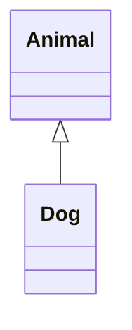
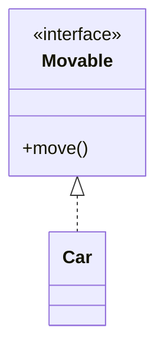
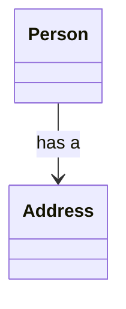
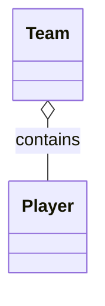
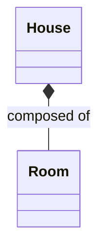
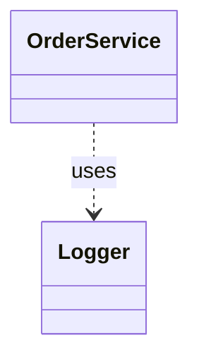

## 继承

**继承**（Inheritance）是面向对象三大特征之一，它表示在已有类的基础上继续扩展出新类。子类可以直接使用父类中已经定义好的非私有成员，在此基础上再增加自己特有的属性和行为，因此继承最基本的价值是**代码复用**，更重要的价值是它为后续的方法重写和多态提供了基础。

### 继承的作用及基本语法

继承首先解决的是“相同代码没必要反复写”的问题。如果多个类中存在共同属性和共同方法，可以先把这些共性提取到父类中，再让多个子类继承这个父类。这样做之后，子类一方面可以复用父类已有的成员，另一方面又可以保留和扩展自己的特有内容。例如，人、学生、教师都可能有姓名、年龄以及“行走”这类共同行为，就没有必要在每个类中都重复写一遍。

Java 中继承通过 `extends` 关键字实现，基本语法如下：

```java
[修饰符列表] class 子类名 extends 父类名 {
}
```

这里的 `extends` 可以理解为“扩展”。子类继承父类后，并不是把父类原样复制一遍，而是表示：**子类拥有父类已有的非私有成员，并在此基础上继续扩展。**

例如：

```java
class Animal {
    String name;

    public void move() {
        System.out.println(name + "正在移动。");
    }
}

class Cat extends Animal {
    public void catchMouse() {
        System.out.println(name + "正在抓老鼠。");
    }
}
```

在这个例子中，`Cat` 继承了 `Animal`，因此 `Cat` 对象既可以直接使用从父类继承来的 `name` 和 `move()`，也可以使用自己特有的 `catchMouse()`。这正体现了继承的本质：**保留共性，扩展个性。**

### 继承中的常用术语

当一个类继承另一个类时，两个类会有固定称呼：

| **关系**     | **名称**                                   |
| ------------ | ------------------------------------------ |
| 被继承的类   | **父类**、**超类**、**基类**、`superclass` |
| 继承别人的类 | **子类**、**派生类**、`subclass`           |

例如，若 `Dog extends Animal`，那么 `Animal` 是父类，`Dog` 是子类。

这些术语本质上都在描述同一种关系，学习时只要记住：**上层是父类，下层是子类** 即可。

### Java 继承的几个基本规则

Java 的继承规则并不多，但都很重要。

首先，**Java 只支持单继承**。也就是说，一个类只能有一个直接父类，不能同时直接继承多个类。如果写成下面这样，就是错误的：

```java
class A {
}

class B {
}

// 错误写法
// class C extends A, B {
// }
```

之所以不支持多继承，主要是为了避免多个父类中出现同名成员时带来的歧义问题。Java 在类的继承上选择了更简单、更清晰的规则：**一个类只能直接继承一个类。**

但是，Java 虽然不支持**多继承**，却支持**多重继承**，也就是多层继承。例如：

```java
class LivingThing {
}

class Animal extends LivingThing {
}

class Dog extends Animal {
}
```

这里 `Dog` 直接继承 `Animal`，`Animal` 又继承 `LivingThing`，因此 `Dog` 通过一层一层向上追溯，最终也间接拥有 `LivingThing` 中可以继承下来的成员。这种“爷爷—父亲—儿子”的层次关系，就是多重继承。

其次，子类继承父类后，并不是父类中的所有内容都能直接拿来用。一般来说，**构造方法不能被继承，父类中被 `private` 修饰的成员也不能被子类直接访问**；除此之外，其他符合访问规则的成员都可以被继承。你上传的 `Person`、`Student`、`Teacher` 三个类就体现了这一点：`Student` 和 `Teacher` 没有重新声明 `name`、`age` 和 `run()`，但仍然可以直接使用它们，因为这些成员定义在父类 `Person` 中，而且不是私有的。

> **注意：** “父类的成员会被子类继承”这句话并不等于“子类可以随便访问父类所有成员”。是否能访问，还要看访问权限。

### 继承的基本使用方式

继承在代码中的使用通常很自然：先抽取多个类的共性到父类中，再让子类保留自己的特有内容。例如：

```java
class Person {
    String name;
    int age;

    public void eat() {
        System.out.println(name + "正在吃饭。");
    }
}

class Student extends Person {
    double score;

    public void study() {
        System.out.println(name + "正在认真学习。");
    }
}

class Teacher extends Person {
    double salary;

    public void teach() {
        System.out.println(name + "正在讲课。");
    }
}
```

这段代码中，`Student` 和 `Teacher` 都继承了 `Person`。因此，学生和教师对象都天然拥有 `name`、`age` 和 `eat()`，而不需要在两个子类中重复编写；与此同时，学生类保留了自己的 `score` 和 `study()`，教师类保留了自己的 `salary` 和 `teach()`。这正是继承最典型的使用场景：**把共同内容上提到父类，把特有内容留在子类。**

很多初学者会把继承理解为“子类复制了父类”，这种理解不够准确。更准确的说法是：**子类是父类的进一步扩展。**

例如，`Person` 可以表示“人”这一类对象，而 `Student` 表示“人中的学生”，`Teacher` 表示“人中的教师”。学生和教师本质上都属于“人”，因此它们应该先拥有“人”的共性，然后再拥有自己额外的属性和行为。也就是说，子类与父类之间通常满足一种“is-a”的关系：

- 学生 **是一个** 人；
- 教师 **是一个** 人；
- 猫 **是一个** 动物；
- 汽车 **不是一个** 发动机。

只有前面这种“是一个”的关系，才适合使用继承；如果只是“包含”“组成”关系，一般就不适合直接用继承。

> **易错点：** 不是看到两个类有联系就使用继承。继承强调的是“子类本身就是父类的一种”，而不是“子类里有父类”。

### 默认继承 `Object`

在 Java 中，任何一个类如果没有显式继承其他类，那么它都会**默认继承 `java.lang.Object` 类**。也就是说，`Object` 是所有类最终的根类。

例如，下面这个类虽然没有写 `extends Object`：

```java
class Product {
}
```

但 Java 实际上会把它理解为：

```java
class Product extends Object {
}
```

因此，即使我们自己定义的类中什么方法都没写，也仍然可以调用一些看起来“凭空就有”的方法，例如 `toString()`、`hashCode()`、`equals()` 等，因为这些方法本来就定义在 `Object` 类中。

例如：

```java
class Product {
}

public class ObjectTest {
    public static void main(String[] args) {
        Product product = new Product();

        String str = product.toString();
        System.out.println(str);

        int code = product.hashCode();
        System.out.println(code);

        String hex = Integer.toHexString(code);
        System.out.println(hex);
    }
}
```

这里的 `Product` 类中并没有定义 `toString()` 和 `hashCode()`，但代码依然可以正常调用，就是因为 `Product` 默认继承了 `Object`。你原始材料中通过 `Teacher` 对象调用这两个方法，本质上利用的也是同一个规则：`Teacher` 继承 `Person`，`Person` 又继承更上层的类，最终整个继承链都会追溯到 `Object`。

### 继承场景下的代码执行顺序

当 `static`、创建对象、构造方法和继承关系同时出现时，执行顺序最容易混乱。要真正理清这一部分，需要把“**类什么时候加载**”和“**对象什么时候初始化**”分开理解：前者看**类是否被首次使用**，后者看**是否执行了 `new`**。

在继承场景中，可以先记住下面几条规则：

1. **类不会一开始就全部加载，而是在第一次被主动使用时才加载。**
2. **如果要使用子类，必须先加载父类。**
3. **同一个类只会加载一次**，因此静态变量显式赋值和静态代码块也只会执行一次。
4. **静态相关内容先执行，对象相关内容后执行。**
5. 创建子类对象时，对象初始化一定遵循“**先父类，后子类**”的顺序。

这里的“主动使用”，在当前阶段可以先理解为：**创建对象、调用类的静态成员、执行主类的 `main` 方法** 等会导致类被真正使用的操作。

#### 从主类开始看完整执行顺序

一个程序从启动到创建出子类对象，大致会经历下面几个阶段。

1. **加载主类**。程序启动后，先找到包含 `main` 方法的主类，并将主类加载到内存中。
2. **为主类的静态成员分配内存并赋默认值**。这一阶段只做“准备”，例如 `int` 默认值为 `0`，引用类型默认值为 `null`。
3. **按代码顺序执行主类的静态变量显式赋值和静态代码块**。谁写在前面就先执行谁。
4. **执行主类的 `main` 方法**。到这里程序才真正开始按 `main` 中的语句向下运行。
5. 当 `main` 中**第一次主动使用某个子类**时，先检查该子类是否已经加载。若没有加载，则先加载它；但在加载子类之前，必须先加载它的**父类**。
6. **加载父类**时，先为父类的静态成员分配内存并赋默认值。
7. 然后按代码顺序执行父类的**静态变量显式赋值**和**静态代码块**。
8. 父类加载完成后，再开始**加载子类**。加载子类时，同样先为子类的静态成员分配内存并赋默认值。
9. 然后按代码顺序执行子类的**静态变量显式赋值**和**静态代码块**。
10. 父类和子类都加载完成后，如果当前语句是 `new` 子类对象，就开始进行**对象创建**。
11. 创建子类对象时，先为该对象的**父类实例成员**和**子类实例成员**分配内存，并赋默认值。
12. 接着先执行父类部分的对象初始化：按代码顺序执行父类的**实例变量显式赋值**和**构造代码块**，然后执行父类构造方法。
13. 父类部分完成后，再执行子类部分的对象初始化：按代码顺序执行子类的**实例变量显式赋值**和**构造代码块**，最后执行子类构造方法。
14. 至此，子类对象创建完成，程序再回到 `main` 方法继续执行后面的语句。

如果后面再次 `new` 同一个子类对象，那么由于**主类、父类、子类都已经加载过了**，所以不会再重复执行这些类的静态默认赋值、静态变量显式赋值和静态代码块，而是直接进入**对象创建阶段**，重复执行“实例成员默认赋值 → 父类实例初始化与构造 → 子类实例初始化与构造”这一部分。

> **注意**：默认值赋值和显式赋值不是一回事。默认值赋值发生在“分配内存后、正式执行代码前”，它是 JVM 的初始化准备动作；显式赋值则是写在代码里的 `=` 右侧表达式，会按照代码顺序真正执行。

#### 一个完整例子

下面用一个新的例子把“类加载顺序”和“对象初始化顺序”放在一起观察：

```java
public class OrderTest {
    public static void main(String[] args) {
        System.out.println("main begin");
        new Sub();
        System.out.println("------");
        new Sub();
        System.out.println("main over");
    }
}

class Super {
    static int superValue = initSuperValue();

    static {
        System.out.println("父类静态代码块");
    }

    int x = initX();

    {
        System.out.println("父类构造代码块");
    }

    public Super() {
        System.out.println("父类构造方法");
    }

    public static int initSuperValue() {
        System.out.println("父类静态变量显式赋值");
        return 1;
    }

    public int initX() {
        System.out.println("父类实例变量显式赋值");
        return 100;
    }
}

class Sub extends Super {
    static int subValue = initSubValue();

    static {
        System.out.println("子类静态代码块");
    }

    int y = initY();

    {
        System.out.println("子类构造代码块");
    }

    public Sub() {
        System.out.println("子类构造方法");
    }

    public static int initSubValue() {
        System.out.println("子类静态变量显式赋值");
        return 2;
    }

    public int initY() {
        System.out.println("子类实例变量显式赋值");
        return 200;
    }
}
```

输出结果为：

```java
main begin
父类静态变量显式赋值
父类静态代码块
子类静态变量显式赋值
子类静态代码块
父类实例变量显式赋值
父类构造代码块
父类构造方法
子类实例变量显式赋值
子类构造代码块
子类构造方法
------
父类实例变量显式赋值
父类构造代码块
父类构造方法
子类实例变量显式赋值
子类构造代码块
子类构造方法
main over
```

## 方法覆盖

**方法覆盖**（Override），也叫**方法重写**，是指子类继承父类之后，对父类中原有的**实例方法**进行重新实现。

### 什么情况下考虑使用方法覆盖

如果子类直接继承父类的方法之后，发现**方法名是合适的、参数也是合适的，但方法体中的具体行为不适合当前子类**，这时就应该使用方法覆盖。也就是说，父类已经把“做这件事的方法入口”定义好了，但不同子类执行这件事的方式可能不同，于是子类需要在保留方法外壳不变的前提下，重写里面的实现。

例如，人都会“说话”，所以父类 `Person` 中可以定义 `speak()`；但中国人和英国人说出来的内容显然不同，因此 `ChinesePerson` 和 `EnglishPerson` 都可以对 `speak()` 进行重写。你提供的代码中，`ChinesePerson` 的 `speak()` 输出 `"你好"`，`EnglishPerson` 的 `speak()` 输出 `"Hello"`，这就是典型的方法覆盖。 

```java
public class Person {
    public void speak() {
        System.out.println("人类在说话");
    }
}

public class ChinesePerson extends Person {
    @Override
    public void speak() {
        System.out.println("你好");
    }
}

public class EnglishPerson extends Person {
    @Override
    public void speak() {
        System.out.println("Hello");
    }
}
```

这里三个类中都有 `speak()`，但它们不是“无关的同名方法”，而是父类和子类之间的**重写关系**。学习时要抓住一句话：**方法覆盖改的是实现，不是改的方法结构。**

### 构成方法覆盖的基本条件

方法覆盖必须发生在**具有继承关系的父子类之间**，而且被重写的方法必须满足“方法头基本一致”的要求。最核心的判断标准有两个：

- 第一，必须是父类中已经存在的方法；
- 第二，子类中重写的方法要与父类方法具有**相同的方法名、相同的形式参数列表**。

至于返回值类型，初学阶段可以先理解为“应当一致”，但更准确地说，**返回值类型相同，或者是父类返回值类型的子类，也可以构成重写**。

```java
public class Person {
    public Object getInstance() {
        return null;
    }
}

public class EnglishPerson extends Person {
    @Override
    public EnglishPerson getInstance() {
        return null;
    }
}
```

这里子类并没有把返回值改成一个毫无关系的类型，而是改成了 `Object` 的子类 `EnglishPerson`，因此这是合法的重写，而不是报错写法。

### `@Override` 注解的作用

`@Override` 的作用不是让程序在运行时“自动拥有重写能力”，而是让编译器在**编译阶段**帮助我们检查：当前方法是否真的重写了父类方法。也就是说，它的作用主要是**校验**，而不是参与运行。

例如，下面是正确写法：

```java
@Override
public void speak() {
    System.out.println("Hello");
}
```

如果把方法名误写成 `speek()`，或者参数列表写错了，那么一旦加上 `@Override`，编译阶段就会直接报错。这样可以避免一种很常见的问题：开发者本来想重写父类方法，结果因为拼写错误，实际上却在子类中定义了一个全新的方法。

### 方法覆盖的几个重要细节

方法覆盖除了“方法名和参数列表要一致”之外，还有一些常见规则需要特别注意。

#### 访问权限不能更低，可以相同，也可以更高

子类重写父类方法时，访问权限不能变得比父类更严格。例如，父类方法如果是 `protected`，子类就不能改成 `private`，否则相当于把原本可以访问的方法缩小了可见范围。

```java
public class Person {
    protected void speak() {
    }
}

// 错误示意
public class EnglishPerson extends Person {
    // private void speak() {}
}
```

但如果父类是 `protected`，子类改成 `public` 则是允许的，因为这是把权限放大了。

#### 抛出的异常不能更多、不能更宽

这条规则本质上是为了保证：父类能正常使用的方法，子类重写后也不能变得“更难使用”。你提供的父类 `Person` 中，`speak()` 声明了 `throws Exception`，而子类 `EnglishPerson` 重写时没有再抛异常，这就是允许的，因为它并没有扩大异常范围。 

初学阶段可以先记住：**父类方法如果声明了异常，子类重写时不能抛出比父类更多、更大的编译时异常，但可以不抛，或者抛得更少。**

#### 私有方法不能重写

`private` 方法本身不能被子类继承，既然子类都继承不到这个方法，自然也就谈不上重写。也就是说，方法覆盖的前提之一是：**父类这个方法对子类来说必须是“可继承”的。**

#### 构造方法不能重写

构造方法的名字必须与类名一致，而父类和子类的类名本来就不同，因此构造方法不会被继承，也不存在方法覆盖这一说。

#### 静态方法不存在方法覆盖

**静态方法**属于类，不属于对象，因此它不参与基于对象的动态绑定，也就不存在真正意义上的方法覆盖。子类中如果定义了一个与父类**同名、同参数列表**的静态方法，这种现象表面上看很像“重写”，但本质上并不是方法覆盖，而是**方法隐藏**。调用哪个静态方法，不取决于对象的实际类型，而取决于**引用的编译时类型或类名本身**。

下面用一个例子说明这一点：

```java
public class StaticMethodTest {
    public static void main(String[] args) {
        Person p1 = new Person();
        Person p2 = new EnglishPerson();
        EnglishPerson p3 = new EnglishPerson();

        p1.print();          // Person print
        p2.print();          // Person print
        p3.print();          // EnglishPerson print

        Person.print();      // Person print
        EnglishPerson.print(); // EnglishPerson print
    }
}

class Person {
    public static void print() {
        System.out.println("Person print");
    }
}

class EnglishPerson extends Person {
    public static void print() {
        System.out.println("EnglishPerson print");
    }
}
```

这段代码中，`Person` 和 `EnglishPerson` 中都定义了 `print()` 方法，而且方法名、参数列表都相同，但它们仍然不是方法覆盖。关键现象在于：`p2` 明明指向的是 `EnglishPerson` 对象，执行 `p2.print()` 时，输出结果却仍然是 `Person print`。这说明静态方法调用并没有根据对象的实际类型去决定执行哪个版本，而是按照 `p2` 的类型 `Person` 来决定调用 `Person.print()`。

#### 方法覆盖与实例变量无关

方法覆盖只针对**实例方法**，与**实例变量**无关。也就是说，子类可以定义一个与父类同名的实例变量，但这并不属于方法覆盖的范畴。变量在访问时，不会像实例方法那样表现出重写和多态的效果；**实例变量访问看的是引用的编译时类型，而不是对象的实际类型。**

下面用一个例子说明这一点：

```java
public class OverrideFieldTest {
    public static void main(String[] args) {
        Person x = new EnglishPerson();
        System.out.println(x.name);   // jack
        x.speak();                    // Hello
    }
}

class Person {
    String name = "jack";

    public void speak() {
        System.out.println("Person Speak");
    }
}

class EnglishPerson extends Person {
    String name = "lucy";

    @Override
    public void speak() {
        System.out.println("Hello");
    }
}
```

这段代码中，父类 `Person` 中定义了实例变量 `name = "jack"`，子类 `EnglishPerson` 中又定义了同名实例变量 `name = "lucy"`。测试时虽然创建的是 `EnglishPerson` 对象，但引用变量 `x` 的类型是 `Person`，因此执行 `System.out.println(x.name);` 时，访问到的是 `Person` 类中的 `name`，输出结果为 `jack`，而不是 `lucy`。

但紧接着执行 `x.speak();` 时，输出结果却是 `Hello`。这是因为 `speak()` 是实例方法，子类对它进行了重写，方法调用在运行时会根据对象的实际类型决定执行哪个版本；而 `name` 是实例变量，变量访问不会发生这种动态绑定。

通过这一组代码可以清楚看出：**同样都是通过 `x` 访问成员，访问实例变量和调用实例方法，规则并不相同。**`x.name` 看的是 **`x` 的类型是 `Person`**，所以访问到父类变量；`x.speak()` 看的是 **`x` 实际指向的是 `EnglishPerson` 对象**，所以执行子类重写后的方法。

## 多态

**多态**（Polymorphism）是面向对象三大特征之一，它建立在**继承**和**方法重写**的基础之上。多态最常见的表现形式是：**父类型引用指向子类对象**。这样写之后，程序在编译阶段看到的是父类型，在运行阶段真正执行的却可能是子类中重写后的方法，因此同一条调用语句在不同对象上可以表现出不同的行为。

### 多态基础语法

#### 向上转型和向下转型

在 Java 中，具有继承关系的父子类型之间允许进行类型转换。这里的类型转换不是基本数据类型之间的转换，而是**引用数据类型**之间的转换。前提只有一个：**两种类型之间必须存在继承关系**；如果没有继承关系，即使强制转换，编译器也不会通过。下面提供的 `Animal`、`Cat` 和 `Bird` 三个类，就构成了这种父子类型关系：`Cat` 和 `Bird` 都继承 `Animal`。  

```java
class Animal {
    public void move() {
        System.out.println("动物在移动");
    }
}

class Cat extends Animal {
    @Override
    public void move() {
        System.out.println("猫在走猫步！");
    }

    public void catchMouse() {
        System.out.println("猫抓老鼠！");
    }
}

class Bird extends Animal {
    @Override
    public void move() {
        System.out.println("Bird fly");
    }

    public void sing() {
        System.out.println("鸟儿在唱歌！");
    }
}
```

所谓**向上转型**（upcasting），就是**子类型对象赋值给父类型引用**。例如：

```java
Animal a = new Cat();
```

这行代码中，右侧创建的是 `Cat` 对象，左侧接收它的是 `Animal` 类型的引用，这就是向上转型。向上转型一般不需要显式写强制转换符，因为它本质上是一种“把具体类型当作更抽象的父类型来看待”的过程，语法上比较自然。下面提供的测试代码中，`Animal a = new Cat();` 就是典型的向上转型写法。

所谓**向下转型**（downcasting），就是**把父类型引用再转回某个子类型引用**。例如：

```java
Animal a = new Cat();
Cat c = (Cat) a;
```

这里 `a` 的类型是 `Animal`，如果需要通过它去调用 `Cat` 特有的 `catchMouse()` 方法，就必须先把它转回 `Cat` 类型。向下转型必须显式写出强制类型转换符，因为父类型的引用不一定真的指向这个子类对象，只有程序员自己明确说明“这里要转成某个子类型”时，编译器才允许继续往下编译。下面提供的测试代码中，也正是通过这种方式调用了 `Cat` 类中特有的方法。

> **注意：** 无论是向上转型还是向下转型，都必须建立在继承关系之上。没有继承关系的两个引用类型之间不能互相转换。

#### 什么是多态

多态最典型的代码形式就是下面这样：

```java
Animal a = new Cat();
a.move();
```

这段代码虽然只有两行，但其中同时体现了多态的核心思想。编译阶段，编译器只知道 `a` 的类型是 `Animal`，因此会去 `Animal` 类中检查是否存在 `move()` 方法；**只要在父类中能够找到这个方法，编译就能通过**。运行阶段，JVM 真正看到的是堆内存中的实际对象，而这里实际创建的是 `Cat` 对象，因此**最终执行的是 `Cat` 中重写后的 `move()` 方法，而不是 `Animal` 中的版本**。下面提供的 `Animal`、`Cat` 和测试代码正是按照这一思路编写的。  

下面用一个完整例子把这个过程串起来：

```java
public class PolymorphismTest {
    public static void main(String[] args) {
        Animal a = new Cat();
        a.move();
    }
}

class Animal {
    public void move() {
        System.out.println("动物在移动");
    }
}

class Cat extends Animal {
    @Override
    public void move() {
        System.out.println("猫在走猫步！");
    }
}
```

这段程序运行后，输出结果是：

```java
猫在走猫步！
```

之所以不是输出“动物在移动”，正是因为这里发生了多态。编译时按照 `Animal` 类型检查，运行时按照真实对象 `Cat` 执行。也可以用一句更适合记忆的话概括：**编译看左边，运行看右边。** 这里“左边”指的是引用变量的类型，“右边”指的是实际创建出来的对象类型。

**多态之所以叫“多态”，就是因为同一个父类型引用，在运行时可以表现出多种不同形态。**例如：

```java
Animal a1 = new Cat();
Animal a2 = new Bird();

a1.move(); // 猫在走猫步！
a2.move(); // Bird fly
```

虽然 `a1` 和 `a2` 的类型都写成了 `Animal`，但由于它们实际指向的对象不同，最终执行的 `move()` 方法也不同。这就是“**同一种调用形式，多种运行结果**”。

#### 为什么多态下不能直接调用子类特有方法

多态带来的一个非常重要的现象是：**父类型引用虽然可以指向子类对象，但它在编译阶段只能调用父类中已经声明过的方法。**

例如：

```java
Animal a = new Cat();
a.move();          // 合法
// a.catchMouse(); // 编译报错
```

这里 `a` 实际上确实指向 `Cat` 对象，但编译器在编译时只把 `a` 当作 `Animal` 来看待。由于 `Animal` 类中没有 `catchMouse()` 方法，因此编译器会直接报错。也就是说，**编译器并不会先去猜测运行时对象是不是 `Cat`，而是只根据引用的声明类型做语法检查。**

下面提供的 `Test01.java` 中，就专门演示了这一点：`a.move()` 可以调用，因为 `Animal` 中存在 `move()`；而 `a.catchMouse()` 会编译失败，因为 `Animal` 中并没有这个方法。

如果确实要调用子类特有方法，就必须先进行**向下转型**：

```java
Animal a = new Cat();
Cat c = (Cat) a;
c.catchMouse();
```

这样写之后，编译器就知道 `c` 的类型已经是 `Cat`，因此可以调用 `catchMouse()`。下面提供的测试代码中，也正是先把 `Animal` 类型的引用转成 `Cat`，再去调用 `Cat` 独有的方法。

> **注意：** 多态并不表示“父类型引用可以直接访问子类的一切内容”。父类型引用在编译阶段仍然受父类成员范围限制。

#### 向下转型的风险

向下转型虽然能让父类型引用重新获得对子类特有成员的访问能力，但它也带来了风险：**如果父类型引用实际指向的并不是目标子类对象，运行时就会抛出 `ClassCastException`。**

下面提供一个完整例子：

```java
public class DownCastTest {
    public static void main(String[] args) {
        Animal x = new Bird();
        Cat y = (Cat) x;
        y.catchMouse();
    }
}

class Animal {
}

class Cat extends Animal {
    public void catchMouse() {
        System.out.println("猫抓老鼠！");
    }
}

class Bird extends Animal {
}
```

这段代码在编译阶段能够通过，因为 `Animal` 和 `Cat` 的确存在继承关系；但运行时会报错，因为 `x` 实际指向的是 `Bird` 对象，而不是 `Cat` 对象。也就是说，**编译器只检查“能不能转”，JVM 运行时才检查“转过去之后是否真实成立”。**

下面提供的 `Test01.java` 中也专门写到了这一点：如果 `Animal x = new Bird();`，再执行 `Cat y = (Cat) x;`，就会发生著名的类型转换异常 `ClassCastException`。

> **易错点：** 向下转型能否编译通过，只说明语法上允许；是否运行成功，还取决于引用实际指向的对象类型。

### `instanceof` 运算符

为了避免向下转型时出现 `ClassCastException`，Java 中通常建议先使用 `instanceof` 运算符进行判断。`instanceof` 的语法格式如下：

```java
引用 instanceof 类型
```

它的执行结果是一个布尔值：

- 如果结果是 `true`，表示该引用指向的对象是这个类型，或者是这个类型的子类型对象；
- 如果结果是 `false`，表示该引用指向的对象不是这个类型的实例。

例如：

```java
Animal a = new Cat();
System.out.println(a instanceof Cat);    // true
System.out.println(a instanceof Bird);   // false
```

在实际开发中，`instanceof` 最常见的用途就是和向下转型配合使用。下面提供一个完整例子：

```java
public class InstanceofTest {
    public static void main(String[] args) {
        Animal a = new Bird();

        if (a instanceof Cat) {
            Cat c = (Cat) a;
            c.catchMouse();
        }

        if (a instanceof Bird) {
            Bird b = (Bird) a;
            b.sing();
        }
    }
}

class Animal {
}

class Cat extends Animal {
    public void catchMouse() {
        System.out.println("猫抓老鼠！");
    }
}

class Bird extends Animal {
    public void sing() {
        System.out.println("鸟儿在唱歌！");
    }
}
```

这里先判断 `a` 是否真的是 `Cat` 或 `Bird` 类型，再决定是否进行向下转型，这样就可以避免不安全的强制转换。

下面提供的 `T.java` 中，方法 `t(Animal a)` 就是一个很典型的多态配合 `instanceof` 的例子：方法参数写成 `Animal`，从而统一接收不同子类对象；运行时再根据实际对象类型判断，如果是 `Cat` 就调用 `catchMouse()`，如果是 `Bird` 就调用 `sing()`。这正说明多态的价值之一在于：**先统一接收，再按实际类型分别处理。** 

```java
public class T {
    public static void t(Animal a) {
        if (a instanceof Cat) {
            Cat c = (Cat) a;
            c.catchMouse();
        } else if (a instanceof Bird) {
            Bird b = (Bird) a;
            b.sing();
        }
    }
}
```

#### `instanceof` 的新语法

从较新的 Java 版本开始，`instanceof` 支持了一种更简洁的写法：在判断类型成立的同时，直接声明一个新的局部变量。传统写法如下：

```java
if (a instanceof Cat) {
    Cat c = (Cat) a;
    c.catchMouse();
}
```

新写法可以写成：

```java
if (a instanceof Cat c) {
    c.catchMouse();
}
```

这种写法把“判断类型”和“完成转换”合并到了一起，代码更紧凑，也更不容易漏写强制转换。下面提供的 `T.java` 中，已经使用了这种新语法：如果 `a` 是 `Cat`，就直接得到变量 `c`；如果 `a` 是 `Bird`，就直接得到变量 `b`。

```java
public class T {
    public static void t(Animal a) {
        if (a instanceof Cat c) {
            c.catchMouse();
        } else if (a instanceof Bird b) {
            b.sing();
        }
    }
}
```

这种写法本质上并没有改变 `instanceof` 的含义，只是让代码表达更简洁。学习时应先掌握传统写法的原理，再理解这种语法糖会更自然。

### 软件设计原则

**软件设计原则**是软件开发中长期沉淀下来的通用经验，它们并不依赖某一种具体编程语言，而是用于指导开发者在分析需求、设计类、组织模块和扩展系统时做出更合理的选择。遵循这些原则的目标通常是：**提高代码质量、降低耦合度、增强可维护性、提升可扩展性，并减少后期修改带来的风险。**

从学习角度看，软件设计原则并不是一套必须死记硬背的“硬规则”，而更像是一组判断标准：当一个类越来越臃肿、模块之间依赖越来越混乱、每次新增功能都要大量修改旧代码时，往往就说明设计已经偏离了这些基本原则。

#### 常见软件设计原则概览

| **原则**         | **英文简称** | **核心思想**             |
| ---------------- | ------------ | ------------------------ |
| **单一职责原则** | **SRP**      | 一个类只负责一项核心职责 |
| **开闭原则**     | **OCP**      | 对扩展开放，对修改关闭   |
| **里氏替换原则** | **LSP**      | 子类应该能够替换父类     |
| **接口隔离原则** | **ISP**      | 接口应小而专，不应臃肿   |
| **依赖倒置原则** | **DIP**      | 依赖抽象，不依赖具体实现 |
| **迪米特法则**   | **LoD**      | 尽量少和陌生对象直接通信 |
| **合成复用原则** | **CRP**      | 优先使用组合，而不是继承 |

其中，前五项通常统称为 **SOLID 原则体系**，它们是面向对象设计中最核心的一组原则；后两项则常作为重要的扩展性设计原则一起学习。

#### 单一职责原则

**单一职责原则**（Single Responsibility Principle，**SRP**）强调：**一个类或模块应当只负责一项明确的职责。** 如果一个类承担了过多功能，那么只要其中一个职责发生变化，这个类就可能被迫修改，从而导致类越来越复杂，维护成本越来越高。

例如，一个 `UserService` 类如果既负责用户注册、又负责发送邮件、还负责记录日志，那么它实际上承担了多个不同职责。更合理的做法是把这些职责拆开：用户注册交给 `UserService`，发送邮件交给 `MailService`，日志记录交给 `LogService`。这样一来，后续如果邮件发送逻辑变化，只需要修改邮件相关类，而不会影响用户注册逻辑。

#### 开闭原则

**开闭原则**（Open-Closed Principle，**OCP**）强调：**软件实体应当对扩展开放，对修改关闭。** 也就是说，当需求变化时，理想状态不是频繁修改已经稳定运行的旧代码，而是在尽量不改动原有代码的基础上，通过新增代码来完成扩展。

例如，一个图形系统最开始只支持矩形，后面又要支持圆形、三角形。如果每增加一种图形，就不断修改原来的判断逻辑，例如反复写 `if...else if...else` 去区分不同图形，那么旧代码会越来越不稳定。更合理的做法是定义一个统一的图形抽象，例如 `Shape`，然后让 `Rectangle`、`Circle`、`Triangle` 分别实现自己的绘制逻辑。这样以后再增加一种图形时，只需要新增一个类，而不必频繁修改原来的代码。

之所以说开闭原则最重要，是因为软件系统最常见的问题并不是“第一次写出来”，而是“以后怎么改”。其它很多设计原则，本质上都是为了让系统更容易满足开闭原则。

#### 里氏替换原则

**里氏替换原则**（Liskov Substitution Principle，**LSP**）强调：**凡是父类能够出现的地方，子类都应该能够替换进去，而且替换后程序逻辑仍然正确。** 这条原则本质上是在约束继承关系的合理性。

例如，假设有一个父类 `Bird`，其中定义了 `fly()` 方法。如果后来让 `Penguin`（企鹅）继承 `Bird`，但企鹅根本不会飞，那么当程序把 `Penguin` 当作 `Bird` 使用并调用 `fly()` 时，逻辑就出问题了。这说明这里的继承关系本身就不合理。也就是说，并不是“有一点相似”就能继承，子类必须真正符合父类原本表达的含义。

在实际设计中，这条原则提醒开发者：**继承不能只图代码复用，更要保证语义正确。** 子类如果改变了父类原本承诺的行为，就容易破坏多态，也会让系统变得难以理解和维护。

#### 接口隔离原则

**接口隔离原则**（Interface Segregation Principle，**ISP**）强调：**不应强迫一个类依赖它用不到的方法。** 换句话说，接口不应该设计得过于庞大，而应尽量做到小而专。

例如，假设定义了一个 `SmartDevice` 接口，其中同时包含 `print()`、`scan()`、`fax()` 三个方法。如果某个设备其实只是普通打印机，它只能打印，不能扫描和传真，但又被迫去实现这三个方法，那么就会出现大量“空实现”或“无意义实现”。更合理的做法是把接口拆分成 `Printable`、`Scannable`、`Faxable` 等更细的小接口，让不同设备按需实现。

接口隔离原则的核心，不是“接口越多越好”，而是“不要把彼此无关的能力强行绑在一个接口里”。接口越臃肿，实现类越痛苦，后续扩展也越混乱。

#### 依赖倒置原则

**依赖倒置原则**（Dependency Inversion Principle，**DIP**）强调：**高层模块不应依赖低层模块的具体实现，二者都应依赖抽象。** 简单理解就是：写程序时尽量“面向接口编程”，而不是“面向具体类编程”。

例如，一个订单服务需要调用支付功能。如果订单服务直接依赖 `AliPayService`，那么以后改成微信支付、银行卡支付时，就不得不修改订单服务本身。更合理的设计是先定义一个 `PaymentService` 接口，然后让 `AliPayService`、`WechatPayService` 去实现这个接口，订单服务只依赖 `PaymentService`。这样以后替换支付方式时，只需要替换具体实现，而高层业务逻辑基本不变。

这条原则的关键价值在于**解耦**。当高层模块直接绑定某个底层实现时，系统会变得非常僵硬；而当它依赖抽象时，具体实现就更容易替换和扩展。

#### 迪米特法则

**迪米特法则**（Law of Demeter，**LoD**），也叫**最少知道原则**，强调：**一个对象应当尽量少地了解其他对象的内部细节，并且只与直接朋友通信。** 所谓“直接朋友”，通常指当前对象本身的成员变量、方法参数、方法内部创建的对象等。

例如，一个订单类如果想完成库存扣减，不应直接层层找到库存对象并操作它的内部细节，而更适合通过一个中间协调者，例如 `OrderProcessor` 或 `InventoryService` 来完成。这样订单类只需要知道“让谁处理库存”，而不必知道库存模块的复杂内部逻辑。

迪米特法则的核心目的是减少对象之间过深、过多的直接联系。对象之间知道得越多，耦合就越高；一旦某个类内部结构变化，依赖它的很多类都可能跟着改。

#### 合成复用原则

**合成复用原则**（Composite Reuse Principle，**CRP**）强调：**在实现代码复用时，应优先考虑组合或聚合，而不是继承。** 继承虽然也能复用父类代码，但它会让子类与父类绑定得很紧；而组合通常更加灵活。

例如，假设要设计一个 `Car` 类，它需要具备发动机能力。此时更合理的做法通常是让 `Car` 内部持有一个 `Engine` 对象，也就是“车有一个发动机”；而不是让 `Car` 去继承 `Engine`，因为从语义上看，**汽车并不是发动机的一种**。前者属于组合，后者则是错误的继承关系。

组合方式的优点在于：某个部件以后需要替换时，影响通常较小。例如，`Car` 可以更换不同类型的 `Engine`，而不必改动车本身的整体层次结构。继承则更强调“is-a”关系，只有在真正存在这种关系时才适合使用。

### 多态在开发中的作用

多态在开发中的核心价值，不只是“语法上可以父类引用指向子类对象”，而是它能够让程序**面向抽象编程**，而不是直接绑定某个具体类。这样设计之后，调用方只关心“对象具备什么能力”，而不关心“对象到底是哪一个具体类型”，从而达到**降低耦合度、提高扩展性**的目的。这种设计思想本质上也符合前面提到的**开闭原则**：当需求扩展时，尽量通过新增代码完成，而不是频繁修改原有代码。

#### 面向具体编程与面向抽象编程的区别

如果程序直接面向具体类编程，那么一旦业务中新增一种类型，原来的代码往往就要跟着修改。例如，主人喂养宠物时，如果方法参数写死为 `Cat`，那么这个方法就只能接收猫对象；以后如果要喂狗、喂蛇，就不得不继续给 `Master` 类增加新的 `feed()` 方法。这样一来，**每扩展一种宠物，就要修改一次主人类**，原有代码会越来越不稳定，扩展能力也很差。

而如果参数设计成父类型 `Pet`，那么 `Cat`、`Dog`、`Snake` 这些子类对象都可以传入。此时 `Master` 类并不关心传进来的是猫、狗还是蛇，它只要求对方是“宠物”，并且具备 `eat()` 这个行为即可。这样以后即使继续新增 `Rabbit`、`Tiger` 等宠物类型，通常也只需要新增子类，不需要再修改 `Master` 类本身。

下面先看“面向具体编程”的写法：

```java
public class Master {
    public void feed(Cat c) {
        c.eat();
    }
}
```

这段代码的问题在于：`feed()` 方法只能接收 `Cat`。如果后面又有 `Dog`，通常就会继续写：

```java
public class Master {
    public void feed(Cat c) {
        c.eat();
    }

    public void feed(Dog d) {
        d.eat();
    }
}
```

如果再增加 `Snake`、`Rabbit`、`Pig`，就要不断修改 `Master` 类。也就是说，`Master` 与具体宠物类型绑得很死，耦合度高，扩展能力差。

再看“面向抽象编程”的写法：

```java
public class Master {
    public void feed(Pet p) {
        p.eat();
    }
}
```

这里参数类型不再是某个具体子类，而是父类型 `Pet`。这样只要某个对象属于 `Pet` 体系，就都可以传进来。此时 `Master` 只依赖“宠物会进食”这个抽象能力，而不依赖某一种具体宠物。

这个例子中，`Master` 类只提供了一个 `feed(Pet pet)` 方法，但它却可以同时喂猫、喂狗。这说明 `Master` 不需要为每种宠物分别写一套逻辑，而是统一面向 `Pet` 这一抽象类型进行编程。这样设计之后，程序的扩展方式就发生了变化：**新增宠物类型时，通常只需要新增一个 `Pet` 的子类，并实现自己的 `eat()` 方法，而不需要修改 `Master` 类。**

例如，以后如果新增一种宠物兔子，只需要这样扩展：

```java
public class Rabbit extends Pet {

    @Override
    public void eat() {
        System.out.println("兔子在吃胡萝卜！");
    }
}
```

然后直接这样使用：

```java
master.feed(new Rabbit());
```

`Master` 类本身不需要做任何修改，这正体现了多态对扩展性的帮助。

> **补充：** “面向抽象编程”并不是不要具体类，而是让高层代码尽量只依赖抽象类型，把变化留给具体实现类去承担。

#### 多态只针对实例方法

`Pet.java`

```java
public abstract class Pet {
    String name = "小黑";

    public abstract void eat();

    public static void run() {
        System.out.println("Pet run");
    }
}
```

`Cat.java`

```java
public class Cat extends Pet {

    @Override
    public void eat() {
        System.out.println("猫咪在进食！");
    }
}
```

`Dog.java`

```java
public class Dog extends Pet {
    String name = "金毛";

    @Override
    public void eat() {
        System.out.println("狗狗在啃骨头！");
    }

    public static void run() {
        System.out.println("Dog run");
    }
}
```

`Test.java`

```java
public class Test {
    public static void main(String[] args) {
        Master master = new Master();

        Pet p = new Dog();
        p.run();
        System.out.println(p.name);
    }
}
```

运行结果如下：

```java
Pet run
小黑
```

这里特别容易误解。虽然 `p` 实际指向的是 `Dog` 对象，但 `run()` 是**静态方法**，`name` 是**实例变量**，它们都不属于方法重写和多态的讨论范围，因此这里不会表现出实例方法那样的动态绑定效果。

也就是说，多态真正发挥作用的，是前面 `feed(Pet pet)` 中调用的 `pet.eat()`。因为 `eat()` 是实例方法，而且在子类中被重写了，所以运行时会根据真实对象类型执行不同版本。

> **注意：** 多态的核心应用场景是“父类型引用调用被子类重写的实例方法”，而不是静态方法或成员变量。

## `super` 关键字

`super` 关键字通常和 `this` 一起学习。`this` 表示**当前对象本身**，而 `super` 表示**当前对象中父类那部分特征**。因此，`super` 的核心作用有两类：一是在子类中访问父类成员，二是在子类构造方法中调用父类构造方法。

### 对 `super` 的基本认识

#### `super` 与 `this` 的关系

**`this` 和 `super` 都和当前对象有关**，但含义不同。**`this` 表示当前对象本身，`super` 表示当前对象中从父类继承下来的那部分特征。**也正因为如此，`this` 的常见用法是 `this.` 和 `this()`，`super` 的常见用法则是 `super.` 和 `super()`。

下面提供一个完整例子，先观察 `this` 和 `super` 在语法表现上的差异：

```java
public class SuperTest01 {
    public static void main(String[] args) {
        Dog dog = new Dog();
        dog.show();
    }
}

class Animal {
}

class Dog extends Animal {
    public void show() {
        System.out.println(this);
        // System.out.println(super); // 编译错误
    }
}
```

这段代码中，`this` 可以单独输出，因为它本质上表示当前对象引用；而 `super` 不能单独输出，因为 `super` 不是一个独立的引用变量，它只是一个关键字，用来帮助程序访问父类成员。也就是说，`super` 不能像 `this` 一样单独存在，它只能出现在 `super.` 或 `super()` 这样的语法环境中。

#### `super` 不能出现在静态上下文中

`super` 不能出现在静态方法、静态代码块等静态上下文中。原因与 `this` 一样：静态上下文不依赖具体对象，而 `super` 表示的是“当前对象中的父类特征”，既然没有当前对象，自然也就不能使用 `super`。

```java
public class SuperTest02 extends Person {
    public static void main(String[] args) {
        SuperTest02 test = new SuperTest02();
        test.show();
    }

    public void show() {
        System.out.println(super.name);
    }

    public static void print() {
        // System.out.println(super.name); // 编译错误
    }
}

class Person {
    String name = "jack";
}
```

上面这段代码中，`show()` 是实例方法，因此可以使用 `super.name`；`print()` 是静态方法，因此不能使用 `super`。同理，`this` 也不能出现在静态上下文中。

> **注意：** `super` 可以看作和 `this` 一样，都依赖具体对象，因此都不能出现在静态上下文中。

### `super.` 的作用与使用规则

#### `super.` 的基本作用

`super.` 用于在子类中访问父类的**实例变量**或**实例方法**。它的本质不是“得到一个父类对象”，而是**在当前子类对象内部，明确访问父类那部分成员**。

```java
public class SuperTest03 {
    public static void main(String[] args) {
        Cat cat = new Cat();
        cat.printInfo();
    }
}

class Animal {
    String name = "动物";

    public void move() {
        System.out.println("动物在移动");
    }
}

class Cat extends Animal {
    String name = "小猫";

    @Override
    public void move() {
        System.out.println("猫在走猫步");
    }

    public void printInfo() {
        System.out.println(name);       // 小猫
        System.out.println(this.name);  // 小猫
        System.out.println(super.name); // 动物

        this.move();   // 猫在走猫步
        super.move();  // 动物在移动
    }
}
```

这里 `this.name` 访问的是子类自己的 `name`，`super.name` 访问的是父类中的 `name`；`this.move()` 调用的是子类重写后的 `move()`，`super.move()` 调用的是父类原来的 `move()`。这说明 `super.` 的作用是：**在父类和子类成员同时存在时，明确指定访问父类版本。**

#### `super.` 什么时候不能省略

`super.` 在很多情况下确实可以省略，因为如果子类中没有同名成员，编译器最终仍然能沿继承链找到对应成员。但当父类和子类中存在**同名实例变量**或**同名实例方法**时，如果要在子类中访问父类版本，`super.` 就不能省略。

```java
public class SuperTest04 {
    public static void main(String[] args) {
        Cat cat = new Cat();
        cat.print();
    }
}

class Animal {
    String name = "小黑";

    public void run() {
        System.out.println("Animal run");
    }
}

class Cat extends Animal {
    String name = "小白";

    @Override
    public void run() {
        System.out.println("Cat run");
    }

    public void print() {
        System.out.println(name);       // 小白
        System.out.println(this.name);  // 小白
        System.out.println(super.name); // 小黑

        run();        // Cat run
        this.run();   // Cat run
        super.run();  // Animal run
    }
}
```

这段代码中，父类和子类中都存在 `name` 和 `run()`。因此：

- `name` 或 `this.name` 访问的是子类自己的变量；
- `super.name` 访问的是父类变量；
- `run()` 或 `this.run()` 调用的是子类重写后的方法；
- `super.run()` 调用的是父类原来的方法。

#### `super.` 在开发中的典型应用

`super.` 在开发中的一个非常重要的应用，是在**子类重写父类方法之后，保留父类原有逻辑，并在其基础上继续扩展功能**。这种写法特别适合“前扩展 + 父类原逻辑 + 后扩展”的场景。

```java
public class SuperTest05 {
    public static void main(String[] args) {
        Worker worker = new Teacher();
        worker.doSome();
    }
}

class Worker {
    public void doSome() {
        System.out.println("执行基础业务逻辑");
    }
}

class Teacher extends Worker {
    @Override
    public void doSome() {
        System.out.println("前置扩展：记录开始日志");
        super.doSome();
        System.out.println("后置扩展：记录结束日志");
    }
}
```

运行结果如下：

```text
前置扩展：记录开始日志
执行基础业务逻辑
后置扩展：记录结束日志
```

这段代码说明：子类在重写方法时，不一定非要完全替换父类逻辑，也可以通过 `super.` 先复用父类已有实现，再在前后增加自己的扩展代码。

### `super()` 的作用与语法规则

#### `super()` 的本质作用

`super()` 用于在子类构造方法中调用父类构造方法，其**根本目的不是“再创建一个父类对象”**，而是**先完成当前对象中父类那部分特征的初始化**。因为一个子类对象在创建时，不仅有子类自己的成员，也有从父类继承而来的成员，所以父类部分必须先初始化。

```java
public class SuperTest06 {
    public static void main(String[] args) {
        Student student = new Student("jack", 20, 90.0);
        student.print();
    }
}

class Person {
    String name;
    int age;

    public Person() {
        super();
        System.out.println("Person 的无参数构造方法执行了");
    }
}

class Student extends Person {
    String name;
    double score;

    public Student() {
    }

    public Student(String name, int age, double score) {
        super();
        this.name = name;
        this.age = age;
        this.score = score;
    }

    public void print() {
        System.out.println("this.name = " + this.name);
        System.out.println("super.name = " + super.name);
        System.out.println("this.age = " + this.age);
        System.out.println("score = " + this.score);
    }
}
```

这里 `super()` 调用的是父类 `Person` 的无参构造方法。要特别注意，`super()` 并不会额外创建一个独立的 `Person` 对象，它只是为了初始化当前 `Student` 对象中的父类部分。

#### `super()` 的自动补全规则

如果一个构造方法的第一行既没有显式写 `this(...)`，也没有显式写 `super(...)`，那么编译器会自动在第一行补上一个无参的 `super()`。这意味着：**子类构造方法执行时，默认会先调用父类无参构造方法。**

```java
public class SuperTest07 {
    public static void main(String[] args) {
        Cat cat = new Cat();
    }
}

class Animal {
    public Animal() {
        System.out.println("Animal 的无参构造方法执行");
    }
}

class Cat extends Animal {
    public Cat() {
        System.out.println("Cat 的无参构造方法执行");
    }
}
```

运行结果如下：

```text
Animal 的无参构造方法执行
Cat 的无参构造方法执行
```

虽然 `Cat()` 中没有写 `super();`，但编译器自动补上了它，因此仍然先执行了父类构造方法。

#### `super()` 与 `this()` 的位置规则

**`super(...)` 和 `this(...)` 都只能出现在构造方法第一行，而且二者不能同时出现在同一个构造方法中。**因为编译器必须先明确：当前构造方法到底是先调用父类构造方法，还是先调用本类其他构造方法。

```java
public class SuperTest08 {
    public static void main(String[] args) {
        new Dog();
    }
}

class Animal {
    public Animal() {
        System.out.println("Animal()");
    }
}

class Dog extends Animal {
    public Dog() {
        super();
        System.out.println("Dog()");
    }
}
```

这段代码合法，因为 `super();` 出现在第一行。如果在 `super();` 之前写其他语句，或者同时又写了 `this(...)`，都会导致编译错误。

### `super()` 与构造方法调用链

#### 为什么父类没有无参构造方法时会报错

如果父类只手动定义了有参构造方法，而没有无参构造方法，那么子类构造方法中如果没有显式写 `super(实参)`，就会因为编译器默认补上的 `super()` 找不到对应构造方法而报错。

```java
public class A {
    public A(String name) {
    }
}

public class B extends A {
}
```

这段代码报错的根本原因是：`B` 虽然没有写构造方法，但编译器会默认补出一个无参构造方法，而该构造方法第一行会自动调用 `super();`。问题在于，父类 `A` 中并没有无参构造方法，因此报错。

可以把编译器补出的内容理解为：

```java
public class B extends A {
    public B() {
        super();
    }
}
```

而 `A` 中只有 `A(String name)`，没有 `A()`，所以无法成立。

> **注意：** 只要父类手动定义了构造方法，编译器就不会再自动生成无参构造方法。因此在实际开发中，通常建议将无参构造方法显式定义出来。

#### 为什么只要 `new` 对象，`Object` 的无参构造方法一定会执行

Java 中所有类最终都直接或间接继承自 `Object`。因此，只要创建对象，构造方法调用链就会不断向上追溯，最终执行到 `Object` 的无参构造方法。

```java
public class SuperTest09 {
    public static void main(String[] args) {
        new Student();
    }
}

class Person {
    public Person() {
        System.out.println("Person()");
    }
}

class Student extends Person {
    public Student() {
        System.out.println("Student()");
    }
}
```

这里真实的执行顺序可以理解为：

1. 执行 `Student()`；
2. `Student()` 首行默认调用 `super()`，进入 `Person()`；
3. `Person()` 首行默认继续调用 `super()`，进入 `Object()`；
4. `Object()` 执行结束后返回 `Person()`；
5. `Person()` 执行结束后再返回 `Student()`。

虽然 `Object()` 中没有输出，但它一定执行了。

### 从对象结构角度理解 `super`

理解 `super` 的关键，不是把它想成“另一个父类对象”，而是要明白：**子类对象在内存中本来就包含父类那部分成员，`super` 访问的正是这部分空间。**

下面先看第一种情况：子类没有重新声明与父类同名的属性。

```java
public class SuperTest10 {
    public static void main(String[] args) {
        Student student = new Student("jack", 20, 90.0);
        student.print();
    }
}

class Person {
    String name;
    int age;

    public Person() {
    }
}

class Student extends Person {
    double score;

    public Student(String name, int age, double score) {
        super();
        this.name = name;
        this.age = age;
        this.score = score;
    }

    public void print() {
        System.out.println("name = " + this.name);
        System.out.println("age = " + this.age);
        System.out.println("score = " + this.score);
    }
}
```

这里 `Student` 中没有重新声明 `name` 和 `age`，因此对象里只有一份 `name` 和 `age`，它们都来自父类 `Person`。

再看第二种情况：子类重新声明了与父类同名的属性。

```java
public class SuperTest11 {
    public static void main(String[] args) {
        Student student = new Student("jack", 20, 90.0);
        student.print();
    }
}

class Person {
    String name;
    int age;

    public Person() {
    }
}

class Student extends Person {
    String name;
    double score;

    public Student(String name, int age, double score) {
        super();
        this.name = name;
        this.age = age;
        this.score = score;
    }

    public void print() {
        System.out.println("this.name = " + this.name);
        System.out.println("super.name = " + super.name);
        System.out.println("this.age = " + this.age);
        System.out.println("score = " + this.score);
    }
}
```

这时对象内部实际上会同时存在两份 `name`：

- 一份属于父类 `Person`；
- 一份属于子类 `Student`。

因此，`this.name` 和 `super.name` 访问的是两块不同的空间。构造方法中只给子类自己的 `name` 赋了值，而父类中的 `name` 仍保持默认值 `null`。

> **结论：** `super` 访问的不是另一个对象，而是当前对象中父类那部分成员空间。

### `super(实参)` 在开发中的典型应用

当父类中的属性是 `private` 时，子类虽然拥有父类那部分空间，但不能直接访问这些私有成员。这时，`super(实参)` 就成为一种非常典型的初始化手段：**通过调用父类构造方法，完成父类私有属性的赋值。**

```java
public class SuperTest12 {
    public static void main(String[] args) {
        CreditAccount creditAccount = new CreditAccount("110", 100.0, 1.0);

        System.out.println(creditAccount.getActNo());
        System.out.println(creditAccount.getBalance());
        System.out.println(creditAccount.getCredit());
    }
}

class Account {
    private String actNo;
    private double balance;

    public Account() {
    }

    public Account(String actNo, double balance) {
        this.actNo = actNo;
        this.balance = balance;
    }

    public String getActNo() {
        return actNo;
    }

    public double getBalance() {
        return balance;
    }
}

class CreditAccount extends Account {
    private double credit;

    public CreditAccount(String actNo, double balance, double credit) {
        super(actNo, balance);
        this.credit = credit;
    }

    public double getCredit() {
        return credit;
    }
}
```

这里 `actNo` 和 `balance` 属于父类 `Account`，并且是私有属性，因此子类不能直接通过 `this.actNo` 或 `super.actNo` 访问它们。此时只能通过 `super(actNo, balance)` 去调用父类有参构造方法，先把父类部分初始化好。

## `final` 关键字

`final` 是 Java 中一个非常常用的关键字，它的核心含义可以概括为：**最终的、不可再变的**。不过，这种“不可再变”并不是只有一种表现形式，而是会随着修饰对象的不同而有所区别。`final` 可以修饰**类、方法、变量、引用**，分别表示：类不能再被继承，方法不能再被重写，变量一旦赋值不能再次赋值，引用一旦指向某个对象后不能再改为指向其他对象。你当前整理的课堂代码也正是围绕这几种典型用法展开的。

### `final` 修饰类

当 `final` 修饰一个类时，表示这个类**不能被继承**。也就是说，这个类已经是最终形态，不能再派生出子类。

```java
final class AccountService {
}

// 编译错误
// class VipAccountService extends AccountService {
// }
```

之所以需要这种限制，是因为有些类的设计者希望该类的行为保持稳定，不允许别人通过继承去改变它的结构或语义。学习时只需要先记住：**`final` 修饰类，限制的是“继承”这件事。**

### `final` 修饰方法

当 `final` 修饰一个方法时，表示这个方法**不能被子类重写**。也就是说，父类已经把这个方法的实现固定下来了，子类可以继承并使用它，但不能改写它的实现。

```java
class Animal {
    public final void breathe() {
        System.out.println("动物都需要呼吸");
    }
}

class Cat extends Animal {
    // 编译错误
    // @Override
    // public void breathe() {
    //     System.out.println("猫呼吸");
    // }
}
```

这里 `breathe()` 方法被 `final` 修饰后，`Cat` 类虽然可以继承这个方法，但不能对它进行重写。

这类用法通常适用于：某个方法的逻辑已经被确定，不希望子类随意改变。例如，一些基础校验流程、核心模板逻辑等，都可能通过 `final` 保护起来。

### `final` 修饰变量

`final` 修饰变量时，表示这个变量**一旦完成赋值，就不能再次赋值**。这里要特别注意，“不能重新赋值”并不等于“声明时必须马上赋值”，而是表示：**第一次赋值可以，第二次赋值不可以。**

```java
public class FinalVariableTest {
    public static void main(String[] args) {
        int a = 10;
        a = 20;

        final int b = 10;
        // b = 20; // 编译错误

        final int c;
        c = 30;
        // c = 40; // 编译错误
    }
}
```

这段代码中，普通变量 `a` 可以多次赋值；而 `final` 修饰的 `b` 和 `c` 都只能赋值一次。

因此，理解 `final` 变量时，最准确的表述不是“不能赋值”，而是：**不能重复赋值。**

> **注意：** `final` 变量的关键限制是“只能赋值一次”，不是“必须在声明时赋值”。

### `final` 修饰实例变量

`final` 修饰实例变量时，要求该变量在**对象初始化结束之前必须完成赋值**。因为实例变量属于对象，每创建一个对象，这个变量都必须有一个确定的值；而 `final` 又要求它只能赋值一次，因此这次赋值必须在对象构造完成前落实好。

实例变量的初始化通常有两种常见方式：

1. **在声明时直接赋值**；
2. **在构造方法中赋值**。

下面先看声明时赋值的方式：

```java
class Student {
    final int age = 20;
}
```

再看通过构造方法赋值的方式：

```java
class Student {
    final int age;

    public Student(int age) {
        this.age = age;
    }
}
```

如果一个 `final` 实例变量既没有在声明时赋值，也没有在构造方法中确保完成赋值，那么程序就无法通过编译。原因在于：对象一旦创建完成，这个变量就必须已经确定下来，不能再依赖系统默认值后续补救。

这里需要特别准确地理解一句课堂上很常见的话：**“`final` 修饰的实例变量不能采用系统默认值。”** 更准确地说，不是 JVM 完全不会给它分配默认值，而是从 Java 语言规则上看，编译器要求该变量在构造完成前必须被程序员显式确定下来，不能把“默认值”当作合法的最终状态。你上传的 `FinalTest01.java` 中，`final int number = 200;` 就属于声明时直接赋值的写法。

### `final` 与 `static` 联合使用

`final` 修饰的变量如果再和 `static` 联合使用，通常就表示一个**常量**。
 这类变量具有两个特点：

- `static` 表示它属于类，只保存一份；
- `final` 表示它的值不能再变。

例如：

```java
public class MathUtil {
    public static final double PI = 3.1415926;
}
```

使用时可以直接通过类名访问：

```java
System.out.println(MathUtil.PI);
```

这种变量通常称为**常量**。在实际开发中，常量名一般全部大写，多个单词之间用下划线分隔，例如 `MAX_VALUE`、`DEFAULT_PORT`、`PI` 等。你上传的 `FinalTest01.java` 中，`INT_MAX_VALUE` 就是这种写法的典型示例。

### `final` 修饰引用

当 `final` 修饰的是一个**引用变量**时，限制的并不是对象本身，而是这个引用的指向。也就是说，**引用一旦指向某个对象后，就不能再改为指向其他对象**；但这个对象内部的成员值是否可以修改，要看对象本身的设计。

下面提供一个完整例子：

```java
public class FinalReferenceTest {
    public static void main(String[] args) {
        final User user = new User(20);
        System.out.println(user.age);

        // user = new User(30); // 编译错误

        user.age = 30;
        System.out.println(user.age);
    }
}

class User {
    int age;

    public User(int age) {
        this.age = age;
    }
}
```

这段代码中，`user` 是一个 `final` 引用，因此它一旦指向了 `new User(20)` 这个对象，就不能再重新指向别的 `User` 对象；但是 `user` 当前指向的这个对象内部，`age` 属性仍然可以修改，所以 `user.age = 30;` 是合法的。你上传的 `FinalTest02.java` 和 `User.java` 也正体现了这一点。 

这里要区分两个层面：

- **引用是否可变**；
- **对象内部状态是否可变**。

`final` 只能限制前者，不能自动限制后者。

> **注意：** `final` 修饰引用时，不能改变的是“指向”，不是“对象内容”。

## 抽象类

**抽象类**（Abstract Class）用于描述一类事物的**共同特征**，同时把其中暂时无法确定、或者不适合在父类中直接实现的行为留给子类去完成。它的核心思想可以概括为一句话：**父类负责抽取公共部分，子类负责实现具体差异。**

### 为什么要使用抽象类

当一个类中已经能够确定一部分共性代码，但某些方法在当前层次下又**无法给出统一实现**，或者**即使写出方法体也没有实际意义**时，就适合把这个类设计为抽象类，并把这些方法设计为抽象方法。

例如，“人”这一类对象都可能有姓名这一共同属性，但“问候”这件事在不同国家有不同实现方式。如果直接在 `Person` 中把 `greet()` 写死，就不够合理；更自然的做法是：`Person` 只保留姓名等公共内容，而把 `greet()` 的具体实现交给不同子类去完成。`Person` 中只定义抽象的 `greet()`，而 `EnglishPerson` 和 `ChinesePerson` 分别给出不同的问候实现。

### 抽象类与抽象方法的基本语法

#### 抽象类的定义方式

抽象类使用 `abstract` 修饰类来定义，基本语法如下：

```java
abstract class 类名 {
}
```

例如：

```java
abstract class Animal {
}
```

这表示 `Animal` 是一个抽象类。

#### 抽象方法的定义方式

抽象方法使用 `abstract` 修饰，并且**没有方法体**，只保留方法声明，基本语法如下：

```java
abstract 返回值类型 方法名(形参列表);
```

例如：

```java
abstract public void greet();
```

这里的 `greet()` 只说明“有这样一个方法”，但并不说明“这个方法怎么实现”，具体实现要交给子类。

### 抽象类与普通类的关系

#### 抽象类不一定有抽象方法

抽象类中**可以有抽象方法**，也**可以完全没有抽象方法**。只要一个类被设计者明确标记为“不希望直接实例化的父类模板”，它就可以被定义为抽象类，即使其中没有抽象方法。

例如，你提供的 `User` 类就是一个没有抽象方法的抽象类：

```java
abstract public class User {
}
```

这个例子说明：**抽象类不一定非要包含抽象方法。** 

#### 但抽象方法必须出现在抽象类中

反过来，如果一个类中定义了抽象方法，那么这个类**必须**是抽象类，否则编译器会报错。因为抽象方法没有方法体，如果类本身又不是抽象类，那么这个类就会变成“既不完整，又要求能创建对象”，这在 Java 语法上是不允许的。

> **结论：** 抽象类不一定有抽象方法，但只要有抽象方法，类就必须是抽象类。

#### 抽象类可以有构造方法，但不能实例化

抽象类虽然不能直接创建对象，但**可以有构造方法**。这一点很重要，因为抽象类往往承担父类角色，子类在创建对象时仍然需要先完成父类部分的初始化，因此抽象类的构造方法依然有实际作用。

下面结合完整例子理解这一点：

```java
public class AbstractConstructorTest {
    public static void main(String[] args) {
        Person p = new EnglishPerson("Tom");
        p.greet();
    }
}

abstract class Person {
    private String name;

    public Person() {
        System.out.println("Person 的无参构造方法执行");
    }

    public Person(String name) {
        this.name = name;
    }

    public String getName() {
        return name;
    }

    public abstract void greet();
}

class EnglishPerson extends Person {
    public EnglishPerson(String name) {
        super(name);
    }

    @Override
    public void greet() {
        System.out.println("Hello, my name is " + this.getName());
    }
}
```

这里虽然不能写 `new Person()`，但在 `new EnglishPerson("Tom")` 的过程中，仍然会先调用 `Person` 的构造方法去完成父类部分初始化。因此，抽象类的构造方法并不是给抽象类自己单独创建对象用的，而是给子类对象初始化父类特征时使用的。你上传的 `Person` 类中也提供了无参和有参构造方法，正体现了这一点。

### 抽象类继承时的要求

#### 非抽象子类必须实现抽象方法

如果一个**非抽象类**继承了抽象类，那么它必须把从父类继承来的抽象方法全部实现，也就是全部重写；否则这个子类本身也必须声明为抽象类。

下面仍以上面的 `Person` 为例：

```java
abstract class Person {
    public abstract void greet();
}

class EnglishPerson extends Person {
    @Override
    public void greet() {
        System.out.println("Hello");
    }
}
```

这里 `EnglishPerson` 是一个普通类，因此它必须实现 `greet()`。如果不实现，编译器就会报错。

#### 抽象类继承抽象类时可以暂不实现

如果一个**抽象类**继承另一个抽象类，那么它可以暂时不实现父类中的抽象方法，因为它自己本身也还不是一个完整的具体类，仍然可以把这个责任继续向下交给后代子类。

```java
abstract class A {
    public abstract void m();
}

abstract class B extends A {
}
```

这里 `B` 没有实现 `m()`，但不会报错，因为 `B` 自己也是抽象类。

### `abstract` 不能和哪些关键字共存

`abstract` 有一个核心含义：**当前内容不完整，要求子类去实现。** 因此它不能和一些含义相冲突的关键字一起使用。

#### `abstract` 不能和 `private` 共存

`private` 表示私有的，不能被子类继承和访问；但抽象方法本来就是要交给子类去实现的。如果一个方法既是 `abstract`，又是 `private`，那么子类根本看不到这个方法，自然也无法重写，因此逻辑矛盾。

#### `abstract` 不能和 `final` 共存

`final` 表示最终的，不能被重写；但抽象方法又必须由子类重写实现。一个方法不可能既要求子类实现，又禁止子类实现，因此二者也冲突。

#### `abstract` 不能和 `static` 共存

`static` 方法属于类，不依赖对象，也不参与方法重写和多态；而抽象方法存在的核心目的就是要求子类重写并在运行时表现出不同实现。因此 `abstract` 和 `static` 在语义上也是冲突的。

## 接口

**接口**（`interface`）在 Java 中可以理解为一种**规范**或**契约**。它本身通常不负责描述“这个对象具体怎么做”，而是负责规定“实现这个接口的类必须具备哪些行为”。因此，接口更强调**规则约束**，而类更强调**具体实现**。从类型角度看，接口和类一样，也属于**引用数据类型**，因此接口类型的变量同样可以指向对象，并且也可以参与多态。

### 接口的基础语法

#### 接口的定义方式与基本特征

接口使用 `interface` 关键字定义，基本语法如下：

```java
[修饰符列表] interface 接口名 {
}
```

例如：

```java
public interface Flyable {
}
```

在基础语法阶段，可以先把接口理解为一种**完全抽象**的结构。也就是说，它主要用于声明规范，而不是直接保存某个对象的完整实现状态。也正因为如此，接口**没有构造方法，也不能直接实例化**。

这里要注意一个层次区别：前面学习过的抽象类是“**半抽象**”的，它既可以有抽象方法，也可以有普通方法、成员变量和构造方法；而接口在当前这一节的基础语法中，应主要理解为“**完全抽象的规范**”。这也是接口和抽象类在入门阶段最直观的区别之一。

#### 接口中可以定义什么

在当前基础语法阶段，接口中主要定义两类内容：**常量**和**抽象方法**。下面提供的 `MyInterface` 正是一个标准示例：其中 `m1()`、`m2()` 是抽象方法，`INT_MAX_VALUE`、`BYTE_MAX_VALUE` 是常量。

```java
public interface MyInterface {
    public abstract void m1();
    void m2();

    public static final int INT_MAX_VALUE = 2147483647;
    byte BYTE_MAX_VALUE = 127;
}
```

这段代码体现了接口语法中的几个重要规则。

第一，接口中的方法默认都是 **`public abstract`** 的，因此这两个修饰符可以省略。也就是说，下面两种写法在这里是等价的：

```java
public abstract void m1();
void m1();
```

第二，接口中的变量默认都是 **`public static final`** 的，因此这三个修饰符也可以省略。所以下面两种写法也是等价的：

```java
public static final int MAX = 100;
int MAX = 100;
```

第三，由于接口中的变量本质上都是常量，因此它们一旦定义就必须赋值，并且通常通过**接口名**直接访问。下面提供的测试代码就使用了这种方式来访问接口常量。

```java
public class MyInterfaceTest {
    public static void main(String[] args) {
        System.out.println(MyInterface.BYTE_MAX_VALUE);
        System.out.println(MyInterface.INT_MAX_VALUE);
    }
}
```

第四，在当前基础语法范围内，接口中的方法不能写方法体。例如下面这种写法在这一阶段应视为不允许：

```java
public interface MyInterface {
    // void m3() { } // 在当前基础语法阶段不这样写
}
```

> **补充：** 从较新的 Java 版本开始，接口中还支持 `default` 方法、`static` 方法和 `private` 方法；但在当前基础语法阶段，可以先把接口理解为“常量 + 抽象方法”的结构，这样更便于建立清晰的基础认识。

#### 接口与接口之间的关系

接口和接口之间使用 **`extends`** 建立关系，并且接口支持**多继承**。也就是说，一个接口可以同时继承多个接口，从而把多个接口中的规范合并到一起。下面提供的 `CommonInterface` 就是这种写法：它同时继承了 `A`、`B`、`C` 三个接口，并且又额外定义了自己的 `common()` 方法。

```java
public interface CommonInterface extends A, B, C {
    void common();
}

interface A {
    void a();
}

interface B {
    void b();
}

interface C {
    void c();
}
```

这段代码说明：如果某个类将来要实现 `CommonInterface`，那么它不仅要实现 `common()`，还要实现从 `A`、`B`、`C` 继承而来的 `a()`、`b()`、`c()`。因此，接口多继承的本质作用是：**把多个规范整合成一个更大的规范。**

#### 类与接口之间的关系：实现

类和接口之间的关系不叫“继承”，通常叫**实现**。Java 使用 `implements` 关键字表示一个类去实现某个接口。所谓“实现接口”，本质上就是：**类承诺按照接口中规定的规范，把这些抽象方法具体写出来。**

下面提供的 `MyClass` 就实现了 `MyInterface`，因此必须把接口中的 `m1()` 和 `m2()` 全部实现出来。

```java
public class MyClass implements MyInterface {
    @Override
    public void m1() {
        System.out.println("MyClass's m1 method execute!");
    }

    @Override
    public void m2() {
        System.out.println("MyClass's m2 method execute!");
    }
}
```

这里需要特别注意一条规则：**一个非抽象类实现接口时，必须将接口中的抽象方法全部实现。** 如果没有全部实现，那么这个类自身也必须声明为抽象类，否则编译器会报错。

例如，上面的 `MyClass` 是普通类，所以它必须把 `m1()` 和 `m2()` 都写出来；如果只写其中一个，就不合法。

#### 一个类可以实现多个接口

和“一个类只能直接继承一个父类”不同，**一个类可以同时实现多个接口**。这也是接口在设计上非常重要的一个作用：它让一个类可以同时具备多组规范。下面提供的 `CommonClass` 就展示了这种写法：它在继承 `User` 的同时，又实现了 `A` 和 `B` 两个接口。

```java
public class CommonClass extends User implements A, B {
    @Override
    public void a() {
    }

    @Override
    public void b() {
    }

    @Override
    public void doSome() {
    }
}
```

这段代码说明了两个非常重要的语法规则。

第一，**类可以先 `extends` 一个父类，再 `implements` 多个接口**。书写顺序上必须是：

```java
class 类名 extends 父类 implements 接口A, 接口B {
}
```

也就是说，`extends` 在前，`implements` 在后，不能颠倒。

第二，**实现多个接口时，类必须把这些接口中的抽象方法全部实现出来**。类似地，下面提供的 `CommonClass2` 实现了 `CommonInterface`，因此除了实现 `common()` 之外，还必须实现 `a()`、`b()`、`c()`。

```java
public class CommonClass2 implements CommonInterface {
    @Override
    public void common() {
    }

    @Override
    public void a() {
    }

    @Override
    public void b() {
    }

    @Override
    public void c() {
    }
}
```

#### 接口类型也可以参与多态

因为接口本身也是一种**引用数据类型**，所以接口类型的变量同样可以指向实现类对象，这本质上也是一种多态。也就是说，接口在使用方式上和父类类似，都可以作为“上层类型”来接收“下层对象”。

下面提供的测试代码中，`mi` 的类型写成了 `MyInterface`，但实际指向的是 `MyClass` 对象：

```java
public class MyInterfaceTest {
    public static void main(String[] args) {
        MyInterface mi = new MyClass();
        mi.m1();
        mi.m2();
    }
}
```

这里在**编译阶段**，编译器只知道 `mi` 的类型是 `MyInterface`，因此只会检查接口中是否声明了 `m1()` 和 `m2()`；到了**运行阶段**，真正执行的则是 `MyClass` 中对这些方法的具体实现。这和前面学习过的“**父类引用指向子类对象**”的多态思想是一致的，只不过这里把“父类”换成了“接口”。

进一步说，接口类型不仅可以出现在“接口引用指向实现类对象”这种场景中，也可以出现在**强制类型转换**中，并且这里有一个容易忽视的规则：**当某种类类型向下转型为某个接口类型时，接口类型和该类之间即使没有直接关系，编译器也不一定报错。**

之所以会这样，根本原因在于 **Java 的类只能单继承，但可以同时实现接口**。这意味着：一个类类型的引用，虽然当前编译时看到的是某个普通类，但它在运行时仍然**有可能**指向某个“**继承了这个类、同时又实现了该接口**”的子类对象。正因为这种可能性存在，编译器在某些情况下会允许这种转换通过编译；但最终能否转换成功，仍然取决于**运行时对象的真实类型**。

例如：

```java
interface Flyable {
    void fly();
}

class Animal {
}

class Bird extends Animal implements Flyable {
    @Override
    public void fly() {
        System.out.println("鸟在飞");
    }
}

public class Test {
    public static void main(String[] args) {
        Animal animal = new Bird();
        Flyable f = (Flyable) animal;
        f.fly();
    }
}
```

在这个例子中，变量 `animal` 的编译类型是 `Animal`，而 `Animal` 本身并没有实现 `Flyable` 接口；但编译器仍然允许写成 `(Flyable) animal`，因为 `animal` 在运行时**可能**指向某个既是 `Animal` 子类、又实现了 `Flyable` 接口的对象。这里实际指向的正是 `Bird` 对象，因此转换成功。

如果运行时对象并没有实现该接口，那么虽然编译能通过，运行时仍然会失败：

```java
interface Flyable {
    void fly();
}

class Animal {
}

class Dog extends Animal {
}

public class Test {
    public static void main(String[] args) {
        Animal animal = new Dog();
        Flyable f = (Flyable) animal; // 运行时抛出 ClassCastException
    }
}
```

这里 `animal` 实际指向的是 `Dog` 对象，而 `Dog` 没有实现 `Flyable` 接口，所以在运行时会抛出 `ClassCastException`。

> **注意**：类与类之间进行强制类型转换时，如果两个类型之间明显没有继承关系，编译器通常会直接报错；但类与接口之间不同，因为一个类的子类完全可能在继承该类的同时实现某个接口，所以即使当前这个类和接口之间没有直接关系，编译器也可能允许先通过。

> **易错点**：这里说“编译器不一定报错”，并不表示任何类都可以随意强制转换成任意接口。只有当编译器认为这种转换在运行时**有可能成立**时，才会允许通过；若编译器能够确定这种可能性根本不存在，例如该类被 `final` 修饰且没有实现该接口，那么仍然会直接报错。

#### 接口与 `Object` 方法的关系

课堂材料中常见一种说法：“所有接口隐式继承 `Object`，因此接口也可以调用 `Object` 的相关方法。” 这句话从入门理解角度能够帮助记忆现象，但更准确的说法应当是：**接口并不是通过 `extends Object` 的方式继承 `Object`，而是因为任何实现类对象本质上都是对象，而所有对象最终都继承自 `Object`，所以接口引用在运行时也可以调用 `Object` 中的公共方法。**

下面提供的测试代码中，`mi` 是接口类型引用，但仍然可以调用 `toString()`。

```java
public class MyInterfaceTest {
    public static void main(String[] args) {
        MyInterface mi = new MyClass();
        System.out.println(mi.toString());
    }
}
```

这并不表示接口本身像普通类那样直接继承了 `Object`，而是表示：`mi` 最终指向的是一个实际对象，而对象都具备 `Object` 中定义的公共方法。因此，从使用效果上看，接口引用当然也可以调用 `toString()`、`equals()` 等方法。

> **注意：** 更准确的理解是“实现类对象最终都继承自 `Object`”，而不是简单地说“接口直接继承 `Object`”。

### 抽象类和接口如何选择

抽象类和接口在代码层面都可以体现“抽象”思想，也都能配合多态使用，因此初学时很容易觉得它们作用差不多。但从设计角度看，二者关注的重点并不相同：**抽象类更适合提取多个类之间已经存在的公共内容，接口更适合为类额外规定某种行为能力。** 也可以把二者概括为一句话：**抽象类偏重“是什么”，接口偏重“能做什么”。**

当多个类之间存在明显的**共同属性**和**共同方法**时，应优先考虑把这些共性提取到父类中。如果其中某些方法在父类层面暂时无法给出统一实现，或者在父类中直接写出方法体没有实际意义，那么这个父类就适合设计为**抽象类**。这样做的核心目的，是把公共代码集中到一个地方，减少重复编写，提高复用性。

下面这组代码就是典型的抽象类使用场景：`Dog`、`XiaoYanZi`、`YingWu` 都属于“动物”，它们都有姓名、年龄，也都需要展示基本信息，因此这些共性被提取到了抽象类 `Animal` 中；但“吃东西”这件事虽然所有动物都会做，具体吃什么却不相同，所以 `eat()` 被定义为抽象方法，交给不同子类去实现。   

```java
public abstract class Animal {
    private String name;
    private int age;

    public Animal() {
    }

    public Animal(String name, int age) {
        this.name = name;
        this.age = age;
    }

    public abstract void eat();

    public void display() {
        System.out.println("名字：" + this.name + "，年龄：" + this.age);
    }
}

public class Dog extends Animal {
    public Dog(String name, int age) {
        super(name, age);
    }

    @Override
    public void eat() {
        System.out.println("狗狗啃骨头！");
    }
}

public class XiaoYanZi extends Animal {
    public XiaoYanZi(String name, int age) {
        super(name, age);
    }

    @Override
    public void eat() {
        System.out.println("小燕子吃虫子！！！");
    }
}
```

这类设计说明：只要多个类之间存在稳定的共性，并且这些共性适合被统一上提，就应优先考虑抽象类。也就是说，**抽象类首先服务于“公共代码提取”这件事。**

而接口的使用重点不同。接口通常不是为了解决“这些类本来就是同一类事物”这个问题，而是为了解决“有些类需要某种功能，有些类不需要这种功能”这个问题。此时如果把这种能力硬塞进父类，往往会导致父类职责变得混乱；更合理的做法是把这种能力单独定义成接口，需要该能力的类去实现，不需要的类则不实现。这样设计之后，程序的扩展性更强，结构也更清晰。

下面这组代码就体现了接口的这种特点：`Flyable` 表示“会飞”这一能力，`Speakable` 表示“会说话”这一能力。并不是所有动物都会飞，也不是所有动物都会说话，因此这两个行为不应该硬写进 `Animal` 抽象类中，而应该拆成接口。这样一来，小燕子只需要实现 `Flyable`，鹦鹉既会飞又会说话，就同时实现 `Flyable` 和 `Speakable`，狗则两个接口都不实现。    

```java
public interface Flyable {
    void fly();
}

public interface Speakable {
    void speak();
}

public class XiaoYanZi extends Animal implements Flyable {
    public XiaoYanZi(String name, int age) {
        super(name, age);
    }

    @Override
    public void eat() {
        System.out.println("小燕子吃虫子！！！");
    }

    @Override
    public void fly() {
        System.out.println("小燕子飞！");
    }
}

public class YingWu extends Animal implements Flyable, Speakable {
    public YingWu(String name, int age) {
        super(name, age);
    }

    @Override
    public void eat() {
        System.out.println("鹦鹉吃虫子！");
    }

    @Override
    public void fly() {
        System.out.println("鹦鹉飞！");
    }

    @Override
    public void speak() {
        System.out.println("鹦鹉说话！！！");
    }
}
```

这说明接口主要强调的是**行为扩展**。它并不关心“你本质上属于哪一类”，而更关心“你是否具备某种能力”。因此，接口特别适合描述像“会飞”“会说话”“会游泳”“可比较”“可序列化”这类附加能力。

为了把这种差别看得更清楚，可以把抽象类和接口放在一起对比：

| **比较角度** | **抽象类**                   | **接口**               |
| ------------ | ---------------------------- | ---------------------- |
| **主要目的** | 提取公共代码、表达共性       | 扩展行为、规定能力     |
| **关注重点** | “是什么”                     | “能做什么”             |
| **适合场景** | 多个类有共同属性和共同方法   | 只有部分类需要某种功能 |
| **典型内容** | 公共属性、公共方法、抽象方法 | 抽象行为规范           |
| **设计倾向** | 强调继承体系                 | 强调能力组合           |

结合前面的动物例子来看，`Animal` 之所以适合设计为抽象类，是因为狗、小燕子、鹦鹉本身都属于动物，确实存在稳定共性；而“飞”和“说话”之所以适合设计成接口，是因为它们只是某些动物具备的附加能力，而不是所有动物都必须拥有的共同特征。

### 接口中的默认方法、静态方法与私有方法

从 Java 8 开始，接口不再只能定义**抽象方法**，还可以定义**默认方法**和**静态方法**；从 Java 9 开始，又进一步支持在接口中定义**私有实例方法**和**私有静态方法**。这一变化的核心意义在于：接口不仅能描述“规范”，还可以在一定程度上承载公共行为，从而提高接口演化时的兼容性与复用性。

#### Java 8：接口中的默认方法

**默认方法**使用 `default` 修饰，定义在接口中，并且带有方法体。它本质上是“接口给实现类提供的一个默认实现”。

在早期 Java 中，接口里的方法默认都是抽象的。这样做虽然能很好地约束实现类必须遵守某种规范，但也会带来一个问题：**接口一旦增加新的抽象方法，所有实现类都必须立刻补上这个方法，否则代码无法通过编译。** 这就是所谓的**接口演变问题**。

例如，原来有一个 `Printer` 接口，很多类都实现了它：

```java
interface Printer {
    void print();
}
```

如果后来希望给这个接口新增一个“打印前提示”的功能：

```java
interface Printer {
    void print();
    void showStartMessage();
}
```

那么所有实现 `Printer` 的类都必须新增 `showStartMessage()`，否则就会报错。接口一旦被广泛使用，这种修改的影响范围会非常大。

为了解决这个问题，Java 8 引入了**默认方法**。新增功能时，可以先在接口中给出默认实现，这样旧的实现类即使不作修改，也仍然可以正常使用。

```java
interface Printer {
    void print();

    default void showStartMessage() {
        System.out.println("开始打印...");
    }
}
```

此时，实现类只需要实现原有的核心抽象方法即可：

```java
class OfficePrinter implements Printer {
    @Override
    public void print() {
        System.out.println("正在打印文档");
    }
}
```

**默认方法虽然定义在接口中，但它最终是通过实现类对象来调用的**，因此它本质上仍然属于“实例级别”的行为，而不是类级别的行为。

例如：

```java
interface Calculator {
    default int add(int a, int b) {
        return a + b;
    }
}

class SimpleCalculator implements Calculator {
}
```

测试代码如下：

```java
public class Test {
    public static void main(String[] args) {
        Calculator calculator = new SimpleCalculator();
        System.out.println(calculator.add(10, 20));
    }
}
```

输出结果为：

```java
30
```

#### Java 8：接口中的静态方法

从 Java 8 开始，接口中还可以定义**静态方法**。静态方法使用 `static` 修饰，和类中的静态方法类似，属于接口本身，而不属于某个实现类对象。

```java
interface MathTool {
    static int max(int a, int b) {
        return a > b ? a : b;
    }
}
```

调用方式如下：

```java
public class Test {
    public static void main(String[] args) {
        System.out.println(MathTool.max(8, 13));
    }
}
```

输出结果为：

```java
13
```

接口中的静态方法通常用于编写与该接口相关的**工具性操作**或**公共辅助逻辑**。它的意义在于：有些功能虽然和接口主题密切相关，但又不适合作为实现类对象的实例行为，这时就可以定义为接口的静态方法。

不过，接口静态方法有一个非常重要的规则：**只能通过接口名调用，不能通过实现类名调用，更不能通过对象调用。**

例如：

```java
interface MathTool {
    static void show() {
        System.out.println("接口中的静态方法");
    }
}

class MyMathTool implements MathTool {
}
```

正确写法：

```java
MathTool.show();
```

错误写法：

```java
// MyMathTool.show();   // 错误
// new MyMathTool().show();   // 错误
```

原因在于：这个静态方法是定义在接口里的，它属于接口本身，不会被实现类继承为自己的静态成员。

#### Java 9：接口中的私有方法

Java 9 之后，接口中允许定义**私有实例方法**和**私有静态方法**。这一设计的核心目的不是让外部直接调用，而是**为了给接口内部的默认方法或静态方法提供复用支持，减少重复代码**。

如果一个接口中有多个默认方法，它们内部可能包含一部分相同逻辑。若没有私有方法，这段重复逻辑只能各写一遍，代码会显得冗余。Java 9 引入私有方法后，就可以把这些公共逻辑提取出来，供接口内部复用。

下面是一个例子：

```java
interface Report {
    default void createDailyReport() {
        System.out.println("生成日报");
        printTitle();
    }

    default void createWeeklyReport() {
        System.out.println("生成周报");
        printTitle();
    }

    private void printTitle() {
        System.out.println("==== 报表中心 ====");
    }
}
```

这里的 `printTitle()` 是接口内部的私有实例方法，只能被接口中的默认方法调用，外部无法访问。

如果接口中的多个静态方法也有重复逻辑，则可以定义**私有静态方法**：

```java
interface MessageUtil {
    static void sendSuccess() {
        printPrefix();
        System.out.println("发送成功");
    }

    static void sendFail() {
        printPrefix();
        System.out.println("发送失败");
    }

    private static void printPrefix() {
        System.out.println("[系统消息]");
    }
}
```

这说明 Java 9 中接口私有方法的主要作用是：**服务接口内部，提取公共代码，提高可维护性。**

## 类之间的关系

面向对象设计中，类与类、类与接口之间并不是孤立存在的，而是通过不同的关系协同完成系统功能。学习“类之间关系”的重点，不只是记住名称，更重要的是理解：**什么情况下属于哪种关系、代码中通常如何体现、UML 图上如何表示。**

### UML

**UML**（Unified Modeling Language，统一建模语言）是一种用于面向对象分析与设计的**图形化建模语言**。它提供了一套统一的符号规则，用来描述软件中的类、对象、接口、交互过程以及系统结构，目的是让设计结果更直观、更规范，也更便于团队交流。

可以把 UML 理解为软件设计中的“图纸语言”。建筑工程师在施工前会先画图纸，软件开发在正式编码前，也常常会先用 UML 描述系统结构与行为。它并不是专门为 Java 准备的，而是面向所有**面向对象编程语言**的一种通用建模工具。

常见的 UML 图有类图、用例图、时序图、状态图、对象图、协作图、活动图、部署图等。其中，在 Java 基础学习阶段，最常接触、也最有用的是**类图（Class Diagram）**，因为它直接描述类、接口以及它们之间的关系。

### 类之间的六种常见关系

在面向对象设计中，最常见的六种关系是：**泛化关系、实现关系、关联关系、聚合关系、组合关系、依赖关系**。其中，前两种更强调“类型层面”的关系，后四种更强调“对象层面”的关系。

| 关系名称     | 关键含义                       | 常见关键词 | 强弱特点           |
| ------------ | ------------------------------ | ---------- | ------------------ |
| **泛化关系** | 子类继承父类                   | is a       | 直接继承，关系明确 |
| **实现关系** | 类实现接口                     | is like a  | 面向规范实现能力   |
| **关联关系** | 一个类持有另一个类             | has a      | 长期、稳定的联系   |
| **聚合关系** | 整体包含部分，但部分可独立存在 | has a      | 弱整体-部分关系    |
| **组合关系** | 整体包含部分，部分依赖整体存在 | contains a | 强整体-部分关系    |
| **依赖关系** | 一个类临时使用另一个类         | uses a     | 最弱、最临时的关系 |

#### 泛化关系（Generalization）

**泛化关系**就是通常所说的**继承关系**，表示“子类是父类的一种”。在 Java 中，它通过 `extends` 体现。

例如，`Dog` 是一种 `Animal`，因此 `Dog` 可以继承 `Animal`。

```java
class Animal {
    public void eat() {
        System.out.println("动物在进食");
    }
}

class Dog extends Animal {
    public void bark() {
        System.out.println("小狗在叫");
    }
}
```

在这个例子中，`Dog` 自动拥有了 `Animal` 中的通用行为，同时还可以定义自己特有的方法。这种关系的核心不是“借用代码”，而是“类型上的从属关系”。



> **注意**：只有当“子类确实是一种父类”时，才适合使用继承。不能因为想复用代码，就随意建立继承关系。

#### 实现关系（Realization）

**实现关系**表示“一个类按照某个接口规定的规范进行实现”。在 Java 中，它通过 `implements` 体现。

例如，`Car` 可以实现 `Movable` 接口，表示“汽车具备移动能力”。

```java
interface Movable {
    void move();
}

class Car implements Movable {
    @Override
    public void move() {
        System.out.println("汽车在行驶");
    }
}
```

这里的重点是：接口定义的是一种**规范**或**能力标准**，实现类负责把这种能力真正做出来。因此，实现关系更强调“像什么、具备什么能力”，而不强调“本质上是什么”。



> **结论**：继承强调“是一个什么类型”，实现强调“具备什么能力”。

#### 关联关系（Association）

**关联关系**表示一个类的对象中**长期持有**另一个类的对象引用，二者之间存在较稳定的联系。最常见的表现形式，就是“一个类作为另一个类的成员变量”。

例如，一个 `Person` 可以拥有一个 `Address`，说明“人和地址之间存在联系”。

```java
class Address {
    private String city;

    public Address(String city) {
        this.city = city;
    }

    public String getCity() {
        return city;
    }
}

class Person {
    private String name;
    private Address address;

    public Person(String name, Address address) {
        this.name = name;
        this.address = address;
    }

    public void showInfo() {
        System.out.println(name + "住在" + address.getCity());
    }
}
```

这里 `Person` 中有一个 `Address` 类型的成员变量，说明 `Person` 和 `Address` 之间建立了关联。它不强调“谁生谁死”，只强调“二者之间有联系”。



> **注意**：只要一个类把另一个类作为成员变量长期保存下来，通常就可以看作关联关系。

#### 聚合关系（Aggregation）

**聚合关系**是一种特殊的关联关系，表示“整体包含部分”，但**部分对象可以独立存在**，即使整体不存在了，部分通常仍然可以存在。

例如，一个 `Team` 中有多个 `Player`。球队可以解散，但球员本身仍然存在，并不因为球队消失而消失。

```java
class Player {
    private String name;

    public Player(String name) {
        this.name = name;
    }

    public String getName() {
        return name;
    }
}

class Team {
    private Player captain;

    public Team(Player captain) {
        this.captain = captain;
    }

    public void showCaptain() {
        System.out.println("队长是：" + captain.getName());
    }
}
```

这里 `Team` 包含 `Player`，但 `Player` 对象可以在外部先独立创建，再传给 `Team` 使用。这说明 `Player` 并不依赖 `Team` 才存在，因此这是聚合关系。



> **结论**：聚合关系强调“整体中有部分”，但部分对象的生命周期**不受整体严格控制**。

#### 组合关系（Composition）

**组合关系**也是整体与部分的关系，但它比聚合更强。组合关系中，**部分对象通常由整体对象创建并管理**，部分对象离开整体后往往没有独立意义。

例如，一个 `House` 中有一个 `Room`。房间是这个房子的一部分，通常是随着房子的创建而创建，随着房子的销毁而失去意义。

```java
class Room {
    public void open() {
        System.out.println("房间已打开");
    }
}

class House {
    private Room room = new Room();

    public void enter() {
        System.out.println("进入房子");
        room.open();
    }
}
```

这里 `Room` 不是从外部传进来的，而是 `House` 在内部自己创建的。也就是说，`Room` 更像是 `House` 的组成部分，而不是一个独立附加进来的对象，因此这是组合关系。



> **易错点**：聚合和组合都表示“包含关系”，区别不在于有没有成员变量，而在于**部分对象能否脱离整体独立存在**。能独立存在，通常偏向聚合；不能独立存在，通常偏向组合。

#### 依赖关系（Dependency）

**依赖关系**表示一个类只是**临时使用**另一个类，它们之间没有长期持有关系。依赖通常出现在**方法参数、局部变量、方法返回值**等位置。

例如，`OrderService` 在提交订单时会临时使用 `Logger` 记录日志。

```java
class Logger {
    public void log(String message) {
        System.out.println("日志：" + message);
    }
}

class OrderService {
    public void submit(Logger logger) {
        logger.log("订单提交成功");
    }
}
```

这里 `OrderService` 并没有把 `Logger` 保存为成员变量，而只是把它作为方法参数临时使用一下。这种“用一下就结束”的关系，就是依赖关系。



依赖关系是六种关系中最弱的一种，因为它不表示长期拥有，也不表示整体与部分，只表示“当前功能实现时需要借助对方”。

> **注意**：一个类中只要出现了另一个类的局部使用，并不一定就是关联关系。若只是方法中临时用到，通常更适合看作依赖关系。

#### 六种关系的理解重点

这六种关系里，最容易混淆的是后三种：**关联、聚合、组合**。它们都可以表现为“一个类中有另一个类”，但关注点并不一样。

- **关联关系**强调“有联系”；
- **聚合关系**强调“整体包含部分，但部分可独立存在”；
- **组合关系**强调“整体包含部分，而且部分依赖整体存在”。

而**依赖关系**比它们都弱，因为它通常只是“方法里临时用一下”。

可以用下面这组思路来判断：

1. 如果是“子类继承父类”，是**泛化关系**；
2. 如果是“类实现接口”，是**实现关系**；
3. 如果是“成员变量长期持有另一个对象”，先看作**关联关系**；
4. 如果这种“持有”体现出整体与部分，且部分能独立存在，是**聚合关系**；
5. 如果这种“持有”体现出整体与部分，且部分依赖整体存在，是**组合关系**；
6. 如果只是方法参数、局部变量等临时使用，则是**依赖关系**。

## 访问控制权限

访问控制权限用于限制类、属性和方法的可见范围。它的核心作用是：**哪些地方可以访问，哪些地方不能访问**。Java 通过访问权限修饰符控制封装边界，从而避免内部实现被随意暴露。

### 访问权限修饰符的四种级别

类中的属性和方法一共有四种访问权限：`private`、**缺省**（不写修饰符）、`protected`、`public`。它们的可见范围如下表所示。

| 修饰符      | 同一个类 | 同一个包 | 不同包的子类 | 其他任意类 |
| ----------- | -------- | -------- | ------------ | ---------- |
| `private`   | √        |          |              |            |
| **缺省**    | √        | √        |              |            |
| `protected` | √        | √        | √            |            |
| `public`    | √        | √        | √            | √          |

这个表需要特别注意两点：第一，**缺省权限**只在**同一个包**中有效；第二，`protected` 虽然看起来像“子类可见”，但它在不同包下的使用有额外限制，不能简单理解为“子类任何地方都能访问”。

> **结论**：四种权限的可见范围从小到大依次是：`private` → 缺省 → `protected` → `public`。

### `private`

`private` 表示**私有的**，只能在**当前类内部**访问。它的可见范围最小，通常用于隐藏不希望被外部直接操作的成员。

```java
class User {
    private String password = "123456";

    public void showPasswordInside() {
        System.out.println(password); // 可以，属于本类内部访问
    }
}
```

如果在类外部直接访问：

```java
class Test {
    public static void main(String[] args) {
        User user = new User();
        // System.out.println(user.password); // 编译报错
    }
}
```

这里 `password` 被 `private` 修饰，因此只能在 `User` 类内部使用，外部即使拿到了对象，也不能直接访问。

### 缺省权限

缺省权限指的是**什么都不写**。它的可见范围是：**同一个类中可以访问，同一个包中的其他类也可以访问；不同包中不能访问。**

```java
class Student {
    String name = "张三"; // 缺省权限
}
```

如果另一个类与它处于同一个包中：

```java
class Test {
    public static void main(String[] args) {
        Student s = new Student();
        System.out.println(s.name); // 可以，同一个包
    }
}
```

如果换到不同包中，这个成员就不能访问了。

缺省权限常用于“只希望包内使用，不希望包外使用”的场景。它的控制范围比 `private` 大，但仍然不是对外公开的。

> **补充**：缺省权限也叫**包访问权限**，因为它本质上是“包内可见，包外不可见”。

### `protected`

`protected` 表示**受保护的**。它的规则比前两个更复杂，可以分成两部分理解：

1. **在同一个包中**，`protected` 和缺省权限的效果很接近，可以直接访问；
2. **在不同包中**，只有子类才能访问，而且这个访问必须发生在**子类的类体中**。

先看同包情况：

```java
class Animal {
    protected String name = "动物";
}

class Test {
    public static void main(String[] args) {
        Animal a = new Animal();
        System.out.println(a.name); // 可以，同一个包
    }
}
```

再看不同包下的子类访问思想。假设 `Animal` 在 `pkg1` 包下，`Dog` 在 `pkg2` 包下，并且 `Dog extends Animal`：

```java
public class Animal {
    protected String name = "动物";
}
public class Dog extends Animal {
    public void show() {
        System.out.println(name); // 可以，在子类类体中访问
    }
}
```

这里之所以能访问，不是因为“拿到了对象就能访问”，而是因为 `Dog` 是 `Animal` 的子类，并且访问行为发生在 `Dog` 自己的类体内部。

> **注意**：`protected` 的关键不是“子类对象能访问”，而是“**子类的类体中可以访问**”。这是学习 `protected` 时最容易混淆的地方。

### `public`

`public` 表示**公共的**，可见范围最大。只要这个类本身能够被看到，那么它的 `public` 成员在任何位置都可以访问。

```java
class Product {
    public String name = "手机";
}
class Test {
    public static void main(String[] args) {
        Product p = new Product();
        System.out.println(p.name); // 可以，任何地方都能访问
    }
}
```

`public` 通常用于对外提供服务的方法，例如程序希望让其他类都能调用的功能入口。

### 类的访问权限只有两种

前面说的是**类中的属性和方法**的访问权限。对于**类本身**来说，情况不同：**类的访问权限只有两种，分别是 `public` 和缺省。**

```java
public class User {
}
```

或者：

```java
class User {
}
```

这是因为类一旦被定义出来，本质上就是一个外部可引用的类型。Java 不允许把顶层类写成 `private` 或 `protected`，否则会导致这个类的可见范围很难成立。

可以这样理解：

- `public class`：任何能导入该包的位置都可以使用；
- **缺省 class**：只有同一个包中的类才能使用。

> **注意**：这里说的是**顶层类**。在后面学习内部类时，内部类的权限规则会更灵活，但当前阶段先记住：**普通类只有 `public` 和缺省两种访问权限。**

### 访问权限修饰符不能修饰局部变量

局部变量定义在方法体、代码块或构造方法内部，它只在当前局部范围内有效，因此**不能再使用访问权限修饰符**。

正确写法：

```java
class Demo {
    public void test() {
        int num = 10;
        System.out.println(num);
    }
}
```

错误写法：

```java
class Demo {
    public void test() {
        // private int num = 10;   // 编译报错
        // public int count = 20;  // 编译报错
    }
}
```

原因在于：局部变量的作用域本来就只限于当前方法或代码块，外部根本无法直接访问它，因此再讨论“`private` 还是 `public`”没有意义。

## Object 类

`java.lang.Object` 是 Java 类层次结构中的根类。换句话说，**任何一个类如果没有显式继承其他类，都会默认继承 `Object`；如果已经继承了别的类，那么它最终也一定间接继承 `Object`。** 正因为如此，`Object` 中定义的方法，所有普通类对象原则上都可以使用。

`Object` 是学习 JDK 类库时接触到的第一个核心类。学习这一节，不只是为了认识 `toString()` 和 `equals()`，也要逐步建立这样一种意识：**遇到不熟悉的类或方法时，要学会查阅 API 文档，并结合源码理解其默认行为。**

现阶段，`Object` 类中最需要掌握的方法有两个：**`toString()`** 和 **`equals()`**。在正式介绍它们之前，需要先简要了解 `Object` 的构造方法。

### Object 类的构造方法

`Object` 类中有一个无参构造方法：

```java
public Object() {
}
```

这个构造方法本身没有任何参数，也没有显式逻辑，看起来似乎“没做什么”。但它的意义在于：**它为所有对象的创建提供了最顶层的构造起点。**

前面学习继承时已经知道，创建子类对象时，构造方法的调用链最终都会向上追溯到父类构造方法。由于所有类最终都继承自 `Object`，所以任何对象在创建过程中，最顶层都会走到 `Object` 的无参构造方法。

例如：

```java
class Person {
}

public class Test {
    public static void main(String[] args) {
        Person p = new Person();
    }
}
```

虽然 `Person` 类中没有写 `extends Object`，也没有写构造方法，但编译器会默认补出继承关系和无参构造，最终对象创建时仍然会调用到 `Object()`。

### toString 方法

`toString()` 的作用是：**将一个 Java 对象转换成字符串形式。**它定义在 `Object` 类中，因此所有对象都可以调用这个方法。

#### Object 中的默认实现

`Object` 类中 `toString()` 的典型源码形式如下：

```java
public String toString() {
    return getClass().getName() + "@" + Integer.toHexString(hashCode());
}
```

这个默认实现返回的字符串由三部分组成：

1. `getClass().getName()`：对象的**全限定类名**；
2. `@`：中间连接符；
3. `Integer.toHexString(hashCode())`：对象哈希值的十六进制形式。

因此，如果一个类没有重写 `toString()`，直接输出对象时，通常会看到类似下面这样的结果：

```java
com.example.Student@3b07d329
```

这类字符串能区分对象，但通常**不适合业务展示**，因为它对阅读者不够直观。

#### 为什么经常要重写 toString

对于自定义类来说，默认的 `toString()` 往往不能满足需求。很多时候，更希望看到的是对象中真正有意义的属性值。

例如，定义一个学生类：

```java
class Student {
    private String name;
    private int age;

    public Student(String name, int age) {
        this.name = name;
        this.age = age;
    }
}
```

如果不重写 `toString()`，直接输出对象：

```java
public class Test {
    public static void main(String[] args) {
        Student s = new Student("张三", 20);
        System.out.println(s);
    }
}
```

输出结果通常类似：

```java
Student@2f4d3709
```

这并不能直接看出学生的具体信息。更合理的做法是重写 `toString()`：

```java
class Student {
    private String name;
    private int age;

    public Student(String name, int age) {
        this.name = name;
        this.age = age;
    }

    @Override
    public String toString() {
        return "Student{name='" + name + "', age=" + age + "}";
    }
}
```

此时再输出对象：

```java
Student{name='张三', age=20}
```

这样更适合调试、打印日志和查看对象内容。

#### toString 的自动调用场景

`toString()` 有一个非常重要的使用特点：**很多时候不需要手动调用，它会被自动触发。**

最常见的两种情况是：

1. `System.out.println(对象引用)`；
2. 字符串拼接时出现对象引用。

例如：

```java
class MyDate {
    private int year;
    private int month;
    private int day;

    public MyDate(int year, int month, int day) {
        this.year = year;
        this.month = month;
        this.day = day;
    }

    @Override
    public String toString() {
        return year + "年" + month + "月" + day + "日";
    }
}

public class Test {
    public static void main(String[] args) {
        MyDate date = new MyDate(2025, 10, 1);

        System.out.println(date);
        System.out.println("日期是：" + date);
    }
}
```

输出结果为：

```java
2025年10月1日
日期是：2025年10月1日
```

这里虽然没有显式写 `date.toString()`，但实际上底层都会自动调用 `toString()`。

> **注意**：`println(对象)` 和 `"字符串" + 对象` 都会自动调用对象的 `toString()` 方法。

### equals 方法

`equals()` 的作用是：**判断两个对象是否相等。**这里的“相等”，并不一定指“是同一个对象”，也可能指“内容相同、业务上应看作同一个对象”。这正是 `equals()` 需要重点理解的地方。

#### Object 中的默认实现

`Object` 类中 `equals()` 的典型源码形式如下：

```java
public boolean equals(Object obj) {
    return (this == obj);
}
```

这个默认实现本质上比较的是：**两个引用是否保存了同一个对象的地址。**

也就是说，`Object` 默认的 `equals()` 和 `==` 在引用类型上的效果是一样的：都判断是不是同一个对象。

#### 为什么经常要重写 equals

在实际业务中，很多时候判断“相等”并不是看它们是不是同一个对象，而是看它们的**内容是否一致**。

例如，两个日期对象只要年、月、日都相同，通常就应该认为它们表示同一个日期。

```java
class MyDate {
    private int year;
    private int month;
    private int day;

    public MyDate(int year, int month, int day) {
        this.year = year;
        this.month = month;
        this.day = day;
    }
}
```

如果不重写 `equals()`：

```java
public class Test {
    public static void main(String[] args) {
        MyDate d1 = new MyDate(2025, 9, 29);
        MyDate d2 = new MyDate(2025, 9, 29);

        System.out.println(d1.equals(d2));
    }
}
```

结果是：

```java
false
```

这是因为默认的 `equals()` 比较的是地址，而不是日期内容。

如果希望“同年同月同日就算相等”，就应重写 `equals()`：

```java
class MyDate {
    private int year;
    private int month;
    private int day;

    public MyDate(int year, int month, int day) {
        this.year = year;
        this.month = month;
        this.day = day;
    }

    @Override
    public boolean equals(Object obj) {
        if (obj == null) {
            return false;
        }
        if (this == obj) {
            return true;
        }
        if (obj instanceof MyDate d) {
            return this.year == d.year
                    && this.month == d.month
                    && this.day == d.day;
        }
        return false;
    }
}
```

此时再比较：

```java
MyDate d1 = new MyDate(2025, 9, 29);
MyDate d2 = new MyDate(2025, 9, 29);
System.out.println(d1.equals(d2));
```

结果为：

```java
true
```

这就符合业务理解了。

> **结论**：默认的 `equals()` 判断的是“地址相同”；重写后的 `equals()` 通常判断的是“内容相同”。

#### equals 重写的基本思路

重写 `equals()` 时，一般按照下面的顺序处理：

1. 判断参数是否为 `null`；
2. 判断两个引用是否指向同一个对象；
3. 判断参数类型是否正确；
4. 向下转型；
5. 比较关键属性。

上面的 `MyDate` 例子就体现了这种思路。

这种写法的好处是：

- 能避免空指针问题；
- 能提高比较效率；
- 能保证只有同类对象才进行内容比较；
- 逻辑清晰，便于维护。

#### 字符串比较为什么要用 equals

`equals()` 的一个非常典型的使用场景，就是**字符串内容比较**。

例如：

```java
public class Test {
    public static void main(String[] args) {
        String s1 = new String("hello");
        String s2 = new String("hello");

        System.out.println(s1 == s2);
        System.out.println(s1.equals(s2));
    }
}
```

输出结果为：

```java
false
true
```

这里 `s1` 和 `s2` 是两个不同对象，因此 `==` 为 `false`；但它们的字符内容相同，所以 `equals()` 为 `true`。

> **易错点**：两个字符串对象比较内容，不能用 `==`，应使用 `equals()`。

#### equals 重写要“比较到底”

在实际对象中，成员变量不一定都是基本类型，也可能还是其他引用类型。此时重写 `equals()` 时，不能只比较表面字段，而应把关键成员继续往下比较。

例如，一个用户对象由“姓名”和“地址”组成，如果业务上规定“姓名相同且地址相同，就认为是同一个用户”，那么地址也必须参与比较。

```java
class Address {
    private String city;
    private String street;

    public Address(String city, String street) {
        this.city = city;
        this.street = street;
    }

    @Override
    public boolean equals(Object obj) {
        if (obj == null) {
            return false;
        }
        if (this == obj) {
            return true;
        }
        if (obj instanceof Address a) {
            return city.equals(a.city) && street.equals(a.street);
        }
        return false;
    }
}

class User {
    private String name;
    private Address address;

    public User(String name, Address address) {
        this.name = name;
        this.address = address;
    }

    @Override
    public boolean equals(Object obj) {
        if (obj == null) {
            return false;
        }
        if (this == obj) {
            return true;
        }
        if (obj instanceof User u) {
            return name.equals(u.name) && address.equals(u.address);
        }
        return false;
    }
}
```

测试：

```java
public class Test {
    public static void main(String[] args) {
        Address a1 = new Address("天津", "向阳路");
        Address a2 = new Address("天津", "向阳路");

        User u1 = new User("张三", a1);
        User u2 = new User("张三", a2);

        System.out.println(u1.equals(u2));
    }
}
```

结果为：

```java
true
```

这里如果 `User.equals()` 只比较 `name`，而不继续比较 `address`，那么“用户是否相等”的判断就是不完整的。

> **注意**：重写 `equals()` 时，若成员变量本身也是对象，并且它也属于“相等判断”的一部分，那么应继续调用该成员自己的 `equals()` 进行比较，而不是只比较地址。

#### Objects 工具类的辅助作用

在对象比较中，`java.util.Objects` 也很常用。它提供了更稳妥的比较方式，例如：

```java
import java.util.Objects;

class Address {
    private String city;
    private String street;

    public Address(String city, String street) {
        this.city = city;
        this.street = street;
    }

    @Override
    public boolean equals(Object obj) {
        if (obj == null || this.getClass() != obj.getClass()) {
            return false;
        }
        Address a = (Address) obj;
        return Objects.equals(city, a.city)
                && Objects.equals(street, a.street);
    }
}
```

`Objects.equals(a, b)` 的好处是：即使其中一个为 `null`，也不会轻易抛出空指针异常，因此写起来更稳妥。

不过在当前阶段，重点仍然是先理解 `equals()` 的基本重写思路，再逐步熟悉这类工具写法。

### hashCode 方法

`hashCode()` 的作用是：**返回对象的哈希值。** 这个值是一个 `int` 类型整数，主要用于哈希表结构中快速定位对象，因此它的核心意义不在于“展示对象内容”，而在于“提高查找和存储效率”。

#### 在 Object 中的默认实现

`Object` 类中对 `hashCode()` 的声明如下：

```java
public native int hashCode();
```

这说明它的具体实现由 JVM 完成。学习阶段通常可以把它理解为：**默认情况下，`Object` 返回的哈希值通常与对象身份有关，常被近似理解为和对象地址相关的值。**不过需要注意，Java 规范并没有强制规定它必须等于对象的实际内存地址，因此“哈希值就是地址”这种说法只能作为入门阶段的近似理解，不能机械等同。

#### hashCode 的主要用途

`hashCode()` 最重要的作用，是为 `HashMap`、`HashSet`、`Hashtable` 这类基于哈希表实现的集合提供支持。

这些集合在存储和查找元素时，通常不会一上来就逐个比较，而是先根据对象的哈希值确定一个大致存放位置，再在较小范围内继续判断。这样做的目的，就是减少比较次数，提高效率。

例如，把一本书放进图书馆时，如果没有编号，查找时就只能一本一本翻；如果每本书都有编号，就可以先按编号找到书架区域，再进一步定位。哈希值在哈希表中的作用，和这里的“编号”很相似。

示例：

```java
class Student {
    private String name;

    public Student(String name) {
        this.name = name;
    }
}

public class Test {
    public static void main(String[] args) {
        Student s1 = new Student("张三");
        Student s2 = new Student("张三");

        System.out.println(s1.hashCode());
        System.out.println(s2.hashCode());
    }
}
```

上面代码中，`s1` 和 `s2` 的属性值相同，但它们是两个不同对象，因此默认情况下输出的哈希值通常不同。

#### 需要注意的问题

`hashCode()` 本身并不负责判断两个对象“内容是否相等”，它只是提供一个用于快速定位的整数值。也就是说：

- **两个对象哈希值相同，不代表它们一定是同一个对象，也不代表它们的内容一定相等；**
- **两个对象如果逻辑上相等，通常应该有相同的哈希值。**

> **注意：** 后续学习中，`hashCode()` 通常需要和 `equals()` 一起理解。尤其是在哈希类集合中，这两个方法往往需要配合重写。

### finalize 方法

`finalize()` 的作用可以概括为：**对象在被垃圾回收器回收之前，系统可能会调用的方法。** 它最初的设计目标，是让对象在销毁前有机会完成一些收尾工作。

#### 基本理解

`finalize()` 定义在 `Object` 类中，方法形式如下：

```java
protected void finalize() throws Throwable
```

它是一个 `protected` 方法，这意味着它通常只能在本类、子类或同包环境中访问。某个类如果重写了这个方法，那么当对象将要被回收时，系统可能会调用它。

例如：

```java
class ResourceDemo {
    @Override
    protected void finalize() throws Throwable {
        System.out.println("对象即将被回收，执行收尾操作");
    }
}
```

这段代码的含义是：当 `ResourceDemo` 对象将被回收时，理论上可以先执行一段清理逻辑。

#### 为什么现在不推荐使用

虽然 `finalize()` 在历史上存在过一定作用，但在现代 Java 开发中，它已经**不推荐继续作为资源管理手段使用**。原因主要有以下几点：

1. 它是否会被调用、什么时候被调用，都不确定；
2. 垃圾回收本身的时机无法由程序员精确控制；
3. 如果把重要资源释放逻辑依赖在 `finalize()` 中，可能导致资源迟迟不被释放；
4. 它会增加回收机制的复杂度，影响程序性能和可维护性。

也就是说，如果把“关闭文件”“释放数据库连接”这类关键操作放进 `finalize()`，就可能出现对象已经不用了，但资源仍长时间没有释放的问题。

> **注意：** `finalize()` 的调用时机不确定，甚至可能根本不执行，因此不能依赖它完成关键操作。

### clone 方法

`clone()` 的作用是：**复制对象，得到一个内容相同但引用不同的新对象。** 它常用于对象拷贝场景，是理解“浅拷贝”和“深拷贝”的基础。

#### 在 Object 中的定义

`Object` 类中的 `clone()` 方法声明如下：

```java
protected native Object clone() throws CloneNotSupportedException;
```

这里有两个需要注意的点：

1. 它是 `protected` 方法，不能像普通 `public` 方法一样在任意位置直接调用；
2. 它返回的是 `Object` 类型，使用时通常需要向下转型。

因此，一个类即使继承了 `Object`，外部代码也不能直接随便调用它的 `clone()`。如果希望外部也能使用克隆功能，通常需要在该类中重写 `clone()`，并把访问权限提高为 `public`。

#### clone 的基本使用条件

一个类如果想支持克隆，通常需要满足两个条件：

1. **实现 `Cloneable` 接口；**
2. **在类中重写 `clone()`，并在方法内部调用 `super.clone()`。**

示例如下：

```java
class Student implements Cloneable {
    private String name;
    private int age;

    public Student(String name, int age) {
        this.name = name;
        this.age = age;
    }

    @Override
    public Student clone() throws CloneNotSupportedException {
        return (Student) super.clone();
    }

    @Override
    public String toString() {
        return "Student{name='" + name + "', age=" + age + "}";
    }
}

public class Test {
    public static void main(String[] args) throws CloneNotSupportedException {
        Student s1 = new Student("张三", 20);
        Student s2 = s1.clone();

        System.out.println(s1);
        System.out.println(s2);
        System.out.println(s1 == s2);
    }
}
```

输出结果中，`s1` 和 `s2` 的内容相同，但 `s1 == s2` 为 `false`，说明它们不是同一个对象。

#### 为什么必须实现 Cloneable

`Cloneable` 是一个**标记接口**，它本身没有需要实现的方法，但它的作用是告诉 JVM：**这个类允许被克隆。**

如果一个类没有实现 `Cloneable`，却调用了 `clone()`，就会抛出 `CloneNotSupportedException`。这相当于 Java 在机制上对克隆操作做了一层限制，避免任意对象被随意复制。

#### 浅拷贝

`Object` 默认提供的克隆，本质上通常是**浅拷贝**。所谓浅拷贝，是指：**如果对象中包含引用类型成员，那么复制的只是引用本身，而不是引用所指向的对象。**

例如：

```java
class Address {
    String city;

    public Address(String city) {
        this.city = city;
    }
}

class Student implements Cloneable {
    String name;
    Address address;

    public Student(String name, Address address) {
        this.name = name;
        this.address = address;
    }

    @Override
    public Student clone() throws CloneNotSupportedException {
        return (Student) super.clone();
    }
}

public class Test {
    public static void main(String[] args) throws CloneNotSupportedException {
        Student s1 = new Student("张三", new Address("北京"));
        Student s2 = s1.clone();

        s2.address.city = "上海";

        System.out.println(s1.address.city);
        System.out.println(s2.address.city);
    }
}
```

运行后，两个对象中的 `city` 都会变成 `"上海"`。原因不是 `s1` 和 `s2` 是同一个对象，而是它们内部的 `address` 指向的是同一个 `Address` 对象。

这就是浅拷贝：**外层对象复制了，但内部引用对象没有真正复制。**

#### 深拷贝

与浅拷贝相对，**深拷贝** 是指不仅复制当前对象本身，还会把对象内部引用到的对象也一并复制一份。这样得到的新对象与原对象虽然初始内容相同，但它们内部不再共享同一个引用成员，因此修改其中一个对象的内部数据时，不会影响另一个对象。

如果仍以上面的 `Student` 和 `Address` 为例，要实现深拷贝，不能只让 `Student` 调用 `super.clone()`，还需要让 `Address` 本身也支持克隆，然后在 `Student` 的 `clone()` 方法中，进一步克隆内部的 `address` 对象。

示例如下：

```java
class Address implements Cloneable {
    String city;

    public Address(String city) {
        this.city = city;
    }

    @Override
    public Address clone() throws CloneNotSupportedException {
        return (Address) super.clone();
    }
}

class Student implements Cloneable {
    String name;
    Address address;

    public Student(String name, Address address) {
        this.name = name;
        this.address = address;
    }

    @Override
    public Student clone() throws CloneNotSupportedException {
        Student copiedStudent = (Student) super.clone();
        copiedStudent.address = this.address.clone();
        return copiedStudent;
    }
}

public class Test {
    public static void main(String[] args) throws CloneNotSupportedException {
        Student s1 = new Student("张三", new Address("北京"));
        Student s2 = s1.clone();

        s2.address.city = "上海";

        System.out.println(s1.address.city); // 北京
        System.out.println(s2.address.city); // 上海
    }
}
```

这段代码中，`Student` 的 `clone()` 分两步完成拷贝：

1. 先调用 `super.clone()`，复制当前 `Student` 对象本身；
2. 再调用 `this.address.clone()`，把内部的 `Address` 对象也重新复制一份，并赋值给新对象。

这样一来，`s1` 和 `s2` 虽然都是从同一份原始数据复制而来，但它们内部的 `address` 已经不是同一个对象了。因此修改 `s2.address.city` 时，不会再影响 `s1.address.city`。

## 内部类

**内部类（Inner Class）** 是指定义在另一个类内部的类。它本质上仍然是一个独立的类，只是从语法位置上看，它被放在了外部类的内部。内部类的主要价值在于：**让类与类之间的从属关系表达得更清楚，同时使内部类可以更方便地访问外部类成员。**

当某个类只为另一个类服务，不需要单独对外广泛使用，或者它与外部类之间联系非常紧密时，就适合设计成内部类。尤其是在“内部逻辑依赖外部类对象状态”这一类场景中，内部类会比普通独立类更合适。

例如，一个 `Car` 类中需要一个专门表示“发动机”的类，而这个发动机只服务于当前汽车对象，并且需要直接访问汽车的品牌、当前速度等信息，此时把 `Engine` 写成 `Car` 的内部类，就比单独定义成一个外部类更自然。

### 为什么要使用内部类

内部类并不是为了“语法炫技”而存在，它主要解决两类问题：一类是类之间关系很紧密，单独拆出去不合适；另一类是内部逻辑需要直接访问外部类的成员，尤其是私有成员。

例如，下面的 `Computer` 类中，`PowerButton` 只服务于 `Computer`，并且按下电源键时需要修改 `Computer` 的私有状态：

```java
class Computer {
    private boolean powerOn = false;

    class PowerButton {
        public void press() {
            powerOn = !powerOn;
            System.out.println("电源状态：" + powerOn);
        }
    }
}
```

这里如果把 `PowerButton` 定义成普通外部类，那么它与 `Computer` 的关系就没有这么直接，而且访问 `powerOn` 也会更麻烦。写成内部类后，结构会更自然。

> **补充：** 内部类不仅可以访问外部类的公有成员，也可以直接访问外部类的私有成员。这是它非常重要的一个特点。

### 内部类的分类

按照定义位置和使用方式的不同，内部类通常分为四种：**静态内部类、实例内部类、局部内部类、匿名内部类**。

| 类型           | 定义位置               | 是否依赖外部类对象 | 主要特点                               |
| -------------- | ---------------------- | ------------------ | -------------------------------------- |
| **静态内部类** | 外部类的成员位置       | 否                 | 类似静态成员，创建时不需要外部类对象   |
| **实例内部类** | 外部类的成员位置       | 是                 | 类似实例成员，创建时必须先有外部类对象 |
| **局部内部类** | 方法、代码块等局部位置 | 依具体情况而定     | 作用范围只在当前局部区域内             |
| **匿名内部类** | 方法、代码块等局部位置 | 依具体情况而定     | 没有名字，通常只使用一次               |

### 静态内部类

**静态内部类** 是使用 `static` 修饰的内部类。它和静态变量、静态方法处于同一层级，属于“类级别”的成员，因此**不依赖外部类对象而存在**。

这意味着：创建静态内部类对象时，不需要先创建外部类对象；但也正因为它不依赖外部类实例，所以它**不能直接访问外部类的实例成员，只能直接访问外部类的静态成员**。

#### 基本示例

```java
class Outer {
    static String schoolName = "黑马程序员";
    int age = 18;

    static class StaticInner {
        public void show() {
            System.out.println(schoolName);
            // System.out.println(age); // 错误，不能直接访问外部类实例成员
        }
    }
}
```

在这个例子中，`StaticInner` 可以直接访问 `schoolName`，因为它是外部类的静态变量；但不能直接访问 `age`，因为 `age` 属于某个具体的 `Outer` 对象，而静态内部类本身并不自动持有外部类对象。

#### 如何实例化

静态内部类的实例化方式如下：

```java
Outer.StaticInner inner = new Outer.StaticInner();
```

这种写法和访问静态成员很像，都是通过 **外部类名.内部类名** 的形式来使用。

> **注意：** 静态内部类不能直接访问外部类的实例变量和实例方法，因为它本身不依附于某个外部类对象。

### 实例内部类

**实例内部类** 是没有使用 `static` 修饰的成员内部类。它和实例变量、实例方法属于同一层级，因此**必须依附于外部类对象而存在**。

这意味着：只有先创建外部类对象，才能再创建实例内部类对象。也正因为它天然绑定某个外部类实例，所以它可以直接访问外部类的所有成员，包括实例成员、静态成员，甚至私有成员。

#### 基本示例

```java
class Outer {
    private String name = "外部类对象";
    static String schoolName = "黑马程序员";

    class Inner {
        public void show() {
            System.out.println(name);
            System.out.println(schoolName);
        }
    }
}
```

这里的 `Inner` 可以直接访问 `name` 和 `schoolName`。其中，`name` 是实例变量，`schoolName` 是静态变量，二者都可以直接使用。

#### 如何实例化

实例内部类的实例化方式如下：

```java
Outer outer = new Outer();
Outer.Inner inner = outer.new Inner();
```

也可以简写为：

```java
Outer.Inner inner = new Outer().new Inner();
```

这种写法之所以特殊，是因为实例内部类对象必须明确依附于某一个外部类对象。`outer.new Inner()` 的含义就是：基于 `outer` 这个外部类对象，创建一个对应的内部类对象。

> **结论：** 实例内部类最大的特点是**依附外部类对象而存在，因此可以直接访问外部类的所有成员**。

### 局部内部类

**局部内部类** 是定义在方法、代码块或构造方法内部的类。它和局部变量处于相似的位置，因此它的**作用范围只限于当前局部区域**，离开这个方法或代码块之后，外部就无法再直接使用它。

局部内部类通常用于：某段逻辑只在当前方法中临时使用，但又希望把这段逻辑单独封装成一个类。

#### 基本示例

```java
class Outer {
    public void show() {
        class LocalInner {
            public void print() {
                System.out.println("这是一个局部内部类");
            }
        }

        LocalInner inner = new LocalInner();
        inner.print();
    }
}
```

这里的 `LocalInner` 只在 `show()` 方法内部有效，外部无法直接访问它。

#### 访问局部变量的规则

局部内部类可以访问方法中的局部变量，但这个局部变量必须是 **final** 的，或者是 **事实上 final（effectively final）** 的。

所谓“事实上 final”，是指变量虽然没有显式写 `final`，但在赋值之后没有再被修改。从 JDK 8 开始，语法上不强制手动写 `final`，但本质要求没有改变。

例如：

```java
class Outer {
    public void show() {
        int num = 10;

        class LocalInner {
            public void print() {
                System.out.println(num);
            }
        }

        LocalInner inner = new LocalInner();
        inner.print();
    }
}
```

这段代码可以正常运行，因为 `num` 在赋值后没有再被修改，属于“事实上 final”。

但如果后面又写了：

```java
num = 20;
```

那么局部内部类中再访问 `num` 就会报错。

#### 为什么要求是 final 或事实上 final

这是因为局部变量存活在方法栈中，而局部内部类对象有可能在方法执行结束后仍然存在。为了保证内部类使用到的数据是稳定、可预测的，Java 要求它捕获的局部变量不能再变化。

可以把它理解为：**内部类使用的不是那个会持续变化的局部变量本体，而是它在某一时刻保存下来的值。**

> **注意：** “JDK 8 开始不需要写 `final`”并不等于“可以随便修改变量”，真正的要求是：**该变量不能再发生变化**。

### 匿名内部类

**匿名内部类** 是一种特殊的局部内部类。它本质上仍然是内部类，只是**没有显式类名**，并且通常只创建一次对象，因此多用于“一次性实现”。

当某个接口实现类或某个抽象类子类只需要临时使用一次时，单独再定义一个类往往显得冗余，这时就可以使用匿名内部类。

#### 基本示例

```java
interface Swim {
    void swim();
}

public class Test {
    public static void main(String[] args) {
        Swim s = new Swim() {
            @Override
            public void swim() {
                System.out.println("学生正在游泳");
            }
        };

        s.swim();
    }
}
```

这里并没有单独定义一个 `SwimImpl` 类，而是直接在创建对象时完成了接口实现。这个没有名字的实现类，就是匿名内部类。

#### 为什么叫“只能用一次”

匿名内部类并不是“对象只能调用一次方法”，而是指：**这个类本身没有名字，通常也不会被复用，往往只在当前这一次创建对象时顺便定义出来。**

例如，如果某个接口的实现逻辑只在一个按钮点击事件中使用一次，那么写匿名内部类会比较方便；如果后面还要多处复用同样逻辑，就更适合单独定义一个普通类。

```java
abstract class Animal {
    public abstract void eat();
}

public class Test {
    public static void main(String[] args) {
        Animal a = new Animal() {
            @Override
            public void eat() {
                System.out.println("小猫在吃鱼");
            }
        };

        a.eat();
    }
}
```

这里实际上是创建了一个“继承 `Animal` 的匿名子类对象”。

> **结论：** 匿名内部类适合处理**一次性、临时性的接口实现或抽象类继承**场景，可以减少单独建类的麻烦。
