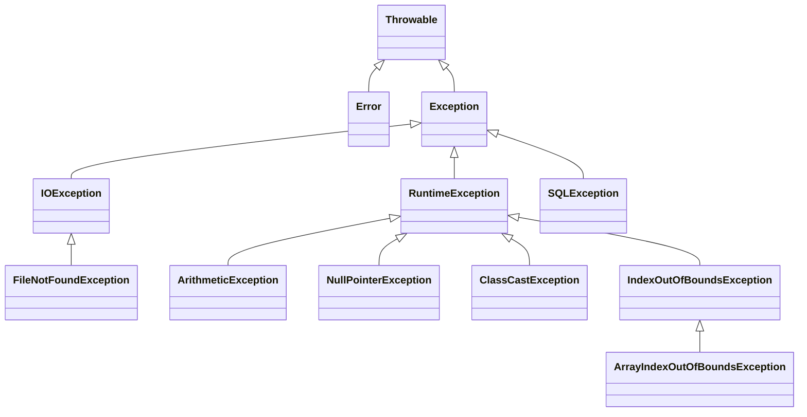

## IDEA 的 Debug 调试

Debug 调试是程序开发中最常用的排错手段之一。它的核心价值不在于“运行程序”，而在于**让程序暂停在指定位置，并逐步观察代码执行过程、变量值变化、方法调用路径和线程状态**。很多看起来“代码没问题却运行错了”的情况，本质上都需要借助 Debug 才能真正定位原因。

### Debug 调试的作用

平时直接运行程序时，代码会从头到尾快速执行完毕，开发者只能看到最终结果，无法看清中间过程。而 Debug 的作用，就是把这个“黑盒执行过程”拆开，让每一步都变得可见。

Debug 主要可以解决以下问题：

- 查看代码的**实际执行顺序**
- 观察变量在执行过程中的**取值变化**
- 判断某个分支、循环、方法是否**真的进入**
- 分析方法调用链，确认问题到底出在哪一层
- 在复杂逻辑、多线程、循环遍历等场景下快速定位异常数据

例如，下面这段代码最终输出的结果如果不符合预期，仅靠肉眼阅读代码不一定能立刻发现问题：

```java
public class DebugTest {
    public static void main(String[] args) {
        int quantity = 3;
        double price = 99.0;
        double total = calculateTotal(quantity, price);
        System.out.println(total);
    }

    public static double calculateTotal(int quantity, double price) {
        double result = quantity + price;
        return result;
    }
}
```

从代码意图看，这里显然是要计算商品总价，但方法内部写成了 `quantity + price`。如果直接运行，只能看到结果不对；而通过 Debug，可以一步一步看到 `quantity`、`price`、`result` 的值，从而快速发现错误出在方法内部的计算逻辑上。

> **注意**：Debug 的重点不是“替代思考”，而是把程序运行过程展示出来，帮助开发者验证自己的判断。

### 开启 Debug 调试

Debug 的基本流程可以概括为：**打断点 → 以 Debug 模式启动 → 程序在断点处暂停 → 逐步观察执行过程**。

#### 第一步：打断点

断点（Breakpoint）是 Debug 的起点。所谓打断点，就是在某一行代码上做一个标记，告诉 IDEA：程序运行到这里时先暂停，不要继续往下执行。

通常会在以下位置打断点：

- 怀疑有问题的代码行
- 某个方法的入口位置
- 变量即将被赋值、修改的位置
- 条件分支和循环体内部
- 调用链中的关键方法


需要特别注意，断点所在的代码行在程序暂停时**通常还没有真正执行**。也就是说，程序停在某一行，表示“下一步将要执行这一行”，而不是“这一行已经执行完了”。

#### 第二步：以 Debug 模式启动程序

打好断点后，需要用 Debug 方式启动程序，而不是普通 Run。只有这样，程序运行到断点处时才会暂停。

常见启动方式通常有多种，例如：

- 点击工具栏中的 Debug 按钮
- 右键当前类或方法，选择 Debug
- 使用快捷键启动 Debug

不同版本的 IDEA、不同操作系统下界面位置可能略有差异，但本质是一样的：**不是普通运行，而是调试运行**。


#### 第三步：查看调试窗口

程序进入 Debug 状态并停在断点后，IDEA 会打开调试窗口。这个窗口是 Debug 的核心工作区，后续的单步执行、变量观察、线程切换、表达式计算等操作，几乎都围绕它展开。

调试窗口通常包含以下信息：

- 当前停在哪个断点
- 当前调用栈（Call Stack）
- 当前方法中的局部变量及其值
- 调试控制按钮
- 监视区、表达式计算区、断点列表等附加区域


> **注意**：当程序停在某一行时，表示这一行**尚未执行**。例如停在 `int x = 10;` 这一行时，往往说明变量 `x` 还没有在当前停顿点完成赋值。

另外，在很多情况下，把鼠标悬停到变量上，也可以临时查看变量当前值。这种方式适合快速查看某个变量，而不必总去变量面板里找。


### Debug 按钮分析

Debug 的核心操作不是“看着程序停住”，而是**控制程序如何继续执行**。常用按钮的区别，决定了能否高效调试。

#### 第一组常用按钮

第一组按钮主要用于控制程序的整体运行状态，常见功能通常包括继续运行、暂停、停止等。

| 按钮功能           | 作用                         | 适用场景                                     |
| ------------------ | ---------------------------- | -------------------------------------------- |
| **Resume Program** | 继续运行，直到遇到下一个断点 | 当前断点已经看完，想让程序继续往后走         |
| **Pause Program**  | 手动暂停当前正在运行的程序   | 程序已经运行起来，但想中途停下来观察         |
| **Stop**           | 结束本次调试运行             | 调试结束，或者程序状态已经没有继续调试的价值 |
| **Rerun**          | 重新启动调试                 | 修改了代码或想从头重新调试                   |


这里容易混淆的是 **Resume** 和 **Step**。`Resume` 的意思不是“执行一行”，而是“继续正常运行”，直到程序再次遇到断点才停下；而 `Step` 系列按钮是单步控制，强调的是“一步一步走”。

#### 第二组常用按钮

第二组按钮是 Debug 中最核心的一组，主要负责**单步执行**。真正决定调试体验的，往往就是这几个按钮是否理解清楚。

| 按钮功能            | 作用                                                         | 典型理解                                    |
| ------------------- | ------------------------------------------------------------ | ------------------------------------------- |
| **Step Over**       | 执行当前行，如果当前行调用了方法，不进入方法内部             | “把这一行执行完，但不进去看里面”            |
| **Step Into**       | 执行当前行，如果当前行调用了方法，则进入方法内部             | “我要进去看看这个方法里面怎么执行”          |
| **Step Out**        | 当前已经进入某个方法内部时，直接执行完当前方法并返回到调用处 | “这个方法我不想继续逐行看了，先退出来”      |
| **Force Step Into** | 强制进入方法内部                                             | 某些普通 `Step Into` 进不去的方法，尝试用它 |
| **Run to Cursor**   | 直接运行到光标所在行并暂停                                   | 不想一行行点，想快速跳到指定位置            |

可以通过一个简单例子理解这些按钮的区别：

```java
public class DebugStepTest {
    public static void main(String[] args) {
        int a = 10;
        int b = 20;
        int result = sum(a, b);
        System.out.println(result);
    }

    public static int sum(int x, int y) {
        int temp = x + y;
        return temp;
    }
}
```

如果当前断在 `int result = sum(a, b);` 这一行：

- 使用 **Step Over**，会直接把 `sum(a, b)` 执行完，停到下一行
- 使用 **Step Into**，会进入 `sum` 方法内部
- 如果已经进入 `sum` 方法，再用 **Step Out**，会直接执行完 `sum` 并回到调用处


> **补充**：某些 JDK 源码方法、库方法或被调试器特殊处理的方法，普通 `Step Into` 可能不会按预期进入，这时可以尝试 **Force Step Into**。它的作用不是“更深层调试”，而是“强制进入本来不容易进入的方法”。

### 添加监视和计算表达式

在实际调试中，仅仅看当前变量列表往往不够。很多时候需要持续关注某个表达式的变化，或者临时验证一个计算结果，这时就会用到 **Watch** 和 **Evaluate Expression**。

#### 添加监视（Watch）

监视的作用是：**把某个变量或表达式固定放到观察区中持续查看**。这样即使调试过程中不断切换代码位置，也可以持续关注它的值变化。

例如，当前在循环中调试，想一直观察 `i`、`sum` 或 `arr[i]` 的变化，就可以把它们加入 Watch。

```java
for (int i = 0; i < arr.length; i++) {
    sum += arr[i];
}
```

在这种场景下，如果把 `i`、`sum`、`arr[i]` 加入监视区，就不需要每次都手动去变量列表里翻找。


这里要注意一个边界问题：**Watch 会一直保留这个表达式本身，但表达式能否继续求值，取决于当前停顿位置是否还在它的作用域内。**也就是说，如果某个局部变量已经离开作用域，Watch 项可能仍然保留，但不一定还能显示一个有效值。

#### 计算表达式（Evaluate Expression）

计算表达式的作用是：**在当前暂停位置，临时计算一个表达式的结果**。它不会修改程序逻辑，只是帮助开发者在当前上下文中验证某个推断。

例如，程序停在某个断点时，当前有变量：

```java
int a = 10;
int b = 20;
```

这时可以临时计算：

```java
a + b
```

看看结果是否为 `30`；也可以计算更复杂的表达式，例如：

```java
(a + b) * 2
```

这种操作不会影响程序继续运行的结果，它只是调试阶段的一种辅助分析工具。


> **结论**：Watch 适合**持续观察**，Evaluate Expression 适合**临时计算**。

### 查看所有断点以及删除断点

当项目逐渐变大后，断点可能会加得很多。如果断点分散在多个类、多个方法中，仅靠肉眼在代码里找会比较麻烦，因此 IDEA 提供了统一查看和管理断点的入口。

在断点管理窗口中，通常可以完成以下操作：

- 查看当前项目中的所有断点
- 快速定位断点所在文件和行号
- 启用或禁用某个断点
- 删除某个断点或批量删除断点
- 配置断点条件、日志输出、挂起方式等高级选项


> **注意**：禁用断点和删除断点不是一回事。**禁用**是暂时让它不生效，之后还可以恢复；**删除**则是把它彻底移除。

### 断点的条件设置

当程序中存在大循环、大数组、集合遍历或大量重复调用时，如果在循环体内部直接打断点，程序可能会每次都停下来，调试效率非常低。这时应使用**条件断点**。

条件断点的含义是：**只有当指定条件成立时，程序才在该断点处暂停；否则直接跳过。**

例如：

```java
for (int i = 0; i < 100; i++) {
    System.out.println(i);
}
```

如果只想在 `i == 50` 时停下来，就不需要从 `0` 一直点到 `50`，而可以直接给断点加条件：

```java
i == 50
```

这样程序前面都会直接运行，到 `i` 等于 `50` 时才暂停。


条件断点特别适合以下场景：

- 遍历大数组或大集合时，只关注某个特定元素
- 循环执行很多次时，只想在某次特定状态下停下
- 某个问题只在变量满足特定值时出现
- 某个对象属性达到某种状态时才需要观察

> **补充**：条件断点的表达式本质上是在当前断点上下文中进行求值，因此必须引用当前作用域内可访问的变量。

### 中断 Debug 调试

有时候调试的目的并不是“把程序完整跑完”，而是**看到某个问题后立刻阻止后续流程继续执行**。例如当前代码后面要写数据库、发消息、调用外部接口，如果已经确认前面数据错误，就不希望后续副作用真正发生。

这时可以使用 **Force Return**。

Force Return 的含义是：**让当前方法立刻返回，不再继续执行后面的代码**。如果当前方法有返回值，还可以指定一个返回结果。

例如：

```java
public int save(User user) {
    validate(user);
    writeDatabase(user);
    sendMessage(user);
    return 1;
}
```

如果调试过程中发现 `user` 数据不对，不想真的执行 `writeDatabase(user)` 和 `sendMessage(user)`，就可以在合适位置使用 Force Return，让当前方法提前结束。


> **注意**：Force Return 是针对**当前方法**的强制返回，不是“回滚程序所有已执行的操作”。如果前面的语句已经执行并产生副作用，Force Return 并不会自动撤销它们。

## 单元测试（JUnit 5）

单元测试（Unit Test）是针对**一个类中的某个方法或某个很小的功能单元**进行的独立测试。它的核心目标不是把整个系统跑起来，而是先验证“这个小地方本身对不对”。只有把一个个方法都验证清楚，后续把它们组合成完整系统时，问题才更容易定位，代码也更可靠。

一个较大的 Java 程序通常由很多类、很多方法共同组成。程序最终出现问题时，错误往往不是“整个系统一起错”，而是某个方法的返回值不对、某个边界情况没处理、某段逻辑写反了。单元测试就是为了解决这个问题：**先把方法单独拿出来验证，再考虑整体联调。**

例如，一个“用户工具类”中有判断年龄是否合法的方法，如果这个方法本身就写错了，那么后续注册、登录、资料修改等功能都可能受到影响。与其等系统运行时报错，不如先为这个方法写一个测试，让程序自动帮忙判断结果是否正确。

### 导入 JUnit 5 的 jar 包

在 Java 中，单元测试通常借助测试框架来完成。当前阶段常用的是 **JUnit 5**。如果项目还没有使用 Maven 或 Gradle 之类的构建工具，也可以通过**手动下载 jar 包并导入项目**的方式使用 JUnit 5。

这里常见的做法是下载 `junit-platform-console-standalone` 对应版本的 jar 包。这个包把运行 JUnit 5 所需的核心内容打包到了一起，更适合入门阶段直接使用。

#### 第一步：打开下载地址并选择版本

需要先进入 JUnit 的 Maven 仓库下载页，在 `junit-platform-console-standalone` 目录中选择需要的版本，再进入该版本页面下载对应的 jar 文件。学习阶段通常选择一个较新的稳定版本即可，不必过分纠结版本差异，关键是保证下载到的是对应版本下的 `jar` 文件。

进入版本列表后，点击某个具体版本号，即可进入该版本的文件详情页。进入详情页后，下载对应的 jar 包即可。

#### 第二步：把 jar 包放入项目并加入类路径

jar 包下载完成后，通常会先把它复制到项目中的 `lib` 目录，再让 IDEA 将它加入当前项目依赖中。这样代码里才能正常导入 `org.junit.jupiter.api.Test`、`Assertions` 等相关类型。

一般流程如下：

1. 在项目中创建或找到 `lib` 目录。
2. 把下载好的 JUnit jar 包复制到 `lib` 目录下。
3. 在 IDEA 中选中这个 jar 包，执行 **Add as Library...**。
4. 将它添加到当前模块的依赖中。

完成后，该 jar 就会出现在项目依赖里，此时测试代码中的相关导包才能被正常识别。

> **补充**：这里所说的“加入类路径”，在当前阶段可以直接理解为“让项目在编译和运行时能够找到这个 jar 包中的类”。如果没有完成这一步，测试代码中的 JUnit 相关类型通常会提示无法识别。

### 测试用例与测试方法

在 JUnit 中，通常会为某个业务类单独编写一个**测试类**，这个测试类常被称为**测试用例类**；测试类中的每一个测试方法，则用于验证某个具体功能点。

这里有两个需要区分的概念：

| 名称           | 含义                                 |
| -------------- | ------------------------------------ |
| **测试用例类** | 专门用于测试某个类的 Java 类         |
| **测试方法**   | 测试用例类中，真正执行测试逻辑的方法 |

也就是说，“测试用例”在入门语境下，既可以泛指整个测试类，也可以指其中的某个具体测试场景。为了表达清楚，通常更建议区分成“测试类”和“测试方法”来理解。

### 编写测试用例

下面先给出一个普通业务类，再为它编写对应的测试类。

#### 被测试的业务类

例如，下面有一个工具类，用于计算两个整数的和，以及两个整数相除的结果：

```java
package com.example.util;

public class NumberUtil {

    public static int add(int a, int b) {
        return a + b;
    }

    public static int divide(int a, int b) {
        return a / b;
    }
}
```

这类代码本身不复杂，但仍然可能因为手误、边界情况或后续修改而出现问题，因此适合先写测试进行验证。

#### 对应的测试类

可以为 `NumberUtil` 编写一个测试类，例如 `NumberUtilTest`：

```java
package com.example.util;

import org.junit.jupiter.api.Assertions;
import org.junit.jupiter.api.Test;

class NumberUtilTest {

    @Test
    void testAdd() {
        // 准备测试数据
        int first = 12;
        int second = 8;

        // 调用要测试的方法，得到实际结果
        int actual = NumberUtil.add(first, second);

        // 给出预期结果
        int expected = 20;

        // 断言：预期值和实际值必须一致
        Assertions.assertEquals(expected, actual);
    }

    @Test
    void testDivide() {
        // 准备测试数据
        int dividend = 36;
        int divisor = 6;

        // 调用要测试的方法，得到实际结果
        int actual = NumberUtil.divide(dividend, divisor);

        // 给出预期结果
        int expected = 6;

        // 断言：预期值和实际值必须一致
        Assertions.assertEquals(expected, actual);
    }
}
```

这段代码中最关键的是 `@Test` 注解。只要某个方法被 `@Test` 标记，JUnit 就会把它识别为测试方法，并在运行测试时自动执行它。

测试方法的核心步骤通常可以概括为三步：

1. **准备数据**
2. **调用被测试的方法**
3. **使用断言比较“实际结果”和“预期结果”**

这是一种非常典型的测试写法。很多测试代码本质上都是围绕这三步展开的。

### 断言的作用

断言（Assertion）是单元测试中最核心的机制之一。它的作用是：**明确告诉测试框架，什么结果才算正确**。如果断言成立，说明测试通过；如果断言失败，说明测试未通过。

例如：

```java
Assertions.assertEquals(expected, actual);
```

这句代码表示：**要求 `expected` 和 `actual` 必须相等**。如果两者不相等，JUnit 会把该测试方法标记为失败。

可以把断言理解为“自动检查规则”。如果没有断言，测试方法即使执行完了，也不能说明结果就一定正确，因为程序只是“跑了”，并没有真正“验”。

例如，下面这种写法就不算完整测试：

```java
@Test
void testAdd() {
    int result = NumberUtil.add(12, 8);
    System.out.println(result);
}
```

它只是把结果打印出来，仍然要靠人去看输出是否正确；而单元测试强调的是**程序自己判断通过还是失败**，因此断言通常不能省略。

### 测试类与测试方法的规范

#### 测试类命名

测试类一般采用“**被测试类名 + Test**”的命名方式。这样看到测试类名时，就能立刻知道它对应测试哪个类。

例如：

| 被测试类          | 测试类                |
| ----------------- | --------------------- |
| `NumberUtil`      | `NumberUtilTest`      |
| `UserService`     | `UserServiceTest`     |
| `OrderCalculator` | `OrderCalculatorTest` |

这种命名方式的好处是清晰、统一，也便于后续维护。

#### 测试方法命名

测试方法的命名通常以 `test` 开头，再接被测试的方法名或测试场景名。例如：

- `testAdd`
- `testDivide`
- `testLoginSuccess`
- `testQueryById`

在当前学习阶段，采用 `testXxx` 这种命名风格最直观，也最容易理解。

> **补充**：后续也会见到更语义化的命名方式，例如 `shouldReturnTrueWhenAgeIsValid`。但在入门阶段，先掌握 `testXxx` 风格更合适。

#### 测试方法的基本编写要求

在 JUnit 5 中，测试方法有一些基本要求，但要注意它与旧版本 JUnit 的规则并不完全相同。

- 使用 `@Test` 注解标记
- 通常写成**无参实例方法**
- 方法不应有返回值
- 方法不能写成 `private`
- 一般不需要手动调用，JUnit 会自动执行

例如：

```java
@Test
void testXxx() {

}
```

很多资料会写成：

```java
@Test
public void testXxx() {

}
```

这种写法**在 JUnit 5 中当然可以用**，但它**不是必须的**。在 JUnit 5 中，测试方法不强制要求写成 `public`，写成包访问权限（即不写访问修饰符）也可以。

### 单元测试方法中使用 `Scanner` 失效

有时在测试方法中使用 `Scanner` 读取控制台输入，会发现无法正常输入内容。这通常不是 `Scanner` 本身失效，而是 IDEA 在运行测试时使用的测试控制台默认行为与普通 `main` 方法控制台不同。

要解决这个问题，可以在 IDEA 的自定义 VM 选项中加入指定参数，让测试控制台支持可编辑输入。

1. 打开 IDEA 顶部菜单中的 **Help**
2. 选择 **Edit Custom VM Options...**
3. 在打开的 VM 配置文件中加入下面这一行：`-Deditable.java.test.console=true`。
4. 保存后重启 IDEA

这个配置的作用，是让 IDEA 的测试控制台允许编辑输入内容。重启 IDEA 后，再运行对应测试，`Scanner` 读取控制台输入的问题通常就可以解决。

不过从单元测试本身的设计角度看，测试方法一般更强调**可重复、自动化、无需人工干预**。而 `Scanner` 依赖手动输入，会让测试变得不够自动，因此在规范测试中通常会尽量减少这种写法。

## 异常概述

程序在运行过程中，并不总会按照理想情况执行。用户可能输入非法数据，文件可能不存在，数组索引可能越界，对象可能为空，系统资源也可能不足。这些“程序运行时出现的不正常情况”，在 Java 中统称为**异常**。

### 异常的引入

现实中的很多事情都不是完全理想的，程序运行也是如此。一个方法在设计时看起来很简单，但只要进入真实运行环境，就可能遇到各种边界情况。例如：

- 用户输入的数据格式不正确
- 要读取的文件不存在
- 数据库中查到的结果为空
- 数组访问时索引非法
- 程序运行过程中内存不足

这些情况如果不加处理，程序就可能直接中断，甚至在用户看来就是“程序崩了”。因此，程序不仅要处理正常流程，还要能面对各种异常情况，并给出合理反应。

例如，下面这个方法希望根据索引获取数组中的元素值：

```java
public static int getElement(int[] data, int index) {
    if (index < 0) {
        System.out.println("索引不能小于 0");
        return ???;
    }

    if (index >= data.length) {
        System.out.println("索引不能超过数组最大下标");
        return ???;
    }

    return data[index];
}
```

这种写法虽然体现了“先判断再处理”的思路，但它存在两个明显问题。

第一，**正常业务代码和错误处理代码混在一起**。方法本来的职责只是“返回数组元素”，但现在还要负责判断各种非法情况，逻辑会越来越乱。

第二，**很多错误并没有合适的返回值可给**。例如这个方法本来应该返回一个 `int`，但如果索引非法，到底返回什么？返回 `0`、`-1` 还是别的值，都可能和真正的合法数据冲突，无法准确表达“这里出问题了”。

也正因为如此，Java 没有把这类问题都做成普通返回值判断，而是提供了一套专门的**异常处理机制**，用于描述和处理程序运行中的异常情况。

### 异常的概念

从面向对象的角度看，异常不是一句普通提示语，而是**一种对象**。Java 把程序运行中的各种异常情况抽象成了不同的**异常类**；当程序出问题时，会创建相应的异常对象，并把异常信息带出来。

例如：

```java
public class ExceptionDemo {
    public static void main(String[] args) {
        calculate();
    }

    public static void calculate() {
        int result = 10 / 0;
        System.out.println(result);
    }
}
```

这段代码中，`10 / 0` 会导致整数除零。程序运行到这一行时，**不会继续正常往下执行**，而是会产生一个表示“算术异常”的对象，并把相关信息抛出，例如：

- 异常类型是什么
- 异常原因是什么
- 异常发生在哪一行
- 方法调用路径是什么

如果当前方法不处理这个异常，异常会继续向上抛给调用者；如果一直没有人处理，最终就会交给 JVM 采用默认方式处理。默认处理通常表现为：**在控制台打印异常信息和调用栈，然后终止程序执行**。

可以把这个过程理解为：

1. 程序执行时出现问题
2. Java 创建对应的异常对象
3. 异常对象被抛出
4. 调用链上如果没有处理者，最终由 JVM 兜底处理


> **注意**：控制台中看到的那一长串异常信息，不只是“报错提示”，其中的**异常类型、异常消息、代码行号、调用链**都具有定位问题的价值。

## 异常分类

### 异常体系

Java 中的所有异常对象，都属于 `Throwable` 体系。`Throwable` 是所有“可以被抛出”的对象的超类，它有两个直接子类：

- `Error`：表示严重错误
- `Exception`：表示程序运行中可以感知和处理的异常

其中，`Exception` 又可以继续分为：

- **运行时异常**（`RuntimeException` 及其子类）
- **编译时异常**（除运行时异常之外的 `Exception` 子类）

下面先用 Mermaid 图把异常体系整理出来：



这个体系需要重点记住三层关系：

1. **`Throwable` 是总根类**
2. **`Throwable` 分成 `Error` 和 `Exception`**
3. **`Exception` 再分成运行时异常和编译时异常**

### Throwable

`Throwable` 是所有异常和错误的共同父类，只要某个对象能够被 `throw` 抛出，它就必须是 `Throwable` 或其子类的对象。

`Throwable` 中有几个非常常用的方法：

| 方法名              | 作用                             |
| ------------------- | -------------------------------- |
| `getMessage()`      | 返回异常的详细消息               |
| `toString()`        | 返回异常类型和异常消息的简短描述 |
| `printStackTrace()` | 打印完整的异常堆栈信息           |

例如，一个异常对象如果执行 `getMessage()`，通常会拿到类似“除数不能为 0”“文件不存在”这样的说明；执行 `printStackTrace()`，则会打印更完整的调用栈，这也是开发中最常见的异常排查方式。

### Error（错误）

`Error` 表示较严重的系统级问题，通常与 JVM 内部状态、系统资源耗尽或底层运行环境有关。这类问题一般不是普通业务代码逻辑能直接修复的，因此通常不把它作为日常业务异常处理的重点。

常见的 `Error` 有：

- `OutOfMemoryError`：内存溢出
- `StackOverflowError`：栈溢出

内存溢出示例：

```java
public class ErrorDemo {
    public static void main(String[] args) {
        int[] data = new int[1024 * 1024 * 1024];
        System.out.println(data);
    }
}
```

这段代码试图创建一个极大的数组，可能导致 JVM 堆内存不足，从而出现 `OutOfMemoryError`。

栈溢出示例：

```java
public class ErrorDemo {
    public static void main(String[] args) {
        repeat();
    }

    public static void repeat() {
        repeat();
    }
}
```

这段代码会无限递归调用自己，导致方法栈不断入栈却永远不返回，最终触发 `StackOverflowError`。

这两类问题都说明：程序已经进入较严重、甚至不可恢复的状态。它们与一般的业务异常不同，通常不能靠简单的 `if` 判断或普通补救逻辑解决。

### Exception（异常）

`Exception` 表示程序运行过程中出现的异常情况。与 `Error` 相比，`Exception` 更贴近日常开发，它描述的是：**程序遇到了不正常情况，但这些情况通常属于业务代码可以感知、处理或规避的范围。**

例如：

- 数组索引越界
- 对空对象调用方法
- 类型转换错误
- 文件不存在
- 数据库连接失败

这些问题虽然会导致程序运行失败，但它们本质上不是 JVM 崩溃，而是程序需要面对的运行异常。因此，开发中真正重点学习和处理的，主要是 `Exception`。

> **补充**：不要把“Exception 可以处理”理解成“都必须手工写处理代码”。有些异常更适合提前规避，有些异常则更适合交给异常机制统一处理。

#### Error 与 Exception 的区别

可以把两者的区别简单理解为：

- **`Exception`**：程序运行时遇到了不符合预期的情况，程序本身通常可以感知、规避或处理
- **`Error`**：系统层面出了严重问题，普通业务代码通常无能为力

### 运行时异常

`RuntimeException` 及其子类都属于**运行时异常**。这类异常在编译阶段通常不会强制检查，因此也常被称为**不检查异常**（Unchecked Exception）。

运行时异常往往由**程序逻辑错误**引起，例如：

- 除数为 0
- 空引用访问成员
- 转型不合法
- 数组索引非法

它们的共同特点是：**编译器不强制你在编写阶段处理，但程序运行时一旦真的发生，就会直接中断当前执行流程。**

#### ArithmeticException

`ArithmeticException` 表示算术运算异常，最典型的情况是整数除以 0。

```java
public class RuntimeExceptionDemo {
    public static void main(String[] args) {
        int count = 0;
        int average = 100 / count;
        System.out.println(average);
    }
}
```

如果 `count` 为 `0`，则会抛出 `ArithmeticException`。

这类异常往往不是“系统突然坏了”，而是程序逻辑没有对除数做有效判断。因此更合理的做法，通常不是事后被动接异常，而是事前先判断条件是否成立。

#### NullPointerException

`NullPointerException` 表示空指针异常。当引用变量为 `null`，却仍试图访问其属性、调用其方法或取数组长度时，就会发生这个异常。

```java
public class RuntimeExceptionDemo {
    public static void main(String[] args) {
        String name = null;
        System.out.println(name.length());
    }
}
```

这里 `name` 没有指向任何字符串对象，因此调用 `length()` 时会抛出空指针异常。

空指针异常之所以常见，是因为 Java 中引用变量本身可以为 `null`。如果使用前没有判断它是否真的指向对象，就很容易在运行时出问题。

#### ClassCastException

`ClassCastException` 表示类型转换异常。当一个对象并不是目标类型的实例，却强行进行向下转型时，就会发生这个异常。

```java
class Vehicle {
}

class Car extends Vehicle {
}

class Bike extends Vehicle {
}

public class RuntimeExceptionDemo {
    public static void main(String[] args) {
        Vehicle vehicle = new Car();
        Bike bike = (Bike) vehicle;
    }
}
```

这里 `vehicle` 实际指向的是 `Car` 对象，却被强制转换成 `Bike`，因此会抛出 `ClassCastException`。

这种异常通常说明：程序对对象实际类型的判断有误。更稳妥的做法，是在转型前先判断对象是否属于目标类型。

#### ArrayIndexOutOfBoundsException

`ArrayIndexOutOfBoundsException` 表示数组索引越界异常。当索引小于 `0` 或大于等于数组长度时，就会发生这个异常。

```java
public class RuntimeExceptionDemo {
    public static void main(String[] args) {
        int[] scores = {90, 85, 98};
        System.out.println(scores[3]);
    }
}
```

这个数组长度是 `3`，合法下标只能是 `0`、`1`、`2`，访问 `scores[3]` 就越界了。

这类异常说明：数组访问必须建立在“索引合法”这一前提上。索引越界通常不是 JVM 的问题，而是程序自己对边界范围控制不严。

### 编译时异常

编译时异常是指：**在编译阶段就会被编译器检查出来，并强制要求处理的异常**。这类异常又叫**可检查异常**（Checked Exception）。

它们的典型特点是：如果代码中可能出现这类异常，而开发者既不处理也不声明抛出，程序就**无法通过编译**。

常见的编译时异常有：

- `IOException`
- `FileNotFoundException`
- `SQLException`

例如：

```java
import java.io.FileInputStream;
import java.io.InputStream;

public class CheckedExceptionDemo {
    public static void main(String[] args) {
        InputStream in = new FileInputStream("D:\\data\\info.txt");
    }
}
```

这段代码中，`FileInputStream` 在尝试打开文件时，可能出现“文件不存在”的问题，因此对应的 `FileNotFoundException` 属于编译时异常。也就是说，编译器会要求开发者必须提前处理，否则代码不能通过编译。

## 异常处理

前面已经认识了什么是异常，以及异常的大致分类。接下来需要进一步学习的是：**异常出现以后，程序到底应该怎么处理**。在 Java 中，常见的处理思路主要有三种：**抛出异常、声明异常、捕获异常**。其中会涉及四个重要关键字：`throw`、`throws`、`try`、`catch`，以及常与它们一起出现的 `finally`。

### 为什么需要异常处理

程序出现异常后，如果完全不处理，异常通常会沿调用链一直向上抛，最终交给 JVM 采用默认方式处理：**打印异常信息并终止程序执行**。这种方式虽然能把错误暴露出来，但很多时候并不符合开发需求。比如有些异常可以在当前方法中解决，有些异常则更适合交给调用者决定如何处理。

例如，一个根据索引读取数组元素的方法，如果索引不合法，直接返回一个随意的值并不可靠；更合理的做法往往是通过异常机制把“这里出问题了”明确传递出去。

### 抛出异常：`throw`

`throw` 的作用是：**在方法体内部，手动抛出一个具体的异常对象**。当程序员已经明确知道“这里出现了不正常情况”时，就可以主动创建异常对象，并用 `throw` 把它抛出去。`throw` 只能写在方法体内部，它一旦执行，当前方法会立刻结束，后面的代码不再继续执行。

基本格式如下：

```java
throw new 异常类名("异常说明信息");
```

下面给出一个新的例子。该方法用于获取数组中指定位置的元素值，如果索引不合法，就主动抛出异常：

```java
public class ArrayTool {
    public static int getElement(int[] data, int index) {
        if (index < 0 || index >= data.length) {
            throw new ArrayIndexOutOfBoundsException("索引超出数组范围");
        }
        return data[index];
    }

    public static void main(String[] args) {
        int[] nums = {10, 20, 30};
        int value = getElement(nums, 5);
        System.out.println(value);
    }
}
```

这段代码中，`index` 为 `5`，而数组长度只有 `3`，因此条件成立，程序会执行：

```java
throw new ArrayIndexOutOfBoundsException("索引超出数组范围");
```

这句代码有两个效果：

1. **创建一个异常对象并抛出**
2. **立刻结束当前方法的执行**

也就是说，`return data[index];` 这一行根本不会执行到。

> **注意**：`throw` 抛出的不是一个异常类名，而是一个**异常对象**。因此正确写法是 `throw new XxxException(...)`，而不是只写异常类型名。

### 声明异常：`throws`

`throws` 的作用是：**在方法声明处，告诉调用者“这个方法执行时可能会抛出哪些异常”**。它本身并不会真正抛出异常对象，而是起到“提前声明、向上报告”的作用。

基本格式如下：

```java
[修饰符] 返回值类型 方法名(参数列表) throws 异常类名1, 异常类名2 {
}
```

#### `throw` 与 `throws` 的区别

这两个关键字很容易混淆，必须分清：

| 关键字   | 位置       | 作用                       |
| -------- | ---------- | -------------------------- |
| `throw`  | 方法体内部 | 真正抛出一个异常对象       |
| `throws` | 方法声明处 | 声明该方法可能抛出某些异常 |

可以简单记忆为：**`throw` 是“真抛”，`throws` 是“先声明”**。

#### 为什么有时必须写 `throws`

如果一个方法内部可能产生**编译时异常**，而当前方法又没有使用 `try-catch` 处理它，那么就必须在方法声明处用 `throws` 声明出来，否则代码无法通过编译。相反，运行时异常通常不要求强制声明。

例如，下面这个方法尝试读取一个文件：

```java
import java.io.FileInputStream;
import java.io.FileNotFoundException;

public class FileTool {
    public static void openFile(String path) throws FileNotFoundException {
        FileInputStream in = new FileInputStream(path);
    }
}
```

这里 `FileInputStream` 构造方法可能抛出 `FileNotFoundException`，而它属于编译时异常，所以如果方法内部不捕获，就必须写：

```java
throws FileNotFoundException
```

否则编译器会直接报错。

#### `throws` 可以声明多个异常

如果一个方法执行过程中可能出现多种异常，就可以在 `throws` 后面写多个异常类型，中间用逗号隔开。

例如：

```java
import java.io.FileInputStream;
import java.io.FileNotFoundException;

public class DataTool {
    public static int readNumber(int[] data, int index, String path)
            throws FileNotFoundException, ArrayIndexOutOfBoundsException {

        FileInputStream in = new FileInputStream(path);

        if (index < 0 || index >= data.length) {
            throw new ArrayIndexOutOfBoundsException("索引不合法");
        }

        return data[index];
    }
}
```

这个方法里既可能出现文件不存在的问题，也可能出现数组索引越界的问题，因此可以同时声明。

不过需要理解一点：`throws` 声明多个异常，只是表示“这些异常**有可能**出现”，并不代表一次调用会同时抛出多个异常。

#### `throws` 声明类型的范围要求

`throws` 后面声明的异常类型，**可以写得比实际抛出的异常更大一些，但不能写得更小**。所谓“写得更大”，是指可以写父类异常；所谓“写得更小”，是指如果方法实际可能抛出某个父类异常，却只声明某个更窄的子类异常，那么声明范围就不完整了。

例如，某方法实际可能抛出 `IllegalNameException`，那么方法声明写成：

```java
throws IllegalNameException
```

是可以的，写成：

```java
throws Exception
```

通常也可以，因为 `Exception` 的范围更大；但如果实际可能抛出的异常范围更广，却只写成某个更窄的子类异常，就不合适了。

### 捕获异常：`try-catch`

如果某个异常当前方法**自己能够处理**，就不一定非要往上抛，而是可以使用 `try-catch` 在本地捕获并处理。`try` 用来包裹可能出现异常的代码，`catch` 用来接住并处理对应类型的异常。一个 `try` 语句至少要配 `catch` 或 `finally` 中的一个，不能单独存在。

基本格式如下：

```java
try {
    // 可能出现异常的代码
} catch (异常类型 变量名) {
    // 异常处理代码
}
```

下面用一个新的例子说明：

```java
public class TryCatchDemo {
    public static void main(String[] args) {
        int[] scores = {80, 90, 100};

        try {
            int value = scores[4];
            System.out.println("成绩：" + value);
        } catch (ArrayIndexOutOfBoundsException e) {
            System.out.println("数组下标越界：" + e.getMessage());
        }

        System.out.println("程序继续执行");
    }
}
```

这段代码中，`scores[4]` 会产生数组越界异常，因此程序不会执行 `System.out.println("成绩：" + value);`，而是会直接跳到 `catch` 中处理。`catch` 执行结束后，程序还会继续向下执行，所以最后的“程序继续执行”仍然会输出。

> **注意**：一旦 `try` 块中某一行发生异常，该行后面的同一 `try` 块代码就不会继续执行，而是立即寻找能匹配的 `catch`。

#### `catch` 中的异常对象有什么用

`catch` 后面的小括号中会接收到一个异常对象，这个对象就是刚才被抛出的那个异常对象。这个变量本质上是一个**引用变量**，保存的是异常对象的引用，通过它可以获取异常的详细信息。

常见用法有：

```java
e.getMessage();
e.printStackTrace();
System.out.println(e);
```

其中：

- `getMessage()` 用于获取异常的简短说明；
- `printStackTrace()` 用于打印完整的异常堆栈信息；
- 直接输出异常对象时，本质上会调用该异常对象的 `toString()`，通常会显示**异常类名 + 异常信息**。`Exception` 已经重写了 `toString()`。

例如：

```java
try {
    throw new RuntimeException("数据格式不正确");
} catch (RuntimeException e) {
    System.out.println(e);
    System.out.println(e.getMessage());
}
```

这类写法中，第一句通常会输出带有异常类型的信息，第二句只输出构造异常对象时传入的提示文字。

> **补充**：在某些运行环境中，`printStackTrace()` 的输出与 `System.out.println()` 的输出前后顺序看起来可能不完全一致，这与控制台输出流及运行环境有关，不应把它理解成异常处理机制本身的规则。

#### 一个 `try` 对应多个 `catch`

一个 `try` 块中可能出现多种不同异常，这时可以写多个 `catch`，分别处理不同情况。这样比统一用一个笼统的 `catch(Exception e)` 更清楚，也更便于针对性处理。

例如：

```java
public class MultiCatchDemo {
    public static void main(String[] args) {
        String text = null;
        int[] nums = {1, 2, 3};

        try {
            System.out.println(text.length());
            System.out.println(nums[5]);
        } catch (NullPointerException e) {
            System.out.println("字符串对象为空");
        } catch (ArrayIndexOutOfBoundsException e) {
            System.out.println("数组下标越界");
        }

        System.out.println("程序结束");
    }
}
```

这段代码中，最先发生的是空指针异常，因此程序会直接进入第一个 `catch`。一旦某个异常已经匹配成功，后面的 `catch` 就不会再执行。

> **结论**：一次异常处理过程中，多个 `catch` 分支里**最多只会执行一个**。

#### 多个 `catch` 的书写顺序

如果多个 `catch` 中的异常类型存在父子关系，那么**子类异常必须写在前面，父类异常必须写在后面**，否则编译会报错。

例如：

```java
try {
    // 可能抛出异常的代码
} catch (ArrayIndexOutOfBoundsException e) {
    System.out.println("数组越界");
} catch (RuntimeException e) {
    System.out.println("运行时异常");
}
```

这种顺序是正确的，因为 `ArrayIndexOutOfBoundsException` 是 `RuntimeException` 的子类。如果反过来先写父类，那么子类对应的 `catch` 就永远没有机会执行，编译器也会直接拦住这种写法。

### `finally`

`finally` 表示：**无论异常是否发生，通常都要执行的代码块**。它不能单独出现，必须跟 `try` 一起使用，常见写法有两种：

```java
try {
    
} finally {
    
}
```

```java
try {
    
} catch (...) {
    
} finally {
    
}
```

`finally` 最典型的用途是：**释放资源**。例如关闭流、关闭数据库连接、释放锁等。这些操作不能因为中途出现异常就被跳过，因此适合放到 `finally` 中，以保证执行。

下面看一个新的例子：

```java
public class FinallyDemo {
    public static void main(String[] args) {
        try {
            int a = 10;
            int b = 0;
            System.out.println(a / b);
        } finally {
            System.out.println("无论是否发生异常，这里通常都会执行");
        }
    }
}
```

这里 `a / b` 会产生异常，但 `finally` 中的输出语句仍然会执行。

#### `try-catch-finally`

当某个异常既需要**在当前方法中处理**，又有一些代码需要**无论如何都执行**时，就会使用 `try-catch-finally` 组合。

基本格式如下：

```java
try {
    // 可能出现异常的代码
} catch (异常类型 变量名) {
    // 异常处理代码
} finally {
    // 通常一定会执行的代码
}
```

例如：

```java
import java.util.Scanner;

public class TryCatchFinallyDemo {
    public static void main(String[] args) {
        Scanner scanner = new Scanner(System.in);

        try {
            System.out.print("请输入一个整数：");
            int number = scanner.nextInt();
            System.out.println("100 / 该数 = " + (100 / number));
        } catch (ArithmeticException e) {
            System.out.println("除数不能为 0");
        } finally {
            System.out.println("本次计算结束");
            scanner.close();
        }
    }
}
```

这个例子中：

- 如果用户输入 `0`，会触发 `ArithmeticException`
- 异常会在 `catch` 中被处理
- 最后的 `finally` 无论如何都会执行，用于输出结束信息并关闭 `Scanner`

这样就同时兼顾了“异常处理”和“资源释放”。

#### `return` 与 `finally`

一个容易混淆的点是：**即使 `try` 或 `catch` 中写了 `return`，`finally` 中的代码通常仍然会执行**。

例如：

```java
public class ReturnFinallyDemo {
    public static void main(String[] args) {
        System.out.println(test());
    }

    public static int test() {
        try {
            return 10;
        } finally {
            System.out.println("finally 执行了");
        }
    }
}
```

执行结果中，`finally` 依然会输出。这说明：`return` 并不会让 `finally` 失效。

再进一步看下面这个例子：

```java
public class ReturnValueDemo {
    public static void main(String[] args) {
        System.out.println(getNumber());
    }

    public static int getNumber() {
        int x = 10;
        try {
            return x;
        } finally {
            x++;
        }
    }
}
```

最终返回的仍然是 `10`，不是 `11`。原因不是 `finally` 没执行，而是 `return x` 时，返回值已经先被临时保存起来了，后面 `finally` 中对 `x` 的修改不会再改变已经确定好的返回结果。

> **易错点**：不要简单理解为“`finally` 会影响 `return` 的返回值”。更准确地说，是**返回值通常先确定，再执行 `finally`**。

#### `System.exit(0)` 与 `finally`

虽然一般说 `finally` 中的代码“总会执行”，但有一个非常重要的例外：**如果在 `try` 或 `catch` 中调用了 `System.exit(0)` 直接退出 JVM，那么 `finally` 也不会再执行**。

例如：

```java
public class ExitDemo {
    public static void main(String[] args) {
        try {
            System.out.println("程序准备退出");
            System.exit(0);
        } finally {
            System.out.println("这一行不会执行");
        }
    }
}
```

因为 `System.exit(0)` 的含义是直接终止虚拟机，所以后面的 `finally` 失去了执行机会。

#### `try-finally`

如果当前方法**不打算在本地捕获异常**，但又有资源必须释放，就可以使用 `try-finally`。这种写法中没有 `catch`，因此异常如果真的发生，仍会继续向上抛出；但不管怎样，`finally` 中的资源释放代码仍会执行。

例如：

```java
import java.io.FileInputStream;
import java.io.FileNotFoundException;

public class TryFinallyDemo {
    public static void main(String[] args) throws FileNotFoundException {
        FileInputStream in = null;
        try {
            in = new FileInputStream("D:\\data.txt");
            System.out.println("文件打开成功");
        } finally {
            System.out.println("这里通常用于释放资源");
        }
    }
}
```

这个例子中没有 `catch`，所以如果文件不存在，异常仍会往上抛；但 `finally` 中的代码仍然会执行。

### `throws` 和 `try-catch` 如何选择

学习异常处理时，经常会遇到这个问题：**到底该往上抛，还是在当前方法里捕获？**

可以从责任划分来理解：

- 如果当前方法**知道怎么处理**，就使用 `try-catch`
- 如果当前方法**不适合处理，或者应该让调用者决定如何处理**，就使用 `throws`

例如，一个工具方法只是读取文件内容，如果文件不存在，该方法本身未必知道“业务上应该弹窗、重试还是记录日志”，这时往往更适合 `throws`；而如果当前方法很明确知道出错后应该给出什么提示，并且程序还能继续运行，那么更适合 `try-catch`。这一点在示例代码的说明里也有强调。

> **结论**：`throws` 偏向“把问题交给上层处理”，`try-catch` 偏向“我自己在这里把问题处理掉”。

## 自定义异常

当标准异常类不能准确表达某一类业务错误时，就可以定义自己的异常类型。**自定义异常的核心作用，是让异常名称和异常信息更贴近业务语义**，从而提高代码的可读性、可维护性，也便于调用者判断问题的性质。

Java 中所有异常都属于 `Throwable` 体系。只有继承 `Throwable` 或其子类的类型，才具有**可抛性**，才能被 `throw` 抛出。因此，自定义异常本质上仍然是在 Java 既有异常体系中扩展新的异常类型。

### 为什么需要自定义异常

标准异常类更偏向描述程序层面的技术错误，例如空指针、数组越界、文件找不到等；但实际开发中，还会遇到大量**业务规则不满足**的情况，例如用户名长度不合法、年龄超出范围、商品价格不能为负数、余额不足等。

这类问题如果直接抛出 `Exception` 或 `RuntimeException`，虽然也能表示“程序出错了”，但异常含义过于笼统，不利于阅读和维护。相比之下，自定义异常可以直接把业务含义体现在类型名上。

例如，商品价格不能为负数时，与其抛出一个笼统的 `Exception`，不如定义一个 `InvalidPriceException`。这样一来，只看异常名称，就能大致判断问题所在。

### 自定义异常的基本格式

自定义异常通常写成一个普通类，并继承 `Exception` 或 `RuntimeException`。一般会提供两个构造器：一个无参构造器，一个带异常信息的构造器。

```java
class 自定义异常名 extends Exception或RuntimeException {
    public 自定义异常名() {
    }

    public 自定义异常名(String msg) {
        super(msg);
    }
}
```

这种写法中：

- 无参构造器用于创建一个不带具体说明信息的异常对象；
- 带参构造器用于创建一个带错误说明的异常对象；
- `super(msg)` 的作用是把异常说明信息交给父类保存，后续可以通过 `getMessage()` 获取。

> **结论**：自定义异常的写法并不复杂，关键在于**继承谁**以及**异常名是否能准确表达业务问题**。

#### 自定义异常的构造器为什么通常写两个

理论上，自定义异常只写带参构造器也能使用；但通常保留无参构造器和带参构造器这两种形式，会更灵活。

例如：

```java
throw new InvalidPriceException();
```

表示仅抛出某种异常类型，但不额外说明原因。

```java
throw new InvalidPriceException("商品价格不能为负数");
```

则在抛出异常的同时给出更具体的信息，便于后续定位问题。

多数情况下，**带消息的构造器更常用**，因为调用者在捕获异常后，往往希望直接看到更明确的错误原因，而不是只知道“发生了某种异常”。

#### 自定义异常继承 `Exception` 和继承 `RuntimeException` 的区别

自定义异常时，最重要的设计选择之一，就是决定它继承 `Exception` 还是 `RuntimeException`。两者的区别不在于能不能抛出，而在于：**调用者是否通常需要显式处理**。

| 继承方式                   | 异常类别   | 是否通常需要显式处理 | 典型特点                           |
| -------------------------- | ---------- | -------------------- | ---------------------------------- |
| `extends Exception`        | 编译时异常 | **通常需要**         | 更强调“调用者必须知道并处理”       |
| `extends RuntimeException` | 运行时异常 | **通常不强制要求**   | 更强调“调用方式错误或参数本身非法” |

##### 继承 `Exception`

如果自定义异常继承 `Exception`，它就属于**编译时异常**。这意味着：如果当前方法中抛出了该异常，又没有在方法内部使用 `try-catch` 处理，那么通常就必须在方法声明处使用 `throws` 继续声明，让调用者知道这里可能出现这个异常。

例如：

```java
public void saveProduct(double price) throws InvalidPriceException {
    if (price < 0) {
        throw new InvalidPriceException("商品价格不能为负数");
    }
}
```

这种设计适合那些**调用者必须明确知道并决定如何处理**的问题。也就是说，这类异常更强调“这是一个需要被认真对待的业务问题”。

##### 继承 `RuntimeException`

如果自定义异常继承 `RuntimeException`，它就属于**运行时异常**。这类异常在语法层面上通常不要求强制写 `throws`，调用者也不一定要显式捕获。

例如：

```java
class InvalidScoreException extends RuntimeException {
    public InvalidScoreException() {
    }

    public InvalidScoreException(String msg) {
        super(msg);
    }
}

class ScoreService {
    public void saveScore(int score) {
        if (score < 0 || score > 100) {
            throw new InvalidScoreException("成绩必须在 0~100 之间");
        }
        System.out.println("成绩保存成功");
    }
}
```

这里即使方法没有写 `throws InvalidScoreException`，代码仍然可以通过编译。因为运行时异常通常表示：**调用方式本身就不合理，或者参数明显违反约定**。

#### 两种继承方式该如何选择

选择继承 `Exception` 还是 `RuntimeException`，本质上是在划分异常处理责任。

可以用下面的思路理解：

- 如果这个问题一旦发生，**调用者必须显式感知并处理**，更适合继承 `Exception`；
- 如果这个问题更多体现为**调用者传参错误、使用方式错误、违反约定**，更适合继承 `RuntimeException`。

例如：

- 导入文件格式错误、订单状态不允许当前操作，这类问题通常需要调用者明确决定下一步如何处理，更适合设计成**编译时异常**；
- 方法参数传入负数、成绩超过上限、年龄明显非法，这类问题往往更像代码使用不当，也常设计成**运行时异常**。

#### 自定义异常的命名建议

自定义异常的名称应尽量做到**见名知意**，让人只看类型名就能大致判断问题含义。常见命名方式有：

- `InvalidPriceException`
- `IllegalUserNameException`
- `AgeOutOfRangeException`
- `BalanceNotEnoughException`
- `OrderStatusException`

命名时一般遵循两个原则：

- 名称要体现具体业务问题，不要过于笼统；
- 通常以 `Exception` 结尾，保持统一风格。

不建议把很多不同业务问题都塞进一个大而泛的异常类中，否则虽然形式上用了“自定义异常”，但实际上并没有提升表达效果。

### 自定义异常的使用方式

自定义异常的使用通常包括三个步骤：

1. 定义异常类；
2. 在业务规则不满足时创建异常对象，并用 `throw` 抛出；
3. 根据异常类型决定是由当前方法处理，还是继续向上声明给调用者处理。

下面给出一个新的例子。假设商品价格不能小于 `0`，否则就认为数据非法。

```java
class InvalidPriceException extends Exception {
    public InvalidPriceException() {
    }

    public InvalidPriceException(String msg) {
        super(msg);
    }
}

class Product {
    private double price;

    public Product(double price) throws InvalidPriceException {
        if (price < 0) {
            throw new InvalidPriceException("商品价格不能为负数");
        }
        this.price = price;
    }

    public double getPrice() {
        return price;
    }
}

public class CustomExceptionDemo {
    public static void main(String[] args) {
        try {
            Product product = new Product(-99.9);
            System.out.println(product.getPrice());
        } catch (InvalidPriceException e) {
            System.out.println("错误信息：" + e.getMessage());
            e.printStackTrace();
        }
    }
}
```

这段代码中，`Product` 的构造方法在赋值前先进行校验。如果价格不合法，就直接抛出 `InvalidPriceException`，阻止非法对象被创建出来。这样做的意义是：**对象一旦创建成功，就尽量保证它本身处于合法状态**。

