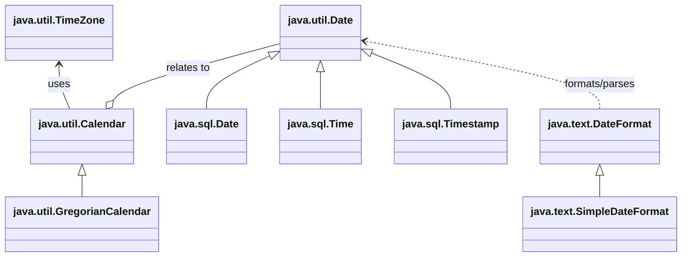

## 基本数据类型包装类

Java 是**面向对象语言**，但不是“纯面向对象语言”，因为 `byte`、`short`、`int`、`long`、`float`、`double`、`boolean`、`char` 这八种**基本数据类型**本身都不是对象。可是在实际开发中，很多位置要求传入的是对象，例如 `Object` 类型参数、`Object[]` 数组以及后续常见的集合操作。为了让基本类型也能以“对象”的形式参与这些操作，Java 为每一种基本数据类型都设计了一个对应的**包装类**。这一组类统称为**基本数据类型包装类**。

从设计思想上看，包装类本质上就是把一个基本类型的值封装进对象中，再提供取值、比较、转换等操作能力。这样既保留了基本类型易于运算的特点，又能在需要时进入对象体系参与统一处理。

### 包装类的对应关系

所有包装类都位于 `java.lang` 包中，对应关系如下：

| 基本数据类型 | 包装类      |
| ------------ | ----------- |
| `byte`       | `Byte`      |
| `short`      | `Short`     |
| `int`        | `Integer`   |
| `long`       | `Long`      |
| `float`      | `Float`     |
| `double`     | `Double`    |
| `boolean`    | `Boolean`   |
| `char`       | `Character` |

在八个包装类中，除了 `Integer` 和 `Character` 之外，其余六个类名都只是把基本数据类型名首字母改为大写即可。这个命名规律本身不难，但 `int` 对应 `Integer`、`char` 对应 `Character` 需要单独记住。

这八个包装类里，`Byte`、`Short`、`Integer`、`Long`、`Float`、`Double` 属于**数值型包装类**，它们都是 `Number` 的子类；`Boolean` 和 `Character` 不属于 `Number` 体系。

需要注意的是，`Number` 中真正的抽象方法主要是 `intValue()`、`longValue()`、`floatValue()`、`doubleValue()`，而 `byteValue()` 和 `shortValue()` 并不是抽象方法。

### 为什么需要包装类

基本类型不能直接当作对象使用，而很多 Java 机制是围绕对象设计的。例如，一个方法如果把参数写成 `Object`，它的目标通常是“尽可能接收各种对象类型的数据”。这时，若要传入一个整数值，就需要先让这个整数具备对象身份。包装类正是为此而存在。

相关示例代码也演示了：把一个 `int` 封装进对象后，它就可以作为 `Object` 参与统一处理。

```java
public class WrapperDemo {
    public static void main(String[] args) {
        print(Integer.valueOf(100));
        print("hello");
        print(Boolean.valueOf(true));
    }

    public static void print(Object obj) {
        System.out.println(obj);
    }
}
```

再例如，`Object[]` 数组中存放的是对象引用，而不是基本类型本身。如果希望把整数、浮点数、布尔值统一放入同一个数组中，就必须依赖包装类；在自动装箱出现之后，这个过程可以由 Java 自动完成。

```java
Object[] values = {10, 3.14, true, 'A'};
```

### Integer 的基本认识

在八个包装类中，`Integer` 最常用，也最适合用来理解包装类的整体机制。学习包装类时，可以先把重点放在 `Integer` 上，再把相同规律迁移到其他包装类。

`Integer` 的常见任务主要有三类：

1. 在 `int` 与 `Integer` 之间来回转换。
2. 在 `String`、`int`、`Integer` 之间进行转换。
3. 提供比较、取值范围、进制转换等实用方法。

### `int` 与 `Integer` 的相互转换

#### `int` 转 `Integer`

把基本类型 `int` 变成包装对象，称为**装箱**。早期写法可以通过构造方法完成，例如 `new Integer(100)`；但这类构造方法已经**过时**，现在不推荐使用，应该优先使用 `valueOf()`。相关示例代码也明确给出了这一点。

```java
Integer a = Integer.valueOf(100);
Integer b = Integer.valueOf("123");
```

这里有两个细节需要注意：

1. `Integer.valueOf(100)` 是把 `int` 转成 `Integer`。
2. `Integer.valueOf("123")` 是把字符串 `"123"` 转成 `Integer`，前提是字符串内容必须是合法的整数字面值。

如果字符串不是合法整数格式，就会抛出 `NumberFormatException`。

```java
Integer n = Integer.valueOf("123");   // 正常
Integer m = Integer.valueOf("12a");   // 运行时报 NumberFormatException
```

> **易错点**：`Integer` 的构造方法虽然很多旧代码中仍能见到，但现代开发中应优先使用 `valueOf()`。一方面写法更规范，另一方面它和后面的缓存机制也有直接关系。

> **补充**：其他包装类的装箱语法与 `Integer` 基本一致，例如 `Long.valueOf(100L)`、`Double.valueOf("3.14")`。但有两个例外需要单独记住：`Character` 只能由 `char` 转成对象，不能直接把字符串转成 `Character`；`Boolean` 在由字符串转对象时，只有字符串内容是 `"true"`（忽略大小写）时结果才是 `true`，其他内容一律得到 `false`。

#### `Integer` 转 `int`

把包装对象中的值取出来，重新变成基本类型，称为**拆箱**。最常见的方式是调用 `intValue()`。相关示例代码中也使用了这一写法。

```java
Integer number = Integer.valueOf(200);
int value = number.intValue();
System.out.println(value); // 200
```

由于 `Integer` 属于 `Number` 体系，所以除了 `intValue()` 之外，它还可以调用 `longValue()`、`doubleValue()` 等方法把值转换成其他基本数值类型。

```java
Integer number = Integer.valueOf(200);
long x = number.longValue();
double y = number.doubleValue();
```

这说明数值型包装类具有统一的“数值提取”能力，但这并不意味着所有转换都一定无损。例如，大范围数值转成小范围数值时，仍可能发生精度丢失或截断。

> **补充**：`Boolean` 不属于 `Number`，因此它没有 `intValue()` 这类方法，只能调用 `booleanValue()` 取出 `boolean`；`Character` 只能调用 `charValue()` 取出 `char`。

### `String`、`int`、`Integer` 之间的转换

包装类学习中最常见、也最容易混淆的部分，就是这三种类型之间的来回转换。以 `Integer` 为中心，可以整理成下面这张表：

| 转换方向            | 推荐写法                                          | 结果类型  |
| ------------------- | ------------------------------------------------- | --------- |
| `String -> int`     | `Integer.parseInt("123")`                         | `int`     |
| `int -> String`     | `Integer.toString(123)` 或 `String.valueOf(123)`  | `String`  |
| `int -> Integer`    | `Integer.valueOf(123)`                            | `Integer` |
| `Integer -> int`    | `integer.intValue()`                              | `int`     |
| `String -> Integer` | `Integer.valueOf("123")`                          | `Integer` |
| `Integer -> String` | `integer.toString()` 或 `String.valueOf(integer)` | `String`  |

#### `String` 转 `int`

最常用的方法是 `Integer.parseInt(String s)`。它把一个**整数字符串**解析为 `int` 值。

```java
int a = Integer.parseInt("123");
int b = Integer.parseInt("-20");
System.out.println(a + b); // 103
```

这里的关键不是“字符串里看起来像数字”，而是它必须满足 `int` 的合法格式要求。否则就会抛出 `NumberFormatException`。

```java
int x = Integer.parseInt("18");    // 正常
int y = Integer.parseInt("18A");   // NumberFormatException
```

#### `int` 转 `String`

最直接、最规范的写法有两种：`Integer.toString(int)` 和 `String.valueOf(int)`。

```java
int score = 95;
String s1 = Integer.toString(score);
String s2 = String.valueOf(score);
System.out.println(s1 + "分");
System.out.println(s2 + "分");
```

很多初学者也会写成 `score + ""`。这种写法能用，但本质上是依赖字符串拼接触发类型转换，可读性和表达意图都不如前两者清楚，因此更推荐 `Integer.toString()` 或 `String.valueOf()`。

#### `String` 转 `Integer`

如果目标不是基本类型，而是包装对象，应使用 `Integer.valueOf(String)`。

```java
Integer age = Integer.valueOf("20");
```

这一步和 `parseInt()` 的差别在于：`parseInt()` 得到的是 `int`，而 `valueOf()` 得到的是 `Integer` 对象。

#### `Integer` 转 `String`

把包装对象转成字符串，可以使用实例方法 `toString()`，也可以使用 `String.valueOf()`。

```java
Integer count = Integer.valueOf(8);
String s1 = count.toString();
String s2 = String.valueOf(count);
```

> **易错点**：`parseInt()` 的结果是 **`int`**，`valueOf()` 的结果是 **`Integer`**。两者经常长得很像，但返回类型不同，使用场景也不同。

> **补充**：`Boolean.parseBoolean(String)` 的规则比较特殊：只有字符串内容是 `"true"`（忽略大小写）时才返回 `true`，其余一律返回 `false`。`Character` 则没有 `parseChar(String)` 这样的静态方法，因此字符串不能直接解析为 `char`。

### Integer 的常用成员

`Integer` 不只是一个“把 `int` 包起来”的类，它还提供了一组与整数处理密切相关的常量和方法。相关示例代码集中演示了这些常用成员。

#### 常用常量

| 成员                | 作用           |
| ------------------- | -------------- |
| `Integer.MAX_VALUE` | `int` 的最大值 |
| `Integer.MIN_VALUE` | `int` 的最小值 |

```java
System.out.println(Integer.MAX_VALUE);
System.out.println(Integer.MIN_VALUE);
```

这两个常量最常用于边界判断、范围说明以及理解整型取值区间。

#### 常用方法

| 方法                         | 作用                       |
| ---------------------------- | -------------------------- |
| `Integer.valueOf(int i)`     | 把 `int` 装箱为 `Integer`  |
| `Integer.valueOf(String s)`  | 把整数字符串转为 `Integer` |
| `Integer.parseInt(String s)` | 把整数字符串解析为 `int`   |
| `Integer.toString(int i)`    | 把 `int` 转为 `String`     |
| `compare(int x, int y)`      | 比较两个 `int` 的大小      |
| `compareTo(Integer other)`   | 比较两个 `Integer` 的大小  |
| `equals(Object obj)`         | 比较两个对象的内容是否相等 |
| `max(int a, int b)`          | 返回较大值                 |
| `min(int a, int b)`          | 返回较小值                 |
| `toBinaryString(int i)`      | 十进制转二进制字符串       |
| `toOctalString(int i)`       | 十进制转八进制字符串       |
| `toHexString(int i)`         | 十进制转十六进制字符串     |

下面用一组简单代码把这些方法串起来看：

```java
public class IntegerMethodDemo {
    public static void main(String[] args) {
        System.out.println(Integer.MAX_VALUE);
        System.out.println(Integer.MIN_VALUE);

        System.out.println(Integer.compare(20, 10)); // 1
        System.out.println(Integer.max(20, 10));     // 20
        System.out.println(Integer.min(20, 10));     // 10

        Integer a = Integer.valueOf(100);
        Integer b = Integer.valueOf(100);
        System.out.println(a.compareTo(b)); // 0
        System.out.println(a.equals(b));    // true

        int n = Integer.parseInt("123");
        String s = Integer.toString(n);
        System.out.println(n + 1); // 124
        System.out.println(s + 1); // 1231
    }
}
```

### 自动装箱与自动拆箱

从 JDK 1.5 开始，Java 提供了**自动装箱**（autoboxing）和**自动拆箱**（unboxing）机制，用来简化基本类型与包装类之间的转换。相关示例代码展示了这部分用法。

#### 自动装箱

当程序需要一个对象，而当前给出的是基本类型时，Java 会自动把它包装成对应的包装类对象。对 `Integer` 来说，下面这段写法会自动完成装箱：

```java
Integer x = 100;
```

从效果上看，它等价于：

```java
Integer x = Integer.valueOf(100);
```

#### 自动拆箱

当程序需要一个基本类型，而当前给出的是包装对象时，Java 会自动把对象中的值取出来。对 `Integer` 来说，下面这段写法会自动完成拆箱：

```java
Integer x = Integer.valueOf(100);
int y = x;
```

从效果上看，它等价于：

```java
int y = x.intValue();
```

#### 自动装箱和自动拆箱出现的常见场景

自动装箱、自动拆箱最常见于以下几类场景：

1. **赋值**：`Integer x = 10;`
2. **方法调用**：把基本类型传给 `Object` 参数
3. **算术运算**：包装类参与 `+`、`-`、`*`、`/` 等运算时会先拆箱
4. **统一存储**：例如放入 `Object[]`、集合等

```java
public class AutoBoxDemo {
    public static void main(String[] args) {
        Integer a = 10;   // 自动装箱
        int b = a;        // 自动拆箱

        Object obj = 20;  // 自动装箱后再赋给 Object

        Integer x = 30;
        Integer y = 40;
        System.out.println(x + y); // 先拆箱再相加，结果是 70

        System.out.println("结果：" + x); // 字符串拼接
    }
}
```

这里尤其要注意最后两行代码的差别：`x + y` 是数值运算，会触发拆箱；而 `"结果：" + x` 是字符串拼接，最终结果是字符串，不是整数相加。

> **易错点**：自动装箱、自动拆箱的存在只是让代码看起来更简洁，并不代表底层真的“不需要转换”。理解时仍然要能还原成 `valueOf()` 和 `xxxValue()` 的思路。

#### 自动拆箱中的空指针问题

自动拆箱虽然方便，但也隐藏了一个非常常见的风险：**空指针异常**。

```java
Integer num = null;
int value = num;   // 运行时抛出 NullPointerException
```

这段代码之所以会报错，不是因为 `null` 不能赋给 `Integer`，而是因为自动拆箱时会尝试执行类似 `num.intValue()` 的操作。`num` 既然是 `null`，就没有任何对象实体，自然也不可能去调用方法。

更准确地理解，这段代码等效于：

```java
Integer num = null;
int value = num.intValue();
```

所以，只要包装对象有可能为 `null`，在发生自动拆箱之前就必须先判空。

```java
Integer num = null;
if (num != null) {
    int value = num;
    System.out.println(value);
}
```

### `Integer` 的缓存机制与比较规则

`Integer` 是 `int` 的包装类。学习 `Integer` 时，最容易混淆的不是“能不能装数字”，而是 **自动装箱到底创建了新对象，还是复用了已有对象**，以及 **包装类比较时 `==` 和 `equals()` 到底有什么区别**。

#### `Integer` 缓存机制是什么

很多资料会把它称为“**整数型常量池**”，但从实现角度看，它更准确地说是 **`Integer` 的缓存机制**。其核心思想是：**对于一部分使用频率很高的整数，不重复创建 `Integer` 对象，而是提前准备好，后续直接复用**。这样可以减少对象创建次数，提高程序执行效率。

在默认情况下，**`Integer` 会缓存 `-128` 到 `127` 之间的整数对应的对象**。也就是说，当代码需要把这个范围内的 `int` 自动装箱成 `Integer` 时，通常不会新建对象，而是直接返回缓存中的对象引用。

例如：

```java
Integer a = 100;
Integer b = 100;
System.out.println(a == b); // true
```

这里的 `a` 和 `b` 指向的是同一个缓存对象，所以 `==` 的结果是 `true`。

如果超出了这个默认范围，通常就不会复用缓存对象，而是得到不同的 `Integer` 实例。

```java
Integer x = 200;
Integer y = 200;
System.out.println(x == y); // false
```

这说明：**相同的数值，不一定对应同一个 `Integer` 对象；是否复用，取决于是否命中缓存范围。**

#### 自动装箱时到底发生了什么

这类写法：

```java
Integer num = 127;
```

表面上看是把 `127` 直接赋给了 `Integer` 变量，实际上发生了 **自动装箱**。这里最需要注意的一点是：

**自动装箱底层更接近 `Integer.valueOf(127)`，而不是 `new Integer(127)`。**

这一点非常关键，因为 `Integer.valueOf(int)` 才会使用缓存机制；如果直接调用 `new Integer(...)`，无论数值是否在缓存范围内，都会创建新对象。

例如：

```java
Integer a = 127;                  // 自动装箱，等价倾向于 Integer.valueOf(127)
Integer b = 127;
System.out.println(a == b);       // true

Integer c = new Integer(127);
Integer d = new Integer(127);
System.out.println(c == d);       // false
```

前一组变量复用了缓存对象，后一组变量则是两个独立的新对象，因此结果不同。

> **易错点**：不要把“自动装箱”理解成“调用包装类构造方法创建对象”。对 `Integer` 来说，自动装箱的关键在于 `valueOf()`，而不是 `new`。

#### 为什么要设计缓存机制

`Integer` 的缓存机制本质上是一种 **对象复用** 思想。之所以这样设计，是因为小整数在程序中使用非常频繁，例如循环计数、数组下标、状态码、条件判断等。如果每次装箱都创建新对象，会带来大量额外的对象分配和垃圾回收开销。

通过提前缓存常用整数对象，可以带来两个直接结果：

- **减少对象创建次数**
- **提高运行效率**

例如，在大量重复装箱小整数的场景下，缓存机制能够明显降低内存分配压力。

#### 源码阅读：`IntegerCache` 的整体逻辑

围绕这个知识点，源码的核心结构可以概括为三部分：

```java
private static final class IntegerCache {
    static final int low = -128;
    static final int high;
    static final Integer[] cache;

    static {
        int h = 127;
        high = h;
        int size = (high - low) + 1;

        Integer[] c = new Integer[size];
        int j = low;
        for (int i = 0; i < c.length; i++) {
            c[i] = new Integer(j++);
        }
        cache = c;
    }
}
```

这段逻辑说明了缓存机制的大致工作过程：先确定缓存范围，再计算数组长度，最后把区间内每一个整数对应的 `Integer` 对象放入数组中，以便后续复用。源码片段中关于 `low`、`high`、`cache` 和静态初始化块的说明，正是在展示这一过程。

结合源码，可以这样理解：

1. `low = -128` 表示缓存下界。
2. `high` 表示缓存上界，默认会落在 `127`。
3. `size = (high - low) + 1` 用来计算缓存数组长度。
4. 静态代码块在类初始化时执行，把范围内的整数对象依次放入 `cache` 数组。
5. 后续调用 `Integer.valueOf(int)` 时，如果参数命中这个范围，就直接返回数组中的现成对象。

这里最重要的不是记住每一行源码，而是理解它体现出的设计思想：**先初始化一批高频对象，后续通过查表复用，而不是反复创建。**

### 整数进制转换

`Integer` 还提供了常见的整数进制转换方法，这也是它作为“整数工具类”的一部分。

#### 十进制转其他进制

```java
System.out.println(Integer.toBinaryString(10)); // 1010
System.out.println(Integer.toOctalString(10));  // 12
System.out.println(Integer.toHexString(10));    // a
```

这三个方法的作用分别是：

| 方法                            | 作用                   |
| ------------------------------- | ---------------------- |
| `Integer.toBinaryString(int i)` | 十进制转二进制字符串   |
| `Integer.toOctalString(int i)`  | 十进制转八进制字符串   |
| `Integer.toHexString(int i)`    | 十进制转十六进制字符串 |

这些方法的返回值都是**字符串**，不是新的整数类型。

#### 其他进制转十进制

如果要把其他进制的字符串还原为十进制整数，可以使用 `Integer.parseInt(String s, int radix)`。其中，`radix` 表示原字符串使用的进制。

```java
System.out.println(Integer.parseInt("100010", 2)); // 34
System.out.println(Integer.parseInt("17", 8));     // 15
System.out.println(Integer.parseInt("2B", 16));    // 43
```

这个方法有两个关键点：

1. 第一个参数必须是**字符串形式**的数字。
2. 第二个参数必须和字符串的实际进制一致，否则会抛出 `NumberFormatException`。

例如，把 `"2B"` 按 16 进制解析是合法的，但按 10 进制解析就会报错。

> **补充**：`parseInt(String s, int radix)` 中的 `radix` 表示进制基数。常见值有 `2`、`8`、`10`、`16`。学习阶段最需要掌握的，是“给定几进制字符串，能否用正确基数还原成十进制整数”。

## `BigInteger` 和 `BigDecimal`

当基本数据类型已经不能满足数值表示或计算精度要求时，就需要使用 `java.math` 包中的大数字类型。`BigInteger` 用来表示**任意精度的整数**，解决的是“整数范围不够大”的问题；`BigDecimal` 用来表示**高精度小数**，解决的是“浮点数计算不精确”的问题。这两个类都属于对象类型，因此它们的运算方式与 `int`、`long`、`double` 不同，不能直接使用 `+`、`-`、`*`、`/`。

### 为什么需要大数字类型

Java 的基本整数类型如 `byte`、`short`、`int`、`long` 都有固定取值范围，其中 `long` 虽然已经能表示很大的整数，但范围仍然有限。如果一个整数超过了 `long` 的表示范围，就无法再用基本整数类型保存，这时应使用 `BigInteger`。

而对于 `float` 和 `double`，问题不在于“范围不够大”，而在于**精度不完全可靠**。它们采用二进制浮点表示，很多十进制小数无法被精确存储，因此参与运算后常会出现看似“多出一点点”的误差。这个误差在科学计算中通常可以接受，但在金额、单价、税率、余额这类场景中往往不能接受，因此商业计算通常使用 `BigDecimal`。

例如：

```java
System.out.println(0.00000001 + 0.00000002);
```

输出结果不是数学上的精确值，而可能是：

```java
3.0000000000000004E-8
```

这说明：**`double` 擅长近似计算，不擅长严格精确的十进制计算。**

### `BigInteger`：任意精度整数

`BigInteger` 用来表示整数，并且整数位数理论上不再受 `long` 这种基本类型范围的限制。它适合处理超大整数运算，如大整数求和、大整数乘法、加密算法中的大数计算等。

#### 创建 `BigInteger` 对象

最常见的方式是使用字符串构造方法：

```java
BigInteger number = new BigInteger("123456789012345678901234567890");
```

之所以常用字符串，是因为很多大整数本身已经超出了基本类型范围，无法先写成 `int` 或 `long` 再传入。

如果原始数值仍在基本类型范围内，也可以使用 `valueOf()`：

```java
BigInteger a = BigInteger.valueOf(100);
BigInteger b = BigInteger.valueOf(200);
```

这里的 `100` 和 `200` 本来还是普通整数，但通过 `valueOf()` 可以方便地构造 `BigInteger` 对象。

#### 为什么不能直接用 `+`、`-`、`*`、`/`

`BigInteger` 是类，不是基本类型。`+`、`-`、`*`、`/` 这类运算符只直接作用于基本数据类型，因此：

```java
BigInteger a = new BigInteger("10");
BigInteger b = new BigInteger("20");
```

不能写成：

```java
// 错误写法
// BigInteger c = a + b;
```

而必须调用对象方法完成运算：

```java
BigInteger c = a.add(b);
```

这背后的原因是：**对象的数学含义需要由类自己定义，而不是由运算符直接处理。**

#### 常用运算方法

| 方法                                 | 含义             |
| ------------------------------------ | ---------------- |
| `add(BigInteger val)`                | 加法             |
| `subtract(BigInteger val)`           | 减法             |
| `multiply(BigInteger val)`           | 乘法             |
| `divide(BigInteger val)`             | 除法，返回商     |
| `divideAndRemainder(BigInteger val)` | 同时返回商和余数 |

下面给出一个更完整的例子：

```java
import java.math.BigInteger;

public class BigIntegerDemo {
    public static void main(String[] args) {
        BigInteger a = new BigInteger("25");
        BigInteger b = new BigInteger("7");

        System.out.println("加法：" + a.add(b));                  // 32
        System.out.println("减法：" + a.subtract(b));             // 18
        System.out.println("乘法：" + a.multiply(b));             // 175
        System.out.println("除法：" + a.divide(b));               // 3

        BigInteger[] result = a.divideAndRemainder(b);
        System.out.println("商：" + result[0] + "，余数：" + result[1]); // 商：3，余数：4
    }
}
```

这里有一个容易忽略的点：`divide()` 只返回商，不返回余数；如果既想要商又想要余数，可以使用 `divideAndRemainder()`，其返回值是一个数组，索引 `0` 表示商，索引 `1` 表示余数。

> **注意：** `divideAndRemainder()` 不是单纯“求余”方法，而是“一次得到商和余数”的方法。

#### 转换为基本数据类型

`BigInteger` 运算后，有时还需要转回基本类型，可以使用 `intValue()`、`longValue()`、`doubleValue()` 等方法。

```java
BigInteger total = new BigInteger("123");
int n = total.intValue();
double d = total.doubleValue();
```

这种转换虽然方便，但不能忽视两个问题。第一，如果数值过大，转换到较小范围的基本类型时可能发生**数据截断或溢出**；第二，转换为 `double` 后仍然会回到浮点数表示方式，精度优势可能丢失。

### `BigDecimal`：高精度小数

`BigDecimal` 用来表示高精度十进制数，最典型的使用场景是金额计算。与 `double` 相比，它的重点不是“更大”，而是“**更精确、更可控**”。

#### 为什么 `BigDecimal` 适合商业计算

十进制中的很多小数，在二进制浮点表示中无法精确表达，因此 `double` 参与计算后会留下微小误差。这种误差在连续计算中可能逐步放大，最终影响结果。

例如金额计算中，若一件商品单价是 `19.99`，数量是 `3`，再叠加折扣、税额、满减等逻辑，若全部用 `double`，最终金额可能出现 `59.96999999999999` 这类结果。虽然误差看起来很小，但在财务系统中这就是不可接受的。

`BigDecimal` 的设计目的，就是让开发者以十进制方式精确表示和运算数值。

#### 创建 `BigDecimal` 对象时为什么推荐使用字符串

`BigDecimal` 的构造方式有多种，例如可以传 `double`、`int`、`long` 或 `String`。其中最值得注意的是：**表示小数时，优先使用字符串构造方法，或使用 `BigDecimal.valueOf(double)`，不要直接使用 `new BigDecimal(double)`。**

例如：

```java
import java.math.BigDecimal;

public class BigDecimalDemo1 {
    public static void main(String[] args) {
        BigDecimal a = new BigDecimal(1.22);
        BigDecimal b = new BigDecimal("1.22");

        System.out.println(a);
        System.out.println(b);
    }
}
```

`a` 往往不会输出成精确的 `1.22`，而会显示一长串近似值；`b` 才能精确表示十进制的 `1.22`。

原因在于：传入 `double` 时，传进去的并不是“十进制意义上的 1.22”，而是“二进制浮点格式下最接近 1.22 的那个近似值”。`BigDecimal` 只是把这个近似值如实保存下来，因此结果会显得“不干净”。

所以更推荐这样写：

```java
BigDecimal price = new BigDecimal("19.99");
```

或者在数值本来就是 `double` 变量时使用：

```java
BigDecimal price = BigDecimal.valueOf(19.99);
```

#### 常用运算方法

| 方法                       | 含义 |
| -------------------------- | ---- |
| `add(BigDecimal val)`      | 加法 |
| `subtract(BigDecimal val)` | 减法 |
| `multiply(BigDecimal val)` | 乘法 |
| `divide(BigDecimal val)`   | 除法 |

例如：

```java
import java.math.BigDecimal;

public class BigDecimalDemo2 {
    public static void main(String[] args) {
        BigDecimal price = new BigDecimal("19.90");
        BigDecimal count = new BigDecimal("3");
        BigDecimal discount = new BigDecimal("5.00");

        BigDecimal total = price.multiply(count).subtract(discount);
        System.out.println(total); // 54.70
    }
}
```

这里的结果是精确十进制结果，不会出现 `54.699999999999996` 这类问题。

#### `divide()` 的边界问题

`BigDecimal` 的除法比加减乘更需要注意。因为有些除法结果是有限小数，例如 `3.0 ÷ 2.0 = 1.5`，可以精确表示；但有些结果是无限循环小数，例如 `1 ÷ 3 = 0.3333...`，这时如果直接调用：

```java
BigDecimal a = new BigDecimal("1");
BigDecimal b = new BigDecimal("3");
System.out.println(a.divide(b));
```

程序会抛出异常，而不是自动帮你无限算下去。原因是：**`BigDecimal` 强调精确，它不会在开发者没有明确说明保留几位、如何舍入时，擅自替你决定结果。**

因此，遇到可能除不尽的情况，应显式指定保留位数和舍入方式。

> **注意：** `BigDecimal` 的除法如果结果是无限小数，直接调用 `divide()` 可能抛出 `ArithmeticException`。

### `BigInteger` 与 `BigDecimal` 的区别

| 对比项           | `BigInteger`         | `BigDecimal`              |
| ---------------- | -------------------- | ------------------------- |
| 表示内容         | 任意精度整数         | 高精度十进制小数          |
| 是否能表示小数   | 不能                 | 能                        |
| 主要用途         | 超大整数运算         | 金额、高精度小数计算      |
| 常见问题         | 不能用运算符直接算   | 构造时不宜直接传 `double` |
| 财务场景是否适合 | 只适合纯整数金额场景 | 更适合                    |

可以这样理解：如果需求是“这个整数太大，`long` 装不下”，用 `BigInteger`；如果需求是“这个小数必须精确，不能有浮点误差”，用 `BigDecimal`。

## String 类

`String` 用来表示字符串，它不是基本数据类型，而是 Java 中非常核心的一个引用类型。字符串在程序中使用极其频繁，因此 Java 对它做了专门优化：一方面把字符串设计成**不可变对象**，另一方面又引入了**字符串常量池**来减少重复创建，提高运行效率。

### String 为什么是不可变的

**不可变（immutable）**，指的是字符串对象一旦创建，其中表示的字符内容就不能再被修改。所谓“修改字符串”，本质上并不是把原对象内部的内容改掉，而是**产生一个新的字符串对象**，再让引用指向新对象。

例如：

```java
String s = "abc";
s = "abcd";
```

这段代码并不是把原来的 `"abc"` 改成了 `"abcd"`，而是让变量 `s` 从原先引用的字符串对象，改为引用另一个新的字符串对象。也就是说，**变的是引用的指向，不是字符串对象本身**。

从底层设计看，`String` 之所以不可变，核心原因不是单独某一个语法点，而是以下几个因素共同作用的结果：

1. `String` 类本身被 `final` 修饰，不能被继承。
2. 字符串内部用于保存内容的字段不会对外暴露，外部不能随意改动其内部存储。
3. `String` 没有提供“原地修改字符内容”的公开方法，任何看似修改字符串的操作，本质上都会产生新对象。

在较早版本的 JDK 中，`String` 底层常见实现是 `char[]`；在较新的 JDK 中，底层实现改为了 `byte[]`，以便在合适场景下节省内存。

> **注意：** 不能把“`value` 是 `final`”简单等同于“字符串一定不可变”。`final` 只能保证数组引用本身不能再指向别处，真正让 `String` 成为不可变对象的，是它整体的封装设计和不提供原地修改能力。

**字符串之所以被设计为不可变，和字符串常量池有直接关系。**因为同一个字符串字面量可能被许多变量同时引用，如果字符串对象本身允许随意修改，那么一个地方修改内容，其他所有引用这个对象的位置都会受到影响，这会让程序行为变得不可预测。

例如，假设 `"hello"` 被多个变量共同使用，如果其中一个变量能直接把这个对象改成 `"world"`，那么其他变量看到的值也会一起变化。这显然不符合字符串作为“共享常量”的设计目标。

因此，字符串必须保持不可变。只有这样，常量池里的字符串对象才能被安全复用，缓存机制才成立。

> **结论：** `String` 的不可变性，是它能够安全参与共享、缓存和常量池复用的重要前提。

### 字符串常量池

Java 在堆内存中为字符串专门准备了一块区域，用来缓存字符串字面量以及部分被驻留（intern）的字符串对象，这就是**字符串常量池**。它本质上是一种缓存技术：对使用频繁、重复率高的字符串进行复用，避免反复创建相同内容的对象，从而提高程序执行效率。

例如：

```java
String s1 = "hello";
String s2 = "hello";
System.out.println(s1 == s2); // true
```

这里 `s1` 和 `s2` 指向的是常量池中的同一个 `"hello"` 对象，因此 `==` 的结果是 `true`。

需要注意的是，**字符串字面量是否进入常量池，是由编译期和类加载后的运行时机制共同配合完成的**。可以简单理解为：源码里的字符串字面量会被记录到编译结果中，程序运行到相关类时，JVM 会确保这些字面量对应的字符串能够被复用。

另外，Java 8 之后，字符串常量池位于**堆**中；较早版本常见的说法是它位于永久代或方法区相关区域。

### 字符串拼接与常量池

#### 变量参与拼接时，结果通常不在常量池中

这是 `String` 中非常重要的一条规则。**只要拼接操作涉及变量，运行时通常就会产生新的字符串对象，而不是直接复用常量池中的结果。**

例如：

```java
String s1 = "ab";
String s2 = "cd";
String s3 = "abcd";
String s4 = s1 + s2;

System.out.println(s3 == s4); // false
```

这里 `s4` 不是直接从常量池中取出的 `"abcd"`，而是在运行时通过拼接产生的新字符串对象，因此 `s3 == s4` 为 `false`。

从底层执行过程看，变量参与字符串拼接时，编译器通常会把它转换成类似 `StringBuilder` 的拼接逻辑，然后再生成新的 `String` 对象。因此它不是编译期常量，自然也不会自动进入常量池。

> **注意：** “拼接结果内容一样”不等于“拼接结果一定在常量池里”。是否进入常量池，关键看它是不是编译期就能确定的常量表达式。

#### 两个字符串字面量直接拼接，会发生编译期优化

如果参与拼接的两边都是字面量，那么编译器会在编译阶段直接把结果合并，这叫做**编译期常量折叠**。示例中对 `"ab" + "cd"` 的情况就做了说明。 

例如：

```java
String s1 = "ab" + "cd";
String s2 = "abcd";
System.out.println(s1 == s2); // true
```

这段代码在编译后可以看作直接变成：

```java
String s1 = "abcd";
```

因此常量池中只有一个 `"abcd"`，`s1` 和 `s2` 都引用它，所以 `==` 为 `true`。

#### `final` 修饰的编译期常量也可能参与优化

如果一个变量被 `final` 修饰，并且它的值在编译期就可以确定，那么它在拼接时也可能被当作常量处理。示例程序中对此做了演示。

例如：

```java
final String s1 = "ab";
String s2 = s1 + "cd";
String s3 = "abcd";

System.out.println(s2 == s3); // true
```

这里的 `s1` 属于编译期常量，因此 `s1 + "cd"` 会被优化成 `"ab" + "cd"`，进一步又被优化成 `"abcd"`，最终和 `s3` 指向同一个常量池对象。

但要注意，并不是所有 `final` 变量都一定能这样优化。只有**值在编译阶段即可确定**时，才属于编译期常量。

### String 对象的创建方式

#### 双引号创建与 `new` 创建的区别

字符串最常见的两种创建方式分别是：

```java
String s1 = "hello";
String s2 = new String("hello");
```

它们的核心区别在于：**双引号直接使用的是字符串字面量，优先复用常量池中的对象；`new` 一定会在堆中再创建一个新的 `String` 对象。**

对于 `s1`，如果常量池中已有 `"hello"`，就直接复用；如果没有，则在常量池中准备对应对象。

对于 `s2`，无论如何，`new String("hello")` 都会创建一个新的堆对象；而其中的 `"hello"` 这个字面量仍然对应常量池中的字符串。

例如：

```java
String str1 = "hello world";
String str2 = new String("hello world");

System.out.println(str1 == str2);      // false
System.out.println(str1.equals(str2)); // true
```

这里 `str1` 指向常量池对象，`str2` 指向新建的堆对象，所以地址不同，但内容相同。

需要注意，描述 `new String("abc")` 时，更严谨的说法是：**它一定会创建一个新的堆对象，而常量池中的 `"abc"` 会被使用或复用。** 不应简单理解成“每次都会新建两个对象”，因为如果池中早就有 `"abc"`，那部分并不会重新创建。

> **易错点：** 比较字符串内容时，默认应使用 `equals()`，不要依赖 `==` 的偶然结果。`==` 有时返回 `true`，只是因为恰好引用了同一个常量池对象，而不是因为它“会比较内容”。

#### 常见构造方法

`String` 提供了多种构造方法，用来从不同类型的数据构造字符串。

| 构造方法                                       | 作用                                     |
| ---------------------------------------------- | ---------------------------------------- |
| `String()`                                     | 创建空字符串                             |
| `String(String original)`                      | 根据已有字符串创建一个新字符串对象       |
| `String(byte[] bytes)`                         | 使用默认字符集对字节数组解码，得到字符串 |
| `String(byte[] bytes, int offset, int length)` | 对字节数组的指定部分进行解码             |
| `String(byte[] bytes, String charsetName)`     | 按指定字符集对字节数组解码               |
| `String(char[] value)`                         | 根据字符数组创建字符串                   |
| `String(char[] value, int offset, int count)`  | 根据字符数组指定部分创建字符串           |

这些构造方法中，需要重点掌握的不是“会背名字”，而是知道它们分别对应什么场景。

##### 1. 空字符串构造

```java
String s = new String();
```

这会创建一个内容为空的字符串，等价于表示 `""`。这种写法在实际开发中并不常见，更多时候直接写 `""` 即可。

##### 2. 根据已有字符串构造

```java
String s = new String("abc");
```

这种写法会创建一个新的堆对象。由于双引号本身就能得到字符串对象，因此单纯为了得到 `"abc"` 这个内容，没有必要额外调用这个构造方法。

其内存关系可以画成下面的示意图：

```
JVM内存示意图（JDK 8 及之后，学习阶段常用画法）

┌──────────────────── VM Stack（虚拟机栈） ────────────────────┐
│ main方法栈帧                                                 │
│                                                             │
│   s  ───────────────────────────────┐                       │
└─────────────────────────────────────│───────────────────────┘
                                      │
                                      ▼
┌────────────────────────── Heap（堆） ───────────────────────┐
│                                                            │
│  ① new出来的String对象                                      │
│     ┌────────────────────────────────────┐                 │
│     │ String对象                         │                 │
│     │ value ───────────────────────┐     │                 │
│     └──────────────────────────────│─────┘                 │
│                                    │                       │
│                                    │  （可能与常量池对象共享底层数组）
│                                    │                       │
│  ② 字符串常量池中的"abc"对应的String对象                      │
│     ┌────────────────────────────────────┐                 │
│     │ String对象："abc"                  │                 │
│     │ value ───────────────────────┐     │                 │
│     └──────────────────────────────│─────┘                 │
│                                    │                       │
│                                    ▼                       │
│                            ┌────────────────┐              │
│                            │ byte[] {'a','b','c'} │        │
│                            └────────────────┘              │
│                                                            │
└────────────────────────────────────────────────────────────┘

┌────────────── 方法区 / 元空间中的相关结构（示意） ──────────────┐
│ StringTable：保存字符串常量池对象的引用                         │
│                                                                │
│   "abc"  ───────────────→  常量池中的那个String对象            │
└────────────────────────────────────────────────────────────────┘
```

这段代码的执行过程可以概括为以下几步：

1. `"abc"` 是**字符串字面量**，它对应的字符串对象会进入**字符串常量池**。
2. `new String("abc")` 会在堆中**再创建一个新的 `String` 对象**。
3. 变量 `s` 保存的是这个 **new 出来的新对象的引用**，因此 `s` 并不直接指向常量池中的 `"abc"`。
4. 从学习角度看，这行代码通常涉及 **两个 `String` 对象**：
   - 一个是**字符串常量池中的 `"abc"` 对象**
   - 一个是**堆中 `new` 出来的新对象**
5. 在较新的 JDK 实现中，由于 `String` 不可变，这两个 `String` 对象**底层字符数据共享同一份 `byte[]`**，因此“两个对象”不一定等于“两份独立的字符数组”。

##### 3. 根据字节数组构造

```java
byte[] bytes = {65, 66, 67, 68};
String s = new String(bytes);
System.out.println(s); // ABCD
```

这里本质上是把字节数据**解码**成字符串。

##### 4. 根据字符数组构造

```java
char[] chars = {'a', 'b', 'c', 'd'};
String s = new String(chars);
System.out.println(s); // abcd
```

这种方式适合在已有字符数组时快速得到一个字符串对象。

### String 中的编码与解码

字符串和字节数组之间的相互转换，本质上是**编码**与**解码**过程。这个知识点非常重要，因为乱码问题几乎都和它有关。

#### 什么是编码，什么是解码

- **编码**：把字符串转换成字节数组，例如 `getBytes()`。
- **解码**：把字节数组转换成字符串，例如 `new String(bytes)`。

例如：

```java
String s = "abc";
byte[] bytes = s.getBytes(); // 编码
String str = new String(bytes); // 解码
```

如果编码和解码使用的是**同一种字符集**，通常可以正确还原原始内容；如果使用的字符集不同，就可能出现乱码。

#### 为什么会出现乱码

乱码并不是“字符串坏了”，而是**编码方式和解码方式不一致**。例如，本来用 UTF-8 把字符串编码成字节数组，却又用 GBK 去解码，同一组字节就会被按错误规则解释，最终得到错误字符。

例如：

```java
String s = "我是一个中国人！";
byte[] bytes = s.getBytes("UTF-8");      // 按 UTF-8 编码
String result = new String(bytes, "GBK"); // 按 GBK 解码
System.out.println(result);               // 乱码
```

#### 常用相关方法

除了构造方法，`String` 还常与下面这些方法配合使用：

| 方法                                  | 作用                               |
| ------------------------------------- | ---------------------------------- |
| `byte[] getBytes()`                   | 按默认字符集把字符串编码成字节数组 |
| `byte[] getBytes(String charsetName)` | 按指定字符集编码成字节数组         |
| `char[] toCharArray()`                | 把字符串转换成字符数组             |

例如：

```java
String s = "中国人";
char[] chars = s.toCharArray();

for (char c : chars) {
    System.out.println(c);
}
```

`toCharArray()` 适合在需要逐个处理字符时使用。

> **补充：** **默认字符集由当前运行环境决定**。涉及跨平台、网络传输、文件读写、接口通信等场景时，最好显式指定字符集，而不是依赖默认值。

### String 类查找方法

`String` 提供了一组非常常用的查找方法，用来完成三类工作：**获取长度**、**按位置取字符**、**按内容查找或判断是否匹配**。这一组方法在字符串处理、参数校验、路径判断、文件名分析、简单文本解析中都非常常见。

#### 获取字符串长度：`length()`

`length()` 用来返回字符串中字符的个数，返回值类型为 `int`。它是判断索引范围、遍历字符串、截取子串时最基础的方法。

需要特别区分两种写法：

- **数组长度**使用 `length` 属性；
- **字符串长度**使用 `length()` 方法。

例如：

```java
String name = "jkweilai";
int len = name.length();
System.out.println(len); // 8
```

这里返回的是字符串中字符的数量。若字符串内容为空字符串 `""`，则 `length()` 的结果为 `0`。

> **易错点：** 数组写 `arr.length`，字符串写 `str.length()`，两者不能混用。

#### 按索引获取字符：`charAt(int index)`

`charAt(int index)` 用来获取指定索引位置上的字符，返回值类型是 `char`。字符串索引从 `0` 开始，到 `length() - 1` 结束，因此合法范围是 **`[0, length())`**。

例如：

```java
String text = "Java";
System.out.println(text.charAt(0)); // J
System.out.println(text.charAt(3)); // a
System.out.println(text.charAt(text.length() - 1)); // a
```

这里 `charAt(0)` 取到第一个字符，`charAt(text.length() - 1)` 取到最后一个字符。这种写法在“取首字符”“取末字符”时很常见。

如果索引越界，就会抛出 `StringIndexOutOfBoundsException` 异常。例如字符串长度为 `4`，却去取索引 `4` 或更大的位置，就会报错。

#### 查找第一次出现的位置：`indexOf()`

`indexOf()` 用来查找某个字符或某个子字符串**第一次出现的位置**，查找方向是**从前往后**。如果找到了，就返回对应索引；如果没有找到，就返回 `-1`。

常用形式如下：

| 方法                                 | 作用                                         |
| ------------------------------------ | -------------------------------------------- |
| `indexOf(int ch)`                    | 查找字符第一次出现的位置                     |
| `indexOf(int ch, int fromIndex)`     | 从指定索引开始，查找字符第一次出现的位置     |
| `indexOf(String str)`                | 查找子字符串第一次出现的位置                 |
| `indexOf(String str, int fromIndex)` | 从指定索引开始，查找子字符串第一次出现的位置 |

例如：

```java
String log = "user-login-user-logout";

System.out.println(log.indexOf('u'));        // 0
System.out.println(log.indexOf('u', 1));     // 11
System.out.println(log.indexOf("login"));    // 5
System.out.println(log.indexOf("user", 1));  // 11
System.out.println(log.indexOf("admin"));    // -1
```

这里的几个结果分别说明：

- 第一次出现的 `'u'` 在索引 `0`；
- 从索引 `1` 开始继续向后找，下一次 `'u'` 出现在索引 `11`；
- `"login"` 第一次出现的位置是 `5`；
- `"admin"` 不存在，因此返回 `-1`。

`fromIndex` 的含义是：**从这个索引位置开始，向后继续查找**，并且这个起始位置本身也参与匹配。

#### 查找最后一次出现的位置：`lastIndexOf()`

`lastIndexOf()` 用来查找某个字符或某个子字符串**最后一次出现的位置**，查找方向是**从后往前**。同样地，找到返回索引，找不到返回 `-1`。

常用形式如下：

| 方法                                     | 作用                                             |
| ---------------------------------------- | ------------------------------------------------ |
| `lastIndexOf(int ch)`                    | 查找字符最后一次出现的位置                       |
| `lastIndexOf(int ch, int fromIndex)`     | 从指定索引开始向前查找字符最后一次出现的位置     |
| `lastIndexOf(String str)`                | 查找子字符串最后一次出现的位置                   |
| `lastIndexOf(String str, int fromIndex)` | 从指定索引开始向前查找子字符串最后一次出现的位置 |

例如：

```java
String path = "java-basic-java-advance-java";

System.out.println(path.lastIndexOf("java"));      // 24
System.out.println(path.lastIndexOf("java", 20));  // 11
System.out.println(path.lastIndexOf('a'));         // 27
System.out.println(path.lastIndexOf('a', 10));     // 9
System.out.println(path.lastIndexOf("python"));    // -1
```

这里的核心区别在于：

- `indexOf()` 找的是**第一次出现**；
- `lastIndexOf()` 找的是**最后一次出现**。

其中第二个参数 `fromIndex` 表示：**从这个位置开始，向前倒着找**。因此它通常用于“限定查找范围”，例如只在前半段内容中寻找最后一次匹配位置。

> **易错点：** `lastIndexOf(str, fromIndex)` 不是“先找到最后一次，再和 `fromIndex` 比较”，而是“从 `fromIndex` 开始往前找”。

#### 判断前缀、后缀和包含关系

有些场景并不关心“具体在第几个位置”，而只关心“是否符合某种模式”。这时更适合使用 `startsWith()`、`endsWith()` 和 `contains()`。它们的返回值都是 `boolean`，只负责判断真或假。

| 方法                        | 作用                         |
| --------------------------- | ---------------------------- |
| `startsWith(String prefix)` | 判断字符串是否以指定内容开头 |
| `endsWith(String suffix)`   | 判断字符串是否以指定内容结尾 |
| `contains(CharSequence s)`  | 判断字符串中是否包含指定内容 |

例如：

```java
String fileName = "report-2026-final.pdf";

System.out.println(fileName.startsWith("report")); // true
System.out.println(fileName.endsWith(".pdf"));     // true
System.out.println(fileName.contains("2026"));     // true
System.out.println(fileName.contains("draft"));    // false
```

这几个方法的适用场景很典型：

- `startsWith()` 常用于判断协议头、路径前缀、命令前缀；
- `endsWith()` 常用于判断文件后缀、域名后缀；
- `contains()` 常用于判断某段文本中是否包含指定关键词。

### String 类转换方法

`String` 的很多常用操作，本质上都属于“**把当前字符串转换成另一种形式**”。有的是把字符串转换成数组，有的是把字符串转换成大小写不同的新字符串，有的是截取、替换或拼接后生成新的字符串。需要先建立一个统一认识：**`String` 是不可变对象，因此这些方法都不会修改原字符串本身，而是返回新的结果。**

#### 字符串转数组

字符串转数组，本质上是把一个整体字符串拆成多个更方便处理的单元。常见形式有三种：**拆成字符串数组**、**拆成字符数组**、**编码成字节数组**。

| 方法                           | 作用                                  |
| ------------------------------ | ------------------------------------- |
| `split(String regex)`          | 按指定规则分割字符串，返回 `String[]` |
| `toCharArray()`                | 把字符串转换成 `char[]`               |
| `getBytes()`                   | 按默认字符集把字符串编码成 `byte[]`   |
| `getBytes(String charsetName)` | 按指定字符集把字符串编码成 `byte[]`   |

##### 1. `split()`：把字符串拆成字符串数组

`split(String regex)` 用来按指定分隔规则切分字符串，返回值是 `String[]`。它最常见的用途是处理日期、路径、标签、逗号分隔数据等。

例如：

```java
String date = "2026-04-22";
String[] parts = date.split("-");

System.out.println(parts[0]); // 2026
System.out.println(parts[1]); // 04
System.out.println(parts[2]); // 22
```

需要特别注意的是：`split()` 的参数不是普通文本，而是**正则表达式**。因此某些具有特殊含义的符号不能直接当普通分隔符使用。例如 `"."`、`"|"` 等字符在正则中有特殊意义，如果要按它们本身分割，需要写转义形式。

##### 2. `toCharArray()`：把字符串拆成字符数组

`toCharArray()` 会把字符串中的每个字符提取出来，组成一个新的 `char[]` 数组。它适合在需要逐字符处理时使用，例如统计字符、逐个遍历、手动比较等。

例如：

```java
String text = "Java";
char[] chars = text.toCharArray();

for (char c : chars) {
    System.out.println(c);
}
```

输出结果会依次得到 `J`、`a`、`v`、`a`。

这里要注意，字符数组中每个元素都是 `char`，包括空格也会被当成一个普通字符保留下来。

##### 3. `getBytes()`：把字符串编码成字节数组

`getBytes()` 和 `getBytes(String charsetName)` 用来把字符串转换成字节数组，本质上属于**编码**过程。这个操作常见于文件保存、网络传输、字节流处理等场景。

例如：

```java
String text = "ABC";
byte[] bytes = text.getBytes();

for (byte b : bytes) {
    System.out.println(b);
}
```

这里得到的是字符经过某种字符集编码后的字节值。

> **注意：** `getBytes()` 使用的是当前运行环境的默认字符集。涉及跨平台或数据交换时，最好显式指定字符集。

#### 字符串大小写转换

`toUpperCase()` 和 `toLowerCase()` 用来进行英文字母大小写转换。它们不会修改原字符串，而是返回一个新的字符串。

| 方法            | 作用                           |
| --------------- | ------------------------------ |
| `toUpperCase()` | 把字符串中的英文字符转换成大写 |
| `toLowerCase()` | 把字符串中的英文字符转换成小写 |

例如：

```java
String str = "hello World";
String upper = str.toUpperCase();
String lower = upper.toLowerCase();

System.out.println(upper); // HELLO WORLD
System.out.println(lower); // hello world
```

这里的重点不在于“会变大写”，而在于：**原字符串 `str` 本身并没有变化。**

#### 去除首尾空白：`trim()`

`trim()` 用来去掉字符串**前后两端**的空白字符，常用于用户输入处理、表单校验、文本清洗等场景。

例如：

```java
String str = "   he llo  ";
String newStr = str.trim();

System.out.println("--" + newStr + "--"); // --he llo--
```

这里被去掉的是前后的空格，而中间的空格会保留。因此 `trim()` 不是“删除所有空格”，而只是“去首尾空白”。

#### 字符串截取：`substring()`

`substring()` 用来从原字符串中取出一部分内容，返回一个新的子字符串。它非常常用，尤其适合处理文件后缀、路径片段、固定格式文本等。

| 方法                                      | 作用                                       |
| ----------------------------------------- | ------------------------------------------ |
| `substring(int beginIndex)`               | 从 `beginIndex` 开始截取到末尾             |
| `substring(int beginIndex, int endIndex)` | 从 `beginIndex` 开始，到 `endIndex` 前结束 |

例如：

```java
String str = "hello world";

System.out.println(str.substring(3));    // lo world
System.out.println(str.substring(3, 8)); // lo wo
```

第二种写法需要重点记住它的区间规则：**左闭右开**，即 **`[beginIndex, endIndex)`**。也就是说，起始索引包含，结束索引不包含。

如果索引不合法，就会抛出 `IndexOutOfBoundsException` 相关异常。常见非法情况包括：

- `beginIndex < 0`
- `endIndex > length()`
- `beginIndex > endIndex`

> **注意：** `substring(beginIndex, endIndex)` 中第二个参数表示“截取到哪里停止”，不是“截取几个字符”。

#### 字符串替换：`replace()`

`replace()` 用来把字符串中满足条件的内容全部替换成新的内容，并返回替换后的新字符串。

| 方法                                                     | 作用                 |
| -------------------------------------------------------- | -------------------- |
| `replace(char oldChar, char newChar)`                    | 替换所有指定字符     |
| `replace(CharSequence target, CharSequence replacement)` | 替换所有指定子字符串 |

例如：

```java
String str = "CD and Java";

System.out.println(str.replace('D', '都'));     // C都 and Java
System.out.println(str.replace("CD", "成都"));  // 成都 and Java
```

这里要注意两点：

1. `replace()` 是**全部替换**，不是只替换第一个。
2. 这里的替换是按字面内容进行的，不是正则表达式替换。

#### 字符串拼接：`concat()` 与 `+`

`concat(String str)` 用来把指定字符串连接到当前字符串末尾，功能上和 `+` 的字符串拼接类似。

例如：

```java
String str = "hello".concat(" world");
System.out.println(str); // hello world
```

不过，学习时更应理解 `concat()` 和 `+` 的使用区别，而不只是记住两种写法都能拼接。

##### 1. `+` 的特点

**`+` 既可以做数值求和，也可以做字符串拼接。**只要表达式中出现了字符串，`+` 就会朝着字符串拼接的方向处理。

例如：

```java
System.out.println("Java" + 8);   // Java8
System.out.println("abc" + null); // abcnull
```

这里 `"abc" + null` 不会抛出空指针异常，而是把 `null` 当成字符串 `"null"` 参与拼接。

##### 2. `concat()` 的特点

`concat()` 的参数必须是字符串类型，并且如果参数为 `null`，会抛出 `NullPointerException`。

```java
String s = "abc";
System.out.println(s.concat("def")); // abcdef
// System.out.println(s.concat(null)); // 空指针异常
```

因此，在日常开发中，`+` 更常见，也更灵活；而 `concat()` 的使用场景相对少一些。

##### 3. 大量拼接时该怎么办

无论是 `+` 还是 `concat()`，都不适合做大量循环拼接。因为字符串不可变，每次拼接都会产生新的字符串结果，效率较低。大量拼接时，应优先使用 `StringBuilder`。

### String 类其他常用方法

#### 判断是否为空字符串：`isEmpty()`

`isEmpty()` 用来判断字符串长度是否为 `0`。若长度为 `0`，返回 `true`；否则返回 `false`。

例如：

```java
String s1 = "";
String s2 = "hello";

System.out.println(s1.isEmpty()); // true
System.out.println(s2.isEmpty()); // false
```

这里要特别注意：`isEmpty()` 判断的是“**是否为空字符串**”，不是“是否为 `null`”，也不是“是否只包含空格”。

> **易错点：** 空字符串 `""` 和 `null` 不是一回事；全是空格的字符串也不等于空字符串。

#### 比较字符串内容：`equals()` 与 `equalsIgnoreCase()`

字符串内容比较最常用的方法有两个：

| 方法                                     | 作用                                 |
| ---------------------------------------- | ------------------------------------ |
| `equals(Object anObject)`                | 判断内容是否完全相同                 |
| `equalsIgnoreCase(String anotherString)` | 判断内容是否相同，忽略英文字母大小写 |

例如：

```java
String str = "hello world";

System.out.println(str.equals("hello WORLD"));           // false
System.out.println(str.equalsIgnoreCase("hello WORLD")); // true
```

#### 把其他类型转成字符串：`valueOf()`

`String.valueOf()` 是 `String` 类中非常重要的静态方法。它的作用是：**把其他类型的数据转换成字符串。**

例如：

```java
System.out.println(String.valueOf(123) + 4);    // 1234
System.out.println(String.valueOf(1.23) + 4);   // 1.234
System.out.println(String.valueOf(true) + 4);   // true4
System.out.println(String.valueOf('A') + 4);    // A4
```

它既可以处理基本数据类型，也可以处理对象。

例如：

```java
Object obj = new Object();
System.out.println(String.valueOf(obj));
```

这里最终会调用对象的 `toString()` 结果来生成字符串表示。

`valueOf()` 还有一个很实用的特点：当参数是 `null` 时，它不会抛出空指针异常，而是返回字符串 `"null"`。

```java
Object obj = null;
System.out.println(String.valueOf(obj)); // null
```

这也是它在很多拼接、日志输出、类型转换场景中很常用的原因。

#### `intern()` 方法

`intern()` 的作用是：**返回当前字符串在字符串常量池中的规范引用**。如果常量池中已经存在内容相同的字符串，就直接返回池中的那个引用；如果不存在，就把该字符串对应的内容加入常量池，再返回常量池中的引用。

例如：

```java
byte[] bytes = {97, 98, 99, 100};
String s = new String(bytes);
String s2 = s.intern();
```

这段代码中，`s` 是根据字节数组新建出来的堆对象；调用 `intern()` 之后，`s2` 得到的是常量池中对应 `"abcd"` 的那个引用。如果常量池原来没有 `"abcd"`，则会先把它加入常量池，再返回。

再例如：

```java
String s1 = new String("hello");
String s2 = s1.intern();
String s3 = "hello";

System.out.println(s1 == s3); // 通常为 false
System.out.println(s2 == s3); // true
```

这里 `s1` 指向 `new` 出来的对象，`s2` 和 `s3` 都指向常量池中的 `"hello"`，因此 `s2 == s3` 为 `true`。

`intern()` 的重点不在于“会不会用”，而在于理解它和字符串常量池的关系。它适合用来把一个原本在堆中的字符串，转换成“常量池中的那份规范引用”，从而在某些场景下实现统一复用。例如，同样都是 `"user"`，一个可能来自字面量，一个可能来自拼接结果，一个可能来自文件读取。调用 `intern()` 后，它们都可以转向常量池中的统一引用。

> **补充：** 在日常业务代码中，`intern()` 并不是高频方法。它更适合理解字符串常量池机制，或在明确需要做字符串驻留时再使用。

#### 更通用的去除空白：`strip()`、`stripLeading()`、`stripTrailing()`

前面已经学过 `trim()`，它可以去掉字符串首尾的空白。但 `strip()` 系列方法更通用，尤其是在处理一些特殊空白字符时更可靠。

| 方法              | 作用               |
| ----------------- | ------------------ |
| `strip()`         | 去除字符串首尾空白 |
| `stripLeading()`  | 去除字符串前导空白 |
| `stripTrailing()` | 去除字符串尾部空白 |

例如：

```java
String s = "\u3000\u3000Hello World!\u3000\u3000";

System.out.println("===>" + s.trim() + "<===");
System.out.println("===>" + s.strip() + "<===");
System.out.println("===>" + s.stripLeading() + "<===");
System.out.println("===>" + s.stripTrailing() + "<===");
```

这里可以观察到：

1. `trim()` 对普通半角空格处理没有问题，但对某些更广义的 Unicode 空白字符支持有限。
2. `strip()` 系列方法对空白字符的处理范围更广，因此在面对全角空格等情况时效果更好。
3. `stripLeading()` 只去前面，`stripTrailing()` 只去后面，便于按需处理。

##### `trim()` 和 `strip()` 的区别

这两个方法表面上都像是在“去空格”，但关注点并不完全相同：

| 方法      | 特点                             |
| --------- | -------------------------------- |
| `trim()`  | 传统方法，常用于处理普通首尾空白 |
| `strip()` | JDK 11 新增，处理空白字符更通用  |

例如：

```java
String s = "\u3000Java\u3000";
System.out.println("--" + s.trim() + "--");
System.out.println("--" + s.strip() + "--");
```

如果首尾包含的是全角空格这类特殊空白，`strip()` 往往更符合预期。

> **结论：** 处理普通首尾空格时，`trim()` 已经够用；若希望对 Unicode 空白字符有更通用的支持，优先使用 `strip()` 系列方法。

#### `join()` 方法

`join()` 是 `String` 的静态方法，用来把多个字符串按指定分隔符连接起来，最终生成一个新的字符串。

其常见形式为：

```java
static String join(CharSequence delimiter, CharSequence... elements)
```

这里可以把它理解成：**给一组字符串元素，在它们中间插入指定分隔符，然后拼成一个整体字符串。**

例如：

```java
String birth = String.join("-", "1970", "10", "11");
System.out.println(birth); // 1970-10-11
```

## 正则表达式

正则表达式（Regular Expression，简称 **regex**）是一种用于描述字符串模式的规则。它的重点不在于“保存文本”，而在于“**规定什么样的文本算匹配**”。因此，正则表达式最适合处理两类问题：一类是**格式校验**，例如邮箱、手机号、密码；另一类是**文本处理**，例如查找、替换、拆分、提取。

### 正则表达式能做什么

正则表达式最常见的用途有以下几类：

- **校验格式**，例如用户名、邮箱、身份证号、日期格式是否符合要求。
- **搜索与替换**，例如批量删除数字、统一替换某类字符。
- **拆分字符串**，例如按多个空格、逗号、数字或其他规则切分文本。
- **提取信息**，例如从日志、HTML、配置文本中提取特定片段。

可以把它理解为：**普通字符串处理是在处理“具体内容”，正则表达式处理的是“内容应满足的模式”。**

Java 支持正则表达式，并且 `String` 类本身就提供了几种与正则表达式直接相关的方法，因此很多简单场景甚至不需要单独引入其他类，就可以完成基本匹配与处理。

常见方法如下：

```java
String replace(CharSequence target, CharSequence replacement);
String replaceAll(String regex, String replacement);
String[] split(String regex);
boolean matches(String regex);
```

这几个方法中，只有 `replace()` 不使用正则表达式；`replaceAll()`、`split()`、`matches()` 都会把参数当作正则表达式来解释。

### 正则表达式的基本符号

#### 元字符

元字符是正则表达式里具有特殊含义的符号，它们不是按字面意思匹配，而是表示某种规则。

| 元字符 | 含义                                               |
| ------ | -------------------------------------------------- |
| `.`    | 匹配除换行符以外的任意单个字符                     |
| `\d`   | 匹配一个数字字符，等价于 `[0-9]`                   |
| `\s`   | 匹配一个空白字符                                   |
| `\w`   | 在 Java 常见默认语义下，通常匹配字母、数字、下划线 |
| `^`    | 匹配字符串开始                                     |
| `$`    | 匹配字符串结束                                     |
| `\b`   | 匹配单词边界                                       |
| `\B`   | 匹配非单词边界                                     |

这里最容易出错的是 `.`、`\d`、`\w` 这几个。

例如：

- `a.c` 可以匹配 `abc`、`a1c`、`a-c`
- `\d\d` 表示连续两个数字
- `^abc$` 表示整个字符串必须从 `abc` 开始并在 `abc` 结束，也就是整个字符串只能是 `abc`

#### 转义字符

有些字符本来在正则中有特殊含义，如果想匹配它们本身，就必须转义。

- `\.` 表示普通的点号 `.`，而不是“任意字符”
- `\*` 表示普通的星号 `*`
- `\?` 表示普通的问号 `?`

例如，想匹配文件名中的点号：

```java
String fileName = "HelloWorld.java";
System.out.println(fileName.matches("HelloWorld\\.java")); // true
```

如果写成 `"HelloWorld.java"`，其中 `.` 会被当成“任意字符”，含义就变了。

##### Java 字符串中的“双重转义”

这是 Java 中学习正则表达式最容易卡住的地方。

正则里写 `\d` 表示数字，但在 Java 字符串字面量中，反斜杠 `\` 本身又是转义符，因此要写成：

```java
"\\d"
```

这样 Java 才会把它解释成正则里的 `\d`。

例如：

```java
String s = "a1b2c3";
System.out.println(s.replaceAll("\\d", "")); // abc
```

这里：

- Java 代码里写的是 `"\\d"`
- 传给正则引擎后，真正的模式是 `\d`

#### 数量控制符

数量控制符用来表示“前面的规则重复多少次”。

| 写法    | 含义             |
| ------- | ---------------- |
| `*`     | 重复 0 次或多次  |
| `+`     | 重复 1 次或多次  |
| `?`     | 重复 0 次或 1 次 |
| `{n}`   | 重复恰好 n 次    |
| `{n,}`  | 重复至少 n 次    |
| `{n,m}` | 重复 n 到 m 次   |

例如：

- `a*`：可以匹配 `""`、`a`、`aa`、`aaa`
- `a+`：可以匹配 `a`、`aa`、`aaa`，但不能匹配空串
- `\d{6}`：匹配 6 位数字
- `[a-z]{3,8}`：匹配 3 到 8 位小写字母

#### 字符类

字符类用于表示“这一位可以从某些字符中任选一个”。

| 写法          | 含义                                  |
| ------------- | ------------------------------------- |
| `[abc]`       | 匹配 `a`、`b`、`c` 中任意一个         |
| `[0-9]`       | 匹配任意一个数字                      |
| `[a-z]`       | 匹配任意一个小写字母                  |
| `[a-zA-Z0-9]` | 匹配任意一个字母或数字                |
| `[^abc]`      | 匹配除 `a`、`b`、`c` 外的任意一个字符 |

例如：

```java
System.out.println("A".matches("[a-zA-Z]"));   // true
System.out.println("7".matches("[0-9]"));      // true
System.out.println("_".matches("[a-zA-Z0-9]"));// false
```

字符类非常适合表示“允许出现哪些字符”。

#### 分支条件

分支条件表示“满足这个，或者满足那个”，使用 `|` 连接多个备选规则。

例如：

```java
0\d{2}-\d{8}|0\d{3}-\d{7}
```

这个表达式表示两种固定电话格式二选一：

- `0` 开头，2 位区号，连字符，8 位本地号
- `0` 开头，3 位区号，连字符，7 位本地号

例如：

```java
System.out.println("010-12345678".matches("0\\d{2}-\\d{8}|0\\d{3}-\\d{7}")); // true
System.out.println("0376-2233445".matches("0\\d{2}-\\d{8}|0\\d{3}-\\d{7}")); // true
```

这里仍然要注意 Java 字符串中的双反斜杠写法。

#### 分组

分组使用圆括号 `()`，它的作用是：**把若干部分看成一个整体**，从而方便重复、选择或提取。

例如：

```java
(\d{1,3}\.){3}\d{1,3}
```

这是一个常见的“IPv4 形式匹配”表达式。它的含义可以拆开理解：

1. `\d{1,3}`：匹配 1 到 3 位数字
2. `\.`：匹配一个普通点号
3. `(\d{1,3}\.){3}`：表示“数字 + 点号”这个整体重复 3 次
4. 最后再跟一个 `\d{1,3}`

因此它可以匹配类似：

- `192.168.1.1`
- `10.0.0.8`

#### 反义写法

反义写法表示“不要这个，其他都可以”。

| 写法       | 含义                                |
| ---------- | ----------------------------------- |
| `\D`       | 匹配非数字字符                      |
| `\S`       | 匹配非空白字符                      |
| `\W`       | 匹配非单词字符                      |
| `[^x]`     | 匹配除了 `x` 以外的任意字符         |
| `[^aeiou]` | 匹配除了 `a e i o u` 之外的任意字符 |

例如，删除所有非数字字符：

```java
String s = "Tel: 010-12345678";
System.out.println(s.replaceAll("\\D", "")); // 01012345678
```

### String 中的正则相关方法

#### `replace()` 与 `replaceAll()` 的区别

这两个方法名字很像，但含义不同：

| 方法           | 是否支持正则 | 作用               |
| -------------- | ------------ | ------------------ |
| `replace()`    | 不支持       | 按字面内容全部替换 |
| `replaceAll()` | 支持         | 按正则规则全部替换 |

例如：

```java
String s = "a1b2c3d4";
System.out.println(s.replaceAll("\\d", "")); // abcd
```

如果把这里的 `replaceAll()` 换成 `replace()`，那它只会寻找字面量 `"\\d"`，显然达不到删除数字的目的。

#### `split(String regex)`

`split()` 会按照某个正则表达式匹配到的内容进行分割，返回字符串数组。

例如：

```java
String s = "a1b2c3d4e5f";
String[] arr = s.split("\\d");

for (String item : arr) {
    System.out.println(item);
}
```

结果会依次得到：

- `a`
- `b`
- `c`
- `d`
- `e`
- `f`

这里分隔符不是某一个具体数字，而是“所有符合 `\d` 的字符”。

#### `matches(String regex)`

`matches()` 用来判断当前整个字符串是否符合某个正则表达式，返回值是 `boolean`。

例如：

```java
String email = "zhangsan@123.com";
String regex = "^[a-zA-Z0-9._%+-]+@[a-zA-Z0-9.-]+\\.[a-zA-Z]{2,}$";
System.out.println(email.matches(regex)); // true
```

## StringBuffer 类

`String` 和 `StringBuffer` 都可以表示字符串，但两者最根本的区别在于：**`String` 是不可变对象**，而 **`StringBuffer` 是可变字符序列**。这意味着，对 `String` 做拼接、替换等“修改”操作时，本质上通常是产生新的字符串对象；而对 `StringBuffer` 进行追加、插入、删除、替换时，通常是在**同一个缓冲区对象上直接修改内容**。

例如，下面这类写法看起来像是在不断修改字符串：

```java
String s = "java";
s = s + "SE";
s = s + "基础";
```

但从结果看，变量 `s` 最终虽然指向了新内容，过程中却会不断产生新的字符串对象。若这种操作在循环中大量出现，就会带来较多额外对象，效率较低。相对地，`StringBuffer` 更适合做**频繁修改字符串内容**的场景。

从继承结构看，`StringBuffer` 是 `AbstractStringBuilder` 的子类，它本身不是抽象类，而是一个可以直接创建对象的具体类。学习阶段可以把它理解为：**底层维护了一块可扩容的字符存储空间**，当内容不够放时，会自动扩容；因此它适合反复追加和修改。较新的 JDK 实现中，底层存储细节已经不再适合简单理解为固定的 `char[]`，但“可变、可扩容”这一点是理解 `StringBuffer` 的核心。

### StringBuffer 类构造方法

`StringBuffer` 常用构造方法并不多，但要分清**内容**和**容量**这两个概念。

- **内容**：当前真正存放了多少字符，对应 `length()`
- **容量**：底层最多能先容纳多少字符而不扩容，对应缓冲区容量

常见构造方法如下：

| 构造方法                         | 作用                              |
| -------------------------------- | --------------------------------- |
| `StringBuffer()`                 | 创建空缓冲区，默认初始容量为 `16` |
| `StringBuffer(int capacity)`     | 创建空缓冲区，并指定初始容量      |
| `StringBuffer(String str)`       | 用已有字符串初始化内容            |
| `StringBuffer(CharSequence seq)` | 用字符序列初始化内容              |

其中最常用的是前三种。默认构造方法创建的是**空内容**，不是“长度为 16 的字符串”；这里的 `16` 指的是**初始容量**。

例如：

```java
StringBuffer sb1 = new StringBuffer();        // 内容为空，初始容量16
StringBuffer sb2 = new StringBuffer(32);      // 内容为空，初始容量32
StringBuffer sb3 = new StringBuffer("study"); // 初始内容为study
```

其中 `sb3` 需要特别注意：它的**内容**是 `"study"`，因此 `length()` 为 `5`；但它的底层容量通常会比 `5` 更大。

#### 构造方法源码阅读：传入字符串时的容量

当构造方法直接接收一个字符串时，源码逻辑如下：

```java
AbstractStringBuilder(String str) {
    int length = str.length();
    int capacity = (length < Integer.MAX_VALUE - 16)
            ? length + 16 : Integer.MAX_VALUE;
    final byte initCoder = str.coder();
    coder = initCoder;
    value = (initCoder == LATIN1)
            ? new byte[capacity] : StringUTF16.newBytesFor(capacity);
    append(str);
}
```

这段源码可以按顺序理解：

1. 先拿到传入字符串的长度：`int length = str.length();`
2. 再计算初始容量：通常是 **字符串长度 + 16**
3. 然后按这个容量创建底层存储空间
4. 最后再调用 `append(str)`，把传入字符串的内容追加进去

例如：

```java
StringBuffer sb = new StringBuffer("hello");
```

这里 `"hello"` 的长度是 `5`，因此底层通常会先准备 `5 + 16 = 21` 的容量，然后再把 `"hello"` 放进去。

#### 构造方法源码阅读：默认容量

无参构造的核心源码如下：

```java
public StringBuffer() {
    super(16);
}
```

这段源码说明了两个事实：

1. `StringBuffer()` 创建的是一个**空缓冲区对象**。
2. 它在底层直接调用父类构造方法，并把 `16` 作为初始容量传进去。

### StringBuffer 类常见方法

#### 添加方法

##### `append()`

`append()` 用来把指定内容追加到当前缓冲区末尾，是 `StringBuffer` 中最常用的方法。它支持多种参数类型，例如字符串、字符、布尔值、整数、长整数等。追加完成后，**当前对象本身的内容会发生变化**。

例如：

```java
StringBuffer sb = new StringBuffer("Java");
sb.append("SE");
sb.append('-');
sb.append(17);
System.out.println(sb); // JavaSE-17
```

`append()` 的一个重要特点是：它会返回当前对象本身，因此可以进行链式调用。

```java
StringBuffer sb = new StringBuffer();
sb.append("学").append("习").append("中");
System.out.println(sb); // 学习中
```

##### `append()` 源码阅读：追加与扩容过程

附加源码中给出了 `append(String str)` 以及扩容相关逻辑，核心代码如下：

```java
public AbstractStringBuilder append(String str) {
    if (str == null) {
        return appendNull();
    }
    int len = str.length();
    ensureCapacityInternal(count + len);
    putStringAt(count, str);
    count += len;
    return this;
}

private void ensureCapacityInternal(int minimumCapacity) {
    int oldCapacity = value.length >> coder;
    if (minimumCapacity - oldCapacity > 0) {
        value = Arrays.copyOf(value,
                newCapacity(minimumCapacity) << coder);
    }
}

private int newCapacity(int minCapacity) {
    int oldLength = value.length;
    int newLength = minCapacity << coder;
    int growth = newLength - oldLength;
    int length = ArraysSupport.newLength(oldLength, growth, oldLength + (2 << coder));
    if (length == Integer.MAX_VALUE) {
        throw new OutOfMemoryError("Required length exceeds implementation limit");
    }
    return length >> coder;
}
```

这段源码可以拆成四步来理解。

1. **先处理 `null`**。如果追加的是 `null`，不会直接抛空指针异常，而是走专门的 `appendNull()` 逻辑。也就是说，`append(null)` 并不是简单报错，而是会按内部规则处理。

2. **先计算需要追加多少内容**。

   ```java
   int len = str.length();
   ```

   这里先拿到待追加字符串的长度。因为只有先知道要加多少个字符，才能判断当前容量是否够用。

3. **追加前先检查容量是否足够。**

   ```java
   ensureCapacityInternal(count + len);
   ```

   这里的 `count` 表示当前已经使用了多少字符，`count + len` 表示“追加之后至少需要的总容量”。如果当前容量不够，就要先扩容；如果够，就直接复用原来的底层数组。

4. **容量够了之后再真正写入内容。**

   ```java
   putStringAt(count, str);
   count += len;
   return this;
   ```

   这几行的含义是：

   - 从当前末尾位置开始写入新字符串
   - 写完后更新已使用长度
   - 返回当前对象本身，因此可以链式调用

扩容的关键在于这段逻辑：

```java
if (minimumCapacity - oldCapacity > 0) {
    value = Arrays.copyOf(value,
            newCapacity(minimumCapacity) << coder);
}
```

它的含义很直接：

- 如果**所需最小容量**大于**当前旧容量**
- 就通过 `Arrays.copyOf()` 创建一个更大的新数组
- 再把旧内容复制到新数组中
- 最后让 `value` 指向这个更大的新数组

也就是说，`StringBuffer` 之所以可变、可扩容，核心原因就在于底层存储空间在必要时可以**换成一个更大的新数组**。

##### `insert()`

`insert(int offset, Type data)` 用来把内容插入到指定索引位置。插入之后，原来该位置及其后面的内容会整体后移。

例如：

```java
StringBuffer sb = new StringBuffer("2026Java");
sb.insert(4, "-");
System.out.println(sb); // 2026-Java
```

还可以继续插入其他类型数据：

```java
sb.insert(5, "SE");
System.out.println(sb); // 2026-SEJava
```

这里需要特别注意索引范围。`insert()` 的插入位置可以是 **`[0, length()]`**，也就是说：

- `0` 表示插到最前面
- `length()` 表示插到最后面

因此它并不是只能插入到 `length() - 1` 之前。

> **易错点：** `insert()` 可以在末尾插入，因此合法位置包含 `length()`，而不只是到 `length() - 1`。

#### 删除方法

##### `delete()`

`delete(int start, int end)` 用来删除从 `start` 到 `end - 1` 的这一段内容，区间规则是 **`[start, end)`**。

例如：

```java
StringBuffer sb = new StringBuffer("Java-Study-Note");
sb.delete(4, 10);
System.out.println(sb); // Java-Note
```

这里删除的是索引 `4` 到 `9` 之间的内容，不包括索引 `10`。

##### `deleteCharAt()`

`deleteCharAt(int index)` 用来删除指定索引位置上的一个字符。

例如：

```java
StringBuffer sb = new StringBuffer("AJava");
sb.deleteCharAt(0);
System.out.println(sb); // Java
```

如果索引越界，这两个删除方法都会抛出字符串下标越界相关异常。

#### 查找方法

`StringBuffer` 也提供查找相关方法，例如 `charAt()`、`indexOf()`、`lastIndexOf()` 等，这些方法的含义和 `String` 中基本一致。

| 方法                                     | 作用                           |
| ---------------------------------------- | ------------------------------ |
| `charAt(int index)`                      | 获取指定位置字符               |
| `indexOf(String str)`                    | 查找子字符串第一次出现的位置   |
| `indexOf(String str, int fromIndex)`     | 从指定位置开始向后查找         |
| `lastIndexOf(String str)`                | 查找子字符串最后一次出现的位置 |
| `lastIndexOf(String str, int fromIndex)` | 从指定位置开始向前查找         |

因此，这部分不需要重新记一套规则，可以直接沿用 `String` 相关方法的理解。

#### 修改方法

##### `replace()`

`replace(int start, int end, String str)` 用指定字符串替换 `start` 到 `end - 1` 这一段内容。

例如：

```java
StringBuffer sb = new StringBuffer("2026/04/23");
sb.replace(4, 5, "-");
sb.replace(7, 8, "-");
System.out.println(sb); // 2026-04-23
```

它和 `delete()` 一样，也是左闭右开的区间规则。

##### `setCharAt()`

`setCharAt(int index, char ch)` 用来修改某个位置上的单个字符。

例如：

```java
StringBuffer sb = new StringBuffer("java");
sb.setCharAt(0, 'J');
System.out.println(sb); // Java
```

`replace()` 适合替换一段内容，`setCharAt()` 更适合只改一个字符。

##### `reverse()` 方法

`reverse()` 用来把当前字符序列整体逆序，调用之后当前对象内容会被直接反转。

例如：

```java
StringBuffer sb = new StringBuffer("abc123");
sb.reverse();
System.out.println(sb); // 321cba
```

它的特点是：**不是返回一个和原内容并存的新缓冲区，而是直接修改当前缓冲区内容。** 

##### `setLength()` 方法

`setLength(int newLength)` 用来重新设置缓冲区长度。

最常见的用法是**截短内容**：

```java
StringBuffer sb = new StringBuffer("JavaSE");
sb.setLength(4);
System.out.println(sb); // Java
```

这里相当于只保留前 4 个字符，其余内容被截掉。

#### 其他常见方法

##### `length()`

`length()` 返回的是当前实际字符个数，而不是底层容量。

```java
StringBuffer sb = new StringBuffer("Note");
System.out.println(sb.length()); // 4
```

##### `substring()`

`substring()` 可以从 `StringBuffer` 中截取子串，但返回值类型是 **`String`**，不是 `StringBuffer`。

```java
StringBuffer sb = new StringBuffer("JavaNote");
String sub = sb.substring(4);
System.out.println(sub); // Note
```

这一点很容易混淆。`StringBuffer` 是可变的，但 `substring()` 返回的是普通的 `String`，因此得到的是一个新的不可变字符串对象。

##### `toString()`

当需要把 `StringBuffer` 最终转换成普通字符串时，可以调用 `toString()`。

```java
StringBuffer sb = new StringBuffer("Java");
String str = sb.toString();
```

## StringBuilder 类

`StringBuilder` 和 `StringBuffer` 一样，都用于表示**可变字符序列**。它们都继承自 `AbstractStringBuilder`，因此在底层设计和大多数方法上非常接近，常见的 `append()`、`insert()`、`delete()`、`replace()`、`reverse()` 等操作，二者的使用方式几乎一致。两者最核心的区别不在“能做什么”，而在于**线程安全性**：`StringBuffer` 是线程安全的，`StringBuilder` 不是线程安全的，因此在不需要线程安全保证的场景下，`StringBuilder` 通常效率更高，也更常用。

### StringBuilder 与 StringBuffer 的区别

学习 `StringBuilder` 时，不要把它当成一套全新的字符串体系。更准确的理解方式是：**它和 `StringBuffer` 功能几乎一致，但去掉了线程同步带来的额外开销。**

可以从下面几个方面理解二者区别：

| 对比项   | StringBuffer             | StringBuilder              |
| -------- | ------------------------ | -------------------------- |
| 是否可变 | 是                       | 是                         |
| 线程安全 | **是**                   | **否**                     |
| 方法特征 | 很多方法带同步控制       | 不做同步控制               |
| 执行效率 | 相对较低                 | 相对较高                   |
| 适用场景 | 多线程共享同一可变字符串 | 单线程，或线程各自独立使用 |

从代码角度看，`StringBuffer` 的方法带有同步控制，而 `StringBuilder` 不做这类检查，因此效率更高。如果多个线程共享同一个可变字符串，优先考虑 `StringBuffer`；如果不涉及共享修改，通常更推荐 `StringBuilder`。

### StringBuilder 的基本使用

由于 `StringBuilder` 和 `StringBuffer` 的方法几乎一致，因此其常用操作也可以按“增、删、改、查”的思路理解。

例如：

```java
StringBuilder sb = new StringBuilder();

// 增
sb.append("abc");
System.out.println(sb); // abc

// 删
sb.delete(0, 1);
System.out.println(sb); // bc

// 改
sb.replace(0, 1, "hello");
System.out.println(sb); // helloc

// 查
System.out.println(sb.charAt(0)); // h
```

从这个例子可以直接看出，`StringBuilder` 的方法调用后，**修改的是对象本身的内容**，而不是生成一堆新的中间字符串对象。这也是它适合频繁拼接和修改的根本原因。

### 字符串的效率比较

在字符串拼接场景中，`String`、`StringBuffer`、`StringBuilder` 的效率差异，主要来自它们对“字符串内容变化”的处理方式不同。

- `String` 是**不可变对象**
- `StringBuffer` 是**可变字符序列**
- `StringBuilder` 也是**可变字符序列**

因此，若在循环中大量执行拼接操作，`String` 往往效率最低，而 `StringBuffer` 和 `StringBuilder` 通常效率更高。

#### 为什么 String 拼接效率较低

例如：

```java
String str = "";
for (int i = 0; i < 5; i++) {
    str = str + i;
}
```

这类写法表面上看是在不断给同一个变量追加内容，但从本质上说，是在反复产生新的字符串结果。由于 `String` 不可变，每次拼接都不能直接改原对象内容，因此在大量循环中会带来较多额外对象和额外开销。

更准确地说，`+` 在很多拼接场景下底层会借助 `StringBuilder` 来完成单次拼接，但**循环反复使用 `str = str + i`** 仍然不是高效做法，因为每轮都会围绕新的结果继续构造，而不是像 `StringBuilder` 那样持续复用同一个可变缓冲区。

#### 为什么 StringBuffer 和 StringBuilder 更高效

再看下面两种写法：

```java
StringBuffer sb1 = new StringBuffer();
for (int i = 0; i < 5; i++) {
    sb1.append(i);
}

StringBuilder sb2 = new StringBuilder();
for (int i = 0; i < 5; i++) {
    sb2.append(i);
}
```

这两段代码的核心优势在于：它们都是在**同一个可变缓冲区对象上不断追加内容**。因此，在大量拼接场景中，一般都会明显优于直接使用 `String`。而在这两者之间，`StringBuilder` 又通常略快于 `StringBuffer`，原因不是“算法不同”，而是前者没有线程同步开销。

> **结论：** 大量字符串拼接时，一般可以把效率关系记为：**`StringBuilder` ≥ `StringBuffer` > `String`**。

### 对象方法链式调用

链式调用，指的是一个方法调用结束后返回一个对象，接着可以立刻继续调用这个对象上的下一个方法。它的外在表现通常是：

```java
对象.方法1().方法2().方法3();
```

这种写法的优势在于：**代码更紧凑，思路更连贯**。对于“连续追加、连续替换、连续处理”的场景尤其自然。

`StringBuffer` 和 `StringBuilder` 都是链式调用的典型代表。

例如：

```java
StringBuilder sb = new StringBuilder();
sb.append("Java")
  .append("SE")
  .append("-")
  .append(17);

System.out.println(sb); // JavaSE-17
```

这里每次调用 `append()` 后，都能立刻继续调用下一个 `append()`，这就是链式语法。

`StringBuilder` 之所以能链式调用，不是因为语法特殊，而是因为它的很多方法在执行完后，都会**返回当前对象本身**。也就是常说的：

```java
return this;
```

只要方法返回的是当前对象，那么调用者就能继续使用这个返回值接着调别的方法。

链式调用特别适合下面这类连续构造字符串的场景：

```java
StringBuilder sql = new StringBuilder();
sql.append("select * from student ")
   .append("where age > ")
   .append(18)
   .append(" order by id desc");

System.out.println(sql);
```

如果不用链式调用，也能写，但通常会更分散：

```java
StringBuilder sql = new StringBuilder();
sql.append("select * from student ");
sql.append("where age > ");
sql.append(18);
sql.append(" order by id desc");
```

两种方式都正确，但链式写法在这种线性构造场景中通常更紧凑。

## 时间处理类

在计算机中，时间通常不是直接以“2026 年 5 月 18 日”这样的形式保存的，而是先转换成一个**时间刻度值**。在 Java 早期日期 API 中，这个核心刻度值通常就是：**从 1970 年 1 月 1 日 00:00:00 开始，到某一时刻为止所经过的毫秒数**。这个基准时间也常被称为 **历元（epoch）**。

例如，获取当前时刻对应的毫秒值，可以直接使用：

```java
long now = System.currentTimeMillis();
```

这个 `long` 类型的毫秒值，是很多日期时间类进行计算、比较、转换时的基础。

### Java 8 之前常见时间处理类关系图

在 Java 8 之前，学习日期时间处理时，通常会接触这几类核心对象：`System.currentTimeMillis()`、`Date`、`Calendar`、`SimpleDateFormat`。其中，**`Date`、`Calendar`、`SimpleDateFormat`** 是学习重点。



这张图可以这样理解：

1. **`System.currentTimeMillis()`** 提供一个最原始的时间刻度值，也就是毫秒数。
2. **`Date`** 更像是对“某一时刻”的对象化封装。
3. **`Calendar`** 更适合处理“年、月、日、时、分、秒”这些字段级别的操作。
4. **`SimpleDateFormat`** 主要负责“日期对象和字符串之间的转换”。

> **结论：** 在 Java 8 之前，时间处理通常围绕 **毫秒值、`Date`、`Calendar`、`SimpleDateFormat`** 这条主线展开。

### Date 时间类

`java.util.Date` 是 Java 很早就提供的日期时间类，它表示的是**一个具体的时刻**，精确到毫秒。虽然 `Date` 从 JDK 1.0 就存在，但由于历史较久，它内部有不少早期设计的方法和构造器已经被弃用；在实际学习和使用中，真正需要掌握的内容并不多。

#### Date 类的常用构造方法

在当前学习阶段，`Date` 最重要的两个构造方法如下：

| 构造方法          | 作用                                   |
| ----------------- | -------------------------------------- |
| `Date()`          | 创建一个表示当前系统时间的 `Date` 对象 |
| `Date(long date)` | 根据指定毫秒值创建一个 `Date` 对象     |

这两个构造方法的本质区别在于：

- `Date()`：时间值由系统当前时刻决定
- `Date(long)`：时间值由传入的毫秒数决定

例如：

```java
Date date1 = new Date();
System.out.println(date1);

Date date2 = new Date(1000);
System.out.println(date2);
```

第一句得到的是“当前时刻”，第二句得到的是“基准时间之后 1000 毫秒，也就是 1 秒之后的时刻”。

> **注意：** `Date` 的 `toString()` 方法已经被重写，可以直接把时间对象转成一个可读的日期时间字符串。打印出的结果通常类似：`Fri Oct 03 15:27:56 CST 2025`。

#### Date 类常用方法

虽然 `Date` 类中很多早期方法已经不推荐使用，但下面这几个方法仍然非常重要，也是面试和笔试中容易出现的基础内容：

| 方法                 | 作用                                           |
| -------------------- | ---------------------------------------------- |
| `before(Date when)`  | 判断当前日期是否在指定日期之前                 |
| `after(Date when)`   | 判断当前日期是否在指定日期之后                 |
| `equals(Object obj)` | 判断两个日期对象是否表示同一时刻               |
| `getTime()`          | 获取当前 `Date` 对象对应的毫秒值               |
| `setTime(long time)` | 用指定毫秒值重新设置当前 `Date` 对象表示的时刻 |

##### `before()`、`after()`、`equals()`

这三个方法主要用来比较两个 `Date` 对象之间的先后关系。

例如：

```java
Date d1 = new Date();
Date d2 = new Date(System.currentTimeMillis() - 1000 * 60 * 60 * 24 * 5);

System.out.println(d1.before(d2)); // false
System.out.println(d1.after(d2));  // true
System.out.println(d1.equals(d2)); // false
```

这里：

- `d1` 表示当前时间
- `d2` 表示当前时间前 5 天

因此：

- `d1.before(d2)` 为 `false`
- `d1.after(d2)` 为 `true`
- `d1.equals(d2)` 为 `false`

这三个方法的语义都非常直观：**前、后、相等**。

##### `getTime()`

`getTime()` 用来把 `Date` 对象转换回毫秒值。它非常重要，因为很多日期计算最终都要回到毫秒数层面来完成。

例如：

```java
Date d1 = new Date();
System.out.println(d1.getTime());
```

它得到的结果，本质上和：

```java
System.out.println(System.currentTimeMillis());
```

是同一类数据，都是“当前时间对应的毫秒值”。

##### `setTime()`

`setTime(long time)` 用来修改当前 `Date` 对象所表示的时刻。

例如：

```java
Date d1 = new Date();
d1.setTime(1000);
System.out.println(d1);
```

这段代码执行后，`d1` 不再表示当前时间，而是改为表示“基准时间之后 1 秒”的时刻。也就是说，`setTime()` 不是返回新对象，而是**直接修改当前 `Date` 对象内部保存的时间值**。

#### 根据两个日期计算相差天数

在日期处理题目中，一个很常见的基础问题是：**已知两个 `Date` 对象，如何计算它们相差多少天**。最常见的思路就是先转毫秒，再做差值，最后换算成天数。

例如：

```java
Date d1 = new Date();
Date d2 = new Date(System.currentTimeMillis() - 1000 * 60 * 60 * 24 * 10);

long time1 = d1.getTime();
long time2 = d2.getTime();

long time = Math.abs(time1 - time2);
long days = time / 1000 / 60 / 60 / 24;

System.out.println("两个日期相差的天数：" + days);
```

这段代码的思路可以拆成四步：

1. 先把两个 `Date` 对象都转成毫秒值。
2. 再计算两个毫秒值的绝对差。
3. 用毫秒差除以 `1000 * 60 * 60 * 24`，换算成天数。
4. 得到最终结果。

这种写法很适合当前阶段理解“时间本质上就是一个毫秒刻度值”这个核心思想。

以下内容已结合 `DateTest04.java` 中关于日期格式化、解析与格式异常的示例整理。

### SimpleDateFormat 类

`SimpleDateFormat` 是 `DateFormat` 的具体子类，主要用于按照指定格式完成 **日期格式化** 和 **日期解析**。在 Java 8 之前的日期 API 中，`Date`、时间戳 `long` 和字符串 `String` 之间的转换，通常会借助 `SimpleDateFormat` 完成。

`Date` 本身只表示一个具体的时间点，不负责保存“显示格式”。日期以什么样的形式展示为字符串，取决于 `SimpleDateFormat` 中指定的日期格式模板。

#### 日期格式化与日期解析

`SimpleDateFormat` 最常见的两个操作是：

| 操作方向           | 方法                   | 含义                             |
| ------------------ | ---------------------- | -------------------------------- |
| `Date` 转 `String` | `format(Date date)`    | 按指定格式把日期对象转换成字符串 |
| `String` 转 `Date` | `parse(String source)` | 按指定格式把字符串解析成日期对象 |

##### Date 转 String

日期格式化是指把 `Date` 对象转换成指定格式的字符串。例如，将当前时间格式化为 `年-月-日 时:分:秒` 的形式：

```java
import java.text.SimpleDateFormat;
import java.util.Date;

public class SimpleDateFormatDemo {
    public static void main(String[] args) {
        Date now = new Date();

        SimpleDateFormat sdf = new SimpleDateFormat("yyyy-MM-dd HH:mm:ss");
        String result = sdf.format(now);

        System.out.println(result);
    }
}
```

运行结果示例：

```text
2026-05-18 21:30:25
```

这类操作常用于页面展示、日志输出、文件命名等场景。

##### String 转 Date

日期解析是指把符合指定格式的字符串转换成 `Date` 对象。例如：

```java
import java.text.ParseException;
import java.text.SimpleDateFormat;
import java.util.Date;

public class SimpleDateFormatDemo {
    public static void main(String[] args) throws ParseException {
        String time = "2026-05-18 21:30:25";

        SimpleDateFormat sdf = new SimpleDateFormat("yyyy-MM-dd HH:mm:ss");
        Date date = sdf.parse(time);

        System.out.println(date);
    }
}
```

运行结果示例：

```text
Mon May 18 21:30:25 CST 2026
```

> **注意：**`parse()` 解析得到的是 `Date` 对象。直接打印 `Date` 时，控制台显示的是 `Date` 默认的字符串形式，不一定和解析前的字符串格式相同。日期格式是否带有“年、月、日”或是否使用 `-` 分隔，取决于格式化时使用的 `SimpleDateFormat`，而不是 `Date` 对象本身。

#### 常用日期格式字符

`SimpleDateFormat` 使用格式模板描述日期和时间的显示规则。模板中的特定字母会被替换为对应的日期时间字段，普通字符会原样保留。

| 格式字符 | 含义             | 示例                             |
| -------- | ---------------- | -------------------------------- |
| `y`      | 年               | `yyyy` 表示四位年份，如 `2026`   |
| `M`      | 月               | `MM` 表示两位月份，如 `05`       |
| `d`      | 日               | `dd` 表示两位日期，如 `18`       |
| `H`      | 时，24 小时制    | `HH` 表示 `00` 到 `23`           |
| `h`      | 时，12 小时制    | `hh` 表示 `01` 到 `12`           |
| `m`      | 分               | `mm` 表示分钟                    |
| `s`      | 秒               | `ss` 表示秒                      |
| `S`      | 毫秒             | `SSS` 表示三位毫秒               |
| `D`      | 一年中的第几天   | `D` 可得到当前日期是本年的第几天 |
| `w`      | 一年中的第几周   | `w` 可得到当前日期是本年的第几周 |
| `W`      | 一个月中的第几周 | `W` 可得到当前日期是本月的第几周 |

例如：

```java
SimpleDateFormat sdf = new SimpleDateFormat("yyyy年MM月dd日 HH:mm:ss SSS");
String result = sdf.format(new Date());
System.out.println(result);
```

运行结果示例：

```text
2026年05月18日 21:30:25 123
```

其中，`年`、`月`、`日`、空格和冒号都是普通字符，会按照原样出现在结果中；`yyyy`、`MM`、`dd`、`HH`、`mm`、`ss`、`SSS` 会被替换成具体的日期时间字段。

> 易错点：`M` 表示月份，`m` 表示分钟。`MM` 和 `mm` 不能混用。例如，`yyyy-mm-dd` 中的 `mm` 表示分钟，不表示月份；正确的年月日格式应写为 `yyyy-MM-dd`。

#### 时间戳与字符串之间的转换

时间戳通常使用 `long` 类型表示，从 `1970-01-01 00:00:00` 开始经过的毫秒数。`SimpleDateFormat` 不能直接格式化 `long` 类型时间戳，通常需要先把时间戳转换成 `Date` 对象。

```java
import java.text.SimpleDateFormat;
import java.util.Date;

public class TimestampDemo {
    public static void main(String[] args) {
        long timestamp = System.currentTimeMillis();

        Date date = new Date(timestamp);
        SimpleDateFormat sdf = new SimpleDateFormat("yyyy-MM-dd HH:mm:ss");

        String result = sdf.format(date);
        System.out.println(result);
    }
}
```

如果需要从字符串得到时间戳，可以先使用 `parse()` 得到 `Date` 对象，再调用 `getTime()`：

```java
import java.text.ParseException;
import java.text.SimpleDateFormat;
import java.util.Date;

public class StringToTimestampDemo {
    public static void main(String[] args) throws ParseException {
        String time = "2026-05-18 21:30:25";

        SimpleDateFormat sdf = new SimpleDateFormat("yyyy-MM-dd HH:mm:ss");
        Date date = sdf.parse(time);

        long timestamp = date.getTime();
        System.out.println(timestamp);
    }
}
```

##### parse 方法的格式匹配问题

使用 `parse()` 时，字符串的格式应当和 `SimpleDateFormat` 指定的格式保持一致。否则，可能会出现 `ParseException`。

```java
import java.text.ParseException;
import java.text.SimpleDateFormat;

public class ParseErrorDemo {
    public static void main(String[] args) throws ParseException {
        String time = "2026/05/18 21:30:25";

        SimpleDateFormat sdf = new SimpleDateFormat("yyyy-MM-dd HH:mm:ss");
        sdf.parse(time);
    }
}
```

这段代码中，字符串使用 `/` 分隔年月日，而格式模板要求使用 `-` 分隔年月日，因此解析时会出现异常。

> 结论：`format()` 是按照格式模板“生成字符串”，`parse()` 是按照格式模板“读取字符串”。格式模板既决定输出结果，也决定解析规则。日期字符串与格式模板不匹配时，解析操作容易失败。

以下内容已结合 `CalendarTest01.java`、`CalendarTest02.java`、`CalendarTest03.java`、`CalendarTest04.java` 中关于 `Calendar` 创建、字段获取、日期设置、日期计算以及 `Date` 转换的内容整理。

### Calendar 日历类

`Calendar` 是 Java 8 之前常用的日历处理类，用于表示某个具体时间，并提供按年、月、日、时、分、秒等字段进行获取、设置和计算的能力。相比 `Date` 只能较粗略地表示时间点，`Calendar` 更适合进行日期字段操作，例如获取某一天是星期几、计算几天后或几分钟前的时间。

`Calendar` 是抽象类，不能直接通过 `new Calendar()` 创建对象。实际开发中通常通过静态方法 `Calendar.getInstance()` 获取当前系统默认时区和地区环境下的日历对象。

```java
import java.util.Calendar;

public class CalendarDemo {
    public static void main(String[] args) {
        Calendar calendar = Calendar.getInstance();
        System.out.println(calendar);
    }
}
```

`getInstance()` 返回的通常是 `GregorianCalendar` 对象。`GregorianCalendar` 是 `Calendar` 的具体实现类，表示公历日历系统，也是世界上多数国家和地区使用的标准日历系统。

> 结论：`Date` 更偏向于表示“一个时间点”，`Calendar` 更偏向于对这个时间点进行“字段级操作”和“日期计算”。

#### Calendar 的常见字段

`Calendar` 中的字段本质上是一些 `int` 类型的静态常量，用于指定要操作日期时间中的哪一部分。调用 `get()`、`set()`、`add()` 等方法时，都需要通过这些字段明确操作目标。

| 字段                    | 含义       | 说明                                            |
| ----------------------- | ---------- | ----------------------------------------------- |
| `Calendar.YEAR`         | 年         | 获取或设置年份                                  |
| `Calendar.MONTH`        | 月         | 月份从 `0` 开始，`0` 表示 1 月，`11` 表示 12 月 |
| `Calendar.DAY_OF_MONTH` | 本月第几天 | 表示一个月中的日期                              |
| `Calendar.DAY_OF_YEAR`  | 本年第几天 | 表示一年中的第几天                              |
| `Calendar.HOUR_OF_DAY`  | 小时       | 24 小时制，范围通常是 `0` 到 `23`               |
| `Calendar.HOUR`         | 小时       | 12 小时制，通常需要结合上午/下午理解            |
| `Calendar.MINUTE`       | 分钟       | 获取或设置分钟                                  |
| `Calendar.SECOND`       | 秒         | 获取或设置秒                                    |
| `Calendar.MILLISECOND`  | 毫秒       | 获取或设置毫秒                                  |
| `Calendar.DAY_OF_WEEK`  | 星期几     | `1` 表示星期日，`7` 表示星期六                  |

> 易错点：`Calendar.MONTH` 的取值从 `0` 开始。设置 8 月时，应写 `Calendar.set(2008, 7, 8)`，而不是 `Calendar.set(2008, 8, 8)`。

#### 获取日期时间字段

`Calendar` 使用 `get(int field)` 方法获取指定字段的值。

```java
public int get(int field)
```

例如：

```java
import java.util.Calendar;

public class CalendarGetDemo {
    public static void main(String[] args) {
        Calendar calendar = Calendar.getInstance();

        int year = calendar.get(Calendar.YEAR);
        int month = calendar.get(Calendar.MONTH) + 1;
        int day = calendar.get(Calendar.DAY_OF_MONTH);
        int hour = calendar.get(Calendar.HOUR_OF_DAY);
        int minute = calendar.get(Calendar.MINUTE);
        int second = calendar.get(Calendar.SECOND);
        int dayOfYear = calendar.get(Calendar.DAY_OF_YEAR);
        int dayOfWeek = calendar.get(Calendar.DAY_OF_WEEK);

        System.out.println(year + "年" + month + "月" + day + "日");
        System.out.println(hour + ":" + minute + ":" + second);
        System.out.println("今天是今年的第" + dayOfYear + "天");
        System.out.println("星期字段值：" + dayOfWeek);
    }
}
```

由于 `Calendar.MONTH` 从 `0` 开始，直接获取月份时通常需要加 `1` 才符合日常习惯。

`Calendar.DAY_OF_WEEK` 的返回值也需要特别注意：

| 返回值 | 含义   |
| ------ | ------ |
| `1`    | 星期日 |
| `2`    | 星期一 |
| `3`    | 星期二 |
| `4`    | 星期三 |
| `5`    | 星期四 |
| `6`    | 星期五 |
| `7`    | 星期六 |

例如，将星期字段转换成中文星期：

```java
int dayOfWeek = calendar.get(Calendar.DAY_OF_WEEK);

switch (dayOfWeek) {
    case 1 -> System.out.println("星期日");
    case 2 -> System.out.println("星期一");
    case 3 -> System.out.println("星期二");
    case 4 -> System.out.println("星期三");
    case 5 -> System.out.println("星期四");
    case 6 -> System.out.println("星期五");
    case 7 -> System.out.println("星期六");
}
```

> 注意：虽然 `get(6)` 也可以获取一年中的第几天，但不建议直接使用数字。使用 `Calendar.DAY_OF_YEAR` 这类常量，可读性更强，也不容易写错。

#### 设置日期时间字段

`Calendar` 提供了多种 `set()` 方法，可以单独设置某个字段，也可以一次设置年、月、日、时、分、秒等信息。

| 方法                                                         | 含义                       |
| ------------------------------------------------------------ | -------------------------- |
| `set(int field, int value)`                                  | 设置指定字段的值           |
| `set(int year, int month, int date)`                         | 设置年、月、日             |
| `set(int year, int month, int date, int hour, int minute)`   | 设置年、月、日、时、分     |
| `set(int year, int month, int date, int hour, int minute, int second)` | 设置年、月、日、时、分、秒 |

##### 单独设置某个字段

```java
import java.util.Calendar;

public class CalendarSetDemo {
    public static void main(String[] args) {
        Calendar calendar = Calendar.getInstance();

        calendar.set(Calendar.YEAR, 2024);

        System.out.println(calendar.get(Calendar.YEAR));
    }
}
```

这类写法只会修改指定字段，其他字段通常保持原有值。例如，只修改年份时，月份、日期、时分秒等仍然保留当前日历对象中的原值。

##### 一次设置年、月、日

```java
import java.util.Calendar;

public class CalendarSetDateDemo {
    public static void main(String[] args) {
        Calendar calendar = Calendar.getInstance();

        calendar.set(2008, 7, 8);

        int year = calendar.get(Calendar.YEAR);
        int month = calendar.get(Calendar.MONTH) + 1;
        int day = calendar.get(Calendar.DAY_OF_MONTH);

        System.out.println(year + "-" + month + "-" + day);
    }
}
```

运行结果：

```text
2008-8-8
```

这段代码设置的是 `2008年8月8日`。第二个参数写 `7`，是因为 `Calendar` 中的月份从 `0` 开始计算。

> 易错点：`set(2022, 4, 20)` 表示 `2022年5月20日`，不是 `2022年4月20日`。

##### Calendar 的宽松解析机制

`Calendar` 默认采用宽松模式（lenient）。在宽松模式下，如果设置了超出正常范围的字段值，`Calendar` 可能不会立即报错，而是自动换算成一个合理日期。

例如：

```java
import java.util.Calendar;

public class CalendarLenientDemo {
    public static void main(String[] args) {
        Calendar calendar = Calendar.getInstance();

        calendar.set(2022, 4, 50);

        int year = calendar.get(Calendar.YEAR);
        int month = calendar.get(Calendar.MONTH) + 1;
        int day = calendar.get(Calendar.DAY_OF_MONTH);

        System.out.println(year + "-" + month + "-" + day);
    }
}
```

`2022, 4, 50` 表示从 `2022年5月` 开始设置第 `50` 天。由于 5 月没有 50 天，`Calendar` 会自动向后顺延，得到一个新的合法日期。

> 注意：这种自动顺延虽然方便，但也容易掩盖错误。学习和开发时应尽量传入合法的年月日，避免依赖异常日期的自动换算结果。

#### 日期计算方法 add()

`Calendar` 可以使用 `add(int field, int amount)` 对指定字段进行增加或减少。

```java
public void add(int field, int amount)
```

其中：

- `field` 表示要操作的日期字段；
- `amount` 为正数表示增加；
- `amount` 为负数表示减少。

例如：

```java
import java.util.Calendar;

public class CalendarAddDemo {
    public static void main(String[] args) {
        Calendar calendar = Calendar.getInstance();

        calendar.add(Calendar.DAY_OF_MONTH, 4);
        calendar.add(Calendar.HOUR_OF_DAY, -5);

        System.out.println(calendar.getTime());
    }
}
```

这段代码先将日期调整为 4 天后，再将时间调整为 5 小时前。

`add()` 的优势在于它会自动处理进位和退位。例如，当前日期是某月最后一天时，增加一天会自动进入下一个月；当前分钟数不足以减去指定值时，也会自动影响小时字段。

```java
Calendar calendar = Calendar.getInstance();

int minute = calendar.get(Calendar.MINUTE);
System.out.println(minute);

calendar.add(Calendar.MINUTE, 10);
System.out.println(calendar.get(Calendar.MINUTE));

calendar.add(Calendar.MINUTE, -10);
System.out.println(calendar.get(Calendar.MINUTE));
```

> 结论：`set()` 更适合“直接指定某个时间字段”，`add()` 更适合“在原有时间基础上进行加减计算”。

#### Calendar 与 Date 的相互转换

`Calendar` 与 `Date` 可以相互转换。`Calendar` 负责字段操作和日期计算，`Date` 更常用于表示具体时间点，也常与 `SimpleDateFormat` 配合完成字符串转换。

| 方法                      | 含义                                             |
| ------------------------- | ------------------------------------------------ |
| `Date getTime()`          | 获取 `Calendar` 当前保存的时间，返回 `Date` 对象 |
| `void setTime(Date date)` | 使用 `Date` 对象设置 `Calendar` 保存的时间       |

##### Calendar 转 Date

```java
import java.text.SimpleDateFormat;
import java.util.Calendar;
import java.util.Date;

public class CalendarToDateDemo {
    public static void main(String[] args) {
        Calendar calendar = Calendar.getInstance();

        Date date = calendar.getTime();

        SimpleDateFormat sdf = new SimpleDateFormat("yyyy-MM-dd HH:mm:ss SSS");
        String result = sdf.format(date);

        System.out.println(result);
    }
}
```

该写法常用于先使用 `Calendar` 获取或计算时间，再通过 `SimpleDateFormat` 格式化输出。

##### Date 转 Calendar

```java
import java.text.ParseException;
import java.text.SimpleDateFormat;
import java.util.Calendar;
import java.util.Date;

public class DateToCalendarDemo {
    public static void main(String[] args) throws ParseException {
        String text = "2026年05月18日 21时30分25秒";

        SimpleDateFormat sdf = new SimpleDateFormat("yyyy年MM月dd日 HH时mm分ss秒");
        Date date = sdf.parse(text);

        Calendar calendar = Calendar.getInstance();
        calendar.setTime(date);

        int dayOfYear = calendar.get(Calendar.DAY_OF_YEAR);
        int dayOfWeek = calendar.get(Calendar.DAY_OF_WEEK);

        System.out.println("一年中的第" + dayOfYear + "天");
        System.out.println("星期字段值：" + dayOfWeek);
    }
}
```

这类写法适合处理“字符串日期需要进一步进行日期字段计算”的场景。先通过 `SimpleDateFormat` 把字符串解析为 `Date`，再通过 `setTime()` 放入 `Calendar`，即可继续获取年份、月份、星期、日期差异等字段信息。

以下内容已结合 `SystemTest01.java` 中关于标准输入输出流、错误输出流、时间获取、环境变量和系统属性获取的内容整理。

## System 类

`System` 是 Java 提供的系统工具类，位于 `java.lang` 包中，主要用于访问与当前 Java 运行环境相关的资源，例如标准输入输出流、系统时间、环境变量、系统属性以及 JVM 退出等操作。

`System` 类中的成员几乎都是 **静态属性** 和 **静态方法**，使用时通常直接通过类名调用，例如 `System.out.println()`、`System.currentTimeMillis()`。因此，`System` 类不需要创建对象，其构造方法使用 `private` 修饰，防止外部实例化。

> 结论：`System` 类不是用来描述某个对象的类，而是 Java 提供的一组系统级工具入口。

### System 类的常用属性

`System` 类中比较常见的属性主要是三个标准流对象。

| 属性         | 类型          | 含义                                     |
| ------------ | ------------- | ---------------------------------------- |
| `System.in`  | `InputStream` | 标准输入流，默认从键盘读取输入           |
| `System.out` | `PrintStream` | 标准输出流，默认向控制台输出普通信息     |
| `System.err` | `PrintStream` | 标准错误输出流，默认向控制台输出错误信息 |

#### 标准输出流与标准错误输出流

`System.out` 常用于输出普通运行结果，`System.err` 常用于输出错误信息或异常提示。

```java
public class SystemStreamDemo {
    public static void main(String[] args) {
        System.out.println("普通输出信息");
        System.err.println("错误提示信息");
    }
}
```

在很多开发工具中，`System.err` 输出的内容可能会以红色显示，用于区分普通输出和错误输出。但这种显示效果由开发工具决定，不是 Java 语法本身规定的。

> 注意：`System.out` 和 `System.err` 默认都输出到控制台，但语义不同。前者用于普通信息，后者用于错误信息。

### System 类的常用方法

`System` 类提供了许多静态方法，用于完成系统时间获取、JVM 控制、环境信息读取等操作。

| 方法                             | 含义                                                       |
| -------------------------------- | ---------------------------------------------------------- |
| `System.gc()`                    | 建议 JVM 启动垃圾回收器                                    |
| `System.currentTimeMillis()`     | 返回当前时间距离 `1970-01-01 00:00:00` 的毫秒数            |
| `System.nanoTime()`              | 返回 JVM 高精度时间源的当前值，常用于计算程序运行耗时      |
| `System.getenv()`                | 获取当前系统环境变量，返回不可修改的 `Map<String, String>` |
| `System.exit(int status)`        | 终止当前运行的 JVM                                         |
| `System.getProperties()`         | 获取所有系统属性                                           |
| `System.getProperty(String key)` | 根据指定 key 获取某个系统属性                              |
| `System.arraycopy(...)`          | 进行数组拷贝                                               |

#### 获取当前时间

##### currentTimeMillis()

`System.currentTimeMillis()` 返回当前时间距离时间原点 `1970-01-01 00:00:00` 的毫秒数，返回值类型是 `long`。

```java
public class CurrentTimeMillisDemo {
    public static void main(String[] args) {
        long time = System.currentTimeMillis();
        System.out.println(time);
    }
}
```

该方法常用于获取当前时间戳，也可以用于简单计算程序执行耗时。

```java
public class TimeCostDemo {
    public static void main(String[] args) {
        long start = System.currentTimeMillis();

        for (int i = 0; i < 1000000; i++) {
            int result = i * 2;
        }

        long end = System.currentTimeMillis();
        System.out.println("耗时：" + (end - start) + "毫秒");
    }
}
```

##### nanoTime()

`System.nanoTime()` 返回一个以纳秒为单位的高精度时间值，主要用于计算时间间隔。

```java
public class NanoTimeDemo {
    public static void main(String[] args) {
        long start = System.nanoTime();

        for (int i = 0; i < 1000000; i++) {
            int result = i + 1;
        }

        long end = System.nanoTime();
        System.out.println("耗时：" + (end - start) + "纳秒");
    }
}
```

> 易错点：`currentTimeMillis()` 更适合表示当前时间戳；`nanoTime()` 更适合计算程序运行耗时。`nanoTime()` 的返回值不用于表示某个具体日期时间。

#### 获取环境变量

`System.getenv()` 用于获取当前操作系统的环境变量，返回值是一个 `Map<String, String>`。

```java
import java.util.Map;

public class SystemEnvDemo {
    public static void main(String[] args) {
        Map<String, String> env = System.getenv();

        System.out.println(env);
        System.out.println(env.get("Path"));
    }
}
```

环境变量来自操作系统，例如 Windows 中常见的 `Path`，Linux 或 macOS 中常见的 `PATH`。不同操作系统中的环境变量名称可能存在差异。

> 注意：`System.getenv()` 获取的是操作系统环境变量，而不是 Java 虚拟机参数。环境变量通常由操作系统或运行环境配置。

#### 获取系统属性

系统属性是 Java 运行时维护的一组配置信息，可以通过 `System.getProperties()` 或 `System.getProperty(String key)` 获取。

##### 获取所有系统属性

```java
public class SystemPropertiesDemo {
    public static void main(String[] args) {
        System.out.println(System.getProperties());
    }
}
```

`System.getProperties()` 会返回所有系统属性，内容较多，通常不适合直接全部打印到正式输出中。

##### 根据 key 获取指定系统属性

```java
public class SystemPropertyDemo {
    public static void main(String[] args) {
        String osName = System.getProperty("os.name");
        String osArch = System.getProperty("os.arch");
        String vmName = System.getProperty("java.vm.name");
        String vmVersion = System.getProperty("java.vm.version");
        String userDir = System.getProperty("user.dir");

        System.out.println("操作系统名称：" + osName);
        System.out.println("操作系统架构：" + osArch);
        System.out.println("JVM名称：" + vmName);
        System.out.println("JVM版本：" + vmVersion);
        System.out.println("当前工作目录：" + userDir);
    }
}
```

常见系统属性如下：

| key               | 含义           |
| ----------------- | -------------- |
| `os.name`         | 操作系统名称   |
| `os.arch`         | 操作系统架构   |
| `java.vm.name`    | JVM 名称       |
| `java.vm.version` | JVM 版本       |
| `user.dir`        | 当前工作目录   |
| `java.version`    | Java 版本      |
| `user.name`       | 当前系统用户名 |

> 结论：`getenv()` 获取的是操作系统环境变量，`getProperty()` 获取的是 Java 运行时系统属性。二者来源不同，不能混为一谈。

#### JVM 退出与垃圾回收

##### exit()

`System.exit(int status)` 用于终止当前正在运行的 Java 虚拟机。

```java
public class SystemExitDemo {
    public static void main(String[] args) {
        System.out.println("程序开始");

        System.exit(0);

        System.out.println("程序结束");
    }
}
```

运行时，`System.exit(0)` 后面的语句不会继续执行。

`status` 表示退出状态：

| 状态值 | 含义                 |
| ------ | -------------------- |
| `0`    | 正常退出             |
| 非 `0` | 异常退出或非正常结束 |

> 注意：`System.exit()` 会直接终止 JVM，普通业务代码中应谨慎使用。否则可能导致后续代码无法执行，资源也可能来不及正常释放。

##### gc()

`System.gc()` 用于建议 JVM 执行垃圾回收。

```java
public class SystemGcDemo {
    public static void main(String[] args) {
        System.gc();
    }
}
```

需要注意的是，`System.gc()` 只是向 JVM 发出垃圾回收建议，不代表垃圾回收一定会立即执行。垃圾回收的具体时机仍由 JVM 决定。

> 结论：`System.gc()` 不能被理解为“立刻回收垃圾对象”，而应理解为“建议 JVM 执行垃圾回收”。

#### 数组拷贝方法 arraycopy()

`System.arraycopy()` 是 `System` 类中常用的数组拷贝方法，可以把一个数组中的部分元素复制到另一个数组中。

```java
public static native void arraycopy(
        Object src,
        int srcPos,
        Object dest,
        int destPos,
        int length
)
```

参数含义如下：

| 参数      | 含义                         |
| --------- | ---------------------------- |
| `src`     | 源数组                       |
| `srcPos`  | 从源数组的哪个下标开始复制   |
| `dest`    | 目标数组                     |
| `destPos` | 从目标数组的哪个下标开始存放 |
| `length`  | 复制的元素个数               |

例如：

```java
public class ArrayCopyDemo {
    public static void main(String[] args) {
        int[] source = {10, 20, 30, 40, 50};
        int[] target = new int[5];

        System.arraycopy(source, 1, target, 0, 3);

        for (int value : target) {
            System.out.println(value);
        }
    }
}
```

运行结果：

```text
20
30
40
0
0
```

这段代码从 `source` 数组下标 `1` 的位置开始，复制 `3` 个元素到 `target` 数组中，并从 `target` 数组下标 `0` 的位置开始存放。

> 易错点：`srcPos`、`destPos` 和 `length` 必须保证不会造成数组越界，否则会抛出运行时异常。数组拷贝时还需要保证源数组和目标数组的元素类型兼容。

以下内容已结合 `MathTest.java` 中对 `Math` 常用属性和方法的演示，以及 `RandomTest.java`、`RandomTest02.java` 中对 `Random` 随机数生成和不重复随机数生成的内容整理。

## Math 类

`Math` 是 `java.lang` 包下的数学工具类，主要提供常见数学常量和数学运算方法，例如圆周率、取整、求最大值、求绝对值、幂运算、平方根和随机小数等。

`Math` 类中的成员都是 **静态属性** 或 **静态方法**，使用时直接通过类名调用，例如 `Math.PI`、`Math.sqrt(9)`。因此，`Math` 类不需要创建对象，其构造方法使用 `private` 修饰，防止外部实例化。

> 结论：`Math` 类是一个典型的工具类，核心特点是“不创建对象，直接通过类名调用”。

### Math 类的常用静态属性

`Math` 中最常用的静态属性是 `Math.PI`，表示圆周率。

```java
public class MathPiDemo {
    public static void main(String[] args) {
        double radius = 5.0;
        double circumference = 2 * Math.PI * radius;

        System.out.println("圆的周长：" + circumference);
    }
}
```

运行结果示例：

```text
圆的周长：31.41592653589793
```

`Math.PI` 的值约为 `3.141592653589793`，常用于圆、弧度、三角函数等数学计算场景。

### 小数取整方法

`Math` 提供了常见的小数取整方法，包括向上取整、向下取整和四舍五入。

| 方法                   | 含义                         | 返回值类型 |
| ---------------------- | ---------------------------- | ---------- |
| `Math.ceil(double a)`  | 返回大于或等于参数的最小整数 | `double`   |
| `Math.floor(double a)` | 返回小于或等于参数的最大整数 | `double`   |
| `Math.round(double a)` | 对参数进行四舍五入           | `long`     |

例如：

```java
public class MathRoundDemo {
    public static void main(String[] args) {
        System.out.println(Math.ceil(5.1));
        System.out.println(Math.floor(5.999));
        System.out.println(Math.round(5.9));
        System.out.println(Math.round(5.1));
    }
}
```

运行结果：

```text
6.0
5.0
6
5
```

需要注意，`ceil()` 和 `floor()` 虽然返回的是整数意义上的结果，但返回值类型仍然是 `double`，所以结果会显示为 `6.0`、`5.0` 这样的形式；`round()` 返回的是整数类型，传入 `double` 时返回 `long`。

> 易错点：`ceil()` 是向上取整，`floor()` 是向下取整。这里的“上”和“下”是指数轴方向，而不是只看小数部分是否进位。

### 最大值、最小值与常见数学运算

`Math.max()` 和 `Math.min()` 用于获取两个数中的最大值和最小值。

```java
public class MathMaxMinDemo {
    public static void main(String[] args) {
        System.out.println(Math.max(10, 20));
        System.out.println(Math.min(10, 20));
    }
}
```

运行结果：

```text
20
10
```

`Math` 还提供了绝对值、幂运算和平方根等常见方法。

| 方法                           | 含义                 |
| ------------------------------ | -------------------- |
| `Math.abs(a)`                  | 获取绝对值           |
| `Math.pow(double a, double b)` | 计算 `a` 的 `b` 次方 |
| `Math.sqrt(double a)`          | 计算平方根           |

例如：

```java
public class MathBasicDemo {
    public static void main(String[] args) {
        System.out.println(Math.abs(10 - 20));
        System.out.println(Math.abs(20 - 10));
        System.out.println(Math.pow(3, 2));
        System.out.println(Math.sqrt(9));
    }
}
```

运行结果：

```text
10
10
9.0
3.0
```

`Math.pow(3, 2)` 表示计算 `3` 的 `2` 次幂，结果是 `9.0`；`Math.sqrt(9)` 表示计算 `9` 的平方根，结果是 `3.0`。

### Math.random() 随机小数

`Math.random()` 用于生成一个 `[0.0, 1.0)` 范围内的随机小数。

```java
public class MathRandomDemo {
    public static void main(String[] args) {
        System.out.println(Math.random());
    }
}
```

返回值范围可以理解为：

```text
0.0 <= Math.random() < 1.0
```

也就是说，结果可能等于 `0.0`，但不会等于 `1.0`。

#### 生成指定范围内的随机整数

如果要生成 `[0, 99]` 范围内的随机整数，可以写成：

```java
int num = (int) (Math.random() * 100);
```

原因是 `Math.random() * 100` 的范围是 `[0.0, 100.0)`，强制转换为 `int` 后会去掉小数部分，最终得到 `0` 到 `99` 之间的整数。

如果要生成 `[1, 100]` 范围内的随机整数，可以写成：

```java
int num = (int) (Math.random() * 100) + 1;
```

其范围推导如下：

1. `Math.random()` 的范围是 `[0.0, 1.0)`；
2. `Math.random() * 100` 的范围是 `[0.0, 100.0)`；
3. `(int)(Math.random() * 100)` 的范围是 `[0, 99]`；
4. `(int)(Math.random() * 100) + 1` 的范围是 `[1, 100]`。

> 易错点：`(int)(Math.random() * 100)` 生成的是 `0` 到 `99`，不是 `1` 到 `100`。如果需要包含 `100`，通常要写成 `(int)(Math.random() * 100) + 1`。

## Random 类

`Random` 是 `java.util` 包下的随机数生成类。与 `Math.random()` 相比，`Random` 提供了更丰富的方法，可以直接生成 `int`、`long`、`boolean`、`double` 等不同类型的随机值。

使用 `Random` 时需要先创建随机数生成器对象：

```java
import java.util.Random;

public class RandomDemo {
    public static void main(String[] args) {
        Random random = new Random();

        int num = random.nextInt();
        System.out.println(num);
    }
}
```

### Random 生成指定范围的随机整数

`Random` 中最常用的方法是 `nextInt(int bound)`。

```java
int num = random.nextInt(bound);
```

它会生成一个 `[0, bound)` 范围内的随机整数，即包含 `0`，但不包含 `bound`。

例如：

```java
import java.util.Random;

public class RandomRangeDemo {
    public static void main(String[] args) {
        Random random = new Random();

        int num = random.nextInt(101);
        System.out.println(num);
    }
}
```

这段代码生成的是 `[0, 100]` 范围内的随机整数。

如果要生成 `[1, 100]` 范围内的随机整数，应写成：

```java
int num = random.nextInt(100) + 1;
```

其范围推导如下：

1. `random.nextInt(100)` 的范围是 `[0, 100)`，即 `0` 到 `99`；
2. 加 `1` 后，范围变成 `[1, 100]`。

> 易错点：`random.nextInt(101)` 生成的是 `0` 到 `100`，不是 `1` 到 `100`。如果希望最小值从 `1` 开始，需要在结果上加 `1`，同时调整边界参数。

### 生成不重复的随机数

如果要生成多个不重复的随机数，可以使用数组保存已经生成的数字，每次生成新数字后，先判断数组中是否已经存在该数字；如果不存在，则存入数组；如果已经存在，则重新生成。

例如，生成 `5` 个 `[0, 5)` 范围内的不重复随机整数：

```java
import java.util.Arrays;
import java.util.Random;

public class UniqueRandomDemo {
    public static void main(String[] args) {
        Random random = new Random();

        int[] nums = {-1, -1, -1, -1, -1};
        int index = 0;

        while (index < nums.length) {
            int num = random.nextInt(5);

            if (!contains(nums, num)) {
                nums[index] = num;
                index++;
            }
        }

        System.out.println(Arrays.toString(nums));
    }

    public static boolean contains(int[] array, int target) {
        for (int value : array) {
            if (value == target) {
                return true;
            }
        }
        return false;
    }
}
```

运行结果示例：

```text
[3, 0, 4, 1, 2]
```

这段代码的核心流程如下：

1. 创建长度为 `5` 的数组，用于保存随机数。
2. 使用 `index` 记录当前要存入的位置。
3. 每次生成一个 `[0, 5)` 范围内的随机数。
4. 调用 `contains()` 判断该数字是否已经存在。
5. 如果不存在，就存入数组，并让 `index` 后移。
6. 当数组存满后，循环结束。

数组初始值使用 `-1`，是因为随机数范围是 `0` 到 `4`，`-1` 不可能作为有效随机数出现，适合用作“当前位置还没有存入有效值”的标记。

> 注意：生成不重复随机数时，随机数范围不能小于需要生成的数量。例如，要生成 `5` 个不重复整数，随机数范围至少要有 `5` 个不同取值。否则，循环后期会越来越难生成新数字，甚至可能无法完成。

### Math.random() 与 Random 的选择

`Math.random()` 和 `Random` 都可以生成随机数，但适用场景略有不同。

| 方式            | 特点                                                     | 适用场景                                           |
| --------------- | -------------------------------------------------------- | -------------------------------------------------- |
| `Math.random()` | 使用简单，只能直接生成 `[0.0, 1.0)` 的 `double` 随机小数 | 简单生成随机小数或临时生成整数                     |
| `Random`        | 方法更多，可以生成多种类型随机值                         | 更常用，适合需要多次生成随机数或控制随机范围的场景 |

一般来说，简单演示可以使用 `Math.random()`；如果需要较多随机数操作，尤其是生成指定范围的整数，使用 `Random` 更方便、更清晰。

> 结论：`Math` 是数学工具类，`Random` 是随机数生成类。`Math.random()` 适合简单随机小数；`Random.nextInt(bound)` 更适合生成指定范围内的随机整数。

以下内容已结合 `UUIDTest.java` 中关于生成 UUID、转换字符串、去除连接符并转为大写的示例整理。

## UUID 类

`UUID` 是 `Universally Unique Identifier` 的缩写，中文通常称为**通用唯一标识符**。它用于生成一个在实际开发中几乎不会重复的字符串标识，常见于分布式系统、数据库主键、文件名、订单号、临时令牌等场景。

在 Java 中，`UUID` 类位于 `java.util` 包下，可以通过 `UUID.randomUUID()` 生成一个随机 UUID 对象，再通过 `toString()` 转换成字符串。

```java
import java.util.UUID;

public class UUIDDemo {
    public static void main(String[] args) {
        UUID uuid = UUID.randomUUID();
        String code = uuid.toString();

        System.out.println(code);
    }
}
```

运行结果示例：

```text
23399e0a-1756-492b-a567-fbad73902e30
```

每次运行程序，生成的 UUID 通常都不同。

### UUID 字符串的基本格式

`UUID.randomUUID().toString()` 默认生成的字符串由 **32 个十六进制字符** 和 **4 个连接符 `-`** 组成，整体长度为 `36`。

默认格式如下：

```text
xxxxxxxx-xxxx-xxxx-xxxx-xxxxxxxxxxxx
```

例如：

```text
23399e0a-1756-492b-a567-fbad73902e30
```

其中：

- `0-9` 和 `a-f` 是十六进制字符；
- `-` 用于分隔不同部分；
- 去掉 `-` 后，剩余部分共有 `32` 个字符。

> 结论：UUID 的核心作用是生成唯一标识，默认字符串形式包含连接符，总长度为 `36`；去掉连接符后是 `32` 位十六进制字符串。

### UUID 的常见用途

UUID 常用于需要生成唯一标识的场景。

| 场景           | 说明                               |
| -------------- | ---------------------------------- |
| 数据库主键     | 可作为不依赖数据库自增规则的主键值 |
| 文件名         | 避免不同用户上传的文件重名         |
| 订单号或流水号 | 生成不容易重复的业务标识           |
| 分布式系统标识 | 多台机器各自生成标识，降低重复概率 |

例如，在保存上传文件时，可以使用 UUID 作为文件名前缀，避免文件名冲突：

```java
String fileName = UUID.randomUUID().toString().replace("-", "") + ".jpg";
System.out.println(fileName);
```

运行结果示例：

```text
23399e0a1756492ba567fbad73902e30.jpg
```

以下内容已结合 `EnumTest01.java`、`EnumTest02.java`、`EnumTest03.java`、`Season.java`、`Eatable.java` 以及带属性和接口实现的 `Season` 枚举类整理。

## 枚举类

枚举（`enum`）是 JDK 1.5 引入的一种特殊引用数据类型，适合表示**取值固定、数量有限、可以逐一列举**的数据。例如季节、星期、性别、订单状态、支付方式等。

枚举的核心价值是：用明确的枚举值代替普通数字或字符串，从而提高代码的**可读性**和**类型安全性**。

### 为什么需要枚举

在没有枚举时，常见做法是用 `int` 或 `String` 表示固定范围的数据。例如用 `1`、`2`、`3`、`4` 分别表示春、夏、秋、冬：

```java
public class SeasonDemo {
    public static void main(String[] args) {
        int season = getSeason();

        switch (season) {
            case 1 -> System.out.println("春季");
            case 2 -> System.out.println("夏季");
            case 3 -> System.out.println("秋季");
            case 4 -> System.out.println("冬季");
        }
    }

    public static int getSeason() {
        return 123;
    }
}
```

这类写法的问题在于：`season` 的业务范围应该只有 `1` 到 `4`，但 `int` 类型本身可以表示大量整数。即使返回 `123` 这种不符合业务含义的值，编译器也不会报错。

枚举可以把这种错误提前到编译阶段发现。例如：

```java
public enum Season {
    SPRING, SUMMER, AUTUMN, WINTER
}
```

使用枚举后，方法返回值可以明确声明为 `Season` 类型：

```java
public static Season getSeason() {
    return Season.WINTER;
}
```

此时方法只能返回 `Season` 中已经定义好的枚举值，不能随意返回无关数字或字符串。

> 结论：枚举适合表示固定取值范围的数据。能用枚举表达的业务状态，不应随意使用 `int` 或 `String` 代替。

### 枚举的定义格式

枚举使用 `enum` 关键字定义，基本格式如下：

```java
[修饰符] enum 枚举名 {
    枚举值1, 枚举值2, 枚举值3
}
```

例如，定义一个季节枚举：

```java
public enum Season {
    SPRING, SUMMER, AUTUMN, WINTER
}
```

枚举值通常采用常量命名规范：**全部大写，多个单词之间使用下划线 `_` 连接**。

例如：

```java
public enum OrderStatus {
    UNPAID, PAID, SHIPPED, FINISHED, CANCELED
}
```

> 注意：枚举值应写在枚举类的最前面。如果枚举类中除了枚举值之外还有属性、构造方法或普通方法，枚举值列表最后必须使用分号 `;` 结束。

例如：

```java
public enum Season {
    SPRING, SUMMER, AUTUMN, WINTER;

    public void show() {
        System.out.println("季节枚举");
    }
}
```

### 枚举的本质

虽然 `enum` 的语法与普通 `class` 不完全相同，但枚举本质上仍然是一种类。每一个枚举类都会隐式继承 `java.lang.Enum`，并且枚举类默认是 `final` 的。

例如：

```java
public enum Season {
    SPRING, SUMMER, AUTUMN, WINTER
}
```

从反编译角度可以理解为类似下面的结构：

```java
public final class Season extends java.lang.Enum<Season> {
    public static final Season SPRING;
    public static final Season SUMMER;
    public static final Season AUTUMN;
    public static final Season WINTER;

    public static Season[] values();
    public static Season valueOf(String name);
}
```

由此可以得出几个重要结论：

1. **枚举是引用数据类型**，不是基本数据类型。
2. **枚举类不能被继承**，因为枚举类隐式使用 `final` 修饰。
3. **枚举类不能再继承其他类**，因为它已经隐式继承了 `java.lang.Enum`。
4. **枚举值本质上是当前枚举类型的对象**。
5. **枚举值默认是 `public static final` 修饰的常量**。
6. 所有枚举类都会自动拥有 `values()` 和 `valueOf(String name)` 方法。

> 易错点：枚举类可以实现接口，但不能继承其他父类。因为 Java 只支持单继承，而枚举类已经默认继承了 `java.lang.Enum`。

### 枚举的基本使用

枚举值通过 `枚举类型.枚举值` 的形式访问。

```java
public class EnumUseDemo {
    public static void main(String[] args) {
        Season season = Season.SPRING;

        System.out.println(season);
    }
}
```

运行结果：

```text
SPRING
```

枚举常用于限制对象属性的取值范围。例如，使用枚举表示学生性别：

```java
enum Gender {
    MAN, WOMAN
}

class Student {
    private String name;
    private Gender gender;

    public Student(String name, Gender gender) {
        this.name = name;
        this.gender = gender;
    }

    public void showInfo() {
        System.out.println("姓名：" + name + "，性别：" + gender);
    }
}

public class StudentDemo {
    public static void main(String[] args) {
        Student student = new Student("小明", Gender.MAN);
        student.showInfo();
    }
}
```

使用枚举后，`gender` 只能接收 `Gender.MAN` 或 `Gender.WOMAN`，不能传入其他不合法值。

#### values() 方法

每个枚举类型都会自动生成 `values()` 方法。该方法返回当前枚举类中所有枚举值组成的数组。

```java
public class EnumValuesDemo {
    public static void main(String[] args) {
        Season[] seasons = Season.values();

        for (Season season : seasons) {
            System.out.println(season);
        }
    }
}
```

运行结果：

```text
SPRING
SUMMER
AUTUMN
WINTER
```

`values()` 常用于遍历全部枚举值，例如生成下拉选项、批量处理所有状态、随机获取某个枚举值等。

#### valueOf() 方法

每个枚举类型都会自动生成 `valueOf(String name)` 方法。该方法可以根据枚举值名称获取对应的枚举对象。

```java
public class EnumValueOfDemo {
    public static void main(String[] args) {
        Season season = Season.valueOf("SPRING");

        System.out.println(season);
        System.out.println(season == Season.SPRING);
    }
}
```

运行结果：

```text
SPRING
true
```

`valueOf()` 的参数必须和枚举值名称完全一致，包括大小写。如果传入不存在的名称，会抛出 `IllegalArgumentException`。

```java
Season season = Season.valueOf("spring"); // 抛出异常
```

> 易错点：`valueOf("SPRING")` 可以成功，`valueOf("spring")` 不可以成功。枚举值名称区分大小写。

#### 枚举在 switch 中的使用

枚举可以直接用于 `switch` 判断。使用 `switch` 判断枚举时，`case` 后面可以直接写枚举值名称，不需要写成 `Season.SPRING`。

```java
public class EnumSwitchDemo {
    public static void main(String[] args) {
        Season season = Season.SUMMER;

        switch (season) {
            case SPRING -> System.out.println("春意盎然");
            case SUMMER -> System.out.println("夏日炎炎");
            case AUTUMN -> System.out.println("秋高气爽");
            case WINTER -> System.out.println("冬雪皑皑");
        }
    }
}
```

运行结果：

```text
夏日炎炎
```

这种写法比使用数字或字符串判断更加清晰，也能避免拼写不一致、取值越界等问题。

### 带属性和构造方法的枚举

枚举本质上是类，因此也可以定义属性、构造方法和普通方法。带属性的枚举常用于给每个枚举值绑定额外信息。

例如，定义一个带中文名称和描述的季节枚举：

```java
public enum Season {
    SPRING("春天", "百花齐放"),
    SUMMER("夏天", "夏日炎炎"),
    AUTUMN("秋天", "秋高气爽"),
    WINTER("冬天", "白雪皑皑");

    private final String name;
    private final String desc;

    Season(String name, String desc) {
        this.name = name;
        this.desc = desc;
    }

    public String getName() {
        return name;
    }

    public String getDesc() {
        return desc;
    }
}
```

使用方式如下：

```java
public class SeasonInfoDemo {
    public static void main(String[] args) {
        Season season = Season.AUTUMN;

        System.out.println(season.getName());
        System.out.println(season.getDesc());
    }
}
```

运行结果：

```text
秋天
秋高气爽
```

这段代码中，`SPRING("春天", "百花齐放")` 表示创建 `SPRING` 这个枚举值时，调用枚举类中的构造方法，并为 `name` 和 `desc` 属性赋值。

> 注意：枚举类的构造方法只能在枚举类内部被枚举值调用，不能在外部通过 `new` 创建枚举对象。

#### 枚举构造方法的特点

枚举类可以定义构造方法，但构造方法有严格限制：

1. 枚举构造方法默认使用 `private` 修饰。
2. 可以省略 `private`，但不能写成 `public` 或 `protected`。
3. 枚举对象只能由枚举值列表创建，外部不能手动 `new`。
4. 如果枚举值需要传参，枚举类中必须提供对应参数列表的构造方法。

例如：

```java
public enum PayType {
    CASH("现金支付"),
    CARD("银行卡支付"),
    WECHAT("微信支付"),
    ALIPAY("支付宝支付");

    private final String desc;

    PayType(String desc) {
        this.desc = desc;
    }

    public String getDesc() {
        return desc;
    }
}
```

下面的写法是错误的：

```java
PayType payType = new PayType("现金支付"); // 编译错误
```

> 结论：枚举值本身就是枚举类的固定对象。枚举的设计目的就是限制对象数量，因此不允许外部随意创建新的枚举对象。

### 枚举实现接口

枚举类不能继承其他类，但可以实现一个或多个接口。枚举实现接口主要有两种方式。

#### 方式一：枚举类统一实现接口方法

如果所有枚举值的行为相同，可以在枚举类中统一重写接口方法。

```java
interface Eatable {
    void eat();
}

public enum Season implements Eatable {
    SPRING("春天", "百花齐放"),
    SUMMER("夏天", "夏日炎炎"),
    AUTUMN("秋天", "秋高气爽"),
    WINTER("冬天", "白雪皑皑");

    private final String name;
    private final String desc;

    Season(String name, String desc) {
        this.name = name;
        this.desc = desc;
    }

    @Override
    public void eat() {
        System.out.println("一年四季，都有适合的食物。");
    }
}
```

调用时，每个枚举值执行的是同一份 `eat()` 方法逻辑：

```java
public class SeasonEatDemo {
    public static void main(String[] args) {
        for (Season season : Season.values()) {
            season.eat();
        }
    }
}
```

运行结果：

```text
一年四季，都有适合的食物。
一年四季，都有适合的食物。
一年四季，都有适合的食物。
一年四季，都有适合的食物。
```

这种方式适合所有枚举值共享同一种行为的场景。

#### 方式二：每个枚举值分别实现接口方法

如果不同枚举值有不同的行为，可以让每个枚举值分别重写接口方法。

```java
interface Eatable {
    void eat();
}

public enum Season implements Eatable {
    SPRING("春天", "百花齐放") {
        @Override
        public void eat() {
            System.out.println("春天吃苹果");
        }
    },
    SUMMER("夏天", "夏日炎炎") {
        @Override
        public void eat() {
            System.out.println("夏天吃西瓜");
        }
    },
    AUTUMN("秋天", "秋高气爽") {
        @Override
        public void eat() {
            System.out.println("秋天吃玉米");
        }
    },
    WINTER("冬天", "白雪皑皑") {
        @Override
        public void eat() {
            System.out.println("冬天吃火锅");
        }
    };

    private final String name;
    private final String desc;

    Season(String name, String desc) {
        this.name = name;
        this.desc = desc;
    }
}
```

调用方式如下：

```java
public class SeasonEatDemo {
    public static void main(String[] args) {
        for (Season season : Season.values()) {
            season.eat();
        }
    }
}
```

运行结果：

```text
春天吃苹果
夏天吃西瓜
秋天吃玉米
冬天吃火锅
```

这种方式相当于让每个枚举值拥有自己的方法实现，适合不同枚举值具有不同行为的场景。

> 结论：如果所有枚举值行为一致，就在枚举类中统一重写方法；如果每个枚举值行为不同，就让每个枚举值分别重写方法。

