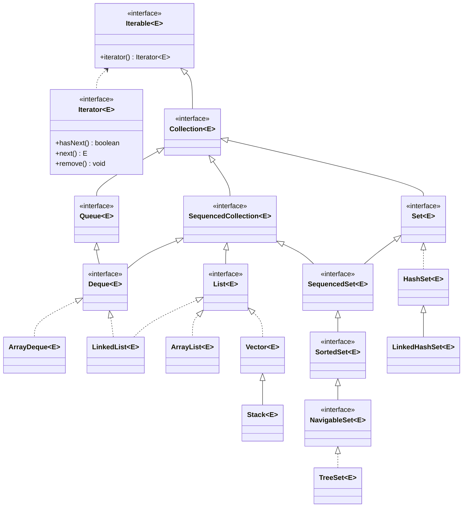
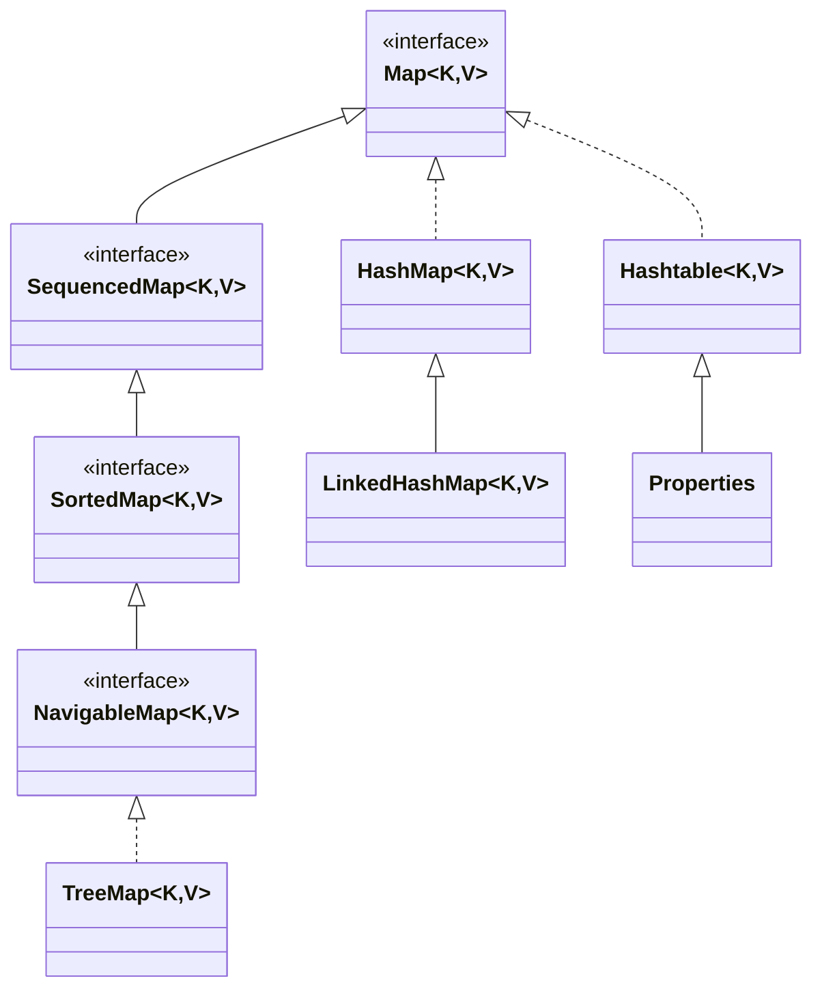
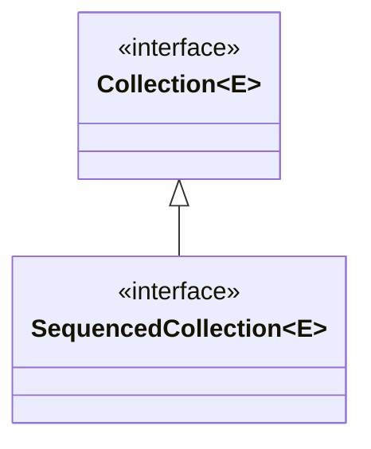

## 集合概述

集合（Collection）是 Java 中用于存储和管理对象的一组容器。数组也可以作为容器保存数据，但数组长度固定，插入、删除元素不够灵活；集合则提供了更加丰富的数据管理能力，可以根据不同需求选择不同的存储结构，例如按顺序存储、去重存储、键值对存储等。

集合框架（Java Collections Framework）主要分为两大体系：**Collection 体系** 和 **Map 体系**。`Collection` 用于存储一个一个的单独元素，`Map` 用于存储键值对。

> 结论：数组适合存储数量固定、结构简单的数据；集合适合存储数量不固定、需要动态管理的数据。

### 集合的基本特点

集合是 Java 提供的更灵活的对象容器。与数组相比，集合通常具有以下特点：

1. **长度可以动态变化**。例如 `ArrayList` 可以随着元素增加自动扩容，不需要在创建时准确指定最终容量。
2. **提供丰富的方法**。集合提供了添加、删除、查找、遍历、判断是否包含等常用操作。
3. **只能存储引用类型数据**。集合中不能直接存储基本数据类型。如果添加 `int`、`double` 等基本类型数据，会通过自动装箱转换成对应的包装类对象。

例如：

```java
import java.util.ArrayList;

public class CollectionDemo {
    public static void main(String[] args) {
        ArrayList<Integer> list = new ArrayList<>();

        list.add(111);
        list.add(222);
        list.add(333);

        for (int i = 0; i < list.size(); i++) {
            System.out.println(list.get(i));
        }
    }
}
```

这段代码中，`ArrayList<Integer>` 表示集合中保存的是 `Integer` 类型对象。`list.add(111)` 中的 `111` 是 `int` 类型，但会被自动装箱成 `Integer` 对象后存入集合。

> 易错点：集合只能存储引用类型，不能直接存储基本数据类型。`ArrayList<Integer>` 中保存的是 `Integer` 对象，不是 `int` 本身。

### Collection 与 Map 两大体系

Java 集合框架中常见容器大体可以分为两类：

| 体系         | 作用         | 典型结构                          |
| ------------ | ------------ | --------------------------------- |
| `Collection` | 存储单个元素 | `List`、`Set`、`Queue`            |
| `Map`        | 存储键值对   | `HashMap`、`TreeMap`、`Hashtable` |

`Collection` 和 `Map` 之间没有继承关系，它们是 Java 集合框架中的两套不同体系。

```java
Collection：一个元素一个元素地存储
Map：一个键值对一个键值对地存储
```

例如，`Collection` 适合保存学生对象列表：

```java
ArrayList<String> names = new ArrayList<>();

names.add("张三");
names.add("李四");
names.add("王五");
```

`Map` 适合保存“学号 -> 学生姓名”这样的映射关系：

```java
HashMap<Integer, String> students = new HashMap<>();

students.put(1001, "张三");
students.put(1002, "李四");
students.put(1003, "王五");
```

> 注意：`Collection` 和 `Map` 没有继承关系，但部分实现类之间可能存在使用关系。例如，某些 `Set` 的底层实现会借助 `Map` 的结构完成元素存储。

### Collection 体系继承结构

`Collection` 是单列集合的根接口，用于表示一组单独元素。它下面常见的子接口包括 `List`、`Set` 和 `Queue`。



#### Collection 体系中的主要接口

| 接口    | 特点                                 |
| ------- | ------------------------------------ |
| `List`  | 有序、可重复，元素有索引             |
| `Set`   | 通常无序、不可重复，主要用于去重     |
| `Queue` | 队列结构，通常用于按特定规则存取元素 |
| `Deque` | 双端队列，可以在两端插入和删除元素   |

其中，`ArrayList` 是 `List` 体系中最常用的实现类之一，适合保存有序、可重复、需要按索引访问的数据。

### Map 体系继承结构

`Map` 是双列集合的根接口，用于存储键值对。每个元素都由一个键和一个值组成，即 `key-value`。



#### Map 体系中的常见实现类

| 类              | 特点                                          |
| --------------- | --------------------------------------------- |
| `HashMap`       | 最常用的 `Map` 实现，按键存储值，查询效率较高 |
| `LinkedHashMap` | 在 `HashMap` 基础上维护元素顺序               |
| `TreeMap`       | 可以按照键的自然顺序或定制规则排序            |
| `Hashtable`     | 较早期的键值对集合类                          |
| `Properties`    | 常用于读取和保存配置文件信息                  |

### Collection 与 Map 的区别

`Collection` 和 `Map` 是集合框架中的两大核心体系，二者的存储结构不同。

| 对比项         | `Collection`           | `Map`                             |
| -------------- | ---------------------- | --------------------------------- |
| 存储内容       | 单个元素               | 键值对                            |
| 泛型形式       | `Collection<E>`        | `Map<K, V>`                       |
| 常见子体系     | `List`、`Set`、`Queue` | `HashMap`、`TreeMap`、`Hashtable` |
| 是否通过键查找 | 通常不是               | 是                                |
| 典型场景       | 保存一组对象           | 保存映射关系                      |

示例对比：

```java
ArrayList<String> names = new ArrayList<>();
names.add("张三");
names.add("李四");
```

`ArrayList` 只保存一个一个的姓名。

```java
HashMap<Integer, String> users = new HashMap<>();
users.put(1001, "张三");
users.put(1002, "李四");
```

`HashMap` 保存的是编号和姓名之间的对应关系。

本节内容整理自 `Collection` 公共方法、`contains()` / `remove()` 与 `equals()` 的关系，以及集合通用迭代方式相关示例。

## Collection 接口

`Collection` 是单列集合体系的顶层接口，表示一组单独存储的元素。`List`、`Set`、`Queue` 等接口都属于 `Collection` 体系，因此 `Collection` 中定义的通用方法，在这些子接口及其实现类中都可以使用。

`Collection` 只规定集合的通用操作能力，例如添加元素、删除元素、判断是否包含元素、获取元素个数、清空集合、转换数组、获取迭代器等。至于元素是否有序、是否允许重复、底层如何存储，则由具体实现类决定。

> 结论：`Collection` 定义的是单列集合的公共能力，不负责规定所有集合的具体存储结构。

### Collection 常用方法

`Collection<E>` 中的 `E` 表示集合中元素的类型。使用泛型后，集合只能保存指定类型的元素，取出元素时也不需要手动强制类型转换。

| 方法                                        | 说明                                     |
| ------------------------------------------- | ---------------------------------------- |
| `int size()`                                | 获取集合中元素的个数                     |
| `boolean isEmpty()`                         | 判断集合是否为空                         |
| `boolean add(E e)`                          | 向集合中添加元素                         |
| `boolean addAll(Collection<? extends E> c)` | 将另一个集合中的所有元素添加到当前集合   |
| `boolean remove(Object o)`                  | 删除集合中指定元素                       |
| `boolean removeAll(Collection<?> c)`        | 删除当前集合中与指定集合共有的元素       |
| `boolean retainAll(Collection<?> c)`        | 只保留当前集合中与指定集合共有的元素     |
| `boolean contains(Object o)`                | 判断集合中是否包含指定元素               |
| `boolean containsAll(Collection<?> c)`      | 判断当前集合是否包含指定集合中的所有元素 |
| `Object[] toArray()`                        | 将集合转换成 `Object` 数组               |
| `void clear()`                              | 清空集合中的所有元素                     |
| `Iterator<E> iterator()`                    | 获取集合的迭代器，用于遍历集合           |

需要注意，`Collection` 是顶层接口，`add(E e)` 的含义是“向集合添加元素”，而不一定是“添加到末尾”。对于 `List` 来说，元素通常有明确的添加顺序；对于某些 `Set` 实现类来说，元素没有下标，存储顺序也不一定等于添加顺序。

### Collection 方法的基本使用

```java
import java.util.ArrayList;
import java.util.Collection;

public class CollectionMethodDemo {
    public static void main(String[] args) {
        Collection<String> names = new ArrayList<>();

        names.add("jack");
        names.add("lucy");
        names.add("tom");
        names.add("jetty");

        System.out.println(names.contains("tom"));
        System.out.println(names.size());

        names.remove("tom");
        System.out.println(names);

        Object[] array = names.toArray();
        for (Object obj : array) {
            System.out.println(obj);
        }

        names.clear();
        System.out.println(names.isEmpty());
    }
}
```

运行结果示例：

```text
true
4
[jack, lucy, jetty]
jack
lucy
jetty
true
```

这段代码体现了 `Collection` 的几个基本动作：

1. 使用 `add()` 添加元素；
2. 使用 `contains()` 判断是否包含某个元素；
3. 使用 `size()` 获取集合元素个数；
4. 使用 `remove()` 删除指定元素；
5. 使用 `toArray()` 将集合转换为数组；
6. 使用 `clear()` 清空集合；
7. 使用 `isEmpty()` 判断集合是否为空。

### retainAll 与 removeAll

`retainAll()` 和 `removeAll()` 都涉及两个集合之间的关系，但作用相反。

| 方法                         | 含义     | 结果                               |
| ---------------------------- | -------- | ---------------------------------- |
| `retainAll(Collection<?> c)` | 保留交集 | 当前集合只留下两个集合都包含的元素 |
| `removeAll(Collection<?> c)` | 删除交集 | 当前集合删除两个集合都包含的元素   |

例如：

```java
import java.util.ArrayList;
import java.util.Collection;

public class CollectionRetainDemo {
    public static void main(String[] args) {
        Collection<String> names1 = new ArrayList<>();
        names1.add("jack");
        names1.add("lucy");
        names1.add("tom");
        names1.add("jetty");

        Collection<String> names2 = new ArrayList<>();
        names2.add("jack");
        names2.add("jetty");
        names2.add("rose");

        names1.retainAll(names2);

        System.out.println(names1);
    }
}
```

运行结果：

```text
[jack, jetty]
```

`retainAll()` 会修改当前集合，使当前集合只保留两个集合共有的元素。

> 注意：`retainAll()` 和 `removeAll()` 操作的是当前集合。调用后，当前集合中的元素可能发生变化。

### contains 方法与 equals 方法

`contains(Object o)` 用于判断集合中是否包含某个元素。对于引用类型对象来说，判断“是否包含”并不是简单比较地址，而是依赖对象的 `equals()` 方法。

例如：

```java
Collection<String> names = new ArrayList<>();

names.add("jack");
names.add("lucy");

System.out.println(names.contains("jack"));
```

因为 `String` 已经重写了 `equals()` 方法，所以只要字符串内容相同，就可以判断为包含。

对于自定义类，如果没有重写 `equals()`，默认会使用 `Object` 中的 `equals()`，本质上仍然是比较对象地址。这样即使两个对象的属性值完全相同，也可能被认为不是同一个元素。

```java
class MyDate {
    private int year;
    private int month;
    private int day;

    public MyDate(int year, int month, int day) {
        this.year = year;
        this.month = month;
        this.day = day;
    }
}
```

如果集合中存入一个 `MyDate` 对象，再使用另一个属性完全相同的 `MyDate` 对象调用 `contains()`，在没有重写 `equals()` 的情况下，结果通常是 `false`。

因此，自定义类作为集合元素时，应根据业务含义重写 `equals()` 方法。

> 结论：`contains()` 判断集合中是否包含某个元素，底层依赖 `equals()`。如果自定义对象需要按属性内容判断相等，就必须重写 `equals()`。

### remove 方法与 equals 方法

`remove(Object o)` 用于删除集合中的指定元素。它和 `contains()` 一样，也依赖 `equals()` 判断集合中的哪个元素与参数对象相等。

```java
import java.util.ArrayList;
import java.util.Collection;

public class CollectionRemoveDemo {
    public static void main(String[] args) {
        Collection<String> names = new ArrayList<>();

        names.add("zhangsan");
        names.add("lisi");
        names.add("wangwu");

        names.remove("lisi");

        System.out.println(names);
    }
}
```

运行结果：

```text
[zhangsan, wangwu]
```

对于 `String` 这类已经重写 `equals()` 的类，删除操作符合内容比较的预期。对于自定义类，如果希望根据属性内容删除元素，同样需要重写 `equals()`。

> 易错点：`remove()` 删除元素时，不是只看两个引用是否指向同一个对象，而是通过 `equals()` 判断是否相等。自定义类不重写 `equals()`，集合中的查找和删除行为往往不符合业务预期。

### 集合的通用迭代

`Collection` 继承自 `Iterable`，因此所有 `Collection` 体系下的集合都支持迭代遍历。所谓迭代，就是通过统一的方式依次取出集合中的元素，而不关心集合底层是数组、链表、哈希表还是树。

集合通过 `iterator()` 方法获取迭代器对象：

```java
Iterator<String> it = names.iterator();
```

迭代器常用两个方法：

| 方法                | 说明                   |
| ------------------- | ---------------------- |
| `boolean hasNext()` | 判断是否还有下一个元素 |
| `E next()`          | 取出下一个元素         |

基本遍历格式如下：

```java
Iterator<String> it = names.iterator();

while (it.hasNext()) {
    String name = it.next();
    System.out.println(name);
}
```

其中，`hasNext()` 只负责判断是否还有元素，`next()` 才会真正取出元素。

> 注意：迭代器内部维护一个游标，初始状态位于第一个元素之前；每调用一次 `next()`，游标向后移动，并返回经过的那个元素。

#### 使用 Iterator 遍历集合

```java
import java.util.ArrayList;
import java.util.Collection;
import java.util.Iterator;

public class IteratorDemo {
    public static void main(String[] args) {
        Collection<String> names = new ArrayList<>();

        names.add("zhangsan");
        names.add("lisi");
        names.add("wangwu");
        names.add("zhaoliu");

        Iterator<String> it = names.iterator();

        while (it.hasNext()) {
            String name = it.next();
            System.out.println(name);
        }
    }
}
```

运行结果：

```text
zhangsan
lisi
wangwu
zhaoliu
```

这是一种所有 `Collection` 集合都可以使用的通用遍历方式。由于集合声明为 `Collection<String>`，所以迭代器也可以声明为 `Iterator<String>`，每次取出的元素直接就是 `String` 类型。

#### 使用 for 循环遍历集合

迭代器也可以写成 `for` 循环形式：

```java
import java.util.ArrayList;
import java.util.Collection;
import java.util.Iterator;

public class IteratorForDemo {
    public static void main(String[] args) {
        Collection<String> names = new ArrayList<>();

        names.add("zhangsan");
        names.add("lisi");
        names.add("wangwu");
        names.add("zhaoliu");

        for (Iterator<String> it = names.iterator(); it.hasNext(); ) {
            String name = it.next();
            System.out.println(name);
        }
    }
}
```

这种写法把迭代器变量放在 `for` 循环内部，作用域更小。循环结束后，外部不能继续使用该迭代器变量。

#### 使用增强 for 遍历集合

集合也支持增强 `for` 循环，也称为 `foreach`。

```java
import java.util.ArrayList;
import java.util.Collection;

public class ForeachDemo {
    public static void main(String[] args) {
        Collection<String> names = new ArrayList<>();

        names.add("zhangsan");
        names.add("lisi");
        names.add("wangwu");
        names.add("zhaoliu");

        for (String name : names) {
            System.out.println(name);
        }
    }
}
```

增强 `for` 的写法更加简洁，适合只需要依次读取元素的场景。

> 补充：增强 `for` 能遍历集合，是因为集合实现了 `Iterable`。从原理上看，增强 `for` 遍历集合时，底层仍然依赖迭代器。

以下内容已结合 `SequencedCollectionTest01.java` 中使用 `ArrayList` 作为 `SequencedCollection`、调用 `reversed()`、`addFirst()`、`addLast()`、`removeFirst()`、`removeLast()` 的示例整理。

## SequencedCollection 接口

`SequencedCollection` 是 JDK 21 新增的接口，位于 `java.util` 包下。它是 `Collection` 的子接口，用于统一表示**具有确定访问顺序**的集合。

所谓“有序”，在集合体系中主要包括两类情况：

1. **元素按照插入顺序或位置顺序保存**，例如 `ArrayList`、`LinkedList`。
2. **元素按照大小规则自动排序**，例如 `TreeSet`。

`SequencedCollection` 的出现，使这类有序集合可以用统一的方法操作首元素、尾元素，并可以获得反向视图。

> 结论：`SequencedCollection` 解决的是“有序集合首尾操作不统一”的问题。它在 `Collection` 的基础上补充了访问头部、尾部和反向遍历的能力。

### SequencedCollection 的继承位置

`SequencedCollection` 继承自 `Collection`，因此它拥有 `Collection` 中的通用方法，例如 `add()`、`remove()`、`contains()`、`size()`、`iterator()` 等。

```java
public interface SequencedCollection<E> extends Collection<E> {
}
```

从继承关系上可以理解为：



`SequencedCollection` 不是用来替代 `Collection` 的，而是在 `Collection` 的基础上进一步强调“集合元素具有确定顺序”。

### SequencedCollection 的常用方法

`SequencedCollection` 主要新增了一组与**首尾元素**和**反向顺序**有关的方法。

| 方法                                | 说明                           |
| ----------------------------------- | ------------------------------ |
| `void addFirst(E e)`                | 向集合头部添加元素             |
| `void addLast(E e)`                 | 向集合尾部添加元素             |
| `E getFirst()`                      | 获取集合中的第一个元素         |
| `E getLast()`                       | 获取集合中的最后一个元素       |
| `E removeFirst()`                   | 删除并返回集合中的第一个元素   |
| `E removeLast()`                    | 删除并返回集合中的最后一个元素 |
| `SequencedCollection<E> reversed()` | 返回当前集合的反向顺序视图     |

需要注意，方法中的 `E` 表示集合元素的类型。例如，`SequencedCollection<Integer>` 中的 `addFirst(E e)` 实际接收的是 `Integer` 类型元素。

> 易错点：这些方法不再使用 `Object` 作为参数和返回值，而是使用泛型 `E`。这样可以保证集合元素类型一致，避免不必要的强制类型转换。

### 基本使用示例

`ArrayList` 在 JDK 21 中具备 `SequencedCollection` 的相关能力，因此可以使用 `SequencedCollection` 接口接收 `ArrayList` 对象。

```java
import java.util.ArrayList;
import java.util.SequencedCollection;

public class SequencedCollectionDemo {
    public static void main(String[] args) {
        SequencedCollection<Integer> nums = new ArrayList<>();

        nums.add(1);
        nums.add(2);
        nums.add(3);
        nums.add(4);

        System.out.println(nums);

        nums.addFirst(0);
        nums.addLast(5);

        System.out.println(nums);

        nums.removeFirst();
        nums.removeLast();

        System.out.println(nums);
    }
}
```

运行结果示例：

```text
[1, 2, 3, 4]
[0, 1, 2, 3, 4, 5]
[1, 2, 3, 4]
```

这段代码体现了 `SequencedCollection` 对有序集合首尾位置的统一操作：

1. `addFirst(0)` 将元素添加到头部；
2. `addLast(5)` 将元素添加到尾部；
3. `removeFirst()` 删除头部元素；
4. `removeLast()` 删除尾部元素。

#### 获取首元素和尾元素

`getFirst()` 和 `getLast()` 用于访问有序集合的首尾元素。

```java
import java.util.ArrayList;
import java.util.SequencedCollection;

public class SequencedGetDemo {
    public static void main(String[] args) {
        SequencedCollection<String> names = new ArrayList<>();

        names.add("jack");
        names.add("lucy");
        names.add("tom");

        System.out.println(names.getFirst());
        System.out.println(names.getLast());
    }
}
```

运行结果：

```text
jack
tom
```

对于有序集合来说，`getFirst()` 获取的是当前顺序下的第一个元素，`getLast()` 获取的是当前顺序下的最后一个元素。

> 注意：如果集合为空，调用 `getFirst()`、`getLast()`、`removeFirst()`、`removeLast()` 会导致异常。因此，实际使用前可以先通过 `isEmpty()` 判断集合是否为空。

#### reversed 方法

`reversed()` 用于获得当前集合的反向顺序视图。

```java
import java.util.ArrayList;
import java.util.SequencedCollection;

public class SequencedReversedDemo {
    public static void main(String[] args) {
        SequencedCollection<Integer> nums = new ArrayList<>();

        nums.add(1);
        nums.add(2);
        nums.add(3);
        nums.add(4);

        SequencedCollection<Integer> reversed = nums.reversed();

        System.out.println(nums);
        System.out.println(reversed);
    }
}
```

运行结果：

```text
[1, 2, 3, 4]
[4, 3, 2, 1]
```

`reversed()` 的重点不是简单“复制一个新集合”，而是提供一个**反向视图**。从这个视图中观察集合时，元素顺序与原集合相反。

> 结论：`reversed()` 适合在不手动倒序遍历的情况下，以相反顺序查看或操作有序集合。

### SequencedCollection 与 Collection 的区别

`Collection` 表示单列集合的通用能力，而 `SequencedCollection` 在此基础上强调元素顺序，并补充了首尾操作。

| 对比项       | `Collection`                                    | `SequencedCollection`                                        |
| ------------ | ----------------------------------------------- | ------------------------------------------------------------ |
| 关注点       | 单列集合的通用操作                              | 有序集合的首尾和反向操作                                     |
| 是否强调顺序 | 不一定                                          | 强调确定顺序                                                 |
| 典型方法     | `add()`、`remove()`、`contains()`、`iterator()` | `addFirst()`、`addLast()`、`getFirst()`、`getLast()`、`reversed()` |
| 适用对象     | 所有单列集合                                    | 具有确定顺序的单列集合                                       |

例如，`Collection` 只要求集合能添加、删除、遍历元素；而 `SequencedCollection` 进一步要求集合能够明确什么是“第一个元素”和“最后一个元素”。

以下内容已结合 `ListTest01.java`、`ListTest02.java`、`ListTest03.java` 中关于 `List` 特点、索引相关方法、三种遍历方式以及 `ListIterator` 双向迭代的示例整理。

## List 接口

`List` 是 `Collection` 的子接口，用于表示一种**有序、可重复、可通过索引访问**的单列集合。`List` 继承了 `Collection` 的通用方法，同时新增了一组与**下标索引**有关的方法，因此它比普通 `Collection` 更适合处理需要按位置访问、插入、修改和删除的数据。

`List` 的常见实现类包括 `ArrayList`、`LinkedList` 和 `Vector`。其中，`ArrayList` 是最常用的实现类之一。

### List 集合的核心特点

`List` 集合主要有三个特点：**有序、可重复、可通过索引访问**。

#### 有序

`List` 中的“有序”通常指元素有明确的存储顺序，并且每个元素都有对应的下标。元素按照添加顺序保存，可以通过索引访问。

```java
List<String> list = new ArrayList<>();

list.add("abc");
list.add("def");
list.add("xyz");

System.out.println(list.get(0)); // abc
System.out.println(list.get(1)); // def
System.out.println(list.get(2)); // xyz
```

#### 可重复

`List` 允许存储重复元素。

```java
List<String> list = new ArrayList<>();

list.add("java");
list.add("java");
list.add("mysql");

System.out.println(list);
```

运行结果：

```text
[java, java, mysql]
```

#### 可以存储 null

常见的 `List` 实现类，例如 `ArrayList`、`LinkedList`，允许存储 `null`。

```java
List<String> list = new ArrayList<>();

list.add("jack");
list.add(null);
list.add(null);

System.out.println(list);
```

运行结果示例：

```text
[jack, null, null]
```

> 注意：`List` 接口本身表示一种有序可重复的集合结构，但不同实现类在是否允许 `null`、是否线程安全、底层结构等方面可能不同。`ArrayList` 和 `LinkedList` 都允许存储 `null`。

### List 接口的常用方法

`List` 继承了 `Collection` 中的通用方法，同时新增了与索引有关的方法。

| 方法                                                   | 说明                                                    |
| ------------------------------------------------------ | ------------------------------------------------------- |
| `void add(int index, E element)`                       | 在指定索引位置插入元素                                  |
| `boolean addAll(int index, Collection<? extends E> c)` | 从指定索引位置开始插入另一个集合中的所有元素            |
| `E set(int index, E element)`                          | 修改指定索引位置的元素，返回被替换的旧元素              |
| `E get(int index)`                                     | 获取指定索引位置的元素                                  |
| `E remove(int index)`                                  | 删除指定索引位置的元素，返回被删除的元素                |
| `int indexOf(Object o)`                                | 从前往后查找指定元素第一次出现的索引，不存在返回 `-1`   |
| `int lastIndexOf(Object o)`                            | 从后往前查找指定元素最后一次出现的索引，不存在返回 `-1` |
| `List<E> subList(int fromIndex, int toIndex)`          | 获取指定范围内的子集合                                  |
| `ListIterator<E> listIterator()`                       | 获取 `List` 专属的列表迭代器                            |

这些方法的共同特点是围绕**索引**展开，因此它们属于 `List` 相比普通 `Collection` 更强的能力。

### List 索引方法的基本使用

```java
import java.util.ArrayList;
import java.util.List;

public class ListMethodDemo {
    public static void main(String[] args) {
        List<Integer> numbers = new ArrayList<>();

        numbers.add(1);
        numbers.add(2);
        numbers.add(3);
        numbers.add(4);
        numbers.add(5);

        System.out.println(numbers);

        numbers.add(2, 22);
        System.out.println(numbers);

        List<Integer> extra = new ArrayList<>();
        extra.add(100);
        extra.add(200);

        numbers.addAll(4, extra);
        System.out.println(numbers);

        numbers.set(4, 1000);
        System.out.println(numbers);

        numbers.remove(4);
        System.out.println(numbers);

        System.out.println(numbers.indexOf(1));
        System.out.println(numbers.lastIndexOf(200));

        List<Integer> sub = numbers.subList(1, 3);
        System.out.println(sub);
    }
}
```

运行结果示例：

```text
[1, 2, 3, 4, 5]
[1, 2, 22, 3, 4, 5]
[1, 2, 22, 3, 100, 200, 4, 5]
[1, 2, 22, 3, 1000, 200, 4, 5]
[1, 2, 22, 3, 200, 4, 5]
0
4
[2, 22]
```

这段代码中：

1. `add(2, 22)` 表示在索引 `2` 的位置插入 `22`；
2. `addAll(4, extra)` 表示从索引 `4` 的位置开始插入 `extra` 集合中的所有元素；
3. `set(4, 1000)` 表示修改索引 `4` 位置的元素；
4. `remove(4)` 表示删除索引 `4` 位置的元素；
5. `subList(1, 3)` 表示获取索引范围 `[1, 3)` 内的元素。

> 易错点：`subList(fromIndex, toIndex)` 的范围是左闭右开，即包含 `fromIndex`，不包含 `toIndex`。

### List 的三种遍历方式

由于 `List` 属于 `Collection` 体系，所以它可以使用集合通用遍历方式；同时，由于 `List` 有索引，它还可以使用索引进行遍历。

#### 方式一：根据索引遍历

索引遍历是 `List` 特有的常见遍历方式。

```java
import java.util.ArrayList;
import java.util.List;

public class ListForIndexDemo {
    public static void main(String[] args) {
        List<String> list = new ArrayList<>();

        list.add("abc");
        list.add("def");
        list.add("xyz");

        for (int i = 0; i < list.size(); i++) {
            String value = list.get(i);
            System.out.println(value);
        }
    }
}
```

这种方式适合需要使用索引位置的场景。

#### 方式二：使用增强 for 遍历

```java
for (String value : list) {
    System.out.println(value);
}
```

增强 `for` 写法简洁，适合只需要依次读取元素、不关心索引的场景。

#### 方式三：使用 Iterator 遍历

```java
import java.util.Iterator;

Iterator<String> it = list.iterator();

while (it.hasNext()) {
    String value = it.next();
    System.out.println(value);
}
```

这是 `Collection` 体系的通用遍历方式。只要是 `Collection` 的实现类，都可以通过 `iterator()` 获取迭代器进行遍历。

> 结论：`List` 可以使用索引遍历、增强 `for` 遍历和迭代器遍历。其中，索引遍历是 `List` 由于拥有下标而具备的特有遍历方式。

### ListIterator 列表迭代器

`ListIterator` 是 `List` 专属的迭代器，只能用于 `List` 集合。与普通 `Iterator` 相比，`ListIterator` 支持**双向迭代**，既可以从前往后遍历，也可以从后往前遍历。

#### 从前往后遍历

```java
import java.util.ArrayList;
import java.util.List;
import java.util.ListIterator;

public class ListIteratorDemo {
    public static void main(String[] args) {
        List<Integer> numbers = new ArrayList<>();

        numbers.add(1);
        numbers.add(2);
        numbers.add(3);
        numbers.add(4);
        numbers.add(5);

        ListIterator<Integer> it = numbers.listIterator();

        while (it.hasNext()) {
            Integer number = it.next();
            System.out.println(number);
        }
    }
}
```

运行结果：

```text
1
2
3
4
5
```

#### 从后往前遍历

如果要从后往前遍历，需要让迭代器初始游标位于集合末尾。

```java
ListIterator<Integer> it = numbers.listIterator(numbers.size());

while (it.hasPrevious()) {
    Integer number = it.previous();
    System.out.println(number);
}
```

运行结果：

```text
5
4
3
2
1
```

> 易错点：从后往前完整遍历时，应使用 `listIterator(list.size())`，而不是 `listIterator(list.size() - 1)`。
> `listIterator(index)` 表示迭代器游标位于指定索引元素之前。如果传入 `size() - 1`，第一次调用 `previous()` 时会跳过最后一个元素。

### Arrays.asList() 将数组转换为 List

`Arrays.asList()` 可以把数组转换为 `List` 集合。

```java
import java.util.Arrays;
import java.util.List;

public class ArraysAsListDemo {
    public static void main(String[] args) {
        List<Integer> list = Arrays.asList(11, 22, 33);

        list.set(1, 222);

        System.out.println(list);
    }
}
```

运行结果：

```text
[11, 222, 33]
```

需要注意，`Arrays.asList()` 返回的是一个**固定长度的 List**。它可以修改已有位置上的元素，但不能增加或删除元素。

```java
List<Integer> list = Arrays.asList(11, 22, 33);

list.set(1, 222);  // 可以修改

// list.add(44);   // 运行时抛出 UnsupportedOperationException
// list.remove(1); // 运行时抛出 UnsupportedOperationException
```

> 注意：`Arrays.asList()` 返回的集合长度固定，并不等同于普通 `ArrayList`。如果需要继续添加或删除元素，可以再创建一个新的 `ArrayList`。

```java
List<Integer> list = new ArrayList<>(Arrays.asList(11, 22, 33));

list.add(44);
list.remove(0);

System.out.println(list);
```

### List 常见实现类

`List` 的常见实现类主要有三个：`ArrayList`、`LinkedList` 和 `Vector`。

| 实现类       | 底层结构 | 特点                                         |
| ------------ | -------- | -------------------------------------------- |
| `ArrayList`  | 数组     | 查询快，尾部增删较方便，最常用               |
| `LinkedList` | 双向链表 | 头尾增删较方便，也可以作为队列、双端队列使用 |
| `Vector`     | 数组     | 线程安全，但效率较低，较少使用               |

实际开发中，如果没有特殊要求，通常优先使用 `ArrayList`。

以下内容已结合 `ArrayListTest01.java` 中关于无参构造、首次扩容、1.5 倍扩容策略以及插入、删除时数组拷贝的源码分析结果整理。

## ArrayList 类

`ArrayList` 是 `List` 接口最常用的实现类之一，底层基于**数组**存储元素。它既保留了数组按下标访问元素的优势，又在数组容量不足时提供自动扩容机制，因此比普通数组更灵活。

`ArrayList` 的核心特点如下：

| 特点                   | 说明                                          |
| ---------------------- | --------------------------------------------- |
| 查询效率高             | 底层是数组，可以通过下标快速定位元素          |
| 修改效率高             | 根据下标定位后，直接覆盖数组对应位置          |
| 尾部增删效率较高       | 在容量足够时，尾部添加只需要赋值并修改 `size` |
| 随机插入、删除效率较低 | 中间位置插入或删除需要移动后续元素            |
| 线程不安全             | 多线程同时操作时可能出现数据安全问题          |

> 结论：`ArrayList` 适合查询多、修改多、尾部添加多的场景；如果频繁在中间位置插入或删除元素，效率会受到数组移动的影响。

### ArrayList 的核心属性

`ArrayList` 底层最重要的两个属性是 `elementData` 和 `size`。

```java
public class ArrayList<E> extends AbstractList<E>
        implements List<E>, RandomAccess, Cloneable, java.io.Serializable {

    transient Object[] elementData;

    private int size;
}
```

#### elementData

`elementData` 是 `ArrayList` 底层真正存储元素的数组。

```java
transient Object[] elementData;
```

虽然 `ArrayList<E>` 使用了泛型，但底层数组仍然是 `Object[]`。这是因为 Java 泛型主要在编译阶段发挥作用，运行时会发生泛型擦除，因此底层使用 `Object[]` 保存元素。

#### size

`size` 表示当前集合中已经存储的元素个数。

```java
private int size;
```

需要注意，`size` 表示的是**元素个数**，不是底层数组容量。

例如，一个 `ArrayList` 底层数组长度可能是 `10`，但当前只添加了 `3` 个元素，此时：

```text
elementData.length == 10
size == 3
```

> 易错点：`size` 不是容量。`size()` 方法返回的是集合中实际元素个数，而不是底层数组长度。

### ArrayList 的构造方法

`ArrayList` 常见构造方法有三个：无参构造、指定初始容量构造、根据已有集合构造。

#### 无参构造方法

```java
public ArrayList() {
    this.elementData = DEFAULTCAPACITY_EMPTY_ELEMENTDATA;
}
```

JDK 8 之后，`ArrayList` 使用无参构造方法创建对象时，底层数组初始长度为 `0`。此时还没有真正分配默认容量为 `10` 的数组。

```java
List<String> list = new ArrayList<>();
```

这行代码执行后，`ArrayList` 底层是一个空数组。只有在第一次添加元素时，才会真正扩容为默认容量 `10`。

> 结论：无参构造创建的 `ArrayList` 初始容量是 `0`，第一次添加元素时才扩容到 `10`。

#### 指定初始容量的构造方法

```java
public ArrayList(int initialCapacity) {
    if (initialCapacity > 0) {
        this.elementData = new Object[initialCapacity];
    } else if (initialCapacity == 0) {
        this.elementData = EMPTY_ELEMENTDATA;
    } else {
        throw new IllegalArgumentException("Illegal Capacity: " + initialCapacity);
    }
}
```

该构造方法允许在创建集合时指定底层数组初始容量。

```java
List<String> list = new ArrayList<>(20);
```

这表示底层数组初始长度为 `20`。如果可以大致预估元素数量，提前指定合适容量可以减少扩容次数，提高添加元素时的效率。

如果传入 `0`，底层使用空数组；如果传入负数，会抛出 `IllegalArgumentException`。

#### 根据已有集合创建 ArrayList

```java
public ArrayList(Collection<? extends E> c) {
    Object[] a = c.toArray();

    if ((size = a.length) != 0) {
        if (c.getClass() == ArrayList.class) {
            elementData = a;
        } else {
            elementData = Arrays.copyOf(a, size, Object[].class);
        }
    } else {
        elementData = EMPTY_ELEMENTDATA;
    }
}
```

该构造方法用于根据已有集合创建一个新的 `ArrayList`。

```java
Collection<String> names = new HashSet<>();
names.add("jack");
names.add("lucy");

List<String> list = new ArrayList<>(names);
```

执行过程可以概括为：

1. 先调用 `c.toArray()`，把参数集合转换成数组；
2. 将数组长度赋值给 `size`；
3. 如果参数集合有元素，则根据情况设置 `elementData`；
4. 如果参数集合为空，则使用空数组。

其中：

```java
if (c.getClass() == ArrayList.class) {
    elementData = a;
} else {
    elementData = Arrays.copyOf(a, size, Object[].class);
}
```

这段判断的核心目的，是保证 `ArrayList` 内部最终使用的是合适的 `Object[]` 数组。若参数集合本身就是标准 `ArrayList`，可以直接使用 `toArray()` 返回的数组；若参数集合不是 `ArrayList`，则通过 `Arrays.copyOf()` 再复制成明确的 `Object[]`。

> 注意：根据已有集合创建 `ArrayList` 时，新集合的 `size` 等于参数集合中的元素个数，底层数组内容来自参数集合转换后的数组。

### add(E e) 添加元素

`add(E e)` 用于向 `ArrayList` 尾部添加元素。

```java
public boolean add(E e) {
    modCount++;
    add(e, elementData, size);
    return true;
}
```

真正添加元素的是内部重载方法：

```java
private void add(E e, Object[] elementData, int s) {
    if (s == elementData.length) {
        elementData = grow();
    }

    elementData[s] = e;
    size = s + 1;
}
```

执行过程如下：

1. 判断当前元素个数 `size` 是否等于数组长度；
2. 如果相等，说明数组已满，需要扩容；
3. 如果容量足够，直接把元素放到 `elementData[size]` 位置；
4. 添加完成后，`size` 加 `1`。

例如：

```java
List<String> list = new ArrayList<>();

list.add("A");
list.add("B");
list.add("C");
```

元素会依次存入底层数组的 `0`、`1`、`2` 位置。

> 结论：`ArrayList` 尾部添加元素的本质，是把元素存入底层数组的 `size` 位置，然后让 `size` 加 `1`。

### ArrayList 的扩容机制

`ArrayList` 底层数组容量不足时，会调用 `grow()` 方法扩容。

```java
private Object[] grow() {
    return grow(size + 1);
}
```

其中，`size + 1` 表示本次添加元素后至少需要的最小容量。

核心扩容逻辑如下：

```java
private Object[] grow(int minCapacity) {
    int oldCapacity = elementData.length;

    if (oldCapacity > 0 || elementData != DEFAULTCAPACITY_EMPTY_ELEMENTDATA) {
        int newCapacity = ArraysSupport.newLength(
                oldCapacity,
                minCapacity - oldCapacity,
                oldCapacity >> 1
        );

        return elementData = Arrays.copyOf(elementData, newCapacity);
    } else {
        return elementData = new Object[Math.max(DEFAULT_CAPACITY, minCapacity)];
    }
}
```

#### 第一次添加元素

如果使用无参构造创建 `ArrayList`，底层初始数组长度为 `0`。第一次添加元素时，会执行：

```java
new Object[Math.max(DEFAULT_CAPACITY, minCapacity)]
```

其中 `DEFAULT_CAPACITY` 的值是 `10`。因此第一次添加元素后，底层数组容量会变成 `10`。

```java
List<String> list = new ArrayList<>();

list.add("A"); // 第一次添加元素时，容量扩为 10
```

#### 一般扩容规则

当底层数组已经有容量，并且容量不足时，会计算新容量：

```java
int newCapacity = ArraysSupport.newLength(
        oldCapacity,
        minCapacity - oldCapacity,
        oldCapacity >> 1
);
```

其中：

| 参数                        | 含义                       |
| --------------------------- | -------------------------- |
| `oldCapacity`               | 原数组容量                 |
| `minCapacity - oldCapacity` | 最小增长量                 |
| `oldCapacity >> 1`          | 首选增长量，即原容量的一半 |

`ArraysSupport.newLength()` 的核心计算逻辑可以理解为：

```java
新容量 = 原容量 + Math.max(最小增长量, 原容量的一半)
```

例如，原容量是 `10`，继续添加第 `11` 个元素时：

```text
oldCapacity = 10
minCapacity = 11
minGrowth = 1
prefGrowth = 10 >> 1 = 5
newCapacity = 10 + Math.max(1, 5) = 15
```

因此，容量会从 `10` 扩容到 `15`。

> 结论：正常情况下，`ArrayList` 扩容后的新容量约为原容量的 `1.5` 倍；如果最小增长量超过原容量的一半，则会优先满足最小所需容量。

### get(int index) 获取元素

`get(int index)` 用于获取指定索引位置的元素。

```java
public E get(int index) {
    Objects.checkIndex(index, size);
    return elementData(index);
}
```

执行过程如下：

1. 使用 `Objects.checkIndex(index, size)` 检查索引是否合法；
2. 如果索引合法，直接返回底层数组对应位置的元素；
3. 如果索引不合法，抛出索引越界异常。

合法索引范围是：

```text
0 <= index < size
```

例如：

```java
List<String> list = new ArrayList<>();

list.add("jack");
list.add("lucy");

System.out.println(list.get(0)); // jack
System.out.println(list.get(1)); // lucy
```

> 结论：`ArrayList` 查询效率高，是因为 `get(index)` 可以直接通过数组下标定位元素。

### set(int index, E element) 修改元素

`set(int index, E element)` 用于修改指定索引位置的元素，并返回被替换的旧元素。

```java
public E set(int index, E element) {
    Objects.checkIndex(index, size);

    E oldValue = elementData(index);
    elementData[index] = element;

    return oldValue;
}
```

执行过程如下：

1. 检查索引是否合法；
2. 保存原位置上的旧元素；
3. 将新元素赋值到指定索引位置；
4. 返回旧元素。

例如：

```java
List<String> list = new ArrayList<>();

list.add("jack");
list.add("lucy");

String oldValue = list.set(1, "tom");

System.out.println(oldValue);
System.out.println(list);
```

运行结果：

```text
lucy
[jack, tom]
```

> 结论：`set()` 的本质是数组指定位置赋值，因此修改效率较高。

### add(int index, E element) 插入元素

`add(int index, E element)` 用于在指定索引位置插入元素。

```java
public void add(int index, E element) {
    rangeCheckForAdd(index);
    modCount++;

    final int s;
    Object[] elementData;

    if ((s = size) == (elementData = this.elementData).length) {
        elementData = grow();
    }

    System.arraycopy(elementData, index, elementData, index + 1, s - index);
    elementData[index] = element;
    size = s + 1;
}
```

执行过程如下：

1. 检查插入索引是否合法；
2. 如果数组已满，先扩容；
3. 使用 `System.arraycopy()` 将从 `index` 开始的元素整体向后移动一位；
4. 将新元素放入 `index` 位置；
5. `size` 加 `1`。

插入时的合法索引范围是：

```text
0 <= index <= size
```

与 `get()` 不同，插入允许 `index == size`，这表示在集合末尾追加元素。

例如：

```java
List<String> list = new ArrayList<>();

list.add("A");
list.add("B");
list.add("C");

list.add(1, "X");

System.out.println(list);
```

运行结果：

```text
[A, X, B, C]
```

插入前：

```text
[A, B, C]
```

插入索引 `1` 后，`B` 和 `C` 都需要向后移动一位：

```text
[A, X, B, C]
```

> 易错点：`ArrayList` 在中间位置插入元素效率较低，原因不是插入赋值本身慢，而是需要移动插入位置之后的元素。

### remove(int index) 删除元素

`remove(int index)` 用于删除指定索引位置的元素，并返回被删除的旧元素。

```java
public E remove(int index) {
    Objects.checkIndex(index, size);

    final Object[] es = elementData;
    E oldValue = (E) es[index];

    fastRemove(es, index);

    return oldValue;
}
```

核心删除逻辑在 `fastRemove()` 中：

```java
private void fastRemove(Object[] es, int i) {
    modCount++;

    final int newSize;
    if ((newSize = size - 1) > i) {
        System.arraycopy(es, i + 1, es, i, newSize - i);
    }

    es[size = newSize] = null;
}
```

执行过程如下：

1. 检查索引是否合法；
2. 保存即将被删除的元素；
3. 如果删除的不是最后一个元素，则将后续元素整体向前移动一位；
4. 将原最后一个有效元素位置设置为 `null`；
5. `size` 减 `1`；
6. 返回被删除的元素。

例如：

```java
List<String> list = new ArrayList<>();

list.add("A");
list.add("B");
list.add("C");
list.add("D");

String oldValue = list.remove(1);

System.out.println(oldValue);
System.out.println(list);
```

运行结果：

```text
B
[A, C, D]
```

删除索引 `1` 的元素后，`C` 和 `D` 会整体向前移动一位。

最后一个有效位置设置为 `null`，是为了让不再使用的对象可以被垃圾回收器回收。

> 结论：`ArrayList` 删除中间元素效率较低，因为需要移动后续元素；删除尾部元素效率较高，因为通常不需要移动元素。

### modCount 的作用

在 `add()`、`add(int index, E element)`、`remove()` 等方法中，可以看到 `modCount++`。

```java
modCount++;
```

`modCount` 表示集合结构被修改的次数。所谓结构性修改，通常指会改变集合元素个数或影响遍历结果的操作，例如添加、删除元素。

`modCount` 主要服务于迭代器的快速失败机制（fail-fast）。当迭代器遍历集合时，如果检测到集合被外部结构性修改，就可能抛出 `ConcurrentModificationException`，避免继续在不稳定状态下遍历。

> 补充：`modCount` 不是用来保证线程安全的。它只是帮助迭代器尽早发现并发修改问题，不能替代同步控制。

### ArrayList 的效率分析

根据底层数组结构和源码逻辑，可以总结出 `ArrayList` 的效率特点。

| 操作         | 效率特点 | 原因                            |
| ------------ | -------- | ------------------------------- |
| 根据索引查询 | 高       | 直接通过数组下标访问            |
| 根据索引修改 | 高       | 直接覆盖数组指定位置            |
| 尾部添加     | 较高     | 容量足够时只需赋值和修改 `size` |
| 中间插入     | 较低     | 需要移动插入位置之后的元素      |
| 中间删除     | 较低     | 需要移动删除位置之后的元素      |
| 扩容         | 有成本   | 需要创建新数组并复制旧数组元素  |

因此，`ArrayList` 适合以下场景：

1. 查询操作较多；
2. 修改指定位置元素较多；
3. 主要在尾部添加元素；
4. 不频繁在中间位置插入或删除元素。

不适合以下场景：

1. 频繁在头部或中间插入元素；
2. 频繁删除头部或中间元素；
3. 多线程同时读写且没有同步控制。

## 链式存储结构

链式存储结构是一种通过**节点之间的引用关系**组织数据的存储方式。与数组要求元素在内存中连续存放不同，链式结构中的节点可以分散在内存的任意位置，每个节点通过保存其他节点的地址来建立前后关系。

链表是链式存储结构的典型代表，常见形式包括**单链表**、**双链表**和**环形链表**。

### 单链表

单链表（Singly Linked List）是一种最基础的链式存储结构。它由一个个节点组成，每个节点通常包含两部分：

1. **数据域**：用于保存当前节点的数据。
2. **指针域 / 引用域**：用于保存下一个节点的地址。

可以抽象表示为：

```text
[data | next] -> [data | next] -> [data | next] -> null
```

在 Java 中，单链表节点可以理解为类似下面的结构：

```java
class Node<E> {
    E data;
    Node<E> next;

    Node(E data) {
        this.data = data;
    }
}
```

其中，`data` 保存元素数据，`next` 指向下一个节点。如果某个节点的 `next` 为 `null`，说明该节点是链表的最后一个节点。

#### 单链表中的首节点和尾节点

单链表中的第一个节点称为**首节点**，最后一个节点称为**尾节点**。

```text
head
 ↓
[11 | next] -> [22 | next] -> [33 | next] -> [44 | null]
                                              ↑
                                             tail
```

其中：

- `head` 通常用于记录链表的起始位置；
- 尾节点的 `next` 指向 `null`，表示链表结束；
- 如果丢失了首节点引用，就无法继续访问后面的节点。

> 结论：单链表必须从首节点开始，沿着 `next` 引用逐个向后访问节点。

#### 单链表的查询操作

单链表不能像数组一样通过下标直接定位元素。数组可以通过 `arr[index]` 直接访问指定位置，而链表只能从首节点开始，沿着 `next` 一个一个向后查找。

例如，要获取索引为 `2` 的节点：

```text
索引：  0             1             2             3
      [11]  --->    [22]  --->    [33]  --->    [44]
```

查询过程如下：

1. 从首节点 `11` 开始；
2. 访问下一个节点 `22`；
3. 再访问下一个节点 `33`；
4. 找到索引为 `2` 的节点。

因此，单链表根据索引查询元素时，时间复杂度是：

```text
O(n)
```

> 注意：链表的查询效率较低，原因是链表没有连续下标寻址能力，必须从头开始逐个遍历。

#### 单链表的删除操作

删除单链表中的某个节点，核心操作是让**被删除节点的前一个节点**直接指向**被删除节点的后一个节点**。

例如，删除节点 `33`：

删除前：

```text
[11] -> [22] -> [33] -> [44] -> null
```

删除后：

```text
[11] -> [22] ---------> [44] -> null
```

原来的 `33` 节点不再被链表引用，就从链表结构中断开了。

删除操作可以分为两层理解：

| 情况                           | 时间复杂度 | 原因                       |
| ------------------------------ | ---------- | -------------------------- |
| 已经知道要删除节点及其前驱节点 | `O(1)`     | 只需要修改引用指向         |
| 根据索引或数据查找后再删除     | `O(n)`     | 主要时间花在查找节点位置上 |

> 结论：链表删除节点本身很快，真正耗时的是删除前的定位过程。

#### 单链表的插入操作

在单链表中插入新节点，需要调整节点之间的引用关系。

例如，要在 `22` 和 `33` 之间插入新节点 `00`：

插入前：

```text
[11] -> [22] -> [33] -> [44] -> null
```

插入后：

```text
[11] -> [22] -> [00] -> [33] -> [44] -> null
```

核心步骤是：

1. 让新节点 `00` 指向原来的后继节点 `33`；
2. 让前一个节点 `22` 指向新节点 `00`。

插入操作同样可以分为两层理解：

| 情况                       | 时间复杂度 | 原因                       |
| -------------------------- | ---------- | -------------------------- |
| 已经知道插入位置的前驱节点 | `O(1)`     | 只需要修改引用指向         |
| 根据索引查找位置后再插入   | `O(n)`     | 主要时间花在查找插入位置上 |

> 易错点：链表插入和删除的优势，指的是“已知操作位置后”的引用修改效率高；如果需要先按索引查找位置，整体效率仍然是 `O(n)`。

### 双链表

双链表（Doubly Linked List）也采用链式存储结构，但每个节点中有两个引用：

1. `prev`：指向前一个节点；
2. `next`：指向后一个节点。

可以抽象表示为：

```text
null <- [prev | data | next] <-> [prev | data | next] <-> [prev | data | next] -> null
```

在 Java 中，双链表节点可以理解为类似下面的结构：

```java
class Node<E> {
    E data;
    Node<E> prev;
    Node<E> next;

    Node(E data) {
        this.data = data;
    }
}
```

相比单链表，双链表的节点多保存了一个前驱引用，因此可以从当前节点向前或向后两个方向移动。

#### 双链表的访问特点

双链表中的每个节点都能找到自己的直接前驱和直接后继。

```text
null <- [11] <-> [22] <-> [33] <-> [44] -> null
```

对于节点 `33` 来说：

- `prev` 指向节点 `22`；
- `next` 指向节点 `44`。

因此，双链表既可以从前往后遍历，也可以从后往前遍历。

```text
从前往后：11 -> 22 -> 33 -> 44
从后往前：44 -> 33 -> 22 -> 11
```

> 结论：双链表比单链表多维护一个前驱引用，因此支持双向遍历。

#### 单链表与双链表的区别

单链表和双链表在逻辑上都表示线性表，区别主要体现在节点结构和遍历方向上。

| 对比项       | 单链表                 | 双链表                                   |
| ------------ | ---------------------- | ---------------------------------------- |
| 节点结构     | 数据 + 后继引用 `next` | 前驱引用 `prev` + 数据 + 后继引用 `next` |
| 遍历方向     | 只能从前往后           | 可以从前往后，也可以从后往前             |
| 内存开销     | 较小                   | 较大，因为每个节点多保存一个引用         |
| 删除已知节点 | 通常需要知道前驱节点   | 可以通过 `prev` 快速找到前驱节点         |
| 结构复杂度   | 较简单                 | 较复杂，需要维护前后两个方向的引用       |

单链表节点结构：

```text
[data | next]
```

双链表节点结构：

```text
[prev | data | next]
```

> 注意：双链表提升了双向访问和部分删除操作的便利性，但代价是每个节点需要额外保存一个前驱引用，内存占用更高，维护引用关系也更复杂。

### 环形链表

环形链表（Circular Linked List）是在链表基础上形成闭环的一种结构。它的核心特点是：**尾节点不再指向 `null`，而是重新指向链表中的某个节点，通常指向首节点**。

环形链表可以分为**环形单链表**和**环形双链表**。

#### 环形单链表

环形单链表是在单链表的基础上，让尾节点的 `next` 指向首节点。

普通单链表：

```text
[11] -> [22] -> [33] -> [44] -> null
```

环形单链表：

```text
[11] -> [22] -> [33] -> [44]
 ↑                         ↓
 └─────────────────────────┘
```

在环形单链表中，从任意节点开始沿着 `next` 一直走，最终都会回到起点。

> 注意：环形链表没有天然的 `null` 作为结束标记，因此遍历时必须设置明确的停止条件，否则容易出现死循环。

#### 环形双链表

环形双链表是在双链表基础上形成闭环：

1. 尾节点的 `next` 指向首节点；
2. 首节点的 `prev` 指向尾节点。

可以抽象表示为：

```text
  ┌──────────────────────────┐
  ↓                          ↑
[11] <-> [22] <-> [33] <-> [44]
 ↑                         ↓
 └─────────────────────────┘
```

环形双链表既可以从前往后循环遍历，也可以从后往前循环遍历。

> 结论：环形双链表结合了“双向访问”和“首尾相连”两个特点，结构更灵活，但遍历和修改时更需要注意边界条件。

以下内容已结合 `LinkedListTest01.java` 中对 `LinkedList` 的添加、查询、修改、指定位置插入和删除操作的示例整理。

## LinkedList 类

`LinkedList` 是 `List` 接口的常用实现类之一，底层采用**双向链表**存储元素。它既可以作为普通 `List` 使用，也可以作为双端队列 `Deque` 使用。

与 `ArrayList` 基于数组不同，`LinkedList` 中的元素不是连续存储的，而是封装在一个个节点中。每个节点保存数据本身，同时保存前一个节点和后一个节点的引用。

`LinkedList` 的核心特点如下：

| 特点               | 说明                                         |
| ------------------ | -------------------------------------------- |
| 查询效率较低       | 不能通过下标直接定位，需要从头或尾遍历节点   |
| 增删效率较高       | 已经定位到节点后，插入和删除只需修改节点引用 |
| 支持双向遍历       | 每个节点同时保存前驱和后继引用               |
| 可作为双端队列使用 | 实现了 `Deque` 接口，支持头尾操作            |
| 线程不安全         | 多线程同时修改时需要额外同步控制             |

> 结论：`LinkedList` 的优势来自链表结构，适合首尾增删或已知节点位置后的插入删除；它的劣势也来自链表结构，按索引查询时需要遍历，效率低于 `ArrayList`。

### LinkedList 的底层结构

`LinkedList` 底层是一个双向链表，每个节点都由三部分组成：

1. `item`：当前节点保存的数据；
2. `next`：指向后一个节点；
3. `prev`：指向前一个节点。

可以抽象表示为：

```text
null <- [prev | item | next] <-> [prev | item | next] <-> [prev | item | next] -> null
```

例如，一个保存 `"a"`、`"b"`、`"c"` 的 `LinkedList`，底层大致可以理解为：

```text
first                                      last
 ↓                                          ↓
["a"] <-> ["b"] <-> ["c"]
```

其中：

- `first` 指向首节点；
- `last` 指向尾节点；
- 每个节点都能找到自己的前一个节点和后一个节点；
- 首节点的 `prev` 为 `null`；
- 尾节点的 `next` 为 `null`。

#### LinkedList 的节点类

`LinkedList` 内部使用 `Node` 类表示链表节点。

```java
public class LinkedList<E> {

    private static class Node<E> {
        // 当前节点中保存的元素
        E item;

        // 后继节点：指向当前节点的下一个节点
        Node<E> next;

        // 前驱节点：指向当前节点的上一个节点
        Node<E> prev;

        // 创建一个节点时，同时指定前驱节点、元素值和后继节点
        Node(Node<E> prev, E element, Node<E> next) {
            this.item = element;
            this.next = next;
            this.prev = prev;
        }
    }
}
```

`Node` 是 `LinkedList` 的静态内部类，用于封装链表中的每一个节点。`LinkedList` 中保存的元素，并不是直接连续放在数组中，而是一个个放在 `Node` 节点的 `item` 属性中。

> 结论：`LinkedList` 的每个元素都被包装成一个节点对象，节点之间通过 `prev` 和 `next` 建立双向关系。

#### LinkedList 的核心属性

`LinkedList` 中最重要的属性是 `size`、`first` 和 `last`。

```java
public class LinkedList<E> {

    // 当前链表中实际保存的元素个数
    transient int size = 0;

    // 首节点引用，指向链表中的第一个节点
    transient Node<E> first;

    // 尾节点引用，指向链表中的最后一个节点
    transient Node<E> last;

    public LinkedList() {
        // 创建空链表时：
        // size 为 0，first 为 null，last 为 null
    }
}
```

三个属性的含义如下：

| 属性    | 含义                         |
| ------- | ---------------------------- |
| `size`  | 记录集合中实际存储的元素个数 |
| `first` | 保存首节点引用               |
| `last`  | 保存尾节点引用               |

空链表中没有任何节点，因此 `first` 和 `last` 都是 `null`。当添加第一个元素后，这个新节点既是首节点，也是尾节点。

### LinkedList 与 Deque 接口

`LinkedList` 不仅实现了 `List` 接口，也实现了 `Deque` 接口。因此，`LinkedList` 除了可以根据索引进行列表操作，还可以作为**双端队列**使用。

常见双端队列方法如下：

| 方法                      | 说明                                          |
| ------------------------- | --------------------------------------------- |
| `boolean offerFirst(E e)` | 在链表头部插入元素                            |
| `boolean offerLast(E e)`  | 在链表尾部插入元素                            |
| `E pollFirst()`           | 删除并返回头部元素；如果没有元素则返回 `null` |
| `E pollLast()`            | 删除并返回尾部元素；如果没有元素则返回 `null` |
| `E peekFirst()`           | 获取头部元素；如果没有元素则返回 `null`       |
| `E peekLast()`            | 获取尾部元素；如果没有元素则返回 `null`       |

例如：

```java
import java.util.LinkedList;

public class LinkedListDequeDemo {
    public static void main(String[] args) {
        LinkedList<String> list = new LinkedList<>();

        list.offerFirst("B");
        list.offerFirst("A");
        list.offerLast("C");

        System.out.println(list.peekFirst());
        System.out.println(list.peekLast());
        System.out.println(list);
    }
}
```

运行结果：

```text
A
C
[A, B, C]
```

> 结论：`LinkedList` 同时具备 `List` 和 `Deque` 的能力。作为 `List` 使用时强调索引和顺序；作为 `Deque` 使用时强调头尾插入、删除和访问。

### add(E e) 添加元素

`LinkedList` 的 `add(E e)` 方法默认把元素添加到链表末尾。

```java
public class LinkedList<E> {

    public boolean add(E e) {
        // 默认将新元素链接到链表尾部
        linkLast(e);

        // 能执行到这里，说明添加成功
        return true;
    }

    void linkLast(E e) {
        // 保存添加前的尾节点
        final Node<E> l = last;

        // 创建新节点：前驱是旧尾节点，后继是 null
        final Node<E> newNode = new Node<>(l, e, null);

        // 新节点成为新的尾节点
        last = newNode;

        if (l == null) {
            // 如果旧尾节点为 null，说明原链表为空
            // 新节点既是首节点，也是尾节点
            first = newNode;
        } else {
            // 如果原链表非空，让旧尾节点的 next 指向新节点
            l.next = newNode;
        }

        // 元素个数加 1
        size++;

        // 记录结构性修改次数，服务于迭代器的快速失败机制
        modCount++;
    }
}
```

执行过程如下：

1. 保存当前尾节点 `last`；
2. 创建一个新节点，新节点的 `prev` 指向旧尾节点，`next` 为 `null`；
3. 将 `last` 更新为新节点；
4. 如果原链表为空，则新节点同时作为 `first`；
5. 如果原链表非空，则让旧尾节点的 `next` 指向新节点；
6. `size` 加 `1`。

例如，向空链表中依次添加 `"a"`、`"b"`、`"c"`：

```text
添加 "a" 后：
first,last
   ↓
 ["a"]

添加 "b" 后：
first          last
 ↓              ↓
["a"] <-> ["b"]

添加 "c" 后：
first                    last
 ↓                        ↓
["a"] <-> ["b"] <-> ["c"]
```

> 结论：`LinkedList` 尾部添加元素时，主要是创建新节点并调整尾节点引用，通常不需要像 `ArrayList` 那样进行数组扩容和元素搬移。

### get(int index) 获取元素

`LinkedList` 根据索引获取元素时，不能像数组一样直接定位，而是需要遍历节点。

```java
public class LinkedList<E> {

    public E get(int index) {
        // 检查 index 是否在有效范围内：0 <= index < size
        checkElementIndex(index);

        // 找到 index 对应的节点，并返回节点中保存的数据
        return node(index).item;
    }

    Node<E> node(int index) {
        if (index < (size >> 1)) {
            // 如果 index 位于左半部分，从首节点开始向后查找
            Node<E> x = first;
            for (int i = 0; i < index; i++) {
                x = x.next;
            }
            return x;
        } else {
            // 如果 index 位于右半部分，从尾节点开始向前查找
            Node<E> x = last;
            for (int i = size - 1; i > index; i--) {
                x = x.prev;
            }
            return x;
        }
    }
}
```

这段源码的关键在 `node(index)` 方法。它会根据索引位置选择遍历方向：

| 情况                | 查找方式                |
| ------------------- | ----------------------- |
| `index < size / 2`  | 从 `first` 开始向后查找 |
| `index >= size / 2` | 从 `last` 开始向前查找  |

例如，链表中有 10 个元素：

- 查询索引 `2`，从头开始更近；
- 查询索引 `8`，从尾开始更近。

这种优化可以减少平均遍历次数，但并没有改变链表按索引查询的本质。最坏情况下仍然需要遍历大量节点。

> 结论：`LinkedList` 的 `get(index)` 需要遍历节点，时间复杂度是 `O(n)`。源码会根据索引位于前半段还是后半段，选择从头或从尾开始查找。

### set(int index, E element) 修改元素

`set(int index, E element)` 用于修改指定索引位置的元素，并返回旧值。

```java
public class LinkedList<E> {

    public E set(int index, E element) {
        // 检查 index 是否越界
        checkElementIndex(index);

        // 先根据 index 找到对应节点
        Node<E> x = node(index);

        // 保存旧值，用于方法返回
        E oldVal = x.item;

        // 修改节点中保存的数据
        x.item = element;

        // 返回修改前的旧值
        return oldVal;
    }
}
```

执行过程如下：

1. 检查索引是否合法；
2. 调用 `node(index)` 找到对应节点；
3. 保存节点中的旧值；
4. 将节点的 `item` 改为新值；
5. 返回旧值。

例如：

```java
LinkedList<String> list = new LinkedList<>();

list.add("a");
list.add("b");
list.add("c");

String old = list.set(1, "bb");

System.out.println(old);
System.out.println(list);
```

运行结果：

```text
b
[a, bb, c]
```

> 注意：`set()` 修改节点数据本身很快，但它需要先根据索引找到节点，因此整体效率仍然受查询节点的影响。

### add(int index, E element) 插入元素

`add(int index, E element)` 用于在指定索引位置插入元素。

```java
public class LinkedList<E> {

    public void add(int index, E element) {
        // 检查插入位置是否合法：0 <= index <= size
        checkPositionIndex(index);

        if (index == size) {
            // 如果 index 等于 size，说明是在链表尾部追加
            linkLast(element);
        } else {
            // 否则先找到 index 位置的节点，
            // 再把新节点插入到该节点之前
            linkBefore(element, node(index));
        }
    }

    void linkBefore(E e, Node<E> succ) {
        // succ 是插入位置原来的节点
        // pred 是 succ 原来的前驱节点
        final Node<E> pred = succ.prev;

        // 创建新节点：
        // 新节点的前驱是 pred，后继是 succ
        final Node<E> newNode = new Node<>(pred, e, succ);

        // 原节点 succ 的前驱改为新节点
        succ.prev = newNode;

        if (pred == null) {
            // 如果 pred 为 null，说明 succ 原来是首节点
            // 新节点插入后成为新的首节点
            first = newNode;
        } else {
            // 如果 pred 不为 null，
            // 让前驱节点的 next 指向新节点
            pred.next = newNode;
        }

        // 元素个数加 1
        size++;

        // 记录结构性修改次数
        modCount++;
    }
}
```

插入逻辑可以分为两种情况：

#### 尾部插入

如果 `index == size`，说明是在尾部添加元素，直接调用 `linkLast(element)`。

```text
[a] <-> [b] <-> [c]
                  ↑
              在尾部插入 d
```

插入后：

```text
[a] <-> [b] <-> [c] <-> [d]
```

#### 中间插入

如果 `index < size`，需要先找到索引位置的节点 `succ`，然后把新节点插入到 `succ` 前面。

例如，在 `"c"` 前插入 `"x"`：

插入前：

```text
[a] <-> [b] <-> [c] <-> [d]
```

插入后：

```text
[a] <-> [b] <-> [x] <-> [c] <-> [d]
```

> 结论：`LinkedList` 插入节点本身只需要修改前后节点的引用，效率较高；但如果按索引插入，需要先调用 `node(index)` 查找位置，因此整体仍可能是 `O(n)`。

### remove(int index) 删除元素

`remove(int index)` 用于删除指定索引位置的元素，并返回被删除的元素。

```java
public class LinkedList<E> {

    public E remove(int index) {
        // 检查 index 是否越界
        checkElementIndex(index);

        // 找到 index 对应节点后，将该节点从链表中断开
        return unlink(node(index));
    }

    E unlink(Node<E> x) {
        // 保存被删除节点中的数据，用于最后返回
        final E element = x.item;

        // 保存被删除节点的后继节点
        final Node<E> next = x.next;

        // 保存被删除节点的前驱节点
        final Node<E> prev = x.prev;

        if (prev == null) {
            // 如果 prev 为 null，说明删除的是首节点
            // 删除后，next 成为新的首节点
            first = next;
        } else {
            // 如果删除的不是首节点，
            // 让前驱节点直接指向后继节点
            prev.next = next;

            // 断开被删除节点与前驱节点的联系
            x.prev = null;
        }

        if (next == null) {
            // 如果 next 为 null，说明删除的是尾节点
            // 删除后，prev 成为新的尾节点
            last = prev;
        } else {
            // 如果删除的不是尾节点，
            // 让后继节点直接指向前驱节点
            next.prev = prev;

            // 断开被删除节点与后继节点的联系
            x.next = null;
        }

        // 清空被删除节点中保存的数据，便于垃圾回收
        x.item = null;

        // 元素个数减 1
        size--;

        // 记录结构性修改次数
        modCount++;

        // 返回被删除的元素
        return element;
    }
}
```

删除节点时需要考虑三种情况：

| 删除位置     | 处理方式                         |
| ------------ | -------------------------------- |
| 删除首节点   | `first` 更新为原首节点的后继节点 |
| 删除尾节点   | `last` 更新为原尾节点的前驱节点  |
| 删除中间节点 | 前驱节点和后继节点互相连接       |

例如，删除 `"c"`：

删除前：

```text
[a] <-> [b] <-> [c] <-> [d]
```

删除后：

```text
[a] <-> [b] <-> [d]
```

节点 `"c"` 的 `prev`、`next` 和 `item` 会被断开或清空，使其不再被链表使用。

> 结论：`LinkedList` 删除节点的核心是修改前驱节点和后继节点之间的引用关系。删除本身效率较高，但按索引删除前需要先查找节点。

### LinkedList 的使用示例

```java
import java.util.LinkedList;

public class LinkedListDemo {
    public static void main(String[] args) {
        LinkedList<String> list = new LinkedList<>();

        list.add("a");
        list.add("b");
        list.add("c");
        list.add("d");
        list.add("e");

        System.out.println(list);

        String value = list.get(2);
        System.out.println(value);

        list.set(2, "ccc");
        System.out.println(list);

        list.add(3, "xyz");
        System.out.println(list);

        list.remove(3);
        System.out.println(list);
    }
}
```

运行结果示例：

```text
[a, b, c, d, e]
c
[a, b, ccc, d, e]
[a, b, ccc, xyz, d, e]
[a, b, ccc, d, e]
```

这段代码体现了 `LinkedList` 作为 `List` 使用时的常见操作：尾部添加、按索引查询、按索引修改、按索引插入和按索引删除。

### LinkedList 与 ArrayList 的对比

`LinkedList` 和 `ArrayList` 都是 `List` 的实现类，但底层结构不同。

| 对比项       | `ArrayList`            | `LinkedList`                   |
| ------------ | ---------------------- | ------------------------------ |
| 底层结构     | 数组                   | 双向链表                       |
| 查询效率     | 高，支持下标快速访问   | 低，需要遍历节点               |
| 修改效率     | 高，直接覆盖数组位置   | 需要先查找节点                 |
| 尾部添加     | 通常较高，可能触发扩容 | 较高，直接链接新尾节点         |
| 中间插入删除 | 需要移动元素           | 找到位置后只需修改引用         |
| 内存占用     | 相对较低               | 较高，每个节点还要保存前后引用 |
| 是否线程安全 | 不安全                 | 不安全                         |

> 注意：不能简单认为 `LinkedList` 的增删一定比 `ArrayList` 快。若按索引插入或删除，`LinkedList` 仍然需要先遍历定位节点；只有在已经定位到节点或在首尾操作时，链表增删的优势才更明显。

### 面向接口编程与 LinkedList

实际开发中，常常使用接口类型接收实现类对象：

```java
List<String> list = new LinkedList<>();
```

这种写法体现了面向接口编程的思想。调用者只依赖 `List` 接口提供的方法，而不关心底层到底是数组还是链表。

例如：

```java
List<String> list = new LinkedList<>();

list.add("a");
list.add("b");
list.add("c");

System.out.println(list.get(1));
```

如果后续需要把底层实现从 `LinkedList` 切换为 `ArrayList`，只需要修改对象创建部分：

```java
List<String> list = new ArrayList<>();
```

只要使用的都是 `List` 接口中定义的方法，其他调用代码通常不需要变化。

> 结论：面向接口编程可以降低代码对具体实现类的依赖，使底层数据结构更容易切换。

以下内容已结合 `VectorTest01.java` 中 `Vector` 添加元素、超过默认容量后扩容以及使用 `Enumeration` 遍历的示例整理。

## Vector 类

`Vector` 是 `List` 接口的早期实现类，底层和 `ArrayList` 一样，都是使用**数组**存储元素。它支持按照索引查询、修改、添加和删除元素，也允许元素重复，并且可以存储 `null`。

`Vector` 与 `ArrayList` 的主要区别在于：`Vector` 的很多方法使用了 `synchronized` 修饰，因此它是**线程安全**的；但由于每次调用这些同步方法都需要进行同步控制，所以在单线程或普通开发场景中效率较低。

> 结论：`Vector` 可以理解为早期的、线程安全版本的 `ArrayList`。现代开发中，如果没有特殊历史代码兼容需求，一般较少主动使用 `Vector`。

### Vector 的底层结构

`Vector` 底层使用数组保存元素，核心属性可以概括为以下几个：

```java
public class Vector<E> extends AbstractList<E>
        implements List<E>, RandomAccess, Cloneable, java.io.Serializable {

    // 底层真正保存元素的数组
    protected Object[] elementData;

    // 当前集合中实际存储的元素个数
    protected int elementCount;

    // 每次扩容时增加的容量；如果小于等于 0，则默认扩容为原容量的 2 倍
    protected int capacityIncrement;
}
```

其中：

| 属性                | 说明                                                       |
| ------------------- | ---------------------------------------------------------- |
| `elementData`       | 底层数组，真正保存集合元素                                 |
| `elementCount`      | 当前集合中实际存储的元素个数，类似 `ArrayList` 中的 `size` |
| `capacityIncrement` | 扩容增量，用于控制扩容时增加多少容量                       |

`Vector` 和 `ArrayList` 一样，都具备随机访问能力，因此也实现了 `RandomAccess` 接口。根据索引获取元素时，底层仍然是数组下标访问。

### Vector 的默认容量

`Vector` 的无参构造方法会直接创建一个长度为 `10` 的数组。

```java
public Vector() {
    this(10);
}
```

可以理解为：

```java
Vector<String> vector = new Vector<>();
```

执行后，底层数组初始容量就是 `10`。

这点与 JDK 8 之后的 `ArrayList` 不同。`ArrayList` 使用无参构造时，初始底层数组长度是 `0`，第一次添加元素时才扩容到 `10`；而 `Vector` 在创建对象时就已经初始化了长度为 `10` 的数组。

| 集合        | 无参构造后的底层容量                    |
| ----------- | --------------------------------------- |
| `ArrayList` | 初始为 `0`，第一次添加元素时扩容到 `10` |
| `Vector`    | 初始就是 `10`                           |

> 易错点：`ArrayList` 和 `Vector` 底层都是数组，但无参构造后的初始化策略不同。

### Vector 的线程安全特点

`Vector` 的很多方法都使用了 `synchronized` 修饰，例如 `add(E e)` 方法：

```java
public synchronized boolean add(E e) {
    // 记录集合结构被修改的次数
    modCount++;

    // 确保底层数组至少能容纳 elementCount + 1 个元素
    add(e, elementData, elementCount);

    // 添加成功后返回 true
    return true;
}
```

`synchronized` 表示同一时刻只能有一个线程进入该对象的同步方法，从而避免多个线程同时修改集合内部状态造成数据混乱。

但是，这种同步方式属于较早期的粗粒度同步设计。它虽然保证了单个方法调用的线程安全，但也带来了额外的同步开销，因此效率通常低于 `ArrayList`。

> 注意：`Vector` 的方法同步并不意味着所有复合操作都天然安全。例如“先判断再添加”这类由多个方法组成的操作，仍然可能需要额外同步控制。

### Vector 的扩容机制

`Vector` 底层数组容量不足时，会进行扩容。默认情况下，`Vector` 的扩容策略是**扩容为原容量的 2 倍**。

核心扩容逻辑可以简化理解为：

```java
private Object[] grow(int minCapacity) {
    // 获取旧容量
    int oldCapacity = elementData.length;

    // 如果 capacityIncrement 大于 0，则按指定增量扩容；
    // 否则默认增长 oldCapacity，也就是扩容为原来的 2 倍
    int newCapacity = oldCapacity + 
            ((capacityIncrement > 0) ? capacityIncrement : oldCapacity);

    // 如果计算出的新容量仍然不够，则至少扩到 minCapacity
    if (newCapacity < minCapacity) {
        newCapacity = minCapacity;
    }

    // 创建新数组，并复制旧数组中的元素
    return elementData = Arrays.copyOf(elementData, newCapacity);
}
```

默认情况下，`capacityIncrement` 为 `0`，因此扩容时：

```text
新容量 = 旧容量 + 旧容量 = 旧容量 × 2
```

例如：

```java
Vector<Integer> list = new Vector<>();

list.add(1);
list.add(2);
// ...
list.add(10);

list.add(11); // 添加第 11 个元素时，容量不足，触发扩容
```

执行过程可以理解为：

1. `Vector` 无参构造时，底层数组容量为 `10`；
2. 添加前 `10` 个元素时，数组容量足够；
3. 添加第 `11` 个元素时，数组已满；
4. 默认扩容为原容量的 `2` 倍，即从 `10` 扩容到 `20`。

> 结论：`Vector` 默认初始容量是 `10`，默认扩容策略是扩大为原容量的 `2` 倍；如果构造时指定了 `capacityIncrement`，则会优先按该增量扩容。

### Vector 的传统方法

`Vector` 是早期集合类，因此保留了一些传统方法。这些方法在现代集合框架中已经不常用，但在阅读旧代码或某些 Java Web 早期代码时仍可能见到。

| 传统方法                    | 类似的新方法       | 说明               |
| --------------------------- | ------------------ | ------------------ |
| `addElement(E obj)`         | `add(E e)`         | 向集合中添加元素   |
| `elementAt(int index)`      | `get(int index)`   | 获取指定索引元素   |
| `removeElement(Object obj)` | `remove(Object o)` | 删除指定元素       |
| `elements()`                | `iterator()`       | 获取用于遍历的对象 |

例如：

```java
import java.util.Enumeration;
import java.util.Vector;

public class VectorDemo {
    public static void main(String[] args) {
        Vector<String> vector = new Vector<>();

        vector.addElement("Java");
        vector.addElement("HTML");
        vector.addElement("CSS");

        Enumeration<String> elements = vector.elements();

        while (elements.hasMoreElements()) {
            String value = elements.nextElement();
            System.out.println(value);
        }
    }
}
```

运行结果：

```text
Java
HTML
CSS
```

`Enumeration` 是 JDK 早期的遍历方式，它的两个核心方法是：

| 方法                | 说明                 |
| ------------------- | -------------------- |
| `hasMoreElements()` | 判断是否还有更多元素 |
| `nextElement()`     | 获取下一个元素       |

> 注意：`Enumeration` 是早期遍历方式，现在更常用的是 `Iterator` 或增强 `for`。了解 `Enumeration` 主要是为了能够阅读旧代码。

### Vector 的常见遍历方式

虽然 `Vector` 保留了 `elements()` 方法，但它本身仍然属于 `List` 体系，因此也可以使用普通集合的遍历方式。

#### 使用 Enumeration 遍历

```java
Enumeration<Integer> elements = list.elements();

while (elements.hasMoreElements()) {
    Integer num = elements.nextElement();
    System.out.println(num);
}
```

#### 使用增强 for 遍历

```java
for (Integer num : list) {
    System.out.println(num);
}
```

#### 使用 Iterator 遍历

```java
Iterator<Integer> it = list.iterator();

while (it.hasNext()) {
    Integer num = it.next();
    System.out.println(num);
}
```

实际开发中，增强 `for` 和 `Iterator` 更常见；`Enumeration` 主要作为历史方法了解即可。

以下内容已结合 `ConcurrentModificationExceptionTest.java` 中迭代器遍历时使用集合删除元素与使用迭代器删除元素的对比，以及 `ListIteratorTest.java` 中 `ListIterator` 双向遍历的示例整理。

## 迭代器

迭代器（`Iterator`）是 Java 集合框架中用于统一遍历集合元素的工具。不同集合的底层结构可能不同，例如 `ArrayList` 底层是数组，`LinkedList` 底层是双向链表，`HashSet` 底层是哈希表；但只要集合提供了迭代器，就可以使用统一的方式依次访问元素。

`Iterator` 最常用的三个方法如下：

| 方法                | 说明                                     |
| ------------------- | ---------------------------------------- |
| `boolean hasNext()` | 判断是否还有下一个元素                   |
| `E next()`          | 返回下一个元素，并推动迭代器继续向后移动 |
| `void remove()`     | 删除本次迭代中刚刚返回的元素             |

基本遍历格式如下：

```java
Iterator<String> it = list.iterator();

while (it.hasNext()) {
    String value = it.next();
    System.out.println(value);
}
```

> 结论：迭代器屏蔽了不同集合底层结构的差异，为集合提供了统一的遍历方式。

### 并发修改异常

`ConcurrentModificationException` 通常出现在**使用迭代器遍历集合的过程中，又通过集合对象本身对集合结构进行修改**的场景中。

例如，下面的代码在迭代过程中使用集合自身的 `remove()` 方法删除元素：

```java
import java.util.ArrayList;
import java.util.Iterator;
import java.util.List;

public class IteratorRemoveErrorDemo {
    public static void main(String[] args) {
        List<String> names = new ArrayList<>();

        names.add("1");
        names.add("2");
        names.add("3");
        names.add("4");

        Iterator<String> it = names.iterator();

        while (it.hasNext()) {
            String name = it.next();

            if ("2".equals(name)) {
                names.remove(name); // 不推荐：迭代过程中使用集合对象删除元素
            }
        }

        System.out.println(names);
    }
}
```

这类代码可能抛出：

```text
java.util.ConcurrentModificationException
```

原因是：迭代器在遍历集合时，会维护自己的遍历状态。如果集合对象绕过迭代器直接修改了集合结构，迭代器内部状态就可能与集合真实状态不一致。Java 集合框架为了避免继续在不一致状态下遍历，会尽快抛出异常。

> 注意：这里的“并发修改”不一定指多线程并发。即使在单线程中，只要迭代器遍历期间通过集合对象直接进行结构性修改，也可能触发该异常。

### 迭代过程中正确删除元素

在迭代器遍历过程中，如果确实需要删除当前遍历到的元素，应使用迭代器自己的 `remove()` 方法。

```java
import java.util.ArrayList;
import java.util.Iterator;
import java.util.List;

public class IteratorRemoveDemo {
    public static void main(String[] args) {
        List<String> names = new ArrayList<>();

        names.add("1");
        names.add("2");
        names.add("3");
        names.add("4");

        Iterator<String> it = names.iterator();

        while (it.hasNext()) {
            String name = it.next();

            if ("2".equals(name)) {
                it.remove(); // 推荐：删除当前迭代器刚刚遍历出来的元素
            }
        }

        System.out.println(names);
    }
}
```

运行结果：

```text
[1, 3, 4]
```

`Iterator.remove()` 删除的是**最近一次由 `next()` 返回的元素**。它不仅会修改集合结构，还会同步更新迭代器内部用于校验修改次数的状态，因此不会破坏迭代器和集合之间的一致性。

> 易错点：`Iterator.remove()` 必须在调用 `next()` 之后使用。若还没有调用 `next()` 就调用 `remove()`，或者连续调用两次 `remove()`，会抛出 `IllegalStateException`。

### fail-fast 机制

迭代器遍历过程中，如果检测到集合被不符合规则地修改，就尽快抛出异常，这种机制称为 **fail-fast 机制**，也叫快速失败机制。

fail-fast 的目的不是修复错误，而是**尽早暴露错误**。如果没有 fail-fast，集合结构被修改后，迭代器可能继续按照旧状态遍历，从而导致跳过元素、重复读取元素、读取到已删除元素，甚至出现更加不可预测的行为。

以 `ArrayList` 为例，迭代器内部依赖数组下标和游标进行遍历。如果遍历过程中通过 `list.remove()` 删除前面的元素，后面的元素会整体前移，而迭代器的游标仍然按照原来的状态向后走，这就可能导致某些元素被跳过。

> 结论：fail-fast 是一种保护机制。它通过主动抛出异常，避免程序在集合状态已经不一致的情况下继续执行。

#### fail-fast 的实现原理：modCount 与 expectedModCount

fail-fast 机制的核心依赖两个修改次数标记：`modCount` 和 `expectedModCount`。

| 标记               | 所属位置     | 作用                                 |
| ------------------ | ------------ | ------------------------------------ |
| `modCount`         | 集合对象中   | 记录集合发生结构性修改的次数         |
| `expectedModCount` | 迭代器对象中 | 记录迭代器创建时“期望看到”的修改次数 |

所谓**结构性修改**，通常指会改变集合元素个数或影响遍历结构的操作，例如 `add()`、`remove()`、`clear()`。像 `set(index, element)` 这种只替换指定位置元素、不改变集合结构的操作，通常不属于结构性修改。

可以用简化源码理解其原理：

```java
class ArrayList<E> {

    // 记录集合结构被修改的次数
    protected transient int modCount = 0;

    public Iterator<E> iterator() {
        return new Itr();
    }

    private class Itr implements Iterator<E> {
        // 游标：记录下一次 next() 要访问的位置
        int cursor;

        // 最近一次 next() 返回的元素位置，初始值 -1 表示还没有返回过元素
        int lastRet = -1;

        // 迭代器创建时，记录当前集合的 modCount
        int expectedModCount = modCount;

        public E next() {
            // 每次取元素前，都检查集合是否被外部结构性修改
            checkForComodification();

            // 取出 cursor 位置的元素
            E element = elementData(cursor);

            // 记录本次返回的位置
            lastRet = cursor;

            // 游标后移
            cursor++;

            return element;
        }

        public void remove() {
            if (lastRet < 0) {
                throw new IllegalStateException();
            }

            // 通过集合内部删除最近一次 next() 返回的元素
            ArrayList.this.remove(lastRet);

            // 删除后，游标回到被删除元素的位置，避免跳过后续元素
            cursor = lastRet;

            // 删除操作已经完成，本轮返回位置重置
            lastRet = -1;

            // 关键：同步更新迭代器期望的修改次数
            expectedModCount = modCount;
        }

        final void checkForComodification() {
            if (modCount != expectedModCount) {
                throw new ConcurrentModificationException();
            }
        }
    }
}
```

当使用集合对象直接删除元素时：

```java
list.remove(name);
```

集合中的 `modCount` 会发生变化，但迭代器中的 `expectedModCount` 不会同步变化。下一次调用迭代器的 `next()` 时，检查到二者不一致，就会抛出 `ConcurrentModificationException`。

当使用迭代器删除元素时：

```java
it.remove();
```

删除操作会修改集合的 `modCount`，同时迭代器会把 `expectedModCount` 更新为新的 `modCount`。因此，迭代器继续遍历时，二者仍然一致，不会触发 fail-fast。

> 结论：使用集合对象修改结构，只更新 `modCount`；使用迭代器删除元素，会同时更新 `modCount` 和 `expectedModCount`。这就是前者可能异常、后者可以正常删除的根本原因。

### Iterator 与 foreach 的区别

增强 `for` 循环，也就是 `foreach`，可以遍历数组，也可以遍历集合。

```java
for (String name : names) {
    System.out.println(name);
}
```

对于集合来说，增强 `for` 底层本质上仍然依赖迭代器。它只是把迭代器遍历写法简化了。

二者主要区别如下：

| 对比项                         | `Iterator`                   | 增强 `for`                   |
| ------------------------------ | ---------------------------- | ---------------------------- |
| 能否遍历集合                   | 可以                         | 可以                         |
| 能否遍历数组                   | 不可以直接使用 `Iterator`    | 可以                         |
| 是否显式拿到迭代器             | 是                           | 否                           |
| 遍历过程中能否安全删除当前元素 | 可以使用 `iterator.remove()` | 不方便，因为拿不到迭代器对象 |
| 适合场景                       | 遍历时可能需要删除元素       | 只读取元素，不修改集合结构   |

例如，增强 `for` 遍历集合时，不应直接通过集合对象删除元素：

```java
for (String name : names) {
    if ("2".equals(name)) {
        names.remove(name); // 可能触发 ConcurrentModificationException
    }
}
```

如果遍历时需要删除元素，应使用显式迭代器：

```java
Iterator<String> it = names.iterator();

while (it.hasNext()) {
    String name = it.next();

    if ("2".equals(name)) {
        it.remove();
    }
}
```

> 结论：增强 `for` 适合只读遍历；如果遍历过程中需要删除集合元素，应优先使用显式 `Iterator`。

### ListIterator 接口

`ListIterator` 是 `Iterator` 的子接口，只能用于 `List` 集合。它比普通 `Iterator` 功能更强，不仅可以从前往后遍历，还可以从后往前遍历，并且支持在遍历过程中删除、修改和添加元素。

常用方法如下：

| 方法                    | 说明                             |
| ----------------------- | -------------------------------- |
| `boolean hasNext()`     | 判断从前往后是否还有下一个元素   |
| `E next()`              | 获取下一个元素                   |
| `boolean hasPrevious()` | 判断从后往前是否还有前一个元素   |
| `E previous()`          | 获取前一个元素                   |
| `void remove()`         | 删除当前迭代器最近一次返回的元素 |
| `void set(E e)`         | 修改当前迭代器最近一次返回的元素 |
| `void add(E e)`         | 在当前游标位置插入元素           |

`List` 接口中提供了两个获取 `ListIterator` 的方法：

| 方法                                      | 说明                             |
| ----------------------------------------- | -------------------------------- |
| `ListIterator<E> listIterator()`          | 获取从列表开头开始的列表迭代器   |
| `ListIterator<E> listIterator(int index)` | 获取游标位于指定位置的列表迭代器 |

#### ListIterator 从前往后遍历

```java
import java.util.ArrayList;
import java.util.List;
import java.util.ListIterator;

public class ListIteratorNextDemo {
    public static void main(String[] args) {
        List<String> list = new ArrayList<>();

        list.add("aaa");
        list.add("bbb");
        list.add("ccc");

        ListIterator<String> it = list.listIterator();

        while (it.hasNext()) {
            String value = it.next();
            System.out.println(value);
        }
    }
}
```

运行结果：

```text
aaa
bbb
ccc
```

`listIterator()` 返回的迭代器初始游标位于第一个元素之前，因此适合从前往后遍历。

#### ListIterator 从后往前遍历

如果要从后往前完整遍历 `List`，应使用 `listIterator(list.size())`，让游标位于最后一个元素之后。

```java
import java.util.ArrayList;
import java.util.List;
import java.util.ListIterator;

public class ListIteratorPreviousDemo {
    public static void main(String[] args) {
        List<String> list = new ArrayList<>();

        list.add("aaa");
        list.add("bbb");
        list.add("ccc");

        ListIterator<String> it = list.listIterator(list.size());

        while (it.hasPrevious()) {
            String value = it.previous();
            System.out.println(value);
        }
    }
}
```

运行结果：

```text
ccc
bbb
aaa
```

> 易错点：从后往前完整遍历时，应使用 `listIterator(list.size())`。如果写成 `listIterator(list.size() - 1)`，游标会位于最后一个元素之前，第一次调用 `previous()` 会返回倒数第二个元素，从而跳过最后一个元素。

#### ListIterator 遍历时修改集合

`ListIterator` 不仅能删除元素，还可以修改当前遍历出来的元素，或在当前游标位置添加新元素。

```java
import java.util.LinkedList;
import java.util.ListIterator;

public class ListIteratorModifyDemo {
    public static void main(String[] args) {
        LinkedList<Integer> list = new LinkedList<>();

        list.add(10);
        list.add(20);
        list.add(30);

        ListIterator<Integer> it = list.listIterator();

        while (it.hasNext()) {
            Integer value = it.next();

            if (value <= 10) {
                // 删除最近一次 next() 返回的元素
                it.remove();
            } else if (value <= 20) {
                // 修改最近一次 next() 返回的元素
                it.set(22);
            } else {
                // 在当前游标位置插入元素
                // 当前是从前往后遍历，所以效果是插入到刚遍历出的元素后面
                it.add(40);
            }
        }

        System.out.println(list);
    }
}
```

运行结果：

```text
[22, 30, 40]
```

这段代码中：

1. 遍历到 `10` 时，调用 `remove()` 删除当前元素；
2. 遍历到 `20` 时，调用 `set(22)` 修改当前元素；
3. 遍历到 `30` 时，调用 `add(40)` 在当前游标位置插入元素。

> 注意：`ListIterator.add(E e)` 插入的位置与当前游标有关。从前往后遍历时，通常表现为插入到刚刚遍历出的元素后面；从后往前遍历时，需要结合游标位置理解，不应简单记成固定的“前面”或“后面”。

#### Iterator 与 ListIterator 的区别

| 对比项   | `Iterator`                                    | `ListIterator`                                      |
| -------- | --------------------------------------------- | --------------------------------------------------- |
| 适用范围 | `Collection` 体系集合，常用于 `List` 和 `Set` | 只能用于 `List`                                     |
| 遍历方向 | 只能从前往后                                  | 可以从前往后，也可以从后往前                        |
| 删除元素 | 支持 `remove()`                               | 支持 `remove()`                                     |
| 修改元素 | 不支持                                        | 支持 `set(E e)`                                     |
| 添加元素 | 不支持                                        | 支持 `add(E e)`                                     |
| 获取方式 | `collection.iterator()`                       | `list.listIterator()` 或 `list.listIterator(index)` |

> 结论：`Iterator` 是集合通用迭代器，适合统一遍历 `Collection`；`ListIterator` 是 `List` 专属迭代器，功能更强，适合需要双向遍历、修改或插入元素的列表场景。

以下内容已结合 `QueueTest01.java` 中使用 `Queue<Integer>`、`ArrayDeque`、`LinkedList`、`offer()`、`poll()` 以及队列、双端队列、栈模拟方式的示例整理。

## 队列 Queue

队列（Queue）是一种操作受限制的线性结构。它通常只允许在一端添加元素，在另一端删除元素：添加元素的一端称为**队尾**，删除元素的一端称为**队头**。

队列最核心的特点是 **先进先出**，即 **FIFO**（First In First Out）。先进入队列的元素，会先从队列中出来。

```text
入队方向
   ↓
队尾 rear                队头 front
[ 5 ] [ 4 ] [ 3 ] [ 2 ] [ 1 ]
                          ↓
                        出队方向
```

例如，依次入队 `1`、`2`、`3`，出队时也会按照 `1`、`2`、`3` 的顺序依次取出。

> 结论：队列适合表示“排队处理”的场景，例如任务队列、消息队列、打印队列、请求排队等。

### Queue 接口

`Queue` 是 Java 集合框架中表示队列的接口，继承自 `Collection`。因此，`Queue` 既拥有 `Collection` 的通用方法，也增加了一组队列相关的方法。

`Queue` 中常用方法如下：

| 方法                 | 说明                                                        |
| -------------------- | ----------------------------------------------------------- |
| `boolean offer(E e)` | 将元素添加到队尾，添加成功返回 `true`，添加失败返回 `false` |
| `E poll()`           | 删除并返回队头元素；如果队列为空，返回 `null`               |
| `E peek()`           | 查看队头元素；如果队列为空，返回 `null`                     |
| `E element()`        | 查看队头元素；如果队列为空，抛出异常                        |
| `E remove()`         | 删除并返回队头元素；如果队列为空，抛出异常                  |

其中，`isEmpty()` 是从 `Collection` 继承来的方法，用于判断集合是否为空，并不是 `Queue` 独有的方法。

#### offer、poll、peek 的常用组合

实际开发中，队列操作更常用 `offer()`、`poll()` 和 `peek()`，因为它们在队列为空或添加失败时通常不会直接抛出异常，而是通过返回值表达结果。

```java
import java.util.ArrayDeque;
import java.util.Queue;

public class QueueDemo {
    public static void main(String[] args) {
        Queue<Integer> queue = new ArrayDeque<>();

        queue.offer(1);
        queue.offer(2);
        queue.offer(3);

        while (!queue.isEmpty()) {
            System.out.println(queue.poll());
        }
    }
}
```

运行结果：

```text
1
2
3
```

这段代码中：

1. `offer()` 表示入队；
2. `poll()` 表示出队；
3. `isEmpty()` 用于判断队列是否还有元素。

> 注意：循环出队时，每次循环通常只调用一次 `poll()`。如果在一次循环中连续调用多次 `poll()`，当队列元素不足时，后续调用可能得到 `null`。

#### Queue 的两组方法区别

`Queue` 中存在两组功能相似的方法。一组在操作失败时返回特殊值，另一组在操作失败时抛出异常。

| 操作     | 返回特殊值的方法 | 抛出异常的方法 |
| -------- | ---------------- | -------------- |
| 入队     | `offer(E e)`     | `add(E e)`     |
| 出队     | `poll()`         | `remove()`     |
| 查看队头 | `peek()`         | `element()`    |

例如，队列为空时：

```java
Queue<Integer> queue = new ArrayDeque<>();

System.out.println(queue.poll()); // null
System.out.println(queue.peek()); // null

// queue.remove();  // 抛出异常
// queue.element(); // 抛出异常
```

> 结论：普通队列操作中，优先使用 `offer()`、`poll()`、`peek()`，代码更稳妥，也更容易处理空队列情况。

#### 使用 LinkedList 实现队列

`LinkedList` 实现了 `Queue` 接口，也实现了 `Deque` 接口，因此既可以作为普通队列使用，也可以作为双端队列使用。

```java
import java.util.LinkedList;
import java.util.Queue;

public class LinkedListQueueDemo {
    public static void main(String[] args) {
        Queue<Integer> queue = new LinkedList<>();

        queue.offer(10);
        queue.offer(20);
        queue.offer(30);

        while (!queue.isEmpty()) {
            System.out.println(queue.poll());
        }
    }
}
```

运行结果：

```text
10
20
30
```

由于 `LinkedList` 底层是双向链表，在队头删除和队尾添加时，可以通过节点引用快速完成操作。

#### 使用 ArrayDeque 实现队列

`ArrayDeque` 是基于数组实现的双端队列，也可以作为普通 `Queue` 使用。

```java
import java.util.ArrayDeque;
import java.util.Queue;

public class ArrayDequeQueueDemo {
    public static void main(String[] args) {
        Queue<Integer> queue = new ArrayDeque<>();

        queue.offer(1);
        queue.offer(2);
        queue.offer(3);
        queue.offer(4);
        queue.offer(5);

        while (!queue.isEmpty()) {
            System.out.println(queue.poll());
        }
    }
}
```

运行结果：

```text
1
2
3
4
5
```

在普通队列场景中，`ArrayDeque` 通常比 `LinkedList` 更推荐，因为它基于数组实现，内存局部性更好，也没有链表节点对象的额外开销。

> 注意：`ArrayDeque` 不允许存储 `null`。这是因为 `null` 常被 `poll()`、`peek()` 用来表示队列为空，如果允许存储 `null`，会导致语义混乱。

### 顺序队列

顺序队列是用数组实现的队列。它通常使用两个标记记录队列状态：

| 标记    | 含义                                 |
| ------- | ------------------------------------ |
| `front` | 队头位置，表示下一个要出队的元素位置 |
| `rear`  | 队尾位置，表示下一个可插入元素的位置 |

初始状态下：

```text
front = 0
rear  = 0
```

数组结构如下：

```text
索引：  0    1    2    3    4
数组：[   ][   ][   ][   ][   ]
       ↑
   front,rear
```

依次入队 `11`、`22`、`33` 后：

```text
索引：  0    1    2    3    4
数组：[11 ][22 ][33 ][   ][   ]
       ↑              ↑
     front           rear
```

此时：

```text
元素个数 = rear - front = 3 - 0 = 3
```

出队一个元素 `11` 后，`front` 向后移动：

```text
索引：  0    1    2    3    4
数组：[11 ][22 ][33 ][   ][   ]
            ↑         ↑
          front      rear
```

此时逻辑上的队列元素是 `22`、`33`。

顺序队列的基本规则如下：

| 条件               | 含义                                   |
| ------------------ | -------------------------------------- |
| `front == rear`    | 队列为空                               |
| `rear == 数组长度` | 队尾已经到达数组末尾，不能继续直接入队 |
| `rear - front`     | 当前队列中的元素个数                   |

> 易错点：顺序队列中，即使数组前面的位置已经空出来，只要 `rear` 到达数组末尾，普通顺序队列仍然无法继续直接入队。这会造成空间浪费。

### 循环队列

循环队列用于解决顺序队列中“数组前面有空位但无法继续使用”的问题。它把数组看作一个首尾相接的环，当 `rear` 到达数组末尾后，如果前面有空位，就可以重新回到索引 `0` 处继续存储。

循环队列中，`front` 和 `rear` 的移动通常使用取模运算：

```text
front = (front + 1) % 数组长度
rear  = (rear + 1) % 数组长度
```

例如，数组长度为 `5`，当 `rear` 从索引 `4` 后继续移动时：

```text
rear = (4 + 1) % 5 = 0
```

这就实现了从数组末尾回到数组开头。

#### 循环队列的空与满

在循环队列中，如果不额外记录元素个数，`front == rear` 既可能表示队列为空，也可能表示队列已满。为了区分这两种情况，常见做法是**牺牲一个数组空间不用**。

此时规则如下：

| 条件                             | 含义     |
| -------------------------------- | -------- |
| `front == rear`                  | 队列为空 |
| `(rear + 1) % 数组长度 == front` | 队列已满 |

也就是说，循环队列实际最多存储：

```text
数组长度 - 1
```

个元素。

> 结论：循环队列通过取模运算重复利用数组空间，避免普通顺序队列中队头前移后造成的空间浪费。

### 双端队列 Deque

双端队列（Deque，Double-Ended Queue）允许在队头和队尾两端进行插入、删除和查看操作。`LinkedList` 和 `ArrayDeque` 都可以作为双端队列使用。

常用方法如下：

| 方法              | 说明               |
| ----------------- | ------------------ |
| `offerFirst(E e)` | 在队头插入元素     |
| `offerLast(E e)`  | 在队尾插入元素     |
| `pollFirst()`     | 删除并返回队头元素 |
| `pollLast()`      | 删除并返回队尾元素 |
| `peekFirst()`     | 查看队头元素       |
| `peekLast()`      | 查看队尾元素       |

#### 队头进，队尾出

```java
import java.util.ArrayDeque;
import java.util.Deque;

public class DequeDemo01 {
    public static void main(String[] args) {
        Deque<Integer> deque = new ArrayDeque<>();

        deque.offerFirst(1);
        deque.offerFirst(2);
        deque.offerFirst(3);

        System.out.println(deque.pollLast());
        System.out.println(deque.pollLast());
        System.out.println(deque.pollLast());
    }
}
```

运行结果：

```text
1
2
3
```

#### 队尾进，队头出

```java
import java.util.ArrayDeque;
import java.util.Deque;

public class DequeDemo02 {
    public static void main(String[] args) {
        Deque<Integer> deque = new ArrayDeque<>();

        deque.offerLast(1);
        deque.offerLast(2);
        deque.offerLast(3);

        System.out.println(deque.pollFirst());
        System.out.println(deque.pollFirst());
        System.out.println(deque.pollFirst());
    }
}
```

运行结果：

```text
1
2
3
```

这两种方式都可以表现出队列的 FIFO 行为，只是入口和出口选择不同。

### 使用 Deque 模拟栈

栈的特点是**后进先出**，即 LIFO（Last In First Out）。`Deque` 可以通过同一端进出模拟栈。

#### 队头进，队头出

```java
Deque<Integer> deque = new ArrayDeque<>();

deque.offerFirst(1);
deque.offerFirst(2);
deque.offerFirst(3);

System.out.println(deque.pollFirst()); // 3
System.out.println(deque.pollFirst()); // 2
System.out.println(deque.pollFirst()); // 1
```

#### 队尾进，队尾出

```java
Deque<Integer> deque = new ArrayDeque<>();

deque.offerLast(1);
deque.offerLast(2);
deque.offerLast(3);

System.out.println(deque.pollLast()); // 3
System.out.println(deque.pollLast()); // 2
System.out.println(deque.pollLast()); // 1
```

> 结论：双端队列既可以模拟队列，也可以模拟栈。两端进出方向不同，表现出的数据结构行为也不同。

### 数组队列与链表队列的实现思路

队列既可以用数组实现，也可以用链表实现。

| 实现方式 | 入队                            | 出队                              | 特点                         |
| -------- | ------------------------------- | --------------------------------- | ---------------------------- |
| 数组队列 | 在 `rear` 位置插入，`rear` 后移 | 从 `front` 位置删除，`front` 后移 | 适合配合循环队列复用空间     |
| 链表队列 | 在尾节点后接入新节点            | 删除头节点，并让 `front` 后移     | 首尾操作清晰，节点可动态创建 |

链表实现队列时，通常维护两个引用：

| 引用    | 含义         |
| ------- | ------------ |
| `front` | 指向队头节点 |
| `rear`  | 指向队尾节点 |

入队时，把新节点接到 `rear` 后面，再更新 `rear`；出队时，删除 `front` 指向的节点，再让 `front` 指向下一个节点。若同时维护队头和队尾引用，入队和出队都可以达到 `O(1)`。

```text
front                         rear
 ↓                             ↓
[11] -> [22] -> [33] -> [44] -> null
```

> 结论：数组队列更关注空间复用问题，因此常配合循环队列；链表队列通过维护队头和队尾引用，可以自然支持高效入队和出队。

以下内容已结合 `StackTest.java` 中使用 `Stack`、`Deque`、`LinkedList` 以及 `offerFirst()` / `pollFirst()` 模拟栈操作的示例整理。

## 栈 Stack

栈（Stack）是一种操作受限制的线性结构。它只允许在一端进行插入和删除操作，这一端称为**栈顶**；另一端称为**栈底**，通常不允许直接操作。

栈最核心的特点是：**后进先出**，即 **LIFO**（Last In First Out）。最后进入栈的元素，会最先被取出。

```text
栈顶
 ↓
[ 40 ]  ← 最后入栈，最先出栈
[ 30 ]
[ 20 ]
[ 10 ]  ← 最先入栈，最后出栈
 ↑
栈底
```

> 结论：队列强调先进先出，栈强调后进先出。栈适合处理“最近加入的数据最先被处理”的场景。

### 栈的基本操作

栈的常见操作主要有入栈、出栈、查看栈顶和判断是否为空。

| 方法        | 说明                                                         |
| ----------- | ------------------------------------------------------------ |
| `push(E e)` | 入栈，将元素添加到栈顶                                       |
| `pop()`     | 出栈，删除并返回栈顶元素；如果栈为空，通常抛出异常           |
| `peek()`    | 查看栈顶元素，但不删除；如果栈为空，通常返回 `null` 或抛出异常，取决于具体实现 |
| `isEmpty()` | 判断栈是否为空                                               |

入栈和出栈都发生在栈顶，因此栈的访问顺序与添加顺序相反。

例如，依次入栈 `10`、`20`、`30`：

```text
入栈顺序：10 -> 20 -> 30
出栈顺序：30 -> 20 -> 10
```

### 使用 Stack 类实现栈

Java 提供了 `java.util.Stack` 类，可以直接表示栈结构。

```java
import java.util.Stack;

public class StackDemo {
    public static void main(String[] args) {
        Stack<Integer> stack = new Stack<>();

        stack.push(10);
        stack.push(20);
        stack.push(30);
        stack.push(40);

        while (!stack.isEmpty()) {
            System.out.println(stack.pop());
        }
    }
}
```

运行结果：

```text
40
30
20
10
```

这段代码中：

1. `push()` 将元素依次压入栈顶；
2. `pop()` 每次取出当前栈顶元素；
3. 由于栈是后进先出结构，所以最后入栈的 `40` 最先输出。

> 注意：`Stack` 是早期集合类，它继承自 `Vector`，很多方法带有历史设计痕迹。现代 Java 开发中，如果需要栈结构，通常更推荐使用 `Deque` 的实现类。

### 使用 Deque 实现栈

`Deque` 是双端队列接口，允许在两端插入和删除元素。由于栈只要求在同一端完成入栈和出栈，因此 `Deque` 很适合模拟栈。

常见写法是使用 `LinkedList` 或 `ArrayDeque` 作为 `Deque` 的实现类。

```java
import java.util.Deque;
import java.util.LinkedList;

public class DequeStackDemo {
    public static void main(String[] args) {
        Deque<Integer> stack = new LinkedList<>();

        stack.push(1);
        stack.push(2);
        stack.push(3);
        stack.push(4);

        while (!stack.isEmpty()) {
            System.out.println(stack.pop());
        }
    }
}
```

运行结果：

```text
4
3
2
1
```

`Deque` 中的 `push()` 和 `pop()` 默认操作的是队头一端。也就是说：

```text
push(e)  等价于从队头入栈
pop()    等价于从队头出栈
```

#### 使用 offerFirst 和 pollFirst 模拟栈

除了 `push()` 和 `pop()`，也可以使用 `Deque` 的双端队列方法模拟栈。

```java
import java.util.Deque;
import java.util.LinkedList;

public class DequeStackDemo {
    public static void main(String[] args) {
        Deque<Integer> stack = new LinkedList<>();

        stack.offerFirst(1);
        stack.offerFirst(2);
        stack.offerFirst(3);
        stack.offerFirst(4);

        while (!stack.isEmpty()) {
            System.out.println(stack.pollFirst());
        }
    }
}
```

运行结果：

```text
4
3
2
1
```

这段代码中，入栈和出栈都发生在队头：

1. `offerFirst(1)`：将 `1` 放到队头；
2. `offerFirst(2)`：将 `2` 放到新的队头；
3. `offerFirst(3)`：将 `3` 放到新的队头；
4. `offerFirst(4)`：将 `4` 放到新的队头；
5. `pollFirst()`：每次从队头取出元素，所以取出顺序为 `4`、`3`、`2`、`1`。

> 结论：只要保证“同一端进，同一端出”，`Deque` 就可以模拟栈结构。

#### Deque 模拟栈的两种方式

`Deque` 可以在队头或队尾操作，因此模拟栈有两种常见方式。

| 入栈方式          | 出栈方式      | 结果     |
| ----------------- | ------------- | -------- |
| `offerFirst(E e)` | `pollFirst()` | 后进先出 |
| `offerLast(E e)`  | `pollLast()`  | 后进先出 |

示例一：队头进，队头出。

```java
Deque<Integer> stack = new LinkedList<>();

stack.offerFirst(1);
stack.offerFirst(2);
stack.offerFirst(3);

System.out.println(stack.pollFirst()); // 3
System.out.println(stack.pollFirst()); // 2
System.out.println(stack.pollFirst()); // 1
```

示例二：队尾进，队尾出。

```java
Deque<Integer> stack = new LinkedList<>();

stack.offerLast(1);
stack.offerLast(2);
stack.offerLast(3);

System.out.println(stack.pollLast()); // 3
System.out.println(stack.pollLast()); // 2
System.out.println(stack.pollLast()); // 1
```

这两种方式都符合栈的 LIFO 特点。

### Stack、LinkedList、ArrayDeque 的选择

Java 中可以通过多种方式实现栈结构。

| 实现方式     | 特点                                  | 使用建议                         |
| ------------ | ------------------------------------- | -------------------------------- |
| `Stack`      | 早期类，继承自 `Vector`，带有同步方法 | 了解即可，现代开发较少主动使用   |
| `LinkedList` | 基于双向链表，可作为 `Deque` 使用     | 可以实现栈，但节点对象有额外开销 |
| `ArrayDeque` | 基于数组的双端队列                    | 通常更推荐用于栈和队列场景       |

如果只是学习栈结构，`Stack` 类比较直观；如果是实际开发，通常优先考虑：

```java
Deque<Integer> stack = new ArrayDeque<>();
```

原因是 `ArrayDeque` 结构更轻量，作为栈或队列使用时性能通常较好。

> 注意：`ArrayDeque` 不允许存储 `null`。这也有利于避免 `poll()`、`peek()` 返回 `null` 时与真实元素混淆。

以下内容已结合 `MapTest01.java`、`MapTest02.java`、`MapTest03.java` 中关于 `Map` 常用方法、`key` 覆盖规则、`values()`、`keySet()` 和 `entrySet()` 遍历方式的示例整理。

## Map 接口

`Map` 是 Java 集合框架中用于存储**键值对**的数据结构。每一组数据由一个 `key` 和一个 `value` 组成，通过 `key` 可以找到对应的 `value`。

例如，保存“身份证号 - 姓名”关系时，身份证号适合作为 `key`，姓名适合作为 `value`。身份证号通常唯一，而姓名可能重复，因此 `Map` 的核心规则是：**key 不能重复，value 可以重复**。

```text
key        value
1001  ->   张三
1002  ->   李四
1003  ->   王五
```

`Map` 位于 `java.util` 包下，常见实现类包括 `HashMap`、`LinkedHashMap`、`TreeMap`、`Hashtable` 和 `Properties`。

> 结论：`Map` 适合存储“通过一个标识查找一个结果”的数据，例如学号查姓名、商品编号查商品、用户名查用户对象。

### Map 的基本特点

`Map<K, V>` 中有两个泛型参数：

| 泛型 | 含义         |
| ---- | ------------ |
| `K`  | key 的类型   |
| `V`  | value 的类型 |

例如：

```java
Map<String, String> users = new HashMap<>();
```

表示该 `Map` 中的 `key` 是 `String` 类型，`value` 也是 `String` 类型。

如果要保存“学号 - 姓名”关系，可以写成：

```java
Map<Integer, String> students = new HashMap<>();
```

其中，`Integer` 表示学号类型，`String` 表示姓名类型。

> 注意：`Map` 中的 `key` 和 `value` 都是引用数据类型，不能直接使用基本数据类型。如果需要使用数字作为键，应使用 `Integer`、`Long` 等包装类。

### Map 常用方法

`Map` 提供了一组围绕键值对进行操作的方法。

| 方法                                  | 说明                                                         |
| ------------------------------------- | ------------------------------------------------------------ |
| `V put(K key, V value)`               | 添加键值对；如果 `key` 已存在，则覆盖旧值，并返回被覆盖的旧值 |
| `V get(Object key)`                   | 根据 `key` 获取对应的 `value`；如果 `key` 不存在，返回 `null` |
| `V remove(Object key)`                | 根据 `key` 删除键值对；删除成功返回被删除的 `value`          |
| `boolean containsKey(Object key)`     | 判断是否包含指定 `key`                                       |
| `boolean containsValue(Object value)` | 判断是否包含指定 `value`                                     |
| `Collection<V> values()`              | 获取所有 `value` 组成的集合                                  |
| `Set<K> keySet()`                     | 获取所有 `key` 组成的 `Set` 集合                             |
| `Set<Map.Entry<K, V>> entrySet()`     | 获取所有键值对组成的 `Set` 集合                              |
| `int size()`                          | 获取键值对个数                                               |
| `boolean isEmpty()`                   | 判断 `Map` 是否为空                                          |
| `void clear()`                        | 清空所有键值对                                               |

#### put 方法与 key 覆盖规则

`put(K key, V value)` 用于向 `Map` 中添加键值对。如果 `key` 不存在，就新增一组键值对；如果 `key` 已经存在，就用新的 `value` 覆盖旧的 `value`。

```java
import java.util.HashMap;
import java.util.Map;

public class MapPutDemo {
    public static void main(String[] args) {
        Map<String, String> users = new HashMap<>();

        users.put("1001", "张三");
        users.put("1002", "李四");
        users.put("1003", "王五");

        users.put("1003", "赵六");

        System.out.println(users);
    }
}
```

运行结果示例：

```text
{1003=赵六, 1002=李四, 1001=张三}
```

这里两次使用 `"1003"` 作为 `key`，后一次的 `"赵六"` 会覆盖前一次的 `"王五"`。

`put()` 的返回值也与覆盖有关：

```java
String oldValue = users.put("1003", "新名字");
System.out.println(oldValue);
```

如果 `key` 原来存在，返回被覆盖的旧值；如果 `key` 原来不存在，返回 `null`。

> 结论：`Map` 中的 `key` 具有唯一性。重复放入相同 `key` 时，不会新增键值对，而是覆盖原来的 `value`。

#### get、remove 与 contains 方法

##### 根据 key 获取 value

`get(Object key)` 用于根据键获取对应的值。

```java
Map<String, String> users = new HashMap<>();

users.put("1001", "张三");
users.put("1002", "李四");

System.out.println(users.get("1001"));
System.out.println(users.get("9999"));
```

运行结果：

```text
张三
null
```

如果 `key` 不存在，`get()` 返回 `null`。

##### 根据 key 删除键值对

`remove(Object key)` 用于根据键删除整组键值对。

```java
String removedValue = users.remove("1001");

System.out.println(removedValue);
System.out.println(users);
```

`remove()` 删除成功时返回被删除的 `value`；如果 `key` 不存在，通常返回 `null`。

##### 判断是否包含 key 或 value

```java
System.out.println(users.containsKey("1002"));
System.out.println(users.containsValue("李四"));
```

`containsKey()` 用于判断是否包含某个键，`containsValue()` 用于判断是否包含某个值。

> 注意：`containsKey()`、`containsValue()` 和 `remove()` 判断对象是否相等时，底层会依赖 `equals()`。如果自定义对象作为 `key` 或 `value`，应根据业务需要正确重写 `equals()`；作为 `HashMap` 的 `key` 时，还需要同时重写 `hashCode()`。

#### values 方法

`values()` 可以获取 `Map` 中所有 `value` 组成的集合。

```java
import java.util.Collection;
import java.util.HashMap;
import java.util.Map;

public class MapValuesDemo {
    public static void main(String[] args) {
        Map<String, String> users = new HashMap<>();

        users.put("1001", "张三");
        users.put("1002", "李四");
        users.put("1003", "王五");

        Collection<String> values = users.values();

        for (String value : values) {
            System.out.println(value);
        }
    }
}
```

`values()` 返回的是 `Collection<V>`，因为 `value` 可以重复，不适合用 `Set` 表示。

> 结论：`keySet()` 得到的是所有键，`values()` 得到的是所有值，`entrySet()` 得到的是所有键值对。

### Map 的遍历方式

`Map` 本身没有直接提供 `iterator()` 方法，因此不能像 `List`、`Set` 那样直接获取迭代器遍历。遍历 `Map` 通常有两种方式：

1. 通过 `keySet()` 遍历所有 `key`，再根据 `key` 获取 `value`；
2. 通过 `entrySet()` 遍历所有键值对。

#### 使用 keySet 遍历 Map

`keySet()` 方法会返回 `Map` 中所有 `key` 组成的 `Set` 集合。

```java
Set<K> keySet()
```

遍历思路如下：

1. 调用 `keySet()` 获取所有 `key`；
2. 遍历 `key` 集合；
3. 每取出一个 `key`，调用 `get(key)` 获取对应的 `value`。

```java
import java.util.HashMap;
import java.util.Map;
import java.util.Set;

public class MapKeySetDemo {
    public static void main(String[] args) {
        Map<Integer, String> map = new HashMap<>();

        map.put(1, "jack");
        map.put(2, "lucy");
        map.put(3, "tom");
        map.put(4, "jetty");

        Set<Integer> keys = map.keySet();

        for (Integer key : keys) {
            String value = map.get(key);
            System.out.println(key + " ==> " + value);
        }
    }
}
```

运行结果示例：

```text
1 ==> jack
2 ==> lucy
3 ==> tom
4 ==> jetty
```

> 注意：`HashMap` 不保证遍历顺序。输出顺序可能与 `put()` 添加顺序不同。

#### 使用 entrySet 遍历 Map

`entrySet()` 方法会返回一个 `Set<Map.Entry<K, V>>` 集合。每一个 `Map.Entry` 对象表示一组键值对。

```java
Set<Map.Entry<K, V>> entrySet()
```

`Map.Entry<K, V>` 是 `Map` 接口中的内部接口，常用方法如下：

| 方法           | 说明                       |
| -------------- | -------------------------- |
| `K getKey()`   | 获取当前键值对中的 `key`   |
| `V getValue()` | 获取当前键值对中的 `value` |

示例：

```java
import java.util.HashMap;
import java.util.Map;
import java.util.Set;

public class MapEntrySetDemo {
    public static void main(String[] args) {
        Map<Integer, String> map = new HashMap<>();

        map.put(1, "jack");
        map.put(2, "lucy");
        map.put(3, "tom");
        map.put(4, "jetty");

        Set<Map.Entry<Integer, String>> entries = map.entrySet();

        for (Map.Entry<Integer, String> entry : entries) {
            Integer key = entry.getKey();
            String value = entry.getValue();

            System.out.println(key + " ==> " + value);
        }
    }
}
```

运行结果示例：

```text
1 ==> jack
2 ==> lucy
3 ==> tom
4 ==> jetty
```

`entrySet()` 方式直接拿到键值对对象，不需要再通过 `key` 调用 `get()` 查询 `value`，因此通常更常用。

> 结论：遍历 `Map` 时，`entrySet()` 是更直接、更常用的方式；`keySet()` 适合只关心 `key`，或需要根据 `key` 单独处理的场景。

#### keySet 与 entrySet 的区别

| 遍历方式     | 遍历对象       | 获取 value 的方式            | 特点                                    |
| ------------ | -------------- | ---------------------------- | --------------------------------------- |
| `keySet()`   | 所有 `key`     | 通过 `map.get(key)` 获取     | 思路直观，但需要再次根据 key 查询 value |
| `entrySet()` | 所有键值对对象 | 通过 `entry.getValue()` 获取 | 更直接，通常更常用                      |

`keySet()` 遍历的核心是“先拿键，再查值”：

```java
for (Integer key : map.keySet()) {
    String value = map.get(key);
}
```

`entrySet()` 遍历的核心是“直接拿键值对”：

```java
for (Map.Entry<Integer, String> entry : map.entrySet()) {
    Integer key = entry.getKey();
    String value = entry.getValue();
}
```

### Map 与 Collection 的区别

`Map` 和 `Collection` 是 Java 集合框架中的两大体系，它们之间没有继承关系。

| 对比项                  | `Collection`                         | `Map`                                 |
| ----------------------- | ------------------------------------ | ------------------------------------- |
| 存储结构                | 单个元素                             | 键值对                                |
| 泛型形式                | `Collection<E>`                      | `Map<K, V>`                           |
| 是否直接继承 Iterable   | 是                                   | 否                                    |
| 是否能直接使用 iterator | 可以                                 | 不可以                                |
| 常见实现类              | `ArrayList`、`HashSet`、`LinkedList` | `HashMap`、`TreeMap`、`LinkedHashMap` |
| 典型场景                | 保存一组对象                         | 保存映射关系                          |

`Collection` 保存的是一个一个独立的元素：

```java
List<String> names = new ArrayList<>();
names.add("张三");
names.add("李四");
```

`Map` 保存的是一组一组键值对：

```java
Map<Integer, String> students = new HashMap<>();
students.put(1001, "张三");
students.put(1002, "李四");
```

> 结论：需要保存“一组元素”时使用 `Collection`；需要保存“键和值的对应关系”时使用 `Map`。

### Map 常见实现类

| 实现类          | 特点                                                     |
| --------------- | -------------------------------------------------------- |
| `HashMap`       | 最常用，基于哈希表，`key` 无序且不可重复                 |
| `LinkedHashMap` | 在 `HashMap` 基础上维护顺序                              |
| `TreeMap`       | 可以按照 `key` 的大小顺序排序                            |
| `Hashtable`     | 早期类，线程安全但效率较低                               |
| `Properties`    | `Hashtable` 的子类，常用于配置文件，键和值通常都是字符串 |

当前阶段重点掌握 `Map` 的基本使用和遍历方式即可。不同实现类的底层结构和排序规则，可以在学习 `HashMap`、`TreeMap` 等具体类时再深入分析。

以下内容已结合 `HashMapTest01.java`、`HashMapTest02.java`、`HashMapTest03.java`、`HashMapTest04.java`、`HashMapTest05.java` 中关于 `HashMap` 的键唯一性、自定义对象作为 `key`、`null` 键值、懒加载初始化、容量保持 2 的整数幂以及 `(n - 1) & hash` 定位规则的示例整理。

## HashMap 类

`HashMap` 是 `Map` 接口最常用的实现类，底层基于**哈希表**存储键值对。它的核心特点是：根据 `key` 快速定位 `value`，因此在一般情况下，添加、删除、修改和查询的效率都较高。

`HashMap` 存储的是 `key-value` 键值对，其中 **key 不允许重复，value 可以重复**。如果使用相同的 `key` 再次调用 `put()`，新的 `value` 会覆盖旧的 `value`。

```java
Map<String, String> map = new HashMap<>();

map.put("张三", "北京");
map.put("李四", "天津");
map.put("王五", "上海");
map.put("王五", "成都");

System.out.println(map);
```

这里 `"王五"` 这个 `key` 被放入两次，后一次的 `"成都"` 会覆盖前一次的 `"上海"`。

> 结论：`HashMap` 中的 `key` 具有唯一性。判断 `key` 是否重复时，底层需要结合 `hashCode()` 和 `equals()`。

### HashMap 的基本特点

`HashMap` 的常见特点如下：

| 特点                  | 说明                                  |
| --------------------- | ------------------------------------- |
| `key` 不可重复        | 重复 `key` 会导致 `value` 覆盖        |
| `value` 可以重复      | 多个不同 `key` 可以对应相同 `value`   |
| `key` 可以为 `null`   | 只能有一个 `null` key，重复时同样覆盖 |
| `value` 可以为 `null` | 可以有多个 `null` value               |
| 元素无序              | 不保证键值对的存入顺序和遍历顺序一致  |
| 查询效率较高          | 底层使用哈希表，通常可以快速定位      |
| 线程不安全            | 多线程同时修改时需要额外同步控制      |

例如：

```java
Map<String, String> map = new HashMap<>();

map.put("1001", "张三");
map.put(null, "李四");
map.put(null, null);

System.out.println(map);
```

`HashMap` 允许 `null` 作为 `key`，也允许 `null` 作为 `value`。当多次放入 `null` key 时，由于 `key` 重复，后一次的 `value` 会覆盖前一次的 `value`。

> 注意：`Hashtable` 的 `key` 和 `value` 都不能为 `null`；`HashMap` 的 `key` 和 `value` 都可以为 `null`。

### key 为 Java 提供的类

如果 `HashMap` 的 `key` 使用 Java 已经提供的常用类，例如 `String`、`Integer` 等，通常可以直接使用。因为这些类已经正确重写了 `equals()` 和 `hashCode()`。

```java
import java.util.HashMap;
import java.util.Map;

public class HashMapStringKeyDemo {
    public static void main(String[] args) {
        Map<String, Integer> map = new HashMap<>();

        map.put("aa", 111);
        map.put("bb", 222);
        map.put("cc", 333);
        map.put("bb", 666);

        for (Map.Entry<String, Integer> entry : map.entrySet()) {
            System.out.println("key: " + entry.getKey() + ", value: " + entry.getValue());
        }
    }
}
```

运行结果中，`"bb"` 对应的值会变成 `666`，因为第二次 `put("bb", 666)` 覆盖了第一次的 `222`。

### key 为自定义类

如果 `HashMap` 的 `key` 是自定义类，通常必须根据业务含义重写 `equals()` 和 `hashCode()`。否则，即使两个对象的属性值完全相同，`HashMap` 也可能认为它们是两个不同的 `key`。

例如，学生对象由姓名和年龄决定唯一性：只要姓名和年龄都相同，就认为是同一个学生。

```java
import java.util.Objects;

public class Student {
    private String name;
    private int age;

    public Student() {
    }

    public Student(String name, int age) {
        this.name = name;
        this.age = age;
    }

    // 根据姓名和年龄判断两个学生是否相同
    @Override
    public boolean equals(Object o) {
        if (this == o) {
            return true;
        }
        if (!(o instanceof Student student)) {
            return false;
        }
        return age == student.age && Objects.equals(name, student.name);
    }

    // 与 equals() 使用同一组关键属性生成哈希值
    @Override
    public int hashCode() {
        return Objects.hash(name, age);
    }

    @Override
    public String toString() {
        return "Student{name='" + name + "', age=" + age + "}";
    }
}
```

使用 `Student` 作为 `HashMap` 的 `key`：

```java
import java.util.HashMap;
import java.util.Map;

public class HashMapStudentKeyDemo {
    public static void main(String[] args) {
        Map<Student, String> map = new HashMap<>();

        map.put(new Student("张三", 33), "天津");
        map.put(new Student("李四", 19), "天津");
        map.put(new Student("王五", 18), "北京");
        map.put(new Student("赵六", 28), "北京");
        map.put(new Student("赵六", 28), "上海");

        for (Map.Entry<Student, String> entry : map.entrySet()) {
            System.out.println("key: " + entry.getKey() + ", value: " + entry.getValue());
        }
    }
}
```

由于两个 `new Student("赵六", 28)` 在业务上被认为是同一个学生，所以后一次的 `"上海"` 会覆盖前一次的 `"北京"`。

> 易错点：自定义对象作为 `HashMap` 的 `key` 时，只重写 `equals()` 通常不够。`HashMap` 会先根据哈希值定位桶位置，再在同一桶中使用 `equals()` 判断是否为同一个 key。如果 `hashCode()` 不一致，两个对象可能根本不会进入同一个桶，也就不会进行预期中的相等判断。

### HashMap 的底层结构

`HashMap` 底层使用哈希表。JDK 8 之后，`HashMap` 的底层结构可以概括为：

```text
数组 + 链表 + 红黑树
```

核心数组通常称为**哈希桶数组**或**位桶数组**，源码中的核心属性是 `table`：

```java
transient Node<K,V>[] table;
```

数组中的每个位置称为一个桶。每个桶中可能没有元素，也可能存储一个节点，还可能在发生哈希冲突后形成链表或红黑树。

`HashMap` 中的每个键值对会被封装成一个 `Node` 节点。

```java
static class Node<K,V> implements Map.Entry<K,V> {
    // key 计算得到的哈希值，用于定位桶位置和后续比较
    final int hash;

    // 键对象
    final K key;

    // 值对象
    V value;

    // 指向同一个桶中下一个节点，用于解决哈希冲突
    Node<K,V> next;

    Node(int hash, K key, V value, Node<K,V> next) {
        this.hash = hash;
        this.key = key;
        this.value = value;
        this.next = next;
    }
}
```

可以抽象理解为：

```text
table
  ↓
[0] -> Node -> Node -> null
[1] -> null
[2] -> Node -> null
[3] -> Node -> Node -> Node -> null
...
```

> 结论：`HashMap` 的数组负责快速定位桶位置，链表或红黑树负责处理同一个桶中的多个节点。

#### 哈希函数与桶定位

`HashMap` 存储键值对时，需要先根据 `key` 计算出一个哈希值，再根据哈希值计算键值对应该存放到数组的哪个位置。

基本流程如下：

1. 调用 `key.hashCode()` 得到哈希码；
2. 对哈希码进行扰动处理，得到最终 hash；
3. 根据 hash 和数组长度计算桶索引；
4. 将键值对放入对应桶中。

从思想上看，桶索引可以理解为：

```text
索引 = hash % 数组长度
```

但在 `HashMap` 中，真正使用的是位运算：

```java
index = (n - 1) & hash;
```

其中，`n` 是数组长度。

当数组长度 `n` 是 2 的整数幂时，下面两个结果等价：

```text
hash % n
hash & (n - 1)
```

位运算比取模运算更快，因此 `HashMap` 会让底层数组长度始终保持为 2 的整数幂。

例如：

```java
public class HashIndexDemo {
    public static void main(String[] args) {
        int hash = "abc".hashCode();
        int length = 8;

        System.out.println(hash & (length - 1));
        System.out.println(hash % length);
    }
}
```

当 `length` 为 `8`、`16`、`32` 这类 2 的整数幂时，`hash & (length - 1)` 可以得到与取模一致的索引结果。

> 结论：`HashMap` 使用 `(n - 1) & hash` 计算桶下标，前提是数组长度为 2 的整数幂。这样既能提高计算效率，也有利于让元素分布更均匀。

#### 为什么容量必须是 2 的整数幂

`HashMap` 让底层数组容量保持为 2 的整数幂，主要有两个原因。

##### 提高定位效率

当数组长度是 2 的整数幂时，可以用位运算代替取模运算：

```text
hash % length  等价于  hash & (length - 1)
```

位运算直接基于二进制执行，效率通常高于普通取模运算。

##### 减少散列不均匀

如果数组长度不是 2 的整数幂，`(length - 1) & hash` 的结果可能无法均匀覆盖所有索引位置。

例如，若 `length` 是奇数，那么 `length - 1` 是偶数，其二进制最低位为 `0`。此时：

```text
(length - 1) & hash
```

结果的最低位一定是 `0`，这会导致计算结果偏向偶数下标，部分桶难以被使用，增加哈希冲突概率。

> 结论：`HashMap` 容量保持 2 的整数幂，是为了让位运算定位成立，并尽量保证元素散列均匀。

#### 哈希冲突

不同的 `key` 经过哈希计算后，可能得到相同的桶下标。这种情况称为**哈希冲突**，也叫哈希碰撞。

例如：

```text
key1 -> hash -> index = 3
key2 -> hash -> index = 3
```

两个不同的 `key` 都要放到 `table[3]` 这个位置，此时不能简单覆盖，因为它们不是同一个 `key`。`HashMap` 会在同一个桶中使用链表或红黑树保存多个节点。

JDK 8 之后，冲突处理规则大致如下：

1. 桶中节点较少时，使用链表；
2. 链表长度较长，并且数组容量达到一定条件时，链表会转为红黑树；
3. 红黑树节点数量减少到一定程度时，可能退化回链表。

常见阈值如下：

| 条件                          | 说明                                 |
| ----------------------------- | ------------------------------------ |
| 链表长度达到 `8`              | 达到树化判断条件                     |
| 数组长度至少为 `64`           | 满足树化容量条件时，链表才会转红黑树 |
| 红黑树节点数量减少到 `6` 左右 | 可能退化回链表                       |

> 注意：链表长度达到 `8` 并不一定立刻树化。如果数组容量还小于 `64`，通常会优先扩容，而不是直接树化。

### HashMap 的构造方法与懒加载

JDK 8 之后，使用无参构造方法创建 `HashMap` 时，并不会立即创建底层 `table` 数组。

```java
public HashMap() {
    this.loadFactor = DEFAULT_LOAD_FACTOR;
}
```

这意味着：

```java
Map<String, String> map = new HashMap<>();
```

执行后只是创建了一个空的 `HashMap` 对象，底层哈希桶数组还没有真正初始化。第一次调用 `put()` 添加元素时，才会创建默认长度为 `16` 的数组。

```java
map.put("1", "jack"); // 第一次 put 时初始化 table，默认容量为 16
```

如果使用指定容量的构造方法：

```java
Map<String, String> map = new HashMap<>(1000);
```

构造方法不会直接创建长度为 `1000` 的数组，而是会先计算一个合适的阈值。真正的 `table` 数组仍然会在第一次 `put()` 时创建，并且容量会调整为不小于指定容量的最小 2 的整数幂。

例如：

| 构造参数              | 实际初始数组容量 |
| --------------------- | ---------------- |
| `new HashMap<>(15)`   | `16`             |
| `new HashMap<>(30)`   | `32`             |
| `new HashMap<>(1000)` | `1024`           |

> 结论：JDK 8 之后，`HashMap` 的底层数组采用懒加载机制。创建对象时不一定创建数组，第一次 `put()` 时才真正初始化哈希桶数组。

#### tableSizeFor 方法

`tableSizeFor(int cap)` 用于计算**大于等于指定容量的最小 2 的整数幂**。

例如：

```text
cap = 3   -> 4
cap = 10  -> 16
cap = 16  -> 16
cap = 1000 -> 1024
```

源码可以简化理解为：

```java
static final int tableSizeFor(int cap) {
    // 计算大于等于 cap 的最小 2 的整数幂
    int n = -1 >>> Integer.numberOfLeadingZeros(cap - 1);

    // 如果结果越界，则做边界处理
    return (n < 0) ? 1 :
           (n >= MAXIMUM_CAPACITY) ? MAXIMUM_CAPACITY :
           n + 1;
}
```

这段代码的核心目的不是让开发者手动做位运算，而是保证 `HashMap` 内部容量符合 2 的整数幂要求。

例如，传入 `1000` 时，`HashMap` 会把容量调整为 `1024`，而不是直接使用 `1000`。

#### 负载因子与扩容阈值

`HashMap` 中有一个重要概念叫**负载因子**（load factor）。默认负载因子是：

```java
static final float DEFAULT_LOAD_FACTOR = 0.75f;
```

扩容阈值可以理解为：

```text
threshold = table.length * loadFactor
```

默认情况下，初始容量为 `16`，负载因子为 `0.75`，因此：

```text
threshold = 16 * 0.75 = 12
```

当添加第 `13` 个键值对时，元素个数超过阈值，就会触发扩容。

扩容时，底层数组容量通常扩大为原来的 `2` 倍。例如：

```text
16 -> 32 -> 64 -> 128
```

扩容不是简单地把数组变大，还需要重新调整节点在新数组中的位置，因此扩容是比较消耗性能的操作。

> 结论：负载因子控制哈希表的空间利用率和冲突概率。默认值 `0.75` 是空间占用与查询效率之间的折中。

#### 如何设置合适的初始容量

如果能够预估 `HashMap` 将要存储的元素个数，应尽量提前设置合适的初始容量，减少扩容次数。

例如，预计要存储 `1000` 个键值对。如果直接写：

```java
Map<String, Integer> map = new HashMap<>(1000);
```

第一次 `put()` 时，底层容量会调整为 `1024`。但默认负载因子是 `0.75`，容量为 `1024` 时的扩容阈值是：

```text
1024 * 0.75 = 768
```

这意味着当元素数量超过 `768` 时就会扩容，无法容纳预期的 `1000` 个元素而不扩容。

为了尽量避免扩容，需要让容量满足：

```text
容量 * 0.75 >= 预计元素个数
```

即：

```text
容量 >= 预计元素个数 / 0.75
```

如果预计存储 `1000` 个元素：

```text
1000 / 0.75 ≈ 1334
```

大于等于 `1334` 的最小 2 的整数幂是 `2048`，因此更合适的初始容量是：

```java
Map<String, Integer> map = new HashMap<>(2048);
```

此时扩容阈值是：

```text
2048 * 0.75 = 1536
```

可以容纳 `1000` 个元素而不触发扩容。

> 易错点：构造参数并不等于“最多可放多少元素”。由于负载因子存在，`new HashMap<>(1024)` 默认最多添加到约 `768` 个元素时就会触发扩容。

### put 方法源码分析

`put()` 的核心是 `putVal()` 方法。它负责根据 `key` 的 hash 定位桶位置，判断是新增节点还是覆盖旧值，并在必要时扩容或树化。

简化源码如下：

```java
final V putVal(int hash, K key, V value, boolean onlyIfAbsent, boolean evict) {
    Node<K,V>[] tab;
    Node<K,V> p;
    int n, i;

    // 第一次 put 时，table 可能还是 null，需要先 resize() 初始化数组
    if ((tab = table) == null || (n = tab.length) == 0) {
        n = (tab = resize()).length;
    }

    // 根据 hash 计算桶下标
    // 只有 table 长度是 2 的整数幂时，(n - 1) & hash 才等价于 hash % n
    if ((p = tab[i = (n - 1) & hash]) == null) {
        // 桶为空，说明没有发生哈希冲突，直接创建新节点
        tab[i] = newNode(hash, key, value, null);
    } else {
        Node<K,V> e;
        K k;

        // 先检查桶中的第一个节点是否就是相同 key
        if (p.hash == hash &&
                ((k = p.key) == key || (key != null && key.equals(k)))) {
            e = p;
        } else if (p instanceof TreeNode) {
            // 如果桶中已经是红黑树结构，按照红黑树规则插入或查找
            e = ((TreeNode<K,V>) p).putTreeVal(this, tab, hash, key, value);
        } else {
            // 否则桶中是链表，遍历链表
            for (int binCount = 0; ; ++binCount) {
                if ((e = p.next) == null) {
                    // 遍历到链表末尾还没找到相同 key，使用尾插法添加新节点
                    p.next = newNode(hash, key, value, null);

                    // 链表长度达到阈值时，尝试树化
                    // 如果 table 长度不足 64，通常优先扩容
                    if (binCount >= TREEIFY_THRESHOLD - 1) {
                        treeifyBin(tab, hash);
                    }
                    break;
                }

                // 遍历过程中发现相同 key，则记录该节点，后续覆盖 value
                if (e.hash == hash &&
                        ((k = e.key) == key || (key != null && key.equals(k)))) {
                    break;
                }

                // 指针后移，继续遍历链表
                p = e;
            }
        }

        // e 不为 null，说明找到了已有 key，需要执行 value 覆盖逻辑
        if (e != null) {
            V oldValue = e.value;

            // onlyIfAbsent 为 false 时允许覆盖旧值
            if (!onlyIfAbsent || oldValue == null) {
                e.value = value;
            }

            afterNodeAccess(e);
            return oldValue;
        }
    }

    // 执行到这里说明新增了一个节点，而不是覆盖旧值
    ++modCount;

    // size 增加后如果超过阈值，则扩容
    if (++size > threshold) {
        resize();
    }

    afterNodeInsertion(evict);

    // 新增 key 时返回 null
    return null;
}
```

执行流程可以概括为：

1. 如果 `table` 尚未初始化，先调用 `resize()` 初始化；
2. 使用 `(n - 1) & hash` 计算桶下标；
3. 如果桶为空，直接放入新节点；
4. 如果桶不为空，说明发生哈希冲突；
5. 先判断桶中第一个节点是否为相同 `key`；
6. 如果是红黑树，按红黑树规则处理；
7. 如果是链表，遍历链表判断是否存在相同 `key`；
8. 如果找到相同 `key`，覆盖旧 `value`，并返回旧值；
9. 如果没有找到相同 `key`，在链表尾部插入新节点；
10. 新增节点后，如果元素数量超过阈值，则触发扩容。

> 结论：`put()` 并不是简单地把键值对放入数组，而是经历哈希定位、冲突处理、重复 key 判断、覆盖或新增、扩容判断等多个步骤。

### get 方法源码分析

`get()` 的核心是 `getNode(Object key)` 方法。它负责根据 `key` 找到对应节点，再返回节点中的 `value`。

简化源码如下：

```java
final Node<K,V> getNode(Object key) {
    Node<K,V>[] tab;
    Node<K,V> first, e;
    int n, hash;
    K k;

    // table 不为空时，先根据 key 的 hash 计算桶下标
    if ((tab = table) != null && (n = tab.length) > 0 &&
            (first = tab[(n - 1) & (hash = hash(key))]) != null) {

        // 优先检查桶中的第一个节点
        if (first.hash == hash &&
                ((k = first.key) == key || (key != null && key.equals(k)))) {
            return first;
        }

        // 如果第一个节点不匹配，继续检查后续节点
        if ((e = first.next) != null) {
            if (first instanceof TreeNode) {
                // 如果桶中是红黑树，则按红黑树规则查找
                return ((TreeNode<K,V>) first).getTreeNode(hash, key);
            }

            // 如果桶中是链表，则顺着 next 逐个查找
            do {
                if (e.hash == hash &&
                        ((k = e.key) == key || (key != null && key.equals(k)))) {
                    return e;
                }
            } while ((e = e.next) != null);
        }
    }

    // 没有找到匹配 key
    return null;
}
```

执行流程可以概括为：

1. 根据 `key` 计算 hash；
2. 使用 `(n - 1) & hash` 定位桶位置；
3. 如果桶为空，直接返回 `null`；
4. 如果桶不为空，先检查第一个节点；
5. 如果第一个节点不匹配，再检查后续链表或红黑树；
6. 找到相同 `key` 时返回对应节点；
7. 如果最终没有找到，返回 `null`。

> 注意：`get(key)` 返回 `null` 有两种可能：一种是 `key` 不存在；另一种是 `key` 存在但对应的 `value` 本身就是 `null`。如果需要区分这两种情况，可以配合 `containsKey(key)` 判断。

### JDK 7 与 JDK 8 之后 HashMap 的常见区别

`HashMap` 在 JDK 8 之后有较重要的底层变化，常见对比如下：

| 对比项       | JDK 7 及以前常见实现       | JDK 8 之后                        |
| ------------ | -------------------------- | --------------------------------- |
| 底层结构     | 数组 + 链表                | 数组 + 链表 + 红黑树              |
| 冲突插入方式 | 常见为头插法               | 尾插法                            |
| 链表过长处理 | 仍然保持链表               | 达到条件后转为红黑树              |
| 查询性能     | 冲突严重时链表查询退化明显 | 冲突严重且树化后查询性能更稳定    |
| 初始化特点   | 不同版本实现细节略有差异   | 通常第一次 `put()` 时初始化 table |

> 结论：JDK 8 之后引入红黑树，主要是为了避免大量哈希冲突时链表过长，从而改善极端情况下的查询效率。

以下内容结合 `LinkedHashMap` 的插入顺序、`null` 键值、重复 key 覆盖以及底层双向链表维护顺序的示例整理。

## LinkedHashMap 类详解

`LinkedHashMap` 是 `HashMap` 的子类，属于 `Map` 体系中的实现类。它的用法与 `HashMap` 基本一致，也通过 `put()`、`get()`、`remove()`、`entrySet()` 等方法操作键值对。

与 `HashMap` 最大的区别在于：`LinkedHashMap` 能够维护键值对的遍历顺序。默认情况下，`LinkedHashMap` 按照**插入顺序**遍历元素，即键值对存进去的顺序和遍历取出的顺序一致。

> 结论：`LinkedHashMap` 可以理解为“有序版的 `HashMap`”。如果需要按照添加顺序遍历键值对，可以使用 `LinkedHashMap`；如果不关心顺序，优先使用 `HashMap`。

### LinkedHashMap 的基本特点

`LinkedHashMap` 继承自 `HashMap`，因此保留了 `HashMap` 的大部分规则。

| 特点                  | 说明                                |
| --------------------- | ----------------------------------- |
| `key` 不可重复        | 重复 `key` 会覆盖旧 `value`         |
| `value` 可以重复      | 多个不同 `key` 可以对应相同 `value` |
| `key` 可以为 `null`   | 只能有一个 `null` key               |
| `value` 可以为 `null` | 可以存储 `null` value               |
| 默认按插入顺序遍历    | 存入顺序和遍历顺序一致              |
| 底层结构更复杂        | 在哈希表基础上额外维护双向链表      |
| 线程不安全            | 多线程修改时需要额外同步控制        |

例如：

```java
import java.util.LinkedHashMap;
import java.util.Map;

public class LinkedHashMapDemo {
    public static void main(String[] args) {
        Map<String, Integer> map = new LinkedHashMap<>();

        map.put("xixi", 11);
        map.put("haha", 22);
        map.put("hehe", 33);
        map.put(null, 44);

        for (Map.Entry<String, Integer> entry : map.entrySet()) {
            System.out.println("key：" + entry.getKey() + "，value：" + entry.getValue());
        }
    }
}
```

运行结果示例：

```text
key：xixi，value：11
key：haha，value：22
key：hehe，value：33
key：null，value：44
```

这说明 `LinkedHashMap` 默认会按照 `put()` 的插入顺序进行遍历。

### key 重复时的覆盖规则

`LinkedHashMap` 与 `HashMap` 一样，`key` 不能重复。如果再次放入相同的 `key`，不会新增键值对，而是覆盖原来的 `value`。

```java
import java.util.LinkedHashMap;
import java.util.Map;

public class LinkedHashMapPutDemo {
    public static void main(String[] args) {
        Map<String, String> map = new LinkedHashMap<>();

        map.put("张三", "北京");
        map.put("李四", "天津");
        map.put("王五", "上海");
        map.put("王五", "成都");

        for (Map.Entry<String, String> entry : map.entrySet()) {
            System.out.println(entry.getKey() + "=" + entry.getValue());
        }
    }
}
```

运行结果示例：

```text
张三=北京
李四=天津
王五=成都
```

`"王五"` 这个 `key` 第二次出现时，会把原来的 `"上海"` 覆盖为 `"成都"`。默认插入顺序模式下，覆盖已有 `key` 的 `value`，不会把该键值对重新移动到最后。

> 易错点：重复 `key` 是覆盖操作，不是新增操作。`LinkedHashMap` 的有序性指的是键值对的遍历顺序，不代表允许重复 `key`。

### 自定义对象作为 key

由于 `LinkedHashMap` 继承自 `HashMap`，所以它判断 `key` 是否重复的规则仍然依赖 `hashCode()` 和 `equals()`。

如果 `key` 是 Java 已经提供的常用类，例如 `String`、`Integer`，通常可以直接使用，因为这些类已经正确重写了 `hashCode()` 和 `equals()`。

如果 `key` 是自定义类，就需要根据业务规则重写这两个方法。

```java
import java.util.Objects;

public class Student {
    private String name;
    private int age;

    public Student(String name, int age) {
        this.name = name;
        this.age = age;
    }

    // 根据姓名和年龄判断是否为同一个学生
    @Override
    public boolean equals(Object o) {
        if (this == o) {
            return true;
        }
        if (!(o instanceof Student student)) {
            return false;
        }
        return age == student.age && Objects.equals(name, student.name);
    }

    // 与 equals() 使用同一组属性生成哈希值
    @Override
    public int hashCode() {
        return Objects.hash(name, age);
    }
}
```

> 结论：只要集合底层依赖哈希表，自定义对象作为 `key` 时就应同时重写 `hashCode()` 和 `equals()`。`LinkedHashMap` 虽然能维护顺序，但判断 key 唯一性的规则仍然来自哈希表。

### LinkedHashMap 的底层结构

`LinkedHashMap` 的底层可以概括为：

```text
哈希表 + 双向链表
```

其中：

1. **哈希表**负责根据 `key` 快速定位键值对；
2. **双向链表**负责记录键值对的插入顺序。

`LinkedHashMap` 中的节点继承自 `HashMap.Node`，并额外增加了 `before` 和 `after` 两个引用，用来维护双向链表。

```java
static class Entry<K,V> extends HashMap.Node<K,V> {
    // 指向插入顺序中的前一个节点
    Entry<K,V> before;

    // 指向插入顺序中的后一个节点
    Entry<K,V> after;

    Entry(int hash, K key, V value, Node<K,V> next) {
        // hash、key、value、next 仍然交给 HashMap.Node 保存
        super(hash, key, value, next);
    }
}
```

其中：

| 属性     | 作用                                     |
| -------- | ---------------------------------------- |
| `hash`   | 保存 `key` 的哈希值                      |
| `key`    | 保存键                                   |
| `value`  | 保存值                                   |
| `next`   | 解决哈希冲突时，指向同一桶中的下一个节点 |
| `before` | 指向插入顺序中的前一个节点               |
| `after`  | 指向插入顺序中的后一个节点               |

可以理解为：`LinkedHashMap` 中的每个节点，既参与哈希表结构，又参与双向链表结构。

### 为什么 LinkedHashMap 能保证顺序

`HashMap` 的节点只需要维护哈希桶中的关系，因此遍历顺序不固定。`LinkedHashMap` 在此基础上额外维护了一条双向链表，将所有键值对按照插入顺序串起来。

抽象结构如下：

```text
哈希表结构：
table[0] -> Entry
table[1] -> Entry -> Entry
table[2] -> null
table[3] -> Entry

双向链表结构：
head <-> Entry1 <-> Entry2 <-> Entry3 <-> Entry4 <-> tail
```

遍历 `LinkedHashMap` 时，不是简单按照哈希桶数组的下标顺序遍历，而是按照双向链表记录的顺序遍历。因此，默认表现为存入顺序和取出顺序一致。

> 结论：`LinkedHashMap` 的有序性不是哈希表本身提供的，而是额外维护的双向链表提供的。

