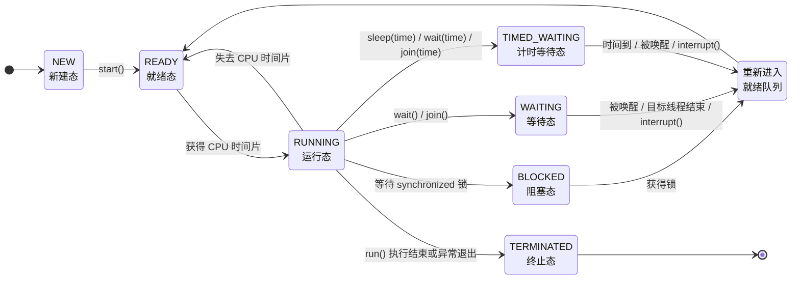

## 多线程概述

多线程是 Java 中非常重要的并发编程基础。它允许一个程序内部同时安排多个执行任务，从而提升程序响应能力、提高 CPU 利用率，并更好地处理网络请求、界面响应、文件读写、服务器并发访问等场景。

> 结论：多线程的核心作用不是简单地“让程序一定变快”，而是让程序具备同时处理多个任务的能力，并在合适场景下提升整体效率和响应速度。

### 程序、进程和线程

理解多线程之前，需要先区分程序、进程和线程三个概念。

| 概念 | 含义                             | 特点                                           |
| ---- | -------------------------------- | ---------------------------------------------- |
| 程序 | 存放在磁盘上的静态代码文件       | 尚未运行，例如一个 `.exe` 文件或一个 Java 程序 |
| 进程 | 程序被加载到内存后正在运行的实例 | 拥有独立的内存空间和系统资源                   |
| 线程 | 进程内部的一个执行单元           | 负责执行具体任务，一个进程至少有一个线程       |

程序是静态的，进程是动态的。一个程序启动后，就会在操作系统中形成一个进程；一个进程中至少包含一个线程，也可以包含多个线程。

例如，打开浏览器是启动了一个浏览器进程；浏览器中同时进行页面渲染、网络加载、文件下载等任务时，内部可能会使用多个线程分别处理不同工作。

> 结论：程序是“未运行的代码”，进程是“运行中的程序”，线程是“进程中的执行单元”。

#### 进程的作用

现代操作系统支持多进程运行，因此计算机可以在同一时间段内执行多个任务。例如，一边使用 IDEA 编写代码，一边听音乐，一边使用浏览器查资料。

多进程的意义主要体现在两个方面：

1. **提高计算机资源利用率**：不同程序可以同时运行，操作系统负责分配 CPU、内存等资源。
2. **实现任务隔离**：每个进程通常拥有独立的内存空间，一个进程出现问题，一般不会直接破坏另一个进程的内存数据。

进程是操作系统进行资源分配的基本单位，而线程是程序执行任务的基本单位。

> 注意：一个进程可以包含多个线程，多线程程序本质上是在同一个进程内部安排多个执行任务。

#### 线程的作用

线程是进程中的执行单元，一个进程至少有一个线程。如果一个进程内部只有一个线程，那么多个任务只能按照顺序依次执行；如果一个进程内部有多个线程，那么多个任务就可以在同一时间段内交替或同时执行。

例如，图形界面程序通常会有一个主线程负责界面显示。如果用户点击按钮后执行一个耗时操作，并且该耗时操作也放在主线程中执行，那么界面可能会卡住。更合理的做法是：主线程继续负责界面响应，耗时任务交给新的线程执行，任务完成后再更新界面。

> 结论：线程可以让一个程序内部同时处理多个任务，常用于提升程序响应能力和资源利用率。

#### 单线程程序和多线程程序

单线程程序中，任务只能一个接一个执行。当前任务没有完成时，后面的任务无法开始。

```text
任务A → 任务B → 任务C
```

多线程程序中，多个任务可以在同一时间段内执行。不同线程分别负责不同任务。

```text
线程1：任务A
线程2：任务B
线程3：任务C
```

单线程结构简单，执行顺序清晰，不容易出现线程安全问题；多线程可以提升响应能力和吞吐量，但也会带来线程调度、共享数据安全、死锁等复杂问题。

> 易错点：多线程并不一定让所有程序都更快。如果线程创建过多、任务划分不合理，反而可能因为线程切换和资源竞争导致程序变慢。

#### Java 程序的运行与主线程

运行 Java 程序时，`java` 命令会启动 Java 虚拟机（Java Virtual Machine，JVM）。JVM 启动后，本质上就是启动了一个进程。

在 Java 程序中，执行 `main()` 方法的线程称为**主线程**。例如：

```java
public class MainThreadDemo {
    public static void main(String[] args) {
        System.out.println(Thread.currentThread().getName());
    }
}
```

通常输出结果为：

```text
main
```

这说明 `main()` 方法中的代码由名为 `main` 的主线程执行。

不过，JVM 启动后通常不只有主线程。为了支持垃圾回收、运行时管理等工作，JVM 内部还会启动一些后台线程。因此，从整体运行机制看，JVM 本身通常是多线程运行的。

> 结论：`main()` 方法由主线程执行，但 Java 程序运行时通常还存在 JVM 内部的其他后台线程。

#### 线程调度

线程调度指操作系统决定哪个线程获得 CPU 执行权的过程。如果多个线程竞争同一个 CPU 核心，同一时刻只能有一个线程真正执行，其他线程需要等待调度。

常见线程调度策略有两类：

| 调度策略   | 含义                                   |
| ---------- | -------------------------------------- |
| 分时调度   | 所有线程轮流使用 CPU，平均分配执行时间 |
| 抢占式调度 | 优先级较高的线程更容易获得 CPU 执行权  |

Java 线程调度采用的是**抢占式调度**。线程优先级较高时，获得 CPU 时间片的概率通常更大；但这不代表高优先级线程一定先执行，也不代表低优先级线程一定不能执行。

> 注意：线程执行顺序通常具有不确定性，不能依赖“代码写在前面，线程就一定先执行”这种假设。

### 并发与并行

并发和并行是多线程中非常容易混淆的两个概念。

| 概念 | 关键词     | 含义                           |
| ---- | ---------- | ------------------------------ |
| 并发 | 同一时间段 | 多个任务在同一时间段内交替推进 |
| 并行 | 同一时刻   | 多个任务在同一时刻真正同时执行 |

并发强调的是任务处理能力，并不要求多个任务在同一瞬间同时运行。并行强调的是任务真正同时执行，通常需要多核 CPU 支持。

#### 并发

并发（Concurrency）指多个任务在同一时间段内交替执行。对于单核 CPU 来说，同一时刻只能执行一个线程，但 CPU 可以在多个线程之间快速切换，使人从宏观上感觉多个任务好像在同时执行。

例如，单核 CPU 上有三个线程 A、B、C，它们的执行过程可能是：

```text
A执行一小段 → B执行一小段 → C执行一小段 → A继续执行 → ...
```

从微观角度看，同一时刻只有一个线程执行；从宏观角度看，多个线程都在推进，因此表现为并发。

> 结论：并发是“看起来同时执行”，本质上可能是多个任务快速交替执行。

#### 并行

并行（Parallelism）指多个任务在同一时刻真正同时执行。并行依赖硬件资源，通常要求 CPU 具有多个核心。

例如，在四核 CPU 上，四个线程可能被分配到四个不同核心上同时运行：

```text
核心1：线程A
核心2：线程B
核心3：线程C
核心4：线程D
```

此时，多个线程在微观和宏观上都是真正同时执行的。

> 结论：并行是“真正同时执行”，通常依赖多核 CPU 或多 CPU 硬件环境。

#### 多线程程序一定是并行的吗

多线程程序不一定是并行的，它取决于底层硬件资源和操作系统调度。

1. **单核 CPU 上**：多线程只能实现并发，多个线程轮流使用同一个 CPU 核心。
2. **多核 CPU 上**：多线程既可能并发，也可能并行。不同线程如果被分配到不同 CPU 核心上，就可以真正并行执行；如果线程数量多于核心数量，仍然需要在线程之间进行调度和切换。

> 结论：多线程提供的是并发编程能力，是否真正并行执行取决于 CPU 核心数和操作系统调度。

#### 为什么要理解并发和并行

理解并发和并行，有助于合理设计线程数量和优化程序性能。如果不了解二者区别，可能会误以为“线程越多，程序越快”。

例如，一个计算密集型程序运行在 4 核 CPU 上，如果创建 100 个线程执行计算任务，并不意味着可以有 100 个任务同时并行。由于 CPU 核心数有限，同一时刻最多只有少量线程真正执行，大量线程只能等待 CPU 时间片。

线程过多还会带来额外成本：

1. **上下文切换成本**：操作系统需要频繁保存和恢复线程状态。
2. **内存占用增加**：每个线程都需要一定的栈空间和运行时资源。
3. **调度压力变大**：线程越多，操作系统调度越复杂。

因此，多线程优化的关键不是盲目增加线程数量，而是根据任务类型和硬件资源合理设置线程数量。

> 易错点：线程数不是越多越好。对于计算密集型任务，线程数通常应接近 CPU 核心数，而不是远远超过核心数。

### CPU 密集型任务与 IO 密集型任务

多线程程序的线程数量通常与任务类型有关。常见任务可以大致分为 CPU 密集型和 IO 密集型。

#### CPU 密集型任务

CPU 密集型任务主要消耗 CPU 计算能力，例如：

1. 大量数学计算；
2. 图片处理；
3. 视频编码；
4. 加密解密；
5. 大规模数据计算。

这类任务的瓶颈主要在 CPU。由于真正并行执行能力受限于 CPU 核心数，因此线程数量通常不宜远大于 CPU 核心数。

```java
int processors = Runtime.getRuntime().availableProcessors();
System.out.println("CPU核心数：" + processors);
```

对于 CPU 密集型任务，线程数通常可以设置为接近 CPU 核心数。

> 结论：CPU 密集型任务依赖 CPU 计算能力，线程数过多会增加切换成本，通常不应远超核心数。

#### IO 密集型任务

IO 密集型任务主要耗时在等待外部资源，例如：

1. 文件读写；
2. 网络请求；
3. 数据库访问；
4. 远程接口调用；
5. 用户输入等待。

这类任务中，线程经常处于等待状态。等待 IO 时，CPU 可以切换去执行其他线程，因此 IO 密集型任务可以使用相对更多的线程，以提高 CPU 利用率。

> 结论：IO 密集型任务大量时间用于等待外部资源，线程数可以适当多于 CPU 核心数。

### 多线程的主要应用场景

多线程常见应用场景包括：

| 场景         | 多线程作用                               |
| ------------ | ---------------------------------------- |
| 图形界面程序 | 主线程保持界面响应，工作线程处理耗时任务 |
| Web 服务器   | 同时处理多个客户端请求                   |
| 文件下载     | 多线程分段下载，提高下载效率             |
| 日志系统     | 异步写日志，减少对主业务流程的阻塞       |
| 网络通信     | 多线程处理多个连接                       |
| 定时任务     | 后台线程周期性执行任务                   |
| IO 操作      | 等待 IO 时让 CPU 处理其他任务            |

> 结论：多线程尤其适合“多个任务需要同时推进”或“某些任务会阻塞等待”的场景。

### 多线程的优点和代价

多线程的优点主要包括：

1. **提高程序响应速度**：耗时任务可以放到后台线程执行，避免主流程卡住。
2. **提高 CPU 利用率**：当某些线程等待 IO 时，CPU 可以调度其他线程执行。
3. **提升系统吞吐量**：服务器可以同时处理多个请求。
4. **便于任务拆分**：不同线程可以分别负责不同任务。

多线程也会带来额外代价：

1. **线程切换有成本**；
2. **线程创建和销毁有成本**；
3. **共享数据可能出现线程安全问题**；
4. **程序执行顺序更难预测**；
5. **可能出现死锁、活锁等问题**。

> 结论：多线程是提升并发能力的重要工具，但会增加程序复杂度。使用多线程时，应同时关注性能收益和并发风险。

## 线程的创建

Java 中创建线程的核心思路是：先定义线程要执行的任务，再启动线程，让该任务在新的执行路径中运行。线程任务通常写在 `run()` 方法中，但真正启动线程必须调用 `start()` 方法。

Java 中常见的线程创建方式主要有两种：

1. 继承 `Thread` 类；
2. 实现 `Runnable` 接口。

> 结论：`run()` 用来定义线程任务，`start()` 用来启动新线程。只写 `run()` 不代表创建了新线程，只有调用 `start()` 才会进入多线程执行。

### Thread 类

`Thread` 类位于 `java.lang` 包中，用于描述 Java 中的线程对象。一个 `Thread` 对象可以代表一条执行线程，线程启动后会执行对应的任务代码。

`Thread` 类常用构造方法如下：

| 构造方法                               | 说明                                     |
| -------------------------------------- | ---------------------------------------- |
| `Thread()`                             | 创建一个线程对象，线程名称由系统默认生成 |
| `Thread(String name)`                  | 创建线程对象，并指定线程名称             |
| `Thread(Runnable target)`              | 创建线程对象，并指定线程任务             |
| `Thread(Runnable target, String name)` | 创建线程对象，并指定线程任务和线程名称   |

`Thread` 类常用方法如下：

| 方法                             | 说明                           |
| -------------------------------- | ------------------------------ |
| `void start()`                   | 启动线程，让线程进入可运行状态 |
| `void run()`                     | 线程要执行的任务代码           |
| `String getName()`               | 获取线程名称                   |
| `void setName(String name)`      | 设置线程名称                   |
| `static Thread currentThread()`  | 获取当前正在执行的线程对象     |
| `static void sleep(long millis)` | 让当前线程休眠指定毫秒数       |
| `void join()`                    | 等待该线程执行结束             |
| `static void yield()`            | 当前线程让出本次 CPU 执行机会  |
| `boolean isAlive()`              | 判断线程是否还处于活动状态     |

> 注意：`Thread.currentThread()` 获取的是“当前正在执行这行代码的线程对象”，不是某个随便创建出来的线程对象。

### 创建线程方式一：继承 Thread 类

继承 `Thread` 类创建线程的步骤如下：

1. 定义一个类继承 `Thread`；
2. 重写 `run()` 方法，把线程任务写入 `run()`；
3. 创建自定义线程类对象；
4. 调用线程对象的 `start()` 方法启动线程。

示例：

```java
public class ThreadExtendsDemo {
    public static void main(String[] args) {
        DownloadThread thread1 = new DownloadThread("下载线程A");
        DownloadThread thread2 = new DownloadThread("下载线程B");

        thread1.start();
        thread2.start();

        for (int i = 1; i <= 5; i++) {
            System.out.println("主线程正在处理界面刷新：" + i);
        }
    }
}

class DownloadThread extends Thread {
    public DownloadThread(String name) {
        super(name);
    }

    @Override
    public void run() {
        for (int i = 1; i <= 5; i++) {
            System.out.println(getName() + " 正在下载第 " + i + " 个文件片段");
        }
    }
}
```

这段代码中，`DownloadThread` 继承了 `Thread`，因此它本身就是线程类。`run()` 方法中定义的是下载任务，`start()` 方法负责启动线程。

程序运行后，主线程和两个下载线程会交替执行。具体输出顺序不固定，因为线程调度由操作系统和 JVM 共同决定。

> 易错点：多线程程序的输出顺序通常不可预测。不能根据某一次运行结果推断线程永远按这个顺序执行。

#### start() 和 run() 的区别

`start()` 和 `run()` 是学习线程创建时最容易混淆的两个方法。

| 调用方式         | 是否启动新线程 | 执行特点                         |
| ---------------- | -------------- | -------------------------------- |
| `thread.start()` | 是             | 新线程启动，由新线程执行 `run()` |
| `thread.run()`   | 否             | 普通方法调用，仍由当前线程执行   |

示例：

```java
public class StartRunDemo {
    public static void main(String[] args) {
        Thread thread = new Thread(() -> {
            System.out.println("任务执行线程：" + Thread.currentThread().getName());
        });

        thread.run();
        System.out.println("main方法执行线程：" + Thread.currentThread().getName());
    }
}
```

如果调用的是 `run()`，输出中的任务仍然由 `main` 线程执行。这说明 `run()` 本身只是一个普通方法，并不会创建新的线程执行路径。

改为：

```java
thread.start();
```

线程任务才会交给新线程执行。

> 结论：`run()` 是任务入口，`start()` 是线程启动入口。实际开发中启动线程必须调用 `start()`，而不是直接调用 `run()`。

#### 为什么不能直接创建 Thread 对象后 start()

语法上可以直接创建 `Thread` 对象并调用 `start()`：

```java
Thread thread = new Thread();
thread.start();
```

这段代码不会报错，但没有实际任务效果。原因是 `Thread` 类本身的 `run()` 方法没有定义具体业务任务。如果没有重写 `run()`，也没有传入 `Runnable` 任务对象，新线程即使启动，也没有明确要执行的业务代码。

创建线程的目的，是建立一条新的执行路径，让某段任务代码和主线程同时推进。因此必须把任务写入 `run()` 方法，或者通过 `Runnable` 对象传入线程。

> 结论：线程对象必须绑定明确任务。没有任务的线程即使启动，也没有实际业务意义。

#### start() 方法只能调用一次

同一个线程对象的 `start()` 方法只能调用一次。线程一旦启动并执行完毕，就不能再次启动。

错误示例：

```java
Thread thread = new Thread(() -> {
    System.out.println("线程任务执行");
});

thread.start();
thread.start(); // 错误：同一个线程对象不能重复启动
```

第二次调用 `start()` 会抛出：

```text
java.lang.IllegalThreadStateException
```

如果需要再次执行同样的任务，应重新创建一个新的线程对象：

```java
Thread thread1 = new Thread(task);
Thread thread2 = new Thread(task);

thread1.start();
thread2.start();
```

> 易错点：线程对象不是“可重复启动的任务按钮”。一个 `Thread` 对象对应一次线程生命周期。

### 线程执行时的内存特点

线程启动后，每个线程都有自己独立的执行栈，用于方法调用、局部变量存储、方法压栈和弹栈。多个线程运行在同一个进程中，因此它们共享同一个进程的堆内存和方法区。

线程之间的内存关系可以概括为：

| 内存区域   | 多线程之间是否共享 | 说明                                     |
| ---------- | ------------------ | ---------------------------------------- |
| 虚拟机栈   | 不共享             | 每个线程独立拥有，用于方法调用和局部变量 |
| 程序计数器 | 不共享             | 每个线程记录自己执行到的位置             |
| 本地方法栈 | 不共享             | 每个线程执行本地方法时使用               |
| 堆内存     | 共享               | 对象实例存放在堆中，可被多个线程访问     |
| 方法区     | 共享               | 类信息、静态变量等可被多个线程访问       |

因此：

1. **局部变量通常不共享**：局部变量位于线程自己的栈帧中，每个线程调用方法时都有独立副本。
2. **实例变量是否共享取决于对象是否共享**：如果多个线程访问同一个对象，那么这个对象的实例变量会被多个线程共享。
3. **静态变量在同一个 JVM 进程中共享**：静态变量属于类，类信息在方法区中，因此多个线程可以访问同一份静态变量。

> 结论：线程栈独立，堆内存共享。多线程安全问题通常发生在多个线程共同访问同一个堆中对象或同一个静态变量时。

### 方法调用不会产生新线程

普通方法之间的调用不会产生新线程。例如：

```java
public class MethodCallDemo {
    public static void main(String[] args) {
        System.out.println("main begin");
        methodA();
        System.out.println("main end");
    }

    public static void methodA() {
        System.out.println("methodA begin");
        methodB();
        System.out.println("methodA end");
    }

    public static void methodB() {
        System.out.println("methodB execute");
    }
}
```

这段代码只有主线程在执行。`methodA()` 和 `methodB()` 只是普通方法调用，它们会在主线程的栈中依次压栈和弹栈，不会自动创建新线程。

要创建新线程，必须显式创建 `Thread` 对象并调用 `start()`。

> 易错点：方法调用层级变多，不等于线程变多。线程数量取决于是否启动了新的线程执行路径。

### 获取当前线程对象和线程名称

`Thread.currentThread()` 可以获取当前正在执行代码的线程对象，`getName()` 可以获取线程名称。

```java
public class CurrentThreadDemo {
    public static void main(String[] args) {
        System.out.println("main方法所在线程：" + Thread.currentThread().getName());

        Thread thread = new Thread(() -> {
            System.out.println("run方法所在线程：" + Thread.currentThread().getName());
        });

        thread.start();
    }
}
```

通常情况下，主线程名称为：

```text
main
```

自定义线程如果没有手动设置名称，默认名称通常类似：

```text
Thread-0
Thread-1
Thread-2
```

这些名称由 `Thread` 类在创建线程对象时自动生成。

> 结论：分析多线程程序时，经常使用 `Thread.currentThread().getName()` 判断当前代码由哪个线程执行。

#### 设置线程名称

设置线程名称有两种常见方式。

第一种是在构造方法中指定：

```java
Thread thread = new Thread(() -> {
    System.out.println(Thread.currentThread().getName());
}, "日志写入线程");

thread.start();
```

第二种是创建线程对象后调用 `setName()`：

```java
Thread thread = new Thread(() -> {
    System.out.println(Thread.currentThread().getName());
});

thread.setName("文件上传线程");
thread.start();
```

线程名称不会影响线程执行逻辑，但可以提高程序调试和日志分析的可读性。

> 注意：实际开发中应给重要线程设置有意义的名称，便于定位问题。

### 创建线程方式二：实现 Runnable 接口

实现 `Runnable` 接口创建线程的步骤如下：

1. 定义一个类实现 `Runnable` 接口；
2. 重写 `run()` 方法，把线程任务写入 `run()`；
3. 创建任务对象；
4. 创建 `Thread` 对象，并把任务对象传入构造方法；
5. 调用 `Thread` 对象的 `start()` 方法启动线程。

示例：

```java
public class RunnableDemo {
    public static void main(String[] args) {
        UploadTask task = new UploadTask();

        Thread thread1 = new Thread(task, "上传线程A");
        Thread thread2 = new Thread(task, "上传线程B");

        thread1.start();
        thread2.start();

        for (int i = 1; i <= 5; i++) {
            System.out.println("主线程处理其他任务：" + i);
        }
    }
}

class UploadTask implements Runnable {
    @Override
    public void run() {
        for (int i = 1; i <= 5; i++) {
            System.out.println(Thread.currentThread().getName() + " 上传第 " + i + " 个文件块");
        }
    }
}
```

这段代码中，`UploadTask` 不是线程对象，而是线程任务对象。真正的线程对象是：

```java
Thread thread1 = new Thread(task, "上传线程A");
Thread thread2 = new Thread(task, "上传线程B");
```

`Thread` 负责创建和启动线程，`Runnable` 负责提供线程要执行的任务。

> 结论：实现 `Runnable` 接口时，任务和线程被拆开了。`Runnable` 表示任务，`Thread` 表示线程。

#### Runnable 接口的本质

`Runnable` 接口非常简单，核心只有一个抽象方法：

```java
public interface Runnable {
    void run();
}
```

它表示一个“可以被线程执行的任务”。`Thread` 类的构造方法可以接收 `Runnable` 对象：

```java
Thread thread = new Thread(runnable);
```

线程启动后，会执行这个 `Runnable` 对象的 `run()` 方法。

这种设计把“线程”和“任务”分开：

| 角色       | 作用                       |
| ---------- | -------------------------- |
| `Runnable` | 描述要执行的任务           |
| `Thread`   | 负责启动线程并调度任务执行 |

> 结论：`Runnable` 不是线程，而是线程要执行的任务。

#### Runnable 方式的优势

实际开发中，更推荐使用实现 `Runnable` 接口的方式创建线程，原因主要有三个。

##### 避免单继承限制

Java 只支持单继承。如果一个类已经继承了某个父类，就不能再继承 `Thread`。

```java
class UploadTask extends BaseTask implements Runnable {
    @Override
    public void run() {
        System.out.println("执行上传任务");
    }
}
```

通过实现 `Runnable`，类仍然可以继承其他父类。

##### 任务和线程解耦

继承 `Thread` 时，自定义类既是任务，又是线程；实现 `Runnable` 时，任务和线程被拆开。

```java
Runnable task = new UploadTask();

Thread thread1 = new Thread(task);
Thread thread2 = new Thread(task);
```

这种写法更符合职责分离：任务对象只负责业务逻辑，线程对象只负责启动和执行。

##### 更方便共享数据

多个线程可以共享同一个 `Runnable` 任务对象，从而共享任务对象中的成员变量。

```java
class TicketTask implements Runnable {
    private int tickets = 10;

    @Override
    public void run() {
        while (tickets > 0) {
            System.out.println(Thread.currentThread().getName() + " 卖出第 " + tickets + " 张票");
            tickets--;
        }
    }
}
```

如果多个线程使用同一个 `TicketTask` 对象，它们访问的是同一份 `tickets` 数据。

> 注意：共享数据虽然方便，但也会带来线程安全问题。后续学习同步机制时，需要重点解决多个线程同时修改共享数据的问题。

### Thread 方式与 Runnable 方式对比

| 对比项             | 继承 `Thread`                   | 实现 `Runnable`                     |
| ------------------ | ------------------------------- | ----------------------------------- |
| 线程任务位置       | 写在 `Thread` 子类的 `run()` 中 | 写在 `Runnable` 实现类的 `run()` 中 |
| 是否受单继承限制   | 受限制                          | 不受影响                            |
| 任务和线程是否分离 | 不分离                          | 分离                                |
| 数据共享是否方便   | 相对不方便                      | 较方便                              |
| 实际开发推荐程度   | 较少直接使用                    | 更常用                              |

> 结论：继承 `Thread` 更容易理解线程创建过程；实现 `Runnable` 更符合实际开发中的设计习惯。

### 使用匿名内部类创建线程

如果线程任务比较简单，也可以使用匿名内部类简化代码。

```java
public class AnonymousThreadDemo {
    public static void main(String[] args) {
        Thread thread = new Thread(new Runnable() {
            @Override
            public void run() {
                System.out.println("匿名内部类任务：" + Thread.currentThread().getName());
            }
        });

        thread.start();
    }
}
```

这种写法不需要单独创建一个 `Runnable` 实现类，适合任务逻辑较短的场景。

### 使用 Lambda 表达式创建线程

由于 `Runnable` 是函数式接口，因此可以使用 Lambda 表达式进一步简化代码。

```java
public class LambdaThreadDemo {
    public static void main(String[] args) {
        Thread thread = new Thread(() -> {
            System.out.println("Lambda任务：" + Thread.currentThread().getName());
        }, "Lambda线程");

        thread.start();
    }
}
```

这段代码等价于传入一个 `Runnable` 实现类对象，只是写法更加简洁。

> 补充：Lambda 表达式只是简化 `Runnable` 实现类的写法，并没有改变线程创建和启动的本质。

### 线程创建后的执行特点

线程启动后，程序中会出现多条执行路径。主线程继续向下执行，新线程执行自己的 `run()` 方法。

示例：

```java
public class ThreadOrderDemo {
    public static void main(String[] args) {
        Thread thread = new Thread(() -> {
            for (int i = 1; i <= 5; i++) {
                System.out.println("子线程：" + i);
            }
        });

        thread.start();

        for (int i = 1; i <= 5; i++) {
            System.out.println("主线程：" + i);
        }
    }
}
```

输出结果可能是交替的，也可能某个线程连续输出多次。因为 `start()` 只表示线程进入可运行状态，并不代表它会立刻获得 CPU 执行权。

> 易错点：`start()` 的含义是“启动线程并等待调度”，不是“马上执行完 `run()`”。

#### 主线程结束后程序一定结束吗

主线程执行完毕后，JVM 不一定立即退出。如果还有其他非守护线程没有执行完，JVM 会继续运行，直到所有非守护线程结束。

例如：

```java
public class MainEndDemo {
    public static void main(String[] args) {
        Thread thread = new Thread(() -> {
            for (int i = 1; i <= 5; i++) {
                System.out.println("子线程继续执行：" + i);
            }
        });

        thread.start();

        System.out.println("main方法结束");
    }
}
```

即使 `main()` 方法先结束，只要子线程还没执行完，程序仍然可能继续运行。

> 结论：`main()` 方法结束不等于 JVM 一定立刻退出。JVM 是否退出取决于是否还有非守护线程在运行。

## 线程的生命周期和状态控制

线程的生命周期指一个线程从创建、启动、等待调度、执行任务，到最终结束的完整过程。线程不是一启动就一直执行，也不是调用 `start()` 后立刻执行完毕，而是在不同状态之间切换，由 JVM 和操作系统共同调度。

Java 中线程状态可以通过 `Thread.State` 表示，主要包括：`NEW`、`RUNNABLE`、`BLOCKED`、`WAITING`、`TIMED_WAITING` 和 `TERMINATED`。

> 结论：线程状态描述的是线程在某一时刻所处的执行阶段。理解线程状态，有助于分析多线程程序为什么等待、为什么卡住、为什么没有立刻执行。

### 线程生命周期图



该图展示的是 Java 线程状态之间的主要转换关系。需要注意的是，Java API 中的 `RUNNABLE` 状态同时包含“就绪”和“运行”两种情况：线程可能正在等待 CPU 调度，也可能正在 CPU 上执行。

> 注意：教材中常说的“就绪”和“运行”在 Java 的 `Thread.State` 中通常都归入 `RUNNABLE` 状态。

### 线程的六种状态

Java 中线程的六种状态如下：

| 状态            | 含义                                           | 常见进入方式                              |
| --------------- | ---------------------------------------------- | ----------------------------------------- |
| `NEW`           | 新建状态，线程对象已创建但尚未启动             | `new Thread()`                            |
| `RUNNABLE`      | 可运行状态，可能正在运行，也可能等待 CPU 调度  | `start()` 后、阻塞结束后                  |
| `BLOCKED`       | 阻塞状态，等待进入 `synchronized` 同步区域     | 等待对象监视器锁                          |
| `WAITING`       | 无限期等待状态，需要其他线程唤醒或目标线程结束 | `wait()`、`join()`                        |
| `TIMED_WAITING` | 限期等待状态，等待指定时间或提前被唤醒         | `sleep(time)`、`wait(time)`、`join(time)` |
| `TERMINATED`    | 终止状态，线程执行结束                         | `run()` 正常结束或异常退出                |

#### 新建状态：NEW

当使用 `new Thread()` 或其子类构造方法创建线程对象后，线程对象就处于 `NEW` 状态。

```java
Thread thread = new Thread();
```

此时只是创建了一个普通的 Java 对象，还没有启动新的执行路径。线程还没有进入调度队列，也不会执行 `run()` 方法。

只有调用 `start()` 方法后，线程才会从 `NEW` 状态进入 `RUNNABLE` 状态。

```java
thread.start();
```

> 结论：`NEW` 状态表示线程对象已创建，但线程还没有真正启动。

#### 可运行状态：RUNNABLE

调用 `start()` 方法后，线程进入 `RUNNABLE` 状态。

```java
Thread thread = new Thread(() -> {
    System.out.println("线程任务执行");
});

thread.start();
```

处于 `RUNNABLE` 状态的线程已经具备运行资格，但是否真正执行，取决于操作系统的线程调度。

Java 中的 `RUNNABLE` 状态包含两种常见情况：

1. **就绪**：线程已经可以运行，但还没有获得 CPU 时间片；
2. **运行**：线程已经获得 CPU 时间片，正在执行 `run()` 方法中的代码。

线程执行过程中，如果失去 CPU 时间片，它仍然可能处于 `RUNNABLE` 状态，只是暂时没有执行。

> 结论：`RUNNABLE` 不等于一定正在运行，它表示线程具备运行条件，可能正在运行，也可能等待 CPU 调度。

#### 阻塞状态：BLOCKED

`BLOCKED` 状态表示线程正在等待一个监视器锁（monitor lock），通常发生在进入 `synchronized` 同步方法或同步代码块时。

例如，线程 A 已经持有某个对象锁，线程 B 也想进入同一把锁保护的同步代码块，那么线程 B 会进入 `BLOCKED` 状态。

```java
synchronized (lock) {
    // 同一时刻只能有一个线程进入这里
}
```

当持有锁的线程释放锁后，处于 `BLOCKED` 状态的线程会重新竞争锁。竞争成功后，线程会回到 `RUNNABLE` 状态。

> 易错点：`BLOCKED` 特指等待 `synchronized` 锁，不是所有“暂停执行”的情况都叫 `BLOCKED`。例如 `sleep()` 进入的是 `TIMED_WAITING`，不是 `BLOCKED`。

#### 无限期等待状态：WAITING

`WAITING` 状态表示线程正在无限期等待另一个线程执行某个特定操作。如果没有外部唤醒或中断，它会一直等待下去。

常见进入方式包括：

| 方法            | 说明                                                         |
| --------------- | ------------------------------------------------------------ |
| `Object.wait()` | 当前线程释放对象锁，等待其他线程调用 `notify()` 或 `notifyAll()` |
| `Thread.join()` | 当前线程等待目标线程执行结束                                 |

例如：

```java
Thread thread = new Thread(() -> {
    System.out.println("子线程执行任务");
});

thread.start();
thread.join();
System.out.println("子线程结束后，主线程继续执行");
```

在主线程中调用 `thread.join()` 后，主线程会等待 `thread` 执行完毕，再继续向下执行。

> 结论：`WAITING` 是没有指定等待时间的等待状态，必须依赖其他线程的唤醒、目标线程结束或中断来退出等待。

#### 限期等待状态：TIMED_WAITING

`TIMED_WAITING` 状态表示线程正在等待一段指定时间。时间到达后，线程会自动回到 `RUNNABLE` 状态，等待重新获得 CPU 调度。

常见进入方式包括：

| 方法                        | 说明                                   |
| --------------------------- | -------------------------------------- |
| `Thread.sleep(long millis)` | 当前线程休眠指定毫秒数                 |
| `Object.wait(long timeout)` | 当前线程等待指定时间，也可能被提前唤醒 |
| `Thread.join(long millis)`  | 当前线程最多等待目标线程指定时间       |

例如：

```java
try {
    Thread.sleep(1000);
} catch (InterruptedException e) {
    e.printStackTrace();
}
```

这段代码会让当前正在执行的线程进入 `TIMED_WAITING` 状态约 1 秒。时间结束后，线程不会立即执行，而是先回到 `RUNNABLE` 状态，等待 CPU 调度。

> 注意：`Thread.sleep(1000)` 表示至少睡眠约 1 秒，不保证 1 秒后立刻运行。线程何时继续执行仍然取决于系统调度。

#### 终止状态：TERMINATED

当线程的 `run()` 方法正常执行完毕，线程就进入 `TERMINATED` 状态。

```java
Thread thread = new Thread(() -> {
    System.out.println("任务执行完毕");
});

thread.start();
```

如果 `run()` 方法中出现未捕获异常，线程也会异常结束并进入 `TERMINATED` 状态。

> 注意：`interrupt()` 不会直接杀死线程。它只是给线程设置中断标记，或者让处于 `sleep()`、`wait()`、`join()` 等等待状态的线程抛出 `InterruptedException`。线程是否结束，取决于代码如何处理中断。

已经终止的线程对象不能再次调用 `start()`。如果重复启动，会抛出 `IllegalThreadStateException`。

### 线程睡眠：sleep()

`Thread.sleep(long millis)` 用于让当前线程暂停执行指定时间，并进入 `TIMED_WAITING` 状态。

```java
public class SleepDemo {
    public static void main(String[] args) {
        for (int i = 1; i <= 5; i++) {
            System.out.println("第 " + i + " 次输出");

            try {
                Thread.sleep(1000);
            } catch (InterruptedException e) {
                e.printStackTrace();
            }
        }
    }
}
```

`sleep()` 是静态方法，作用对象始终是**当前正在执行的线程**，而不是某个线程对象本身。

错误理解示例：

```java
Thread thread = new Thread();
thread.sleep(1000);
```

虽然语法允许通过对象调用静态方法，但实际效果仍然等价于：

```java
Thread.sleep(1000);
```

也就是说，谁执行到这行代码，谁休眠。

> 易错点：`t.sleep(1000)` 并不是让 `t` 线程休眠，而是让当前执行这行代码的线程休眠。因此应统一写成 `Thread.sleep(1000)`，避免误解。

#### TimeUnit 的休眠写法

在现代 Java 代码中，也可以使用 `TimeUnit` 提高可读性。

```java
import java.util.concurrent.TimeUnit;

public class TimeUnitDemo {
    public static void main(String[] args) {
        try {
            TimeUnit.SECONDS.sleep(1);
            TimeUnit.MILLISECONDS.sleep(500);
            TimeUnit.MINUTES.sleep(1);
        } catch (InterruptedException e) {
            e.printStackTrace();
        }
    }
}
```

与 `Thread.sleep()` 相比，`TimeUnit` 的优势是单位更清晰：

```java
Thread.sleep(1000);
TimeUnit.SECONDS.sleep(1);
```

两者都表示休眠 1 秒，但第二种写法可读性更强。

> 补充：`TimeUnit` 不改变线程休眠的本质，只是提供了更清晰的时间单位表达。

#### sleep() 的注意事项

`sleep()` 使用时需要注意以下几点：

1. `sleep()` 是静态方法，应使用 `Thread.sleep()` 调用；
2. `sleep()` 让当前线程进入 `TIMED_WAITING` 状态；
3. `sleep()` 时间结束后，线程进入 `RUNNABLE` 状态，而不是立刻运行；
4. `sleep()` 会抛出 `InterruptedException`，必须捕获或声明抛出；
5. `sleep()` 不会释放当前线程已经持有的 `synchronized` 锁。

> 结论：`sleep()` 只负责让当前线程暂停一段时间，不负责释放锁，也不保证时间到后立即执行。

### 线程优先级

每个线程都有优先级。优先级较高的线程，理论上获得 CPU 时间片的概率更大；优先级较低的线程，获得 CPU 时间片的概率相对较小。

Java 中线程优先级范围是 `1` 到 `10`：

| 常量                   | 数值 | 含义       |
| ---------------------- | ---- | ---------- |
| `Thread.MIN_PRIORITY`  | `1`  | 最低优先级 |
| `Thread.NORM_PRIORITY` | `5`  | 默认优先级 |
| `Thread.MAX_PRIORITY`  | `10` | 最高优先级 |

设置和获取线程优先级的方法如下：

```java
thread.setPriority(Thread.MAX_PRIORITY);
int priority = thread.getPriority();
```

示例：

```java
public class PriorityDemo {
    public static void main(String[] args) {
        Thread low = new Thread(new PrintTask(), "低优先级线程");
        Thread high = new Thread(new PrintTask(), "高优先级线程");

        low.setPriority(Thread.MIN_PRIORITY);
        high.setPriority(Thread.MAX_PRIORITY);

        low.start();
        high.start();
    }
}

class PrintTask implements Runnable {
    @Override
    public void run() {
        for (int i = 1; i <= 100; i++) {
            System.out.println(Thread.currentThread().getName() + "：" + i);
        }
    }
}
```

线程优先级只能影响线程获得 CPU 的概率，不能保证线程执行顺序。

> 易错点：优先级高不等于一定先执行完，优先级低也不等于一定后执行。线程调度仍然具有不确定性。

### 线程让步：yield()

`Thread.yield()` 用于让当前正在运行的线程主动让出本次 CPU 执行机会，使其重新回到 `RUNNABLE` 状态。

```java
public class YieldDemo {
    public static void main(String[] args) {
        Runnable task = () -> {
            for (int i = 1; i <= 100; i++) {
                System.out.println(Thread.currentThread().getName() + "：" + i);

                if (i % 10 == 0) {
                    Thread.yield();
                }
            }
        };

        new Thread(task, "线程A").start();
        new Thread(task, "线程B").start();
    }
}
```

调用 `yield()` 后，当前线程只是让出 CPU 机会，并不会进入阻塞状态。它仍然处于 `RUNNABLE` 状态，可能很快又被调度执行。

> 结论：`yield()` 是一种“提示式让步”，不是强制暂停。它不能保证其他线程一定会立刻执行。

#### sleep() 和 yield() 的区别

| 对比项               | `sleep()`                   | `yield()`       |
| -------------------- | --------------------------- | --------------- |
| 方法类型             | 静态方法                    | 静态方法        |
| 作用对象             | 当前线程                    | 当前线程        |
| 状态变化             | 进入 `TIMED_WAITING`        | 回到 `RUNNABLE` |
| 是否指定时间         | 必须指定等待时间            | 不指定时间      |
| 是否一定暂停一段时间 | 是                          | 否              |
| 是否抛出检查异常     | 抛出 `InterruptedException` | 不抛出检查异常  |
| 可控性               | 较强                        | 较弱            |

> 结论：`sleep()` 是限时等待，`yield()` 是主动让步。实际开发中，不应依赖 `yield()` 精确控制线程执行顺序。

### 线程合并：join()

`join()` 是 `Thread` 类的实例方法，用于让当前线程等待目标线程执行结束。

例如，在主线程中调用：

```java
thread.join();
```

表示主线程等待 `thread` 线程执行完毕后，才能继续执行后续代码。

示例：

```java
public class JoinDemo {
    public static void main(String[] args) {
        Thread downloadThread = new Thread(() -> {
            for (int i = 1; i <= 5; i++) {
                System.out.println("下载线程执行：" + i);
            }
        });

        downloadThread.start();

        try {
            downloadThread.join();
        } catch (InterruptedException e) {
            e.printStackTrace();
        }

        System.out.println("下载完成，主线程继续处理文件");
    }
}
```

执行逻辑如下：

1. 主线程启动 `downloadThread`；
2. 主线程执行到 `downloadThread.join()`；
3. 主线程进入等待状态；
4. `downloadThread` 执行完毕；
5. 主线程恢复执行。

> 结论：谁调用 `join()` 所在的代码，谁等待；等待的是 `join()` 前面的目标线程。

#### join(long millis)

`join()` 也可以指定最长等待时间：

```java
thread.join(3000);
```

这表示当前线程最多等待 `thread` 执行 3 秒。如果 `thread` 在 3 秒内执行完毕，当前线程会提前恢复；如果 3 秒到达时 `thread` 还没有结束，当前线程也会继续向下执行。

```java
public class JoinTimeDemo {
    public static void main(String[] args) {
        Thread task = new Thread(() -> {
            for (int i = 1; i <= 10; i++) {
                System.out.println("子线程：" + i);

                try {
                    Thread.sleep(1000);
                } catch (InterruptedException e) {
                    e.printStackTrace();
                }
            }
        });

        task.start();

        try {
            task.join(3000);
        } catch (InterruptedException e) {
            e.printStackTrace();
        }

        System.out.println("主线程最多等待3秒后继续执行");
    }
}
```

> 结论：`join()` 是无限等待目标线程结束，`join(long millis)` 是最多等待指定时间。

### 守护线程

Java 中线程可以分为两类：

1. **用户线程**；
2. **守护线程**。

用户线程是程序中的主要工作线程。只要还有用户线程没有结束，JVM 通常不会退出。

守护线程通常用于执行后台辅助任务，例如垃圾回收、后台监控、自动保存等。当所有用户线程都结束后，即使守护线程还在运行，JVM 也会退出。

设置守护线程的方法是：

```java
thread.setDaemon(true);
```

示例：

```java
public class DaemonDemo {
    public static void main(String[] args) {
        Thread daemon = new Thread(() -> {
            int count = 1;

            while (true) {
                System.out.println("守护线程执行后台任务：" + count++);

                try {
                    Thread.sleep(1000);
                } catch (InterruptedException e) {
                    e.printStackTrace();
                }
            }
        }, "后台监控线程");

        daemon.setDaemon(true);
        daemon.start();

        for (int i = 1; i <= 5; i++) {
            System.out.println("用户线程执行主要任务：" + i);

            try {
                Thread.sleep(1000);
            } catch (InterruptedException e) {
                e.printStackTrace();
            }
        }

        System.out.println("用户线程结束，JVM 即将退出");
    }
}
```

当主线程执行结束后，如果程序中只剩守护线程，JVM 会退出，守护线程不会保证执行完毕。

> 注意：`setDaemon(true)` 必须在线程启动之前调用。如果在线程启动之后调用，会抛出 `IllegalThreadStateException`。

#### 守护线程的适用场景

守护线程适合处理后台辅助任务，例如：

1. 垃圾回收；
2. 后台日志刷新；
3. 自动保存；
4. 定时监控；
5. 心跳检测；
6. 后台资源清理。

这些任务通常依附于主业务线程存在。当主业务线程全部结束后，后台辅助任务也没有继续运行的必要。

> 结论：守护线程适合做“辅助性、后台性、非核心结果性”的任务，不适合处理必须完整执行的重要业务。

### 不推荐使用的线程控制方法

早期 Java 中提供过一些直接控制线程的方法，例如：

| 方法        | 问题                                        |
| ----------- | ------------------------------------------- |
| `stop()`    | 强制终止线程，可能破坏数据一致性，已过时    |
| `suspend()` | 暂停线程但不释放锁，容易导致死锁，已过时    |
| `resume()`  | 与 `suspend()` 配套使用，设计不安全，已过时 |

现代 Java 开发中，不应再使用这些方法。线程终止通常应通过标记变量、`interrupt()`、线程池关闭机制等方式安全控制。

> 易错点：不要把 `interrupt()` 理解为“强制杀死线程”。它更像是一种协作式中断信号，线程是否结束取决于代码是否响应这个信号。

## 线程同步

多线程程序中，多个线程运行在同一个进程内，它们拥有各自独立的执行栈，但会共享同一个堆内存中的对象。当多个线程同时访问同一份可变数据，并且至少有一个线程会修改这份数据时，就可能出现线程安全问题。

线程同步的核心目标是：**保证同一时刻只有一个线程能够执行访问共享数据的关键代码**，从而避免数据被并发修改时出现不一致结果。

> 结论：线程同步不是为了让程序“单线程化”，而是为了保护共享数据在关键操作过程中的一致性。

### 线程安全问题的产生

线程安全问题通常满足三个条件：

1. 存在多个线程并发执行；
2. 多个线程访问同一份共享数据；
3. 至少有一个线程会修改这份共享数据。

以银行账户取款为例，账户余额为 `5000`，两个线程都要取款 `3000`。如果两个线程几乎同时执行“判断余额是否足够”的操作，都可能看到余额仍然是 `5000`，于是都认为可以取款。最终两个线程都完成扣款，账户余额就可能变成负数。

问题的根源在于：**判断余额、计算余额、修改余额本应是一个不可分割的整体操作，但在线程切换时被拆开执行了。**

```java
class Account {
    private double balance = 5000;

    public double getBalance() {
        return balance;
    }

    public void withdraw(double amount) {
        balance -= amount;
    }
}

class WithdrawTask implements Runnable {
    private final Account account;

    public WithdrawTask(Account account) {
        this.account = account;
    }

    @Override
    public void run() {
        if (account.getBalance() >= 3000) {
            try {
                // 模拟网络、数据库或业务处理延迟，增加线程切换机会
                Thread.sleep(1);
            } catch (InterruptedException e) {
                e.printStackTrace();
            }

            account.withdraw(3000);
            System.out.println(Thread.currentThread().getName()
                    + " 取款成功，余额：" + account.getBalance());
        } else {
            System.out.println(Thread.currentThread().getName()
                    + " 取款失败，余额：" + account.getBalance());
        }
    }
}
```

这类问题又称为**竞态条件**（race condition）。程序结果取决于多个线程抢占 CPU 的时机，因此结果不稳定、难复现、难排查。

> 易错点：线程安全问题不一定每次运行都会出现。只要代码存在并发访问共享可变数据的风险，就应该按照线程安全问题处理。

### 临界区

在多线程程序中，访问共享数据并可能引发线程安全问题的代码区域，称为**临界区**。

银行取款案例中的临界区包括：

1. 判断余额是否足够；
2. 计算扣款后的余额；
3. 修改账户余额；
4. 输出与余额相关的结果。

这些操作之间不能被其他取款线程插入执行，否则就可能得到错误结果。因此，需要使用同步机制把临界区保护起来。

> 结论：加锁时不应只锁某一行修改语句，而应锁住完整的“判断 + 修改”业务过程。

### synchronized 关键字

Java 提供了 `synchronized` 关键字解决线程同步问题。它可以修饰代码块，也可以修饰方法。

`synchronized` 的本质是基于**监视器锁**（monitor lock）实现互斥访问。一个线程进入同步区域前，必须先获得指定对象的锁；如果锁已经被其他线程持有，该线程只能等待。

`synchronized` 可以使用在两个位置：

1. **同步代码块**；
2. **同步方法**。

`synchronized` 不能修饰局部变量、成员变量、构造方法或类。

#### 同步代码块

同步代码块的语法如下：

```java
synchronized (锁对象) {
    // 需要同步保护的临界区代码
}
```

括号中的锁对象也称为**同步监视器**。多个线程只有使用同一把锁，才会产生互斥效果。

示例：使用账户对象作为锁，保证同一个账户同一时刻只能被一个线程取款。

```java
class Account {
    private final String accountNo;
    private double balance;

    public Account(String accountNo, double balance) {
        this.accountNo = accountNo;
        this.balance = balance;
    }

    public void withdraw(double amount) {
        synchronized (this) {
            // 判断和扣款必须放在同一个同步代码块中
            if (balance >= amount) {
                System.out.println(Thread.currentThread().getName()
                        + " 正在从账户 " + accountNo + " 取款 " + amount);

                try {
                    // 模拟业务处理延迟
                    Thread.sleep(1000);
                } catch (InterruptedException e) {
                    e.printStackTrace();
                }

                balance -= amount;

                System.out.println(Thread.currentThread().getName()
                        + " 取款成功，当前余额：" + balance);
            } else {
                System.out.println(Thread.currentThread().getName()
                        + " 取款失败，当前余额：" + balance);
            }
        }
    }
}
```

执行过程如下：

1. 第一个线程进入 `withdraw()` 方法；
2. 执行到 `synchronized (this)` 时，尝试获取当前账户对象的锁；
3. 如果获取成功，就进入同步代码块；
4. 在该线程退出同步代码块之前，其他使用同一账户对象锁的线程只能等待；
5. 当前线程执行完同步代码块后释放锁；
6. 其他线程再竞争该锁并继续执行。

> 结论：同步代码块的关键不是 `synchronized` 写在哪里，而是多个线程是否使用了同一把锁。

##### 锁对象的选择

锁对象必须满足一个核心条件：**需要同步的多个线程必须共享同一个锁对象**。

常见选择如下：

| 场景                         | 推荐锁对象                                 |
| ---------------------------- | ------------------------------------------ |
| 保护某个对象自己的实例数据   | `this`                                     |
| 保护某个明确的共享资源对象   | 该共享资源对象                             |
| 保护某个类级别的静态共享数据 | `类名.class`                               |
| 需要专门控制锁范围           | `private final Object lock = new Object()` |

示例：使用专门锁对象。

```java
class Account {
    private final Object lock = new Object();
    private double balance;

    public Account(double balance) {
        this.balance = balance;
    }

    public void withdraw(double amount) {
        synchronized (lock) {
            // lock 是当前账户对象内部专门用于同步的锁
            if (balance >= amount) {
                balance -= amount;
            }
        }
    }
}
```

如果锁对象使用不当，同步可能失效。

错误示例：

```java
public void withdraw(double amount) {
    Object lock = new Object();

    synchronized (lock) {
        // 每次调用方法都会创建新锁，不同线程拿到的不是同一把锁
        balance -= amount;
    }
}
```

这段代码中，`lock` 是方法内部的局部变量，每次调用都会创建新对象，多个线程不会竞争同一把锁，因此不能实现同步。

> 易错点：锁对象不是随便 new 一个对象就可以。只有多个线程共享同一个锁对象，同步才有效。

##### 不推荐使用的锁对象

实际开发中，不推荐使用字符串字面量和包装类对象作为锁对象。

```java
synchronized ("lock") {
    // 不推荐
}

synchronized (Integer.valueOf(1)) {
    // 不推荐
}
```

原因如下：

1. 字符串字面量可能进入字符串常量池，被程序中其他位置共享；
2. 部分包装类对象存在缓存机制，可能被意外复用；
3. 这些对象作为锁时，锁范围不够清晰，容易和其他代码产生意外关联。

更推荐使用私有的、不可变引用的锁对象：

```java
private final Object lock = new Object();
```

#### 同步方法

如果一个方法中的所有代码都需要同步，可以使用同步方法。

##### 非静态同步方法

非静态同步方法是在实例方法上添加 `synchronized`。

```java
public synchronized void withdraw(double amount) {
    if (balance >= amount) {
        balance -= amount;
    }
}
```

非静态同步方法的锁对象是当前对象，即 `this`。它等价于：

```java
public void withdraw(double amount) {
    synchronized (this) {
        if (balance >= amount) {
            balance -= amount;
        }
    }
}
```

因此，如果多个线程调用的是同一个对象的非静态同步方法，它们会竞争同一把对象锁；如果调用的是不同对象的非静态同步方法，则锁不同，不会互相等待。

> 结论：非静态同步方法锁的是 `this`，也就是调用该方法的当前对象。

##### 静态同步方法

静态同步方法是在静态方法上添加 `synchronized`。

```java
public static synchronized void updateConfig() {
    // 修改类级别共享数据
}
```

静态同步方法的锁对象是当前类的 `Class` 对象，即 `类名.class`。它等价于：

```java
public static void updateConfig() {
    synchronized (Account.class) {
        // 修改类级别共享数据
    }
}
```

因此，即使通过不同对象调用静态同步方法，使用的也是同一把类锁。

> 结论：静态同步方法锁的是 `类名.class`，不是某个实例对象。

#### 不建议直接同步 run() 方法

在实现 `Runnable` 时，不建议直接把 `run()` 方法声明为 `synchronized`。

```java
@Override
public synchronized void run() {
    // 不推荐：整个线程任务都被同步
}
```

原因是 `run()` 方法通常包含完整任务流程，其中可能有大量与共享数据无关的代码。如果直接同步整个 `run()`，会扩大锁范围，降低程序并发性能。

更合理的做法是：只对真正访问共享数据的临界区加锁。

```java
@Override
public void run() {
    // 与共享数据无关的代码

    synchronized (lock) {
        // 只同步访问共享数据的代码
    }

    // 与共享数据无关的代码
}
```

#### synchronized 的锁释放时机

线程获得 `synchronized` 锁后，会在以下几种情况下释放锁：

1. 同步代码块或同步方法正常执行完毕；
2. 同步代码块或同步方法中发生异常，线程退出同步区域；
3. 在同步代码块或同步方法中调用了锁对象的 `wait()` 方法。

需要注意的是，`sleep()` 不会释放锁。

```java
synchronized (lock) {
    Thread.sleep(1000); // 当前线程休眠，但仍然持有 lock 锁
}
```

> 易错点：`sleep()` 只让当前线程暂停执行，不会释放已经持有的 `synchronized` 锁。

#### synchronized 的可重入性

`synchronized` 是可重入锁。所谓可重入，是指同一个线程在已经持有某个对象锁的情况下，可以再次获得这把锁，而不会把自己阻塞住。

示例：一个同步方法内部调用另一个同步方法。

```java
class UserService {
    public synchronized void save() {
        System.out.println("save begin");
        validate();
        System.out.println("save over");
    }

    public synchronized void validate() {
        System.out.println("validate execute");
    }
}
```

执行 `save()` 时，线程已经获得当前对象的锁。`save()` 内部继续调用 `validate()`，由于调用者仍然是同一个线程，因此可以再次进入 `validate()`。

如果 `synchronized` 不支持可重入，这种写法会导致线程自己等待自己释放锁，从而发生死锁。

> 结论：可重入性保证了同一个线程可以重复进入同一把锁保护的同步区域。

##### 继承关系中的可重入锁

可重入性也适用于父子类继承关系。子类同步方法中可以调用父类同步方法，只要锁对象仍然是同一个对象。

```java
class Parent {
    public synchronized void parentMethod() {
        System.out.println("父类同步方法执行");
    }
}

class Child extends Parent {
    public synchronized void childMethod() {
        System.out.println("子类同步方法执行");
        parentMethod();
    }
}
```

`childMethod()` 和 `parentMethod()` 都是非静态同步方法，锁对象都是当前子类对象本身，因此同一个线程可以重复获得这把锁。

##### 同步方法与方法重写

父类方法是否使用 `synchronized`，不强制要求子类重写方法也必须使用 `synchronized`。

```java
class Parent {
    public synchronized void method() {
        System.out.println("父类同步方法");
    }
}

class Child extends Parent {
    @Override
    public void method() {
        System.out.println("子类非同步方法");
    }
}
```

`synchronized` 不属于方法签名的一部分，因此子类重写时可以去掉，也可以重新添加。

> 注意：如果子类重写后去掉 `synchronized`，该方法就不再具备父类方法原有的同步保护效果。

### synchronized 面试题分析

#### 面试题一：一个同步方法和一个普通方法

问题：`m2()` 是否需要等待 `m1()` 执行结束？

```java
class MyClass {
    public synchronized void m1() {
        System.out.println("m1 begin");
        sleep(10);
        System.out.println("m1 over");
    }

    public void m2() {
        System.out.println("m2 begin");
        System.out.println("m2 over");
    }
}
```

答案：**不需要等待**。

原因是 `m1()` 是同步方法，需要获取 `this` 锁；但 `m2()` 是普通方法，不需要获取 `this` 锁。即使线程 t1 正在执行 `m1()` 并持有当前对象锁，线程 t2 仍然可以直接执行普通方法 `m2()`。

> 结论：对象锁只限制同步代码，不限制普通方法执行。

#### 面试题二：同一个对象的两个非静态同步方法

问题：`m2()` 是否需要等待 `m1()` 执行结束？

```java
class MyClass {
    public synchronized void m1() {
        System.out.println("m1 begin");
        sleep(10);
        System.out.println("m1 over");
    }

    public synchronized void m2() {
        System.out.println("m2 begin");
        System.out.println("m2 over");
    }
}
```

如果两个线程使用的是同一个 `MyClass` 对象，答案是：**需要等待**。

原因是非静态同步方法的锁对象都是 `this`。线程 t1 执行 `m1()` 时持有当前对象锁，线程 t2 要执行 `m2()` 也必须获得同一把对象锁，因此只能等待 t1 执行完 `m1()` 后再执行。

> 结论：同一个对象的多个非静态同步方法共用同一把 `this` 锁。

#### 面试题三：不同对象的两个非静态同步方法

问题：`m2()` 是否需要等待 `m1()` 执行结束？

```java
MyClass mc1 = new MyClass();
MyClass mc2 = new MyClass();

Thread t1 = new Thread(() -> mc1.m1());
Thread t2 = new Thread(() -> mc2.m2());
```

答案：**不需要等待**。

原因是 `m1()` 锁的是 `mc1` 对象，`m2()` 锁的是 `mc2` 对象。两个线程使用的是不同对象，锁也不同，因此互不影响。

> 结论：非静态同步方法锁的是调用该方法的具体对象，不同对象拥有不同对象锁。

#### 面试题四：不同对象的两个静态同步方法

问题：`m2()` 是否需要等待 `m1()` 执行结束？

```java
class MyClass {
    public static synchronized void m1() {
        System.out.println("m1 begin");
        sleep(10);
        System.out.println("m1 over");
    }

    public static synchronized void m2() {
        System.out.println("m2 begin");
        System.out.println("m2 over");
    }
}
```

即使两个线程使用的是不同 `MyClass` 对象，答案仍然是：**需要等待**。

原因是静态同步方法锁的是 `MyClass.class`，不是实例对象。只要调用的是同一个类的静态同步方法，就会竞争同一把类锁。

> 结论：静态同步方法与对象无关，锁的是类对象 `类名.class`。

### 死锁

死锁是指两个或多个线程在执行过程中，互相等待对方释放锁，导致所有相关线程都无法继续执行。

典型死锁场景如下：

1. 线程 A 已经持有锁 `o1`，想继续获取锁 `o2`；
2. 线程 B 已经持有锁 `o2`，想继续获取锁 `o1`；
3. 线程 A 等线程 B 释放 `o2`；
4. 线程 B 等线程 A 释放 `o1`；
5. 双方互相等待，程序卡住。

示例：

```java
public class DeadLockDemo {
    public static void main(String[] args) {
        Object lockA = new Object();
        Object lockB = new Object();

        new Thread(() -> {
            synchronized (lockA) {
                sleep(1000);

                synchronized (lockB) {
                    System.out.println("线程1执行完成");
                }
            }
        }, "线程1").start();

        new Thread(() -> {
            synchronized (lockB) {
                sleep(1000);

                synchronized (lockA) {
                    System.out.println("线程2执行完成");
                }
            }
        }, "线程2").start();
    }

    private static void sleep(long millis) {
        try {
            Thread.sleep(millis);
        } catch (InterruptedException e) {
            e.printStackTrace();
        }
    }
}
```

这段代码中，两个线程获取锁的顺序相反，容易造成死锁。

> 易错点：死锁通常不会抛出异常，程序只是卡住不动，因此比普通异常更难排查。

#### 死锁的避免思路

避免死锁的核心是减少不合理的锁嵌套，并保持多个线程获取锁的顺序一致。

常见做法如下：

1. 尽量减少同步代码块嵌套；
2. 多个线程需要获取多把锁时，统一锁的获取顺序；
3. 缩小同步范围，减少持锁时间；
4. 不要在持有锁时执行长时间阻塞操作；
5. 尽量使用更高级的并发工具类管理复杂同步问题。

例如，两个线程都按照 `lockA → lockB` 的顺序获取锁，就可以避免互相等待。

```java
synchronized (lockA) {
    synchronized (lockB) {
        // 临界区
    }
}
```

> 结论：死锁的本质不是“锁太多”，而是多个线程获取锁的顺序和时机设计不当。

