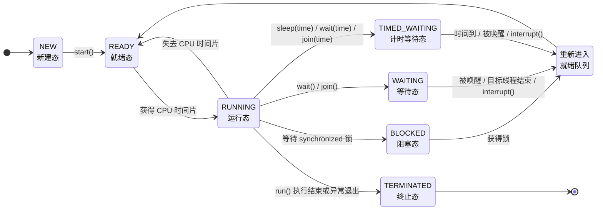

## 多线程概述

多线程是 Java 中非常重要的并发编程基础。它允许一个程序内部同时安排多个执行任务，从而提升程序响应能力、提高 CPU 利用率，并更好地处理网络请求、界面响应、文件读写、服务器并发访问等场景。

> 结论：多线程的核心作用不是简单地“让程序一定变快”，而是让程序具备同时处理多个任务的能力，并在合适场景下提升整体效率和响应速度。

### 程序、进程和线程

理解多线程之前，需要先区分程序、进程和线程三个概念。

| 概念 | 含义                             | 特点                                           |
| ---- | -------------------------------- | ---------------------------------------------- |
| 程序 | 存放在磁盘上的静态代码文件       | 尚未运行，例如一个 `.exe` 文件或一个 Java 程序 |
| 进程 | 程序被加载到内存后正在运行的实例 | 拥有独立的内存空间和系统资源                   |
| 线程 | 进程内部的一个执行单元           | 负责执行具体任务，一个进程至少有一个线程       |

程序是静态的，进程是动态的。一个程序启动后，就会在操作系统中形成一个进程；一个进程中至少包含一个线程，也可以包含多个线程。

例如，打开浏览器是启动了一个浏览器进程；浏览器中同时进行页面渲染、网络加载、文件下载等任务时，内部可能会使用多个线程分别处理不同工作。

> 结论：程序是“未运行的代码”，进程是“运行中的程序”，线程是“进程中的执行单元”。

#### 进程的作用

现代操作系统支持多进程运行，因此计算机可以在同一时间段内执行多个任务。例如，一边使用 IDEA 编写代码，一边听音乐，一边使用浏览器查资料。

多进程的意义主要体现在两个方面：

1. **提高计算机资源利用率**：不同程序可以同时运行，操作系统负责分配 CPU、内存等资源。
2. **实现任务隔离**：每个进程通常拥有独立的内存空间，一个进程出现问题，一般不会直接破坏另一个进程的内存数据。

进程是操作系统进行资源分配的基本单位，而线程是程序执行任务的基本单位。

> 注意：一个进程可以包含多个线程，多线程程序本质上是在同一个进程内部安排多个执行任务。

#### 线程的作用

线程是进程中的执行单元，一个进程至少有一个线程。如果一个进程内部只有一个线程，那么多个任务只能按照顺序依次执行；如果一个进程内部有多个线程，那么多个任务就可以在同一时间段内交替或同时执行。

例如，图形界面程序通常会有一个主线程负责界面显示。如果用户点击按钮后执行一个耗时操作，并且该耗时操作也放在主线程中执行，那么界面可能会卡住。更合理的做法是：主线程继续负责界面响应，耗时任务交给新的线程执行，任务完成后再更新界面。

> 结论：线程可以让一个程序内部同时处理多个任务，常用于提升程序响应能力和资源利用率。

#### 单线程程序和多线程程序

单线程程序中，任务只能一个接一个执行。当前任务没有完成时，后面的任务无法开始。

```text
任务A → 任务B → 任务C
```

多线程程序中，多个任务可以在同一时间段内执行。不同线程分别负责不同任务。

```text
线程1：任务A
线程2：任务B
线程3：任务C
```

单线程结构简单，执行顺序清晰，不容易出现线程安全问题；多线程可以提升响应能力和吞吐量，但也会带来线程调度、共享数据安全、死锁等复杂问题。

> 易错点：多线程并不一定让所有程序都更快。如果线程创建过多、任务划分不合理，反而可能因为线程切换和资源竞争导致程序变慢。

#### Java 程序的运行与主线程

运行 Java 程序时，`java` 命令会启动 Java 虚拟机（Java Virtual Machine，JVM）。JVM 启动后，本质上就是启动了一个进程。

在 Java 程序中，执行 `main()` 方法的线程称为**主线程**。例如：

```java
public class MainThreadDemo {
    public static void main(String[] args) {
        System.out.println(Thread.currentThread().getName());
    }
}
```

通常输出结果为：

```text
main
```

这说明 `main()` 方法中的代码由名为 `main` 的主线程执行。

不过，JVM 启动后通常不只有主线程。为了支持垃圾回收、运行时管理等工作，JVM 内部还会启动一些后台线程。因此，从整体运行机制看，JVM 本身通常是多线程运行的。

> 结论：`main()` 方法由主线程执行，但 Java 程序运行时通常还存在 JVM 内部的其他后台线程。

#### 线程调度

线程调度指操作系统决定哪个线程获得 CPU 执行权的过程。如果多个线程竞争同一个 CPU 核心，同一时刻只能有一个线程真正执行，其他线程需要等待调度。

常见线程调度策略有两类：

| 调度策略   | 含义                                   |
| ---------- | -------------------------------------- |
| 分时调度   | 所有线程轮流使用 CPU，平均分配执行时间 |
| 抢占式调度 | 优先级较高的线程更容易获得 CPU 执行权  |

Java 线程调度采用的是**抢占式调度**。线程优先级较高时，获得 CPU 时间片的概率通常更大；但这不代表高优先级线程一定先执行，也不代表低优先级线程一定不能执行。

> 注意：线程执行顺序通常具有不确定性，不能依赖“代码写在前面，线程就一定先执行”这种假设。

### 并发与并行

并发和并行是多线程中非常容易混淆的两个概念。

| 概念 | 关键词     | 含义                           |
| ---- | ---------- | ------------------------------ |
| 并发 | 同一时间段 | 多个任务在同一时间段内交替推进 |
| 并行 | 同一时刻   | 多个任务在同一时刻真正同时执行 |

并发强调的是任务处理能力，并不要求多个任务在同一瞬间同时运行。并行强调的是任务真正同时执行，通常需要多核 CPU 支持。

#### 并发

并发（Concurrency）指多个任务在同一时间段内交替执行。对于单核 CPU 来说，同一时刻只能执行一个线程，但 CPU 可以在多个线程之间快速切换，使人从宏观上感觉多个任务好像在同时执行。

例如，单核 CPU 上有三个线程 A、B、C，它们的执行过程可能是：

```text
A执行一小段 → B执行一小段 → C执行一小段 → A继续执行 → ...
```

从微观角度看，同一时刻只有一个线程执行；从宏观角度看，多个线程都在推进，因此表现为并发。

> 结论：并发是“看起来同时执行”，本质上可能是多个任务快速交替执行。

#### 并行

并行（Parallelism）指多个任务在同一时刻真正同时执行。并行依赖硬件资源，通常要求 CPU 具有多个核心。

例如，在四核 CPU 上，四个线程可能被分配到四个不同核心上同时运行：

```text
核心1：线程A
核心2：线程B
核心3：线程C
核心4：线程D
```

此时，多个线程在微观和宏观上都是真正同时执行的。

> 结论：并行是“真正同时执行”，通常依赖多核 CPU 或多 CPU 硬件环境。

#### 多线程程序一定是并行的吗

多线程程序不一定是并行的，它取决于底层硬件资源和操作系统调度。

1. **单核 CPU 上**：多线程只能实现并发，多个线程轮流使用同一个 CPU 核心。
2. **多核 CPU 上**：多线程既可能并发，也可能并行。不同线程如果被分配到不同 CPU 核心上，就可以真正并行执行；如果线程数量多于核心数量，仍然需要在线程之间进行调度和切换。

> 结论：多线程提供的是并发编程能力，是否真正并行执行取决于 CPU 核心数和操作系统调度。

#### 为什么要理解并发和并行

理解并发和并行，有助于合理设计线程数量和优化程序性能。如果不了解二者区别，可能会误以为“线程越多，程序越快”。

例如，一个计算密集型程序运行在 4 核 CPU 上，如果创建 100 个线程执行计算任务，并不意味着可以有 100 个任务同时并行。由于 CPU 核心数有限，同一时刻最多只有少量线程真正执行，大量线程只能等待 CPU 时间片。

线程过多还会带来额外成本：

1. **上下文切换成本**：操作系统需要频繁保存和恢复线程状态。
2. **内存占用增加**：每个线程都需要一定的栈空间和运行时资源。
3. **调度压力变大**：线程越多，操作系统调度越复杂。

因此，多线程优化的关键不是盲目增加线程数量，而是根据任务类型和硬件资源合理设置线程数量。

> 易错点：线程数不是越多越好。对于计算密集型任务，线程数通常应接近 CPU 核心数，而不是远远超过核心数。

### CPU 密集型任务与 IO 密集型任务

多线程程序的线程数量通常与任务类型有关。常见任务可以大致分为 CPU 密集型和 IO 密集型。

#### CPU 密集型任务

CPU 密集型任务主要消耗 CPU 计算能力，例如：

1. 大量数学计算；
2. 图片处理；
3. 视频编码；
4. 加密解密；
5. 大规模数据计算。

这类任务的瓶颈主要在 CPU。由于真正并行执行能力受限于 CPU 核心数，因此线程数量通常不宜远大于 CPU 核心数。

```java
int processors = Runtime.getRuntime().availableProcessors();
System.out.println("CPU核心数：" + processors);
```

对于 CPU 密集型任务，线程数通常可以设置为接近 CPU 核心数。

> 结论：CPU 密集型任务依赖 CPU 计算能力，线程数过多会增加切换成本，通常不应远超核心数。

#### IO 密集型任务

IO 密集型任务主要耗时在等待外部资源，例如：

1. 文件读写；
2. 网络请求；
3. 数据库访问；
4. 远程接口调用；
5. 用户输入等待。

这类任务中，线程经常处于等待状态。等待 IO 时，CPU 可以切换去执行其他线程，因此 IO 密集型任务可以使用相对更多的线程，以提高 CPU 利用率。

> 结论：IO 密集型任务大量时间用于等待外部资源，线程数可以适当多于 CPU 核心数。

### 多线程的主要应用场景

多线程常见应用场景包括：

| 场景         | 多线程作用                               |
| ------------ | ---------------------------------------- |
| 图形界面程序 | 主线程保持界面响应，工作线程处理耗时任务 |
| Web 服务器   | 同时处理多个客户端请求                   |
| 文件下载     | 多线程分段下载，提高下载效率             |
| 日志系统     | 异步写日志，减少对主业务流程的阻塞       |
| 网络通信     | 多线程处理多个连接                       |
| 定时任务     | 后台线程周期性执行任务                   |
| IO 操作      | 等待 IO 时让 CPU 处理其他任务            |

> 结论：多线程尤其适合“多个任务需要同时推进”或“某些任务会阻塞等待”的场景。

### 多线程的优点和代价

多线程的优点主要包括：

1. **提高程序响应速度**：耗时任务可以放到后台线程执行，避免主流程卡住。
2. **提高 CPU 利用率**：当某些线程等待 IO 时，CPU 可以调度其他线程执行。
3. **提升系统吞吐量**：服务器可以同时处理多个请求。
4. **便于任务拆分**：不同线程可以分别负责不同任务。

多线程也会带来额外代价：

1. **线程切换有成本**；
2. **线程创建和销毁有成本**；
3. **共享数据可能出现线程安全问题**；
4. **程序执行顺序更难预测**；
5. **可能出现死锁、活锁等问题**。

> 结论：多线程是提升并发能力的重要工具，但会增加程序复杂度。使用多线程时，应同时关注性能收益和并发风险。

## 线程的创建

Java 中创建线程的核心思路是：先定义线程要执行的任务，再启动线程，让该任务在新的执行路径中运行。线程任务通常写在 `run()` 方法中，但真正启动线程必须调用 `start()` 方法。

Java 中常见的线程创建方式主要有两种：

1. 继承 `Thread` 类；
2. 实现 `Runnable` 接口。

> 结论：`run()` 用来定义线程任务，`start()` 用来启动新线程。只写 `run()` 不代表创建了新线程，只有调用 `start()` 才会进入多线程执行。

### Thread 类

`Thread` 类位于 `java.lang` 包中，用于描述 Java 中的线程对象。一个 `Thread` 对象可以代表一条执行线程，线程启动后会执行对应的任务代码。

`Thread` 类常用构造方法如下：

| 构造方法                               | 说明                                     |
| -------------------------------------- | ---------------------------------------- |
| `Thread()`                             | 创建一个线程对象，线程名称由系统默认生成 |
| `Thread(String name)`                  | 创建线程对象，并指定线程名称             |
| `Thread(Runnable target)`              | 创建线程对象，并指定线程任务             |
| `Thread(Runnable target, String name)` | 创建线程对象，并指定线程任务和线程名称   |

`Thread` 类常用方法如下：

| 方法                             | 说明                           |
| -------------------------------- | ------------------------------ |
| `void start()`                   | 启动线程，让线程进入可运行状态 |
| `void run()`                     | 线程要执行的任务代码           |
| `String getName()`               | 获取线程名称                   |
| `void setName(String name)`      | 设置线程名称                   |
| `static Thread currentThread()`  | 获取当前正在执行的线程对象     |
| `static void sleep(long millis)` | 让当前线程休眠指定毫秒数       |
| `void join()`                    | 等待该线程执行结束             |
| `static void yield()`            | 当前线程让出本次 CPU 执行机会  |
| `boolean isAlive()`              | 判断线程是否还处于活动状态     |

> 注意：`Thread.currentThread()` 获取的是“当前正在执行这行代码的线程对象”，不是某个随便创建出来的线程对象。

### 创建线程方式一：继承 Thread 类

继承 `Thread` 类创建线程的步骤如下：

1. 定义一个类继承 `Thread`；
2. 重写 `run()` 方法，把线程任务写入 `run()`；
3. 创建自定义线程类对象；
4. 调用线程对象的 `start()` 方法启动线程。

示例：

```java
public class ThreadExtendsDemo {
    public static void main(String[] args) {
        DownloadThread thread1 = new DownloadThread("下载线程A");
        DownloadThread thread2 = new DownloadThread("下载线程B");

        thread1.start();
        thread2.start();

        for (int i = 1; i <= 5; i++) {
            System.out.println("主线程正在处理界面刷新：" + i);
        }
    }
}

class DownloadThread extends Thread {
    public DownloadThread(String name) {
        super(name);
    }

    @Override
    public void run() {
        for (int i = 1; i <= 5; i++) {
            System.out.println(getName() + " 正在下载第 " + i + " 个文件片段");
        }
    }
}
```

这段代码中，`DownloadThread` 继承了 `Thread`，因此它本身就是线程类。`run()` 方法中定义的是下载任务，`start()` 方法负责启动线程。

程序运行后，主线程和两个下载线程会交替执行。具体输出顺序不固定，因为线程调度由操作系统和 JVM 共同决定。

> 易错点：多线程程序的输出顺序通常不可预测。不能根据某一次运行结果推断线程永远按这个顺序执行。

#### start() 和 run() 的区别

`start()` 和 `run()` 是学习线程创建时最容易混淆的两个方法。

| 调用方式         | 是否启动新线程 | 执行特点                         |
| ---------------- | -------------- | -------------------------------- |
| `thread.start()` | 是             | 新线程启动，由新线程执行 `run()` |
| `thread.run()`   | 否             | 普通方法调用，仍由当前线程执行   |

示例：

```java
public class StartRunDemo {
    public static void main(String[] args) {
        Thread thread = new Thread(() -> {
            System.out.println("任务执行线程：" + Thread.currentThread().getName());
        });

        thread.run();
        System.out.println("main方法执行线程：" + Thread.currentThread().getName());
    }
}
```

如果调用的是 `run()`，输出中的任务仍然由 `main` 线程执行。这说明 `run()` 本身只是一个普通方法，并不会创建新的线程执行路径。

改为：

```java
thread.start();
```

线程任务才会交给新线程执行。

> 结论：`run()` 是任务入口，`start()` 是线程启动入口。实际开发中启动线程必须调用 `start()`，而不是直接调用 `run()`。

#### 为什么不能直接创建 Thread 对象后 start()

语法上可以直接创建 `Thread` 对象并调用 `start()`：

```java
Thread thread = new Thread();
thread.start();
```

这段代码不会报错，但没有实际任务效果。原因是 `Thread` 类本身的 `run()` 方法没有定义具体业务任务。如果没有重写 `run()`，也没有传入 `Runnable` 任务对象，新线程即使启动，也没有明确要执行的业务代码。

创建线程的目的，是建立一条新的执行路径，让某段任务代码和主线程同时推进。因此必须把任务写入 `run()` 方法，或者通过 `Runnable` 对象传入线程。

> 结论：线程对象必须绑定明确任务。没有任务的线程即使启动，也没有实际业务意义。

#### start() 方法只能调用一次

同一个线程对象的 `start()` 方法只能调用一次。线程一旦启动并执行完毕，就不能再次启动。

错误示例：

```java
Thread thread = new Thread(() -> {
    System.out.println("线程任务执行");
});

thread.start();
thread.start(); // 错误：同一个线程对象不能重复启动
```

第二次调用 `start()` 会抛出：

```text
java.lang.IllegalThreadStateException
```

如果需要再次执行同样的任务，应重新创建一个新的线程对象：

```java
Thread thread1 = new Thread(task);
Thread thread2 = new Thread(task);

thread1.start();
thread2.start();
```

> 易错点：线程对象不是“可重复启动的任务按钮”。一个 `Thread` 对象对应一次线程生命周期。

### 线程执行时的内存特点

线程启动后，每个线程都有自己独立的执行栈，用于方法调用、局部变量存储、方法压栈和弹栈。多个线程运行在同一个进程中，因此它们共享同一个进程的堆内存和方法区。

线程之间的内存关系可以概括为：

| 内存区域   | 多线程之间是否共享 | 说明                                     |
| ---------- | ------------------ | ---------------------------------------- |
| 虚拟机栈   | 不共享             | 每个线程独立拥有，用于方法调用和局部变量 |
| 程序计数器 | 不共享             | 每个线程记录自己执行到的位置             |
| 本地方法栈 | 不共享             | 每个线程执行本地方法时使用               |
| 堆内存     | 共享               | 对象实例存放在堆中，可被多个线程访问     |
| 方法区     | 共享               | 类信息、静态变量等可被多个线程访问       |

因此：

1. **局部变量通常不共享**：局部变量位于线程自己的栈帧中，每个线程调用方法时都有独立副本。
2. **实例变量是否共享取决于对象是否共享**：如果多个线程访问同一个对象，那么这个对象的实例变量会被多个线程共享。
3. **静态变量在同一个 JVM 进程中共享**：静态变量属于类，类信息在方法区中，因此多个线程可以访问同一份静态变量。

> 结论：线程栈独立，堆内存共享。多线程安全问题通常发生在多个线程共同访问同一个堆中对象或同一个静态变量时。

### 方法调用不会产生新线程

普通方法之间的调用不会产生新线程。例如：

```java
public class MethodCallDemo {
    public static void main(String[] args) {
        System.out.println("main begin");
        methodA();
        System.out.println("main end");
    }

    public static void methodA() {
        System.out.println("methodA begin");
        methodB();
        System.out.println("methodA end");
    }

    public static void methodB() {
        System.out.println("methodB execute");
    }
}
```

这段代码只有主线程在执行。`methodA()` 和 `methodB()` 只是普通方法调用，它们会在主线程的栈中依次压栈和弹栈，不会自动创建新线程。

要创建新线程，必须显式创建 `Thread` 对象并调用 `start()`。

> 易错点：方法调用层级变多，不等于线程变多。线程数量取决于是否启动了新的线程执行路径。

### 获取当前线程对象和线程名称

`Thread.currentThread()` 可以获取当前正在执行代码的线程对象，`getName()` 可以获取线程名称。

```java
public class CurrentThreadDemo {
    public static void main(String[] args) {
        System.out.println("main方法所在线程：" + Thread.currentThread().getName());

        Thread thread = new Thread(() -> {
            System.out.println("run方法所在线程：" + Thread.currentThread().getName());
        });

        thread.start();
    }
}
```

通常情况下，主线程名称为：

```text
main
```

自定义线程如果没有手动设置名称，默认名称通常类似：

```text
Thread-0
Thread-1
Thread-2
```

这些名称由 `Thread` 类在创建线程对象时自动生成。

> 结论：分析多线程程序时，经常使用 `Thread.currentThread().getName()` 判断当前代码由哪个线程执行。

#### 设置线程名称

设置线程名称有两种常见方式。

第一种是在构造方法中指定：

```java
Thread thread = new Thread(() -> {
    System.out.println(Thread.currentThread().getName());
}, "日志写入线程");

thread.start();
```

第二种是创建线程对象后调用 `setName()`：

```java
Thread thread = new Thread(() -> {
    System.out.println(Thread.currentThread().getName());
});

thread.setName("文件上传线程");
thread.start();
```

线程名称不会影响线程执行逻辑，但可以提高程序调试和日志分析的可读性。

> 注意：实际开发中应给重要线程设置有意义的名称，便于定位问题。

### 创建线程方式二：实现 Runnable 接口

实现 `Runnable` 接口创建线程的步骤如下：

1. 定义一个类实现 `Runnable` 接口；
2. 重写 `run()` 方法，把线程任务写入 `run()`；
3. 创建任务对象；
4. 创建 `Thread` 对象，并把任务对象传入构造方法；
5. 调用 `Thread` 对象的 `start()` 方法启动线程。

示例：

```java
public class RunnableDemo {
    public static void main(String[] args) {
        UploadTask task = new UploadTask();

        Thread thread1 = new Thread(task, "上传线程A");
        Thread thread2 = new Thread(task, "上传线程B");

        thread1.start();
        thread2.start();

        for (int i = 1; i <= 5; i++) {
            System.out.println("主线程处理其他任务：" + i);
        }
    }
}

class UploadTask implements Runnable {
    @Override
    public void run() {
        for (int i = 1; i <= 5; i++) {
            System.out.println(Thread.currentThread().getName() + " 上传第 " + i + " 个文件块");
        }
    }
}
```

这段代码中，`UploadTask` 不是线程对象，而是线程任务对象。真正的线程对象是：

```java
Thread thread1 = new Thread(task, "上传线程A");
Thread thread2 = new Thread(task, "上传线程B");
```

`Thread` 负责创建和启动线程，`Runnable` 负责提供线程要执行的任务。

> 结论：实现 `Runnable` 接口时，任务和线程被拆开了。`Runnable` 表示任务，`Thread` 表示线程。

#### Runnable 接口的本质

`Runnable` 接口非常简单，核心只有一个抽象方法：

```java
public interface Runnable {
    void run();
}
```

它表示一个“可以被线程执行的任务”。`Thread` 类的构造方法可以接收 `Runnable` 对象：

```java
Thread thread = new Thread(runnable);
```

线程启动后，会执行这个 `Runnable` 对象的 `run()` 方法。

这种设计把“线程”和“任务”分开：

| 角色       | 作用                       |
| ---------- | -------------------------- |
| `Runnable` | 描述要执行的任务           |
| `Thread`   | 负责启动线程并调度任务执行 |

> 结论：`Runnable` 不是线程，而是线程要执行的任务。

#### Runnable 方式的优势

实际开发中，更推荐使用实现 `Runnable` 接口的方式创建线程，原因主要有三个。

##### 避免单继承限制

Java 只支持单继承。如果一个类已经继承了某个父类，就不能再继承 `Thread`。

```java
class UploadTask extends BaseTask implements Runnable {
    @Override
    public void run() {
        System.out.println("执行上传任务");
    }
}
```

通过实现 `Runnable`，类仍然可以继承其他父类。

##### 任务和线程解耦

继承 `Thread` 时，自定义类既是任务，又是线程；实现 `Runnable` 时，任务和线程被拆开。

```java
Runnable task = new UploadTask();

Thread thread1 = new Thread(task);
Thread thread2 = new Thread(task);
```

这种写法更符合职责分离：任务对象只负责业务逻辑，线程对象只负责启动和执行。

##### 更方便共享数据

多个线程可以共享同一个 `Runnable` 任务对象，从而共享任务对象中的成员变量。

```java
class TicketTask implements Runnable {
    private int tickets = 10;

    @Override
    public void run() {
        while (tickets > 0) {
            System.out.println(Thread.currentThread().getName() + " 卖出第 " + tickets + " 张票");
            tickets--;
        }
    }
}
```

如果多个线程使用同一个 `TicketTask` 对象，它们访问的是同一份 `tickets` 数据。

> 注意：共享数据虽然方便，但也会带来线程安全问题。后续学习同步机制时，需要重点解决多个线程同时修改共享数据的问题。

### Thread 方式与 Runnable 方式对比

| 对比项             | 继承 `Thread`                   | 实现 `Runnable`                     |
| ------------------ | ------------------------------- | ----------------------------------- |
| 线程任务位置       | 写在 `Thread` 子类的 `run()` 中 | 写在 `Runnable` 实现类的 `run()` 中 |
| 是否受单继承限制   | 受限制                          | 不受影响                            |
| 任务和线程是否分离 | 不分离                          | 分离                                |
| 数据共享是否方便   | 相对不方便                      | 较方便                              |
| 实际开发推荐程度   | 较少直接使用                    | 更常用                              |

> 结论：继承 `Thread` 更容易理解线程创建过程；实现 `Runnable` 更符合实际开发中的设计习惯。

### 使用匿名内部类创建线程

如果线程任务比较简单，也可以使用匿名内部类简化代码。

```java
public class AnonymousThreadDemo {
    public static void main(String[] args) {
        Thread thread = new Thread(new Runnable() {
            @Override
            public void run() {
                System.out.println("匿名内部类任务：" + Thread.currentThread().getName());
            }
        });

        thread.start();
    }
}
```

这种写法不需要单独创建一个 `Runnable` 实现类，适合任务逻辑较短的场景。

### 使用 Lambda 表达式创建线程

由于 `Runnable` 是函数式接口，因此可以使用 Lambda 表达式进一步简化代码。

```java
public class LambdaThreadDemo {
    public static void main(String[] args) {
        Thread thread = new Thread(() -> {
            System.out.println("Lambda任务：" + Thread.currentThread().getName());
        }, "Lambda线程");

        thread.start();
    }
}
```

这段代码等价于传入一个 `Runnable` 实现类对象，只是写法更加简洁。

> 补充：Lambda 表达式只是简化 `Runnable` 实现类的写法，并没有改变线程创建和启动的本质。

### 线程创建后的执行特点

线程启动后，程序中会出现多条执行路径。主线程继续向下执行，新线程执行自己的 `run()` 方法。

示例：

```java
public class ThreadOrderDemo {
    public static void main(String[] args) {
        Thread thread = new Thread(() -> {
            for (int i = 1; i <= 5; i++) {
                System.out.println("子线程：" + i);
            }
        });

        thread.start();

        for (int i = 1; i <= 5; i++) {
            System.out.println("主线程：" + i);
        }
    }
}
```

输出结果可能是交替的，也可能某个线程连续输出多次。因为 `start()` 只表示线程进入可运行状态，并不代表它会立刻获得 CPU 执行权。

> 易错点：`start()` 的含义是“启动线程并等待调度”，不是“马上执行完 `run()`”。

#### 主线程结束后程序一定结束吗

主线程执行完毕后，JVM 不一定立即退出。如果还有其他非守护线程没有执行完，JVM 会继续运行，直到所有非守护线程结束。

例如：

```java
public class MainEndDemo {
    public static void main(String[] args) {
        Thread thread = new Thread(() -> {
            for (int i = 1; i <= 5; i++) {
                System.out.println("子线程继续执行：" + i);
            }
        });

        thread.start();

        System.out.println("main方法结束");
    }
}
```

即使 `main()` 方法先结束，只要子线程还没执行完，程序仍然可能继续运行。

> 结论：`main()` 方法结束不等于 JVM 一定立刻退出。JVM 是否退出取决于是否还有非守护线程在运行。

## 线程的生命周期和状态控制

线程的生命周期指一个线程从创建、启动、等待调度、执行任务，到最终结束的完整过程。线程不是一启动就一直执行，也不是调用 `start()` 后立刻执行完毕，而是在不同状态之间切换，由 JVM 和操作系统共同调度。

Java 中线程状态可以通过 `Thread.State` 表示，主要包括：`NEW`、`RUNNABLE`、`BLOCKED`、`WAITING`、`TIMED_WAITING` 和 `TERMINATED`。

> 结论：线程状态描述的是线程在某一时刻所处的执行阶段。理解线程状态，有助于分析多线程程序为什么等待、为什么卡住、为什么没有立刻执行。

### 线程生命周期图



该图展示的是 Java 线程状态之间的主要转换关系。需要注意的是，Java API 中的 `RUNNABLE` 状态同时包含“就绪”和“运行”两种情况：线程可能正在等待 CPU 调度，也可能正在 CPU 上执行。

> 注意：教材中常说的“就绪”和“运行”在 Java 的 `Thread.State` 中通常都归入 `RUNNABLE` 状态。

### 线程的六种状态

Java 中线程的六种状态如下：

| 状态            | 含义                                           | 常见进入方式                              |
| --------------- | ---------------------------------------------- | ----------------------------------------- |
| `NEW`           | 新建状态，线程对象已创建但尚未启动             | `new Thread()`                            |
| `RUNNABLE`      | 可运行状态，可能正在运行，也可能等待 CPU 调度  | `start()` 后、阻塞结束后                  |
| `BLOCKED`       | 阻塞状态，等待进入 `synchronized` 同步区域     | 等待对象监视器锁                          |
| `WAITING`       | 无限期等待状态，需要其他线程唤醒或目标线程结束 | `wait()`、`join()`                        |
| `TIMED_WAITING` | 限期等待状态，等待指定时间或提前被唤醒         | `sleep(time)`、`wait(time)`、`join(time)` |
| `TERMINATED`    | 终止状态，线程执行结束                         | `run()` 正常结束或异常退出                |

#### 新建状态：NEW

当使用 `new Thread()` 或其子类构造方法创建线程对象后，线程对象就处于 `NEW` 状态。

```java
Thread thread = new Thread();
```

此时只是创建了一个普通的 Java 对象，还没有启动新的执行路径。线程还没有进入调度队列，也不会执行 `run()` 方法。

只有调用 `start()` 方法后，线程才会从 `NEW` 状态进入 `RUNNABLE` 状态。

```java
thread.start();
```

> 结论：`NEW` 状态表示线程对象已创建，但线程还没有真正启动。

#### 可运行状态：RUNNABLE

调用 `start()` 方法后，线程进入 `RUNNABLE` 状态。

```java
Thread thread = new Thread(() -> {
    System.out.println("线程任务执行");
});

thread.start();
```

处于 `RUNNABLE` 状态的线程已经具备运行资格，但是否真正执行，取决于操作系统的线程调度。

Java 中的 `RUNNABLE` 状态包含两种常见情况：

1. **就绪**：线程已经可以运行，但还没有获得 CPU 时间片；
2. **运行**：线程已经获得 CPU 时间片，正在执行 `run()` 方法中的代码。

线程执行过程中，如果失去 CPU 时间片，它仍然可能处于 `RUNNABLE` 状态，只是暂时没有执行。

> 结论：`RUNNABLE` 不等于一定正在运行，它表示线程具备运行条件，可能正在运行，也可能等待 CPU 调度。

#### 阻塞状态：BLOCKED

`BLOCKED` 状态表示线程正在等待一个监视器锁（monitor lock），通常发生在进入 `synchronized` 同步方法或同步代码块时。

例如，线程 A 已经持有某个对象锁，线程 B 也想进入同一把锁保护的同步代码块，那么线程 B 会进入 `BLOCKED` 状态。

```java
synchronized (lock) {
    // 同一时刻只能有一个线程进入这里
}
```

当持有锁的线程释放锁后，处于 `BLOCKED` 状态的线程会重新竞争锁。竞争成功后，线程会回到 `RUNNABLE` 状态。

> 易错点：`BLOCKED` 特指等待 `synchronized` 锁，不是所有“暂停执行”的情况都叫 `BLOCKED`。例如 `sleep()` 进入的是 `TIMED_WAITING`，不是 `BLOCKED`。

#### 无限期等待状态：WAITING

`WAITING` 状态表示线程正在无限期等待另一个线程执行某个特定操作。如果没有外部唤醒或中断，它会一直等待下去。

常见进入方式包括：

| 方法            | 说明                                                         |
| --------------- | ------------------------------------------------------------ |
| `Object.wait()` | 当前线程释放对象锁，等待其他线程调用 `notify()` 或 `notifyAll()` |
| `Thread.join()` | 当前线程等待目标线程执行结束                                 |

例如：

```java
Thread thread = new Thread(() -> {
    System.out.println("子线程执行任务");
});

thread.start();
thread.join();
System.out.println("子线程结束后，主线程继续执行");
```

在主线程中调用 `thread.join()` 后，主线程会等待 `thread` 执行完毕，再继续向下执行。

> 结论：`WAITING` 是没有指定等待时间的等待状态，必须依赖其他线程的唤醒、目标线程结束或中断来退出等待。

#### 限期等待状态：TIMED_WAITING

`TIMED_WAITING` 状态表示线程正在等待一段指定时间。时间到达后，线程会自动回到 `RUNNABLE` 状态，等待重新获得 CPU 调度。

常见进入方式包括：

| 方法                        | 说明                                   |
| --------------------------- | -------------------------------------- |
| `Thread.sleep(long millis)` | 当前线程休眠指定毫秒数                 |
| `Object.wait(long timeout)` | 当前线程等待指定时间，也可能被提前唤醒 |
| `Thread.join(long millis)`  | 当前线程最多等待目标线程指定时间       |

例如：

```java
try {
    Thread.sleep(1000);
} catch (InterruptedException e) {
    e.printStackTrace();
}
```

这段代码会让当前正在执行的线程进入 `TIMED_WAITING` 状态约 1 秒。时间结束后，线程不会立即执行，而是先回到 `RUNNABLE` 状态，等待 CPU 调度。

> 注意：`Thread.sleep(1000)` 表示至少睡眠约 1 秒，不保证 1 秒后立刻运行。线程何时继续执行仍然取决于系统调度。

#### 终止状态：TERMINATED

当线程的 `run()` 方法正常执行完毕，线程就进入 `TERMINATED` 状态。

```java
Thread thread = new Thread(() -> {
    System.out.println("任务执行完毕");
});

thread.start();
```

如果 `run()` 方法中出现未捕获异常，线程也会异常结束并进入 `TERMINATED` 状态。

> 注意：`interrupt()` 不会直接杀死线程。它只是给线程设置中断标记，或者让处于 `sleep()`、`wait()`、`join()` 等等待状态的线程抛出 `InterruptedException`。线程是否结束，取决于代码如何处理中断。

已经终止的线程对象不能再次调用 `start()`。如果重复启动，会抛出 `IllegalThreadStateException`。

### 线程睡眠：sleep()

`Thread.sleep(long millis)` 用于让当前线程暂停执行指定时间，并进入 `TIMED_WAITING` 状态。

```java
public class SleepDemo {
    public static void main(String[] args) {
        for (int i = 1; i <= 5; i++) {
            System.out.println("第 " + i + " 次输出");

            try {
                Thread.sleep(1000);
            } catch (InterruptedException e) {
                e.printStackTrace();
            }
        }
    }
}
```

`sleep()` 是静态方法，作用对象始终是**当前正在执行的线程**，而不是某个线程对象本身。

错误理解示例：

```java
Thread thread = new Thread();
thread.sleep(1000);
```

虽然语法允许通过对象调用静态方法，但实际效果仍然等价于：

```java
Thread.sleep(1000);
```

也就是说，谁执行到这行代码，谁休眠。

> 易错点：`t.sleep(1000)` 并不是让 `t` 线程休眠，而是让当前执行这行代码的线程休眠。因此应统一写成 `Thread.sleep(1000)`，避免误解。

#### TimeUnit 的休眠写法

在现代 Java 代码中，也可以使用 `TimeUnit` 提高可读性。

```java
import java.util.concurrent.TimeUnit;

public class TimeUnitDemo {
    public static void main(String[] args) {
        try {
            TimeUnit.SECONDS.sleep(1);
            TimeUnit.MILLISECONDS.sleep(500);
            TimeUnit.MINUTES.sleep(1);
        } catch (InterruptedException e) {
            e.printStackTrace();
        }
    }
}
```

与 `Thread.sleep()` 相比，`TimeUnit` 的优势是单位更清晰：

```java
Thread.sleep(1000);
TimeUnit.SECONDS.sleep(1);
```

两者都表示休眠 1 秒，但第二种写法可读性更强。

> 补充：`TimeUnit` 不改变线程休眠的本质，只是提供了更清晰的时间单位表达。

#### sleep() 的注意事项

`sleep()` 使用时需要注意以下几点：

1. `sleep()` 是静态方法，应使用 `Thread.sleep()` 调用；
2. `sleep()` 让当前线程进入 `TIMED_WAITING` 状态；
3. `sleep()` 时间结束后，线程进入 `RUNNABLE` 状态，而不是立刻运行；
4. `sleep()` 会抛出 `InterruptedException`，必须捕获或声明抛出；
5. `sleep()` 不会释放当前线程已经持有的 `synchronized` 锁。

> 结论：`sleep()` 只负责让当前线程暂停一段时间，不负责释放锁，也不保证时间到后立即执行。

### 线程优先级

每个线程都有优先级。优先级较高的线程，理论上获得 CPU 时间片的概率更大；优先级较低的线程，获得 CPU 时间片的概率相对较小。

Java 中线程优先级范围是 `1` 到 `10`：

| 常量                   | 数值 | 含义       |
| ---------------------- | ---- | ---------- |
| `Thread.MIN_PRIORITY`  | `1`  | 最低优先级 |
| `Thread.NORM_PRIORITY` | `5`  | 默认优先级 |
| `Thread.MAX_PRIORITY`  | `10` | 最高优先级 |

设置和获取线程优先级的方法如下：

```java
thread.setPriority(Thread.MAX_PRIORITY);
int priority = thread.getPriority();
```

示例：

```java
public class PriorityDemo {
    public static void main(String[] args) {
        Thread low = new Thread(new PrintTask(), "低优先级线程");
        Thread high = new Thread(new PrintTask(), "高优先级线程");

        low.setPriority(Thread.MIN_PRIORITY);
        high.setPriority(Thread.MAX_PRIORITY);

        low.start();
        high.start();
    }
}

class PrintTask implements Runnable {
    @Override
    public void run() {
        for (int i = 1; i <= 100; i++) {
            System.out.println(Thread.currentThread().getName() + "：" + i);
        }
    }
}
```

线程优先级只能影响线程获得 CPU 的概率，不能保证线程执行顺序。

> 易错点：优先级高不等于一定先执行完，优先级低也不等于一定后执行。线程调度仍然具有不确定性。

### 线程让步：yield()

`Thread.yield()` 用于让当前正在运行的线程主动让出本次 CPU 执行机会，使其重新回到 `RUNNABLE` 状态。

```java
public class YieldDemo {
    public static void main(String[] args) {
        Runnable task = () -> {
            for (int i = 1; i <= 100; i++) {
                System.out.println(Thread.currentThread().getName() + "：" + i);

                if (i % 10 == 0) {
                    Thread.yield();
                }
            }
        };

        new Thread(task, "线程A").start();
        new Thread(task, "线程B").start();
    }
}
```

调用 `yield()` 后，当前线程只是让出 CPU 机会，并不会进入阻塞状态。它仍然处于 `RUNNABLE` 状态，可能很快又被调度执行。

> 结论：`yield()` 是一种“提示式让步”，不是强制暂停。它不能保证其他线程一定会立刻执行。

#### sleep() 和 yield() 的区别

| 对比项               | `sleep()`                   | `yield()`       |
| -------------------- | --------------------------- | --------------- |
| 方法类型             | 静态方法                    | 静态方法        |
| 作用对象             | 当前线程                    | 当前线程        |
| 状态变化             | 进入 `TIMED_WAITING`        | 回到 `RUNNABLE` |
| 是否指定时间         | 必须指定等待时间            | 不指定时间      |
| 是否一定暂停一段时间 | 是                          | 否              |
| 是否抛出检查异常     | 抛出 `InterruptedException` | 不抛出检查异常  |
| 可控性               | 较强                        | 较弱            |

> 结论：`sleep()` 是限时等待，`yield()` 是主动让步。实际开发中，不应依赖 `yield()` 精确控制线程执行顺序。

### 线程合并：join()

`join()` 是 `Thread` 类的实例方法，用于让当前线程等待目标线程执行结束。

例如，在主线程中调用：

```java
thread.join();
```

表示主线程等待 `thread` 线程执行完毕后，才能继续执行后续代码。

示例：

```java
public class JoinDemo {
    public static void main(String[] args) {
        Thread downloadThread = new Thread(() -> {
            for (int i = 1; i <= 5; i++) {
                System.out.println("下载线程执行：" + i);
            }
        });

        downloadThread.start();

        try {
            downloadThread.join();
        } catch (InterruptedException e) {
            e.printStackTrace();
        }

        System.out.println("下载完成，主线程继续处理文件");
    }
}
```

执行逻辑如下：

1. 主线程启动 `downloadThread`；
2. 主线程执行到 `downloadThread.join()`；
3. 主线程进入等待状态；
4. `downloadThread` 执行完毕；
5. 主线程恢复执行。

> 结论：谁调用 `join()` 所在的代码，谁等待；等待的是 `join()` 前面的目标线程。

#### join(long millis)

`join()` 也可以指定最长等待时间：

```java
thread.join(3000);
```

这表示当前线程最多等待 `thread` 执行 3 秒。如果 `thread` 在 3 秒内执行完毕，当前线程会提前恢复；如果 3 秒到达时 `thread` 还没有结束，当前线程也会继续向下执行。

```java
public class JoinTimeDemo {
    public static void main(String[] args) {
        Thread task = new Thread(() -> {
            for (int i = 1; i <= 10; i++) {
                System.out.println("子线程：" + i);

                try {
                    Thread.sleep(1000);
                } catch (InterruptedException e) {
                    e.printStackTrace();
                }
            }
        });

        task.start();

        try {
            task.join(3000);
        } catch (InterruptedException e) {
            e.printStackTrace();
        }

        System.out.println("主线程最多等待3秒后继续执行");
    }
}
```

> 结论：`join()` 是无限等待目标线程结束，`join(long millis)` 是最多等待指定时间。

### 守护线程

Java 中线程可以分为两类：

1. **用户线程**；
2. **守护线程**。

用户线程是程序中的主要工作线程。只要还有用户线程没有结束，JVM 通常不会退出。

守护线程通常用于执行后台辅助任务，例如垃圾回收、后台监控、自动保存等。当所有用户线程都结束后，即使守护线程还在运行，JVM 也会退出。

设置守护线程的方法是：

```java
thread.setDaemon(true);
```

示例：

```java
public class DaemonDemo {
    public static void main(String[] args) {
        Thread daemon = new Thread(() -> {
            int count = 1;

            while (true) {
                System.out.println("守护线程执行后台任务：" + count++);

                try {
                    Thread.sleep(1000);
                } catch (InterruptedException e) {
                    e.printStackTrace();
                }
            }
        }, "后台监控线程");

        daemon.setDaemon(true);
        daemon.start();

        for (int i = 1; i <= 5; i++) {
            System.out.println("用户线程执行主要任务：" + i);

            try {
                Thread.sleep(1000);
            } catch (InterruptedException e) {
                e.printStackTrace();
            }
        }

        System.out.println("用户线程结束，JVM 即将退出");
    }
}
```

当主线程执行结束后，如果程序中只剩守护线程，JVM 会退出，守护线程不会保证执行完毕。

> 注意：`setDaemon(true)` 必须在线程启动之前调用。如果在线程启动之后调用，会抛出 `IllegalThreadStateException`。

#### 守护线程的适用场景

守护线程适合处理后台辅助任务，例如：

1. 垃圾回收；
2. 后台日志刷新；
3. 自动保存；
4. 定时监控；
5. 心跳检测；
6. 后台资源清理。

这些任务通常依附于主业务线程存在。当主业务线程全部结束后，后台辅助任务也没有继续运行的必要。

> 结论：守护线程适合做“辅助性、后台性、非核心结果性”的任务，不适合处理必须完整执行的重要业务。

### 不推荐使用的线程控制方法

早期 Java 中提供过一些直接控制线程的方法，例如：

| 方法        | 问题                                        |
| ----------- | ------------------------------------------- |
| `stop()`    | 强制终止线程，可能破坏数据一致性，已过时    |
| `suspend()` | 暂停线程但不释放锁，容易导致死锁，已过时    |
| `resume()`  | 与 `suspend()` 配套使用，设计不安全，已过时 |

现代 Java 开发中，不应再使用这些方法。线程终止通常应通过标记变量、`interrupt()`、线程池关闭机制等方式安全控制。

> 易错点：不要把 `interrupt()` 理解为“强制杀死线程”。它更像是一种协作式中断信号，线程是否结束取决于代码是否响应这个信号。

## 线程同步

多线程程序中，多个线程运行在同一个进程内，它们拥有各自独立的执行栈，但会共享同一个堆内存中的对象。当多个线程同时访问同一份可变数据，并且至少有一个线程会修改这份数据时，就可能出现线程安全问题。

线程同步的核心目标是：**保证同一时刻只有一个线程能够执行访问共享数据的关键代码**，从而避免数据被并发修改时出现不一致结果。

> 结论：线程同步不是为了让程序“单线程化”，而是为了保护共享数据在关键操作过程中的一致性。

### 线程安全问题的产生

线程安全问题通常满足三个条件：

1. 存在多个线程并发执行；
2. 多个线程访问同一份共享数据；
3. 至少有一个线程会修改这份共享数据。

以银行账户取款为例，账户余额为 `5000`，两个线程都要取款 `3000`。如果两个线程几乎同时执行“判断余额是否足够”的操作，都可能看到余额仍然是 `5000`，于是都认为可以取款。最终两个线程都完成扣款，账户余额就可能变成负数。

问题的根源在于：**判断余额、计算余额、修改余额本应是一个不可分割的整体操作，但在线程切换时被拆开执行了。**

```java
class Account {
    private double balance = 5000;

    public double getBalance() {
        return balance;
    }

    public void withdraw(double amount) {
        balance -= amount;
    }
}

class WithdrawTask implements Runnable {
    private final Account account;

    public WithdrawTask(Account account) {
        this.account = account;
    }

    @Override
    public void run() {
        if (account.getBalance() >= 3000) {
            try {
                // 模拟网络、数据库或业务处理延迟，增加线程切换机会
                Thread.sleep(1);
            } catch (InterruptedException e) {
                e.printStackTrace();
            }

            account.withdraw(3000);
            System.out.println(Thread.currentThread().getName()
                    + " 取款成功，余额：" + account.getBalance());
        } else {
            System.out.println(Thread.currentThread().getName()
                    + " 取款失败，余额：" + account.getBalance());
        }
    }
}
```

这类问题又称为**竞态条件**（race condition）。程序结果取决于多个线程抢占 CPU 的时机，因此结果不稳定、难复现、难排查。

> 易错点：线程安全问题不一定每次运行都会出现。只要代码存在并发访问共享可变数据的风险，就应该按照线程安全问题处理。

### 临界区

在多线程程序中，访问共享数据并可能引发线程安全问题的代码区域，称为**临界区**。

银行取款案例中的临界区包括：

1. 判断余额是否足够；
2. 计算扣款后的余额；
3. 修改账户余额；
4. 输出与余额相关的结果。

这些操作之间不能被其他取款线程插入执行，否则就可能得到错误结果。因此，需要使用同步机制把临界区保护起来。

> 结论：加锁时不应只锁某一行修改语句，而应锁住完整的“判断 + 修改”业务过程。

### synchronized 关键字

Java 提供了 `synchronized` 关键字解决线程同步问题。它可以修饰代码块，也可以修饰方法。

`synchronized` 的本质是基于**监视器锁**（monitor lock）实现互斥访问。一个线程进入同步区域前，必须先获得指定对象的锁；如果锁已经被其他线程持有，该线程只能等待。

`synchronized` 可以使用在两个位置：

1. **同步代码块**；
2. **同步方法**。

`synchronized` 不能修饰局部变量、成员变量、构造方法或类。

#### 同步代码块

同步代码块的语法如下：

```java
synchronized (锁对象) {
    // 需要同步保护的临界区代码
}
```

括号中的锁对象也称为**同步监视器**。多个线程只有使用同一把锁，才会产生互斥效果。

示例：使用账户对象作为锁，保证同一个账户同一时刻只能被一个线程取款。

```java
class Account {
    private final String accountNo;
    private double balance;

    public Account(String accountNo, double balance) {
        this.accountNo = accountNo;
        this.balance = balance;
    }

    public void withdraw(double amount) {
        synchronized (this) {
            // 判断和扣款必须放在同一个同步代码块中
            if (balance >= amount) {
                System.out.println(Thread.currentThread().getName()
                        + " 正在从账户 " + accountNo + " 取款 " + amount);

                try {
                    // 模拟业务处理延迟
                    Thread.sleep(1000);
                } catch (InterruptedException e) {
                    e.printStackTrace();
                }

                balance -= amount;

                System.out.println(Thread.currentThread().getName()
                        + " 取款成功，当前余额：" + balance);
            } else {
                System.out.println(Thread.currentThread().getName()
                        + " 取款失败，当前余额：" + balance);
            }
        }
    }
}
```

执行过程如下：

1. 第一个线程进入 `withdraw()` 方法；
2. 执行到 `synchronized (this)` 时，尝试获取当前账户对象的锁；
3. 如果获取成功，就进入同步代码块；
4. 在该线程退出同步代码块之前，其他使用同一账户对象锁的线程只能等待；
5. 当前线程执行完同步代码块后释放锁；
6. 其他线程再竞争该锁并继续执行。

> 结论：同步代码块的关键不是 `synchronized` 写在哪里，而是多个线程是否使用了同一把锁。

##### 锁对象的选择

锁对象必须满足一个核心条件：**需要同步的多个线程必须共享同一个锁对象**。

常见选择如下：

| 场景                         | 推荐锁对象                                 |
| ---------------------------- | ------------------------------------------ |
| 保护某个对象自己的实例数据   | `this`                                     |
| 保护某个明确的共享资源对象   | 该共享资源对象                             |
| 保护某个类级别的静态共享数据 | `类名.class`                               |
| 需要专门控制锁范围           | `private final Object lock = new Object()` |

示例：使用专门锁对象。

```java
class Account {
    private final Object lock = new Object();
    private double balance;

    public Account(double balance) {
        this.balance = balance;
    }

    public void withdraw(double amount) {
        synchronized (lock) {
            // lock 是当前账户对象内部专门用于同步的锁
            if (balance >= amount) {
                balance -= amount;
            }
        }
    }
}
```

如果锁对象使用不当，同步可能失效。

错误示例：

```java
public void withdraw(double amount) {
    Object lock = new Object();

    synchronized (lock) {
        // 每次调用方法都会创建新锁，不同线程拿到的不是同一把锁
        balance -= amount;
    }
}
```

这段代码中，`lock` 是方法内部的局部变量，每次调用都会创建新对象，多个线程不会竞争同一把锁，因此不能实现同步。

> 易错点：锁对象不是随便 new 一个对象就可以。只有多个线程共享同一个锁对象，同步才有效。

##### 不推荐使用的锁对象

实际开发中，不推荐使用字符串字面量和包装类对象作为锁对象。

```java
synchronized ("lock") {
    // 不推荐
}

synchronized (Integer.valueOf(1)) {
    // 不推荐
}
```

原因如下：

1. 字符串字面量可能进入字符串常量池，被程序中其他位置共享；
2. 部分包装类对象存在缓存机制，可能被意外复用；
3. 这些对象作为锁时，锁范围不够清晰，容易和其他代码产生意外关联。

更推荐使用私有的、不可变引用的锁对象：

```java
private final Object lock = new Object();
```

#### 同步方法

如果一个方法中的所有代码都需要同步，可以使用同步方法。

##### 非静态同步方法

非静态同步方法是在实例方法上添加 `synchronized`。

```java
public synchronized void withdraw(double amount) {
    if (balance >= amount) {
        balance -= amount;
    }
}
```

非静态同步方法的锁对象是当前对象，即 `this`。它等价于：

```java
public void withdraw(double amount) {
    synchronized (this) {
        if (balance >= amount) {
            balance -= amount;
        }
    }
}
```

因此，如果多个线程调用的是同一个对象的非静态同步方法，它们会竞争同一把对象锁；如果调用的是不同对象的非静态同步方法，则锁不同，不会互相等待。

> 结论：非静态同步方法锁的是 `this`，也就是调用该方法的当前对象。

##### 静态同步方法

静态同步方法是在静态方法上添加 `synchronized`。

```java
public static synchronized void updateConfig() {
    // 修改类级别共享数据
}
```

静态同步方法的锁对象是当前类的 `Class` 对象，即 `类名.class`。它等价于：

```java
public static void updateConfig() {
    synchronized (Account.class) {
        // 修改类级别共享数据
    }
}
```

因此，即使通过不同对象调用静态同步方法，使用的也是同一把类锁。

> 结论：静态同步方法锁的是 `类名.class`，不是某个实例对象。

#### 不建议直接同步 run() 方法

在实现 `Runnable` 时，不建议直接把 `run()` 方法声明为 `synchronized`。

```java
@Override
public synchronized void run() {
    // 不推荐：整个线程任务都被同步
}
```

原因是 `run()` 方法通常包含完整任务流程，其中可能有大量与共享数据无关的代码。如果直接同步整个 `run()`，会扩大锁范围，降低程序并发性能。

更合理的做法是：只对真正访问共享数据的临界区加锁。

```java
@Override
public void run() {
    // 与共享数据无关的代码

    synchronized (lock) {
        // 只同步访问共享数据的代码
    }

    // 与共享数据无关的代码
}
```

#### synchronized 的锁释放时机

线程获得 `synchronized` 锁后，会在以下几种情况下释放锁：

1. 同步代码块或同步方法正常执行完毕；
2. 同步代码块或同步方法中发生异常，线程退出同步区域；
3. 在同步代码块或同步方法中调用了锁对象的 `wait()` 方法。

需要注意的是，`sleep()` 不会释放锁。

```java
synchronized (lock) {
    Thread.sleep(1000); // 当前线程休眠，但仍然持有 lock 锁
}
```

> 易错点：`sleep()` 只让当前线程暂停执行，不会释放已经持有的 `synchronized` 锁。

#### synchronized 的可重入性

`synchronized` 是可重入锁。所谓可重入，是指同一个线程在已经持有某个对象锁的情况下，可以再次获得这把锁，而不会把自己阻塞住。

示例：一个同步方法内部调用另一个同步方法。

```java
class UserService {
    public synchronized void save() {
        System.out.println("save begin");
        validate();
        System.out.println("save over");
    }

    public synchronized void validate() {
        System.out.println("validate execute");
    }
}
```

执行 `save()` 时，线程已经获得当前对象的锁。`save()` 内部继续调用 `validate()`，由于调用者仍然是同一个线程，因此可以再次进入 `validate()`。

如果 `synchronized` 不支持可重入，这种写法会导致线程自己等待自己释放锁，从而发生死锁。

> 结论：可重入性保证了同一个线程可以重复进入同一把锁保护的同步区域。

##### 继承关系中的可重入锁

可重入性也适用于父子类继承关系。子类同步方法中可以调用父类同步方法，只要锁对象仍然是同一个对象。

```java
class Parent {
    public synchronized void parentMethod() {
        System.out.println("父类同步方法执行");
    }
}

class Child extends Parent {
    public synchronized void childMethod() {
        System.out.println("子类同步方法执行");
        parentMethod();
    }
}
```

`childMethod()` 和 `parentMethod()` 都是非静态同步方法，锁对象都是当前子类对象本身，因此同一个线程可以重复获得这把锁。

##### 同步方法与方法重写

父类方法是否使用 `synchronized`，不强制要求子类重写方法也必须使用 `synchronized`。

```java
class Parent {
    public synchronized void method() {
        System.out.println("父类同步方法");
    }
}

class Child extends Parent {
    @Override
    public void method() {
        System.out.println("子类非同步方法");
    }
}
```

`synchronized` 不属于方法签名的一部分，因此子类重写时可以去掉，也可以重新添加。

> 注意：如果子类重写后去掉 `synchronized`，该方法就不再具备父类方法原有的同步保护效果。

### synchronized 面试题分析

#### 面试题一：一个同步方法和一个普通方法

问题：`m2()` 是否需要等待 `m1()` 执行结束？

```java
class MyClass {
    public synchronized void m1() {
        System.out.println("m1 begin");
        sleep(10);
        System.out.println("m1 over");
    }

    public void m2() {
        System.out.println("m2 begin");
        System.out.println("m2 over");
    }
}
```

答案：**不需要等待**。

原因是 `m1()` 是同步方法，需要获取 `this` 锁；但 `m2()` 是普通方法，不需要获取 `this` 锁。即使线程 t1 正在执行 `m1()` 并持有当前对象锁，线程 t2 仍然可以直接执行普通方法 `m2()`。

> 结论：对象锁只限制同步代码，不限制普通方法执行。

#### 面试题二：同一个对象的两个非静态同步方法

问题：`m2()` 是否需要等待 `m1()` 执行结束？

```java
class MyClass {
    public synchronized void m1() {
        System.out.println("m1 begin");
        sleep(10);
        System.out.println("m1 over");
    }

    public synchronized void m2() {
        System.out.println("m2 begin");
        System.out.println("m2 over");
    }
}
```

如果两个线程使用的是同一个 `MyClass` 对象，答案是：**需要等待**。

原因是非静态同步方法的锁对象都是 `this`。线程 t1 执行 `m1()` 时持有当前对象锁，线程 t2 要执行 `m2()` 也必须获得同一把对象锁，因此只能等待 t1 执行完 `m1()` 后再执行。

> 结论：同一个对象的多个非静态同步方法共用同一把 `this` 锁。

#### 面试题三：不同对象的两个非静态同步方法

问题：`m2()` 是否需要等待 `m1()` 执行结束？

```java
MyClass mc1 = new MyClass();
MyClass mc2 = new MyClass();

Thread t1 = new Thread(() -> mc1.m1());
Thread t2 = new Thread(() -> mc2.m2());
```

答案：**不需要等待**。

原因是 `m1()` 锁的是 `mc1` 对象，`m2()` 锁的是 `mc2` 对象。两个线程使用的是不同对象，锁也不同，因此互不影响。

> 结论：非静态同步方法锁的是调用该方法的具体对象，不同对象拥有不同对象锁。

#### 面试题四：不同对象的两个静态同步方法

问题：`m2()` 是否需要等待 `m1()` 执行结束？

```java
class MyClass {
    public static synchronized void m1() {
        System.out.println("m1 begin");
        sleep(10);
        System.out.println("m1 over");
    }

    public static synchronized void m2() {
        System.out.println("m2 begin");
        System.out.println("m2 over");
    }
}
```

即使两个线程使用的是不同 `MyClass` 对象，答案仍然是：**需要等待**。

原因是静态同步方法锁的是 `MyClass.class`，不是实例对象。只要调用的是同一个类的静态同步方法，就会竞争同一把类锁。

> 结论：静态同步方法与对象无关，锁的是类对象 `类名.class`。

### 死锁

死锁是指两个或多个线程在执行过程中，互相等待对方释放锁，导致所有相关线程都无法继续执行。

典型死锁场景如下：

1. 线程 A 已经持有锁 `o1`，想继续获取锁 `o2`；
2. 线程 B 已经持有锁 `o2`，想继续获取锁 `o1`；
3. 线程 A 等线程 B 释放 `o2`；
4. 线程 B 等线程 A 释放 `o1`；
5. 双方互相等待，程序卡住。

示例：

```java
public class DeadLockDemo {
    public static void main(String[] args) {
        Object lockA = new Object();
        Object lockB = new Object();

        new Thread(() -> {
            synchronized (lockA) {
                sleep(1000);

                synchronized (lockB) {
                    System.out.println("线程1执行完成");
                }
            }
        }, "线程1").start();

        new Thread(() -> {
            synchronized (lockB) {
                sleep(1000);

                synchronized (lockA) {
                    System.out.println("线程2执行完成");
                }
            }
        }, "线程2").start();
    }

    private static void sleep(long millis) {
        try {
            Thread.sleep(millis);
        } catch (InterruptedException e) {
            e.printStackTrace();
        }
    }
}
```

这段代码中，两个线程获取锁的顺序相反，容易造成死锁。

> 易错点：死锁通常不会抛出异常，程序只是卡住不动，因此比普通异常更难排查。

#### 死锁的避免思路

避免死锁的核心是减少不合理的锁嵌套，并保持多个线程获取锁的顺序一致。

常见做法如下：

1. 尽量减少同步代码块嵌套；
2. 多个线程需要获取多把锁时，统一锁的获取顺序；
3. 缩小同步范围，减少持锁时间；
4. 不要在持有锁时执行长时间阻塞操作；
5. 尽量使用更高级的并发工具类管理复杂同步问题。

例如，两个线程都按照 `lockA → lockB` 的顺序获取锁，就可以避免互相等待。

```java
synchronized (lockA) {
    synchronized (lockB) {
        // 临界区
    }
}
```

> 结论：死锁的本质不是“锁太多”，而是多个线程获取锁的顺序和时机设计不当。

## 线程通信

在多线程程序中，仅仅保证线程之间的**互斥访问**还不够。互斥只能解决“同一时刻只能有一个线程操作共享数据”的问题，但不能解决“某个线程应该什么时候执行、什么时候暂停、什么时候通知其他线程继续执行”的问题。

例如生产者和消费者问题中，生产者负责生产商品，消费者负责消费商品。如果仓库中已经有商品，生产者就不应该继续生产；如果仓库中没有商品，消费者就不应该继续消费。此时线程之间需要相互配合：仓库满了，生产者等待；仓库空了，消费者等待；状态发生变化后，再唤醒对方继续工作。这种线程之间基于共享状态进行等待和唤醒的机制，就属于**线程通信**。

### 等待唤醒机制

Java 中经典的线程通信方式是 `wait()`、`notify()` 和 `notifyAll()`。这三个方法都定义在 `java.lang.Object` 类中，而不是定义在 `Thread` 类中。

原因是：线程通信必须依赖某个**同步监视器对象**，也就是锁对象。Java 中任意对象都可以作为锁对象，因此这些和锁对象绑定的方法被定义在所有类的根类 `Object` 中。

#### `wait()` 方法

`wait()` 用于让当前线程进入等待状态，并且释放当前线程持有的同步监视器锁。

```java
synchronized (obj) {
    obj.wait();
}
```

当线程执行到 `obj.wait()` 时，会发生两件重要的事情：

1. 当前线程进入 `WAITING` 状态；
2. 当前线程释放 `obj` 这把锁。

释放锁非常关键。否则，当前线程等待之后仍然占着锁，其他线程就无法进入同步代码块修改共享状态，也就无法完成后续的唤醒操作。

`wait()` 有三种常见形式：

```java
wait();                    // 一直等待，直到被唤醒或被中断
wait(long timeoutMillis);  // 最多等待指定毫秒数
wait(long timeoutMillis, int nanos); // 最多等待指定毫秒数和纳秒数
```

其中，带时间参数的 `wait()` 除了可以被 `notify()` 或 `notifyAll()` 唤醒，也可以在等待时间到达后自动结束等待。

> **注意**
>
> 线程从 `wait()` 状态被唤醒后，不是立刻继续执行，而是先重新竞争锁。只有重新获得锁之后，才能从 `wait()` 之后的代码继续向下执行。

#### `notify()` 方法

`notify()` 用于唤醒在同一个锁对象上等待的**一个线程**。

```java
synchronized (obj) {
    obj.notify();
}
```

如果有多个线程都在 `obj` 上执行过 `wait()` 并进入等待状态，`obj.notify()` 只会随机唤醒其中一个线程。被唤醒的线程只是具备了继续竞争锁的资格，并不是马上执行。

> **易错点**
>
> `notify()` 只负责唤醒一个等待线程，但不保证唤醒的是“正确类型”的线程。
> 在多生产者、多消费者场景中，生产者唤醒的可能还是生产者，消费者唤醒的也可能还是消费者。

#### `notifyAll()` 方法

`notifyAll()` 用于唤醒在同一个锁对象上等待的所有线程。

```java
synchronized (obj) {
    obj.notifyAll();
}
```

所有被唤醒的线程会一起去竞争锁，但最终仍然只有一个线程能先获得锁并继续执行。其他线程需要继续等待锁。

在多生产者、多消费者场景中，一般更推荐使用 `notifyAll()`，因为它能避免 `notify()` 唤醒同类线程后导致所有线程都进入等待状态的问题。

#### `wait()`、`notify()` 和 `notifyAll()` 的使用规则

这三个方法必须满足以下规则：

1. 它们都是 `Object` 类中的方法，任意 Java 对象都可以调用。
2. 它们必须在同步代码块或同步方法中调用。
3. 调用者必须是当前线程已经持有的锁对象。
4. 如果没有持有对应锁就调用这些方法，会抛出 `IllegalMonitorStateException`。
5. `wait()` 会释放锁，`notify()` 和 `notifyAll()` 不会立即释放锁，而是等当前同步代码执行结束后才释放锁。

错误示例：

```java
public class ThreadTest {
    public static void main(String[] args) {
        Object obj = new Object();

        // 错误：当前线程没有持有 obj 这把锁
        obj.notify(); // java.lang.IllegalMonitorStateException
    }
}
```

正确示例：

```java
public class ThreadTest {
    public static void main(String[] args) {
        Object obj = new Object();

        synchronized (obj) {
            // 正确：当前线程已经持有 obj 这把锁
            obj.notify();
        }
    }
}
```

> **结论**
>
> `wait()`、`notify()` 和 `notifyAll()` 必须和锁对象配套使用。调用哪个对象的 `wait()`，就表示当前线程等待在哪个对象的等待队列上；调用哪个对象的 `notifyAll()`，就表示唤醒等待在这个对象上的线程。

### `sleep()` 和 `wait()` 的区别

`sleep()` 和 `wait()` 都能让线程暂停执行，但二者本质不同。

| 对比项     | `sleep()`              | `wait()`                                    |
| ---------- | ---------------------- | ------------------------------------------- |
| 所属类     | `Thread` 类            | `Object` 类                                 |
| 使用位置   | 可以在普通代码中使用   | 必须在同步代码块或同步方法中使用            |
| 是否释放锁 | 不释放锁               | 释放锁                                      |
| 唤醒方式   | 时间到期或被中断       | `notify()`、`notifyAll()`、时间到期或被中断 |
| 主要用途   | 让当前线程休眠一段时间 | 用于线程之间通信                            |

例如：

```java
public synchronized void testSleep() {
    try {
        // 当前线程睡眠，但仍然持有 this 这把锁
        Thread.sleep(1000);
    } catch (InterruptedException e) {
        throw new RuntimeException(e);
    }
}
```

在上面的代码中，线程睡眠期间不会释放锁，因此其他线程仍然无法进入同一个对象的其他同步方法。

而 `wait()` 不同：

```java
public synchronized void testWait() {
    try {
        // 当前线程进入等待状态，并释放 this 这把锁
        this.wait();
    } catch (InterruptedException e) {
        throw new RuntimeException(e);
    }
}
```

`wait()` 释放锁后，其他线程就可以进入同步方法，修改共享状态，并在合适的时候调用 `notify()` 或 `notifyAll()` 唤醒等待线程。

### 生产者消费者模式

生产者消费者模式是一种经典的线程通信模型。它通常包含三个角色：生产者、消费者和缓冲区。

#### 生产者

生产者负责产生数据或任务。

在示例中，生产者线程负责交替生产两种商品：

```java
馒头 + 黄色
包子 + 白色
```

生产者不直接把商品交给消费者，而是把商品放入共享仓库中。

#### 消费者

消费者负责处理数据或任务。

在示例中，消费者线程负责从仓库中取出商品，并输出商品信息。消费者也不需要知道商品是由哪个生产者线程生产的，只需要关注仓库中是否有商品可以消费。

#### 缓冲区

缓冲区是生产者和消费者之间的中间区域。

在示例中，`ProductStock` 就是缓冲区，也可以理解为仓库。仓库中最多只能存放一个商品：

- `flag == false`：仓库为空，生产者可以生产，消费者应该等待；
- `flag == true`：仓库有商品，消费者可以消费，生产者应该等待。

缓冲区的作用主要有三个：

1. **解耦生产者和消费者**：生产者只负责往仓库放数据，消费者只负责从仓库取数据。
2. **实现线程协作**：仓库状态决定线程是继续执行还是进入等待。
3. **协调忙闲不均**：生产速度和消费速度不一致时，缓冲区可以起到中间协调作用。

#### 商品类：共享数据本身

商品类用于表示被生产和消费的数据对象。

```java
// 商品类
public class Product {
    private String name;
    private String color;

    public String getName() {
        return name;
    }

    public void setName(String name) {
        this.name = name;
    }

    public String getColor() {
        return color;
    }

    public void setColor(String color) {
        this.color = color;
    }
}
```

该类中有两个属性：

- `name`：商品名称，例如“馒头”“包子”；
- `color`：商品颜色，例如“黄色”“白色”。

由于多个线程会间接访问同一个 `Product` 对象，所以对它的读写必须放在同步控制范围内，否则可能出现线程安全问题。

#### 仓库类：线程通信的核心

仓库类负责保存商品，并控制生产者和消费者之间的等待、唤醒关系。

```java
public class ProductStock {

    // 共享商品对象，仓库中最多存放一个商品
    private Product product;

    // 标记仓库中是否有商品：
    // true 表示有商品，false 表示没有商品
    private boolean flag;

    public ProductStock(Product product) {
        this.product = product;
    }

    // 生产方法
    public synchronized void create(String name, String color) {
        // 如果仓库中已经有商品，生产者不能继续生产，必须等待
        while (flag) {
            try {
                // 当前生产者线程进入等待状态，并释放 this 这把锁
                // 被唤醒后，需要重新获得锁，并重新判断 flag
                this.wait();
            } catch (InterruptedException e) {
                throw new RuntimeException(e);
            }
        }

        // 执行到这里，说明仓库为空，可以生产商品
        product.setName(name);

        try {
            // 模拟生产耗时
            // sleep 不会释放锁，因此这里只是为了放大线程切换效果
            Thread.sleep(1);
        } catch (InterruptedException e) {
            throw new RuntimeException(e);
        }

        product.setColor(color);

        System.out.println("生产者--->" + color + name);

        // 生产完成后，仓库变为有商品状态
        flag = true;

        // 唤醒所有等待线程，让消费者有机会消费
        this.notifyAll();
    }

    // 消费方法
    public synchronized void consume() {
        // 如果仓库中没有商品，消费者不能消费，必须等待
        while (!flag) {
            try {
                // 当前消费者线程进入等待状态，并释放 this 这把锁
                // 被唤醒后，需要重新获得锁，并重新判断 flag
                this.wait();
            } catch (InterruptedException e) {
                throw new RuntimeException(e);
            }
        }

        // 执行到这里，说明仓库中有商品，可以消费
        System.out.println("消费者--->" + product.getColor() + product.getName());

        // 消费完成后，仓库变为空
        flag = false;

        // 唤醒所有等待线程，让生产者有机会继续生产
        this.notifyAll();
    }
}
```

这个类中最重要的设计有三个：

1. `create()` 和 `consume()` 都使用 `synchronized` 修饰，保证同一时刻只有一个线程能操作仓库。
2. 使用 `flag` 标记仓库状态，决定生产者或消费者是否应该等待。
3. 使用 `while + wait()` 判断等待条件，并使用 `notifyAll()` 唤醒所有等待线程。

> **核心结论**
>
> 生产者消费者模式的关键不是“线程轮流执行”，而是“线程根据共享状态决定等待或继续执行”。

#### 生产者线程

生产者线程不断调用仓库的 `create()` 方法生产商品。

```java
// 生产线程
public class ProduceRunnable implements Runnable {
    private ProductStock stock;

    public ProduceRunnable(ProductStock stock) {
        this.stock = stock;
    }

    @Override
    public void run() {
        int index = 0;

        while (true) {
            if (index % 2 == 0) {
                // 偶数次生产黄色馒头
                stock.create("馒头", "黄色");
            } else {
                // 奇数次生产白色包子
                stock.create("包子", "白色");
            }

            index++;
        }
    }
}
```

生产者线程本身不直接处理同步问题，它只负责调用仓库提供的生产方法。真正的线程安全控制和线程通信逻辑都封装在 `ProductStock` 中。

#### 消费者线程

消费者线程不断调用仓库的 `consume()` 方法消费商品。

```java
// 消费线程
public class ConsumeRunnable implements Runnable {
    private ProductStock stock;

    public ConsumeRunnable(ProductStock stock) {
        this.stock = stock;
    }

    @Override
    public void run() {
        while (true) {
            // 不断从共享仓库中消费商品
            stock.consume();
        }
    }
}
```

消费者线程也不直接判断仓库是否有商品，而是交给 `ProductStock.consume()` 方法统一处理。

这样做的好处是：生产者和消费者都只依赖仓库对象，不需要彼此直接通信。

#### 测试类：多个线程共享同一个仓库

测试类中创建一个共享仓库，然后启动两个生产者线程和两个消费者线程。

```java
public class Test {
    public static void main(String[] args) {
        // 创建共享仓库
        ProductStock stock = new ProductStock(new Product());

        // 两个生产者线程操作同一个仓库
        Thread t1 = new Thread(new ProduceRunnable(stock), "t1");
        Thread t2 = new Thread(new ProduceRunnable(stock), "t2");

        // 两个消费者线程操作同一个仓库
        Thread t3 = new Thread(new ConsumeRunnable(stock), "t3");
        Thread t4 = new Thread(new ConsumeRunnable(stock), "t4");

        t1.start();
        t2.start();
        t3.start();
        t4.start();
    }
}
```

这里必须注意：所有生产者和消费者操作的必须是**同一个 `ProductStock` 对象**。

如果每个线程都创建自己的仓库对象，那么它们之间就没有共享数据，也就谈不上线程通信。

#### 为什么单生产者单消费者中 `if` 可能看起来可行

在只有一个生产者和一个消费者时，很多初学代码会这样写：

```java
if (flag) {
    this.wait();
}
```

或者：

```java
if (!flag) {
    this.wait();
}
```

在单生产者、单消费者场景中，这种写法有时看起来能正常运行。原因是线程数量少，唤醒关系比较简单：生产者通常只会唤醒消费者，消费者通常只会唤醒生产者。

但是，这种写法并不严谨。

线程被唤醒后，会从 `wait()` 后面继续执行。如果使用 `if`，线程不会重新检查条件。也就是说，即使当前条件已经不满足，线程也可能继续往下执行，导致重复生产或重复消费。

#### 为什么多生产者多消费者必须使用 `while`

在多生产者、多消费者场景中，线程被唤醒后必须重新判断条件，所以应该使用 `while`，而不是 `if`。

错误写法：

```java
if (flag) {
    this.wait();
}
```

正确写法：

```java
while (flag) {
    this.wait();
}
```

原因是：线程被唤醒只能说明它“有资格重新竞争锁”，不能说明它等待的条件已经成立。

例如消费者线程被唤醒后，可能还没来得及消费，另一个消费者线程已经先获得锁并消费掉商品。此时仓库又变空了。如果前一个消费者线程不重新判断 `flag`，就可能继续向下执行，造成重复消费。

使用 `while` 的逻辑是：

```java
while (条件不满足) {
    wait();
}
```

线程每次被唤醒并重新获得锁后，都会再次检查条件。只有条件真正满足时，才会跳出循环继续执行。

> **结论**
>
> `wait()` 必须配合 `while` 使用，而不是配合 `if` 使用。
> 这是编写等待唤醒代码时非常重要的习惯。

#### 为什么多生产者多消费者中推荐使用 `notifyAll()`

如果使用 `notify()`，一次只能随机唤醒一个等待线程。问题在于：被唤醒的线程不一定是当前需要执行的线程。

例如仓库中已经有商品时，真正应该被唤醒的是消费者线程。但如果 `notify()` 恰好唤醒了另一个生产者线程，这个生产者线程被唤醒后重新判断 `flag`，发现仓库仍然有商品，于是继续等待。

如果类似情况不断发生，就可能导致所有线程都进入等待状态，程序无法继续推进。

因此，在多生产者、多消费者场景下，更稳妥的写法是：

```java
this.notifyAll();
```

`notifyAll()` 会唤醒所有等待线程。虽然最终只有一个线程能获得锁继续执行，但所有线程都会重新检查自己的执行条件：

- 生产者检查仓库是否为空；
- 消费者检查仓库是否有商品。

条件满足的线程继续执行，条件不满足的线程再次等待。

> **易错点**
>
> `notifyAll()` 不是让所有线程同时执行，而是让所有等待线程重新参与锁竞争。
> 线程能不能真正继续执行，还要看它重新获得锁后，`while` 条件是否满足。

#### `while + wait() + notifyAll()` 的标准结构

生产者消费者模型中，等待唤醒机制通常可以总结为下面的结构。

生产者：

```java
public synchronized void create() {
    while (仓库已满) {
        wait();
    }

    // 生产数据
    // 修改共享状态：仓库变为有数据

    notifyAll();
}
```

消费者：

```java
public synchronized void consume() {
    while (仓库为空) {
        wait();
    }

    // 消费数据
    // 修改共享状态：仓库变为空

    notifyAll();
}
```

这个结构背后的思想是：

1. 先判断当前线程是否具备执行条件；
2. 如果条件不满足，就进入等待并释放锁；
3. 被唤醒后重新获得锁，并再次判断条件；
4. 条件满足后执行核心操作；
5. 修改共享状态；
6. 唤醒其他等待线程。

#### 本案例的执行过程

以仓库初始为空为例：

1. 消费者线程先执行 `consume()`，发现 `flag == false`，说明仓库为空，于是进入 `wait()`，并释放锁。
2. 生产者线程执行 `create()`，发现 `flag == false`，说明仓库为空，于是生产商品。
3. 生产者生产完成后，把 `flag` 改为 `true`，表示仓库已有商品。
4. 生产者调用 `notifyAll()`，唤醒等待在仓库对象上的线程。
5. 消费者线程被唤醒后，重新竞争锁。
6. 消费者获得锁后，再次判断 `while (!flag)`，此时 `flag == true`，条件不成立，于是跳出循环并消费商品。
7. 消费者消费完成后，把 `flag` 改为 `false`，表示仓库为空。
8. 消费者调用 `notifyAll()`，唤醒生产者继续生产。

这个过程不断循环，就形成了生产者和消费者之间的交替协作。

## Lock 锁

前面学习线程同步时，主要使用的是 `synchronized` 关键字。`synchronized` 可以修饰同步代码块，也可以修饰同步方法，用于保证同一时刻只有一个线程能够访问共享数据。

但是，从 Java Development Kit 1.5 开始，`java.util.concurrent.locks` 包中提供了更加灵活的锁机制，其中最常用的就是 `Lock` 接口及其实现类 `ReentrantLock`。

`Lock` 和 `synchronized` 都可以实现线程同步，但二者的使用方式不同：

- `synchronized` 是 Java 语言关键字，锁的获取和释放是隐式完成的；
- `Lock` 是接口，锁的获取和释放需要程序员显式调用方法完成。

### synchronized 的不足

`synchronized` 使用简单，但在一些复杂并发场景中不够灵活。

#### 锁的获取和释放是隐式的

使用同步代码块时，锁的边界如下：

```java
synchronized (同步监视器) { // 进入同步代码块时自动加锁
    // 需要同步的代码
} // 离开同步代码块时自动释放锁
```

使用同步方法时，锁的边界如下：

```java
public synchronized void method() { // 调用同步方法时自动加锁
    // 需要同步的代码
} // 方法执行结束后自动释放锁
```

虽然这种写法比较简洁，但锁的获取和释放过程并不直观。程序员只能通过 `synchronized` 关键字推断加锁位置和释放锁位置，不能像普通方法调用一样显式控制。

#### `notifyAll()` 会唤醒所有等待线程

在多生产者、多消费者问题中，使用 `synchronized + wait() + notifyAll()` 可以解决线程通信问题。

但是，`notifyAll()` 会唤醒等待在同一个锁对象上的所有线程。这意味着：

- 生产者消费完状态变化后，可能唤醒消费者，也可能唤醒生产者；
- 消费者消费完状态变化后，可能唤醒生产者，也可能唤醒消费者；
- 被错误唤醒的线程重新检查条件后，又会继续等待。

这种方式虽然安全，但效率不高。

例如仓库中已经有商品时，真正应该唤醒的是消费者线程，而不是生产者线程。如果把生产者也唤醒，生产者重新获得锁后发现仓库仍然有商品，只能再次进入等待。

#### 无法直接区分不同类型的等待队列

使用 `synchronized` 时，一个锁对象只有一个等待队列。生产者和消费者都在同一个锁对象上执行 `wait()`，因此它们都进入同一个等待队列。

此时，使用 `notify()` 只能随机唤醒一个线程，可能唤醒同类线程；使用 `notifyAll()` 又会唤醒所有线程，造成额外开销。

如果希望实现“生产者只唤醒消费者，消费者只唤醒生产者”，传统的 `synchronized` 写法就不够方便。

`Lock + Condition` 可以解决这个问题。一个 `Lock` 对象可以创建多个 `Condition` 对象，每个 `Condition` 对象都可以理解为一个独立的等待队列。

### Lock 接口

`Lock` 是 `java.util.concurrent.locks` 包中的一个接口。它提供了比 `synchronized` 更灵活的加锁和解锁方式。

使用 `Lock` 时，最常用的两个方法是：

```java
void lock();    // 获取锁
void unlock();  // 释放锁
```

#### `lock()` 方法

`lock()` 用于获取锁。

如果当前锁没有被其他线程占用，当前线程会立即获得锁并继续执行。如果锁已经被其他线程占用，当前线程会等待，直到锁被释放。

```java
lock.lock();
```

#### `unlock()` 方法

`unlock()` 用于释放锁。

```java
lock.unlock();
```

使用 `Lock` 时，必须手动释放锁。如果忘记释放锁，其他线程就可能永远无法获得锁，从而造成死锁。

因此，`unlock()` 通常必须写在 `finally` 代码块中。

标准写法如下：

```java
Lock lock = new ReentrantLock();

lock.lock(); // 获取锁
try {
    // 需要同步执行的代码
} finally {
    lock.unlock(); // 释放锁
}
```

这种写法的好处是：无论同步代码中是否发生异常，`finally` 都会执行，从而保证锁一定会被释放。

#### Lock 和 synchronized 的区别

| 对比项               | `synchronized`                      | `Lock`                                              |
| -------------------- | ----------------------------------- | --------------------------------------------------- |
| 类型                 | Java 关键字                         | 接口                                                |
| 所在位置             | Java 语言层面                       | `java.util.concurrent.locks` 包                     |
| 加锁方式             | 隐式加锁                            | 调用 `lock()` 显式加锁                              |
| 解锁方式             | 代码块或方法结束后自动释放          | 调用 `unlock()` 显式释放                            |
| 异常时是否自动释放锁 | 会自动释放                          | 不会自动释放，必须写在 `finally` 中                 |
| 等待唤醒机制         | `wait()`、`notify()`、`notifyAll()` | `Condition` 的 `await()`、`signal()`、`signalAll()` |
| 等待队列数量         | 一个锁对象对应一个等待队列          | 一个锁对象可以创建多个 `Condition` 等待队列         |
| 灵活性               | 较低                                | 更高                                                |

### ReentrantLock 类

`ReentrantLock` 是 `Lock` 接口的常用实现类，中文通常称为**可重入锁**。

“可重入”的意思是：同一个线程已经获得某把锁之后，可以再次获得这把锁，而不会被自己阻塞。

例如：

```java
public class Demo {
    private Lock lock = new ReentrantLock();

    public void methodA() {
        lock.lock();
        try {
            methodB(); // 当前线程已经持有锁，还可以继续进入 methodB
        } finally {
            lock.unlock();
        }
    }

    public void methodB() {
        lock.lock();
        try {
            System.out.println("methodB");
        } finally {
            lock.unlock();
        }
    }
}
```

在上面的代码中，如果 `ReentrantLock` 不是可重入锁，那么同一个线程在 `methodA()` 中已经获得锁后，再调用 `methodB()` 时会被自己阻塞。由于它是可重入锁，所以同一个线程可以重复获取同一把锁。

但是要注意：加锁几次，就要解锁几次。每一次 `lock()` 都应该对应一次 `unlock()`。

#### ReentrantLock 解决卖票问题

卖票问题是经典的线程安全案例。假设有 100 张票，三个窗口同时卖票。三个窗口可以看作三个线程，它们共同访问同一个票数变量。

如果不加锁，就可能出现同一张票被多个窗口卖出，或者票数已经小于等于 0 后仍然继续卖票的问题。

错误写法：

```java
class TicketRunnable implements Runnable {
    private int ticketNum = 100;

    @Override
    public void run() {
        while (true) {
            if (ticketNum <= 0) {
                break;
            }

            try {
                // 模拟线程切换，放大线程安全问题
                Thread.sleep(10);
            } catch (InterruptedException e) {
                throw new RuntimeException(e);
            }

            String name = Thread.currentThread().getName();
            System.out.println(name + "卖出第" + ticketNum + "张票");

            ticketNum--;
        }
    }
}
```

这段代码的问题在于：判断票数、输出票数、票数递减这三个操作不是一个不可分割的整体。

可能出现如下情况：

1. 窗口 1 判断 `ticketNum > 0`，准备卖票；
2. 窗口 1 还没有来得及递减票数，线程切换到窗口 2；
3. 窗口 2 也读取到相同的票数，并卖出同一张票；
4. 多个线程重复操作同一个票数，导致数据错误。

使用 `ReentrantLock` 优化后：

```java
import java.util.concurrent.locks.Lock;
import java.util.concurrent.locks.ReentrantLock;

class TicketRunnable implements Runnable {
    // 多个线程共享的票数
    private int ticketNum = 100;

    // 创建锁对象
    private Lock lock = new ReentrantLock();

    @Override
    public void run() {
        while (true) {
            lock.lock(); // 获取锁

            try {
                // 判断票是否已经卖完
                if (ticketNum <= 0) {
                    break;
                }

                try {
                    // 模拟售票耗时
                    Thread.sleep(1);
                } catch (InterruptedException e) {
                    throw new RuntimeException(e);
                }

                String name = Thread.currentThread().getName();
                System.out.println(name + "卖出第" + ticketNum + "张票");

                // 卖出一张票后，总票数减一
                ticketNum--;
            } finally {
                // 即使 break 跳出循环，也会先执行 finally 释放锁
                lock.unlock();
            }
        }
    }
}
```

测试类：

```java
public class Test {
    public static void main(String[] args) {
        TicketRunnable tr = new TicketRunnable();

        new Thread(tr, "窗口1").start();
        new Thread(tr, "窗口2").start();
        new Thread(tr, "窗口3").start();
    }
}
```

加锁后，判断票数、输出票数、票数递减这一组操作被锁保护起来。同一时刻只能有一个窗口卖票，因此不会再出现重复卖票或超卖的问题。

> **注意**
>
> `break` 写在 `try` 中时，`finally` 仍然会执行，所以锁会被释放。
> 但是，为了代码更清晰，也可以把是否结束循环的逻辑单独处理，避免初学时误以为 `break` 会跳过 `finally`。

#### Lock 不能直接搭配 wait 和 notifyAll 使用

在传统写法中，`wait()`、`notify()` 和 `notifyAll()` 依赖的是 `synchronized` 的同步监视器对象。

例如：

```java
public synchronized void method() {
    this.wait();
    this.notifyAll();
}
```

这段代码中，当前线程持有的是 `this` 这把锁，因此可以调用 `this.wait()` 和 `this.notifyAll()`。

但是，如果改成 `Lock` 写法：

```java
private Lock lock = new ReentrantLock();

public void method() {
    lock.lock();

    try {
        this.wait();      // 错误
        this.notifyAll(); // 错误
    } finally {
        lock.unlock();
    }
}
```

这段代码会抛出：

```java
java.lang.IllegalMonitorStateException
```

原因是：当前线程持有的是 `lock` 表示的锁，而不是 `this` 这个对象的监视器锁。此时调用 `this.wait()` 和 `this.notifyAll()`，就相当于没有持有 `this` 锁却操作 `this` 的等待队列，因此会抛出异常。

> **结论**
>
> `synchronized` 要搭配 `wait()`、`notify()`、`notifyAll()` 使用；
> `Lock` 要搭配 `Condition` 的 `await()`、`signal()`、`signalAll()` 使用。

### Condition 接口

`Condition` 是 `java.util.concurrent.locks` 包中的接口，用于配合 `Lock` 实现等待和唤醒机制。

在 `Condition` 中，常用方法如下：

```java
void await();      // 当前线程进入等待状态，类似 Object.wait()
void signal();     // 唤醒一个等待线程，类似 Object.notify()
void signalAll();  // 唤醒所有等待线程，类似 Object.notifyAll()
```

`Condition` 对象不能单独使用，必须由 `Lock` 对象创建：

```java
Lock lock = new ReentrantLock();

Condition condition = lock.newCondition();
```

并且，调用 `await()`、`signal()`、`signalAll()` 之前，当前线程必须先获得与该 `Condition` 关联的锁。

标准写法：

```java
lock.lock();

try {
    condition.await();
} finally {
    lock.unlock();
}
```

或者：

```java
lock.lock();

try {
    condition.signalAll();
} finally {
    lock.unlock();
}
```

#### Condition 的优势：可以创建多个等待队列

`Condition` 最重要的优势是：一个 `Lock` 可以创建多个 `Condition` 对象。

例如在生产者消费者问题中，可以创建两个条件队列：

```java
private Lock lock = new ReentrantLock();

// 生产者等待队列
private Condition produceCondition = lock.newCondition();

// 消费者等待队列
private Condition consumeCondition = lock.newCondition();
```

这样就可以做到：

- 仓库满时，让生产者进入 `produceCondition` 等待队列；
- 仓库空时，让消费者进入 `consumeCondition` 等待队列；
- 生产完成后，只唤醒消费者等待队列；
- 消费完成后，只唤醒生产者等待队列。

相比 `notifyAll()` 唤醒所有等待线程，这种方式更加精准。

#### 使用 Lock 和 Condition 改写生产者消费者模型

下面是基于 `Lock + Condition` 实现的仓库类。

```java
import java.util.concurrent.locks.Condition;
import java.util.concurrent.locks.Lock;
import java.util.concurrent.locks.ReentrantLock;

public class ProductStock {

    // 仓库中保存的商品对象，最多只允许存放一个商品
    private Product product;

    // true 表示仓库中有商品，false 表示仓库中没有商品
    private boolean flag;

    // 锁对象：用于保护共享数据 product 和 flag
    private Lock lock = new ReentrantLock();

    // 生产者条件队列：仓库有商品时，生产者在这里等待
    private Condition produceCondition = lock.newCondition();

    // 消费者条件队列：仓库没有商品时，消费者在这里等待
    private Condition consumeCondition = lock.newCondition();

    public ProductStock(Product product) {
        this.product = product;
    }

    // 生产方法
    public void create(String name, String color) {
        // 显式获取锁
        lock.lock();

        try {
            // 如果仓库中已经有商品，生产者不能继续生产
            while (flag) {
                // 当前生产者线程进入生产者等待队列，并释放 lock 锁
                // 被唤醒后，需要重新竞争 lock 锁，并再次判断 flag
                produceCondition.await();
            }

            // 执行到这里，说明仓库为空，可以生产商品
            product.setName(name);

            try {
                // 模拟生产耗时
                // sleep 不释放锁，只是为了放大线程切换效果
                Thread.sleep(1);
            } catch (InterruptedException e) {
                throw new RuntimeException(e);
            }

            product.setColor(color);
            System.out.println("生产者--->" + color + name);

            // 生产完成后，仓库变为有商品状态
            flag = true;

            // 唤醒消费者等待队列中的线程
            // 这里不会唤醒生产者等待队列中的线程
            consumeCondition.signalAll();
        } catch (InterruptedException e) {
            throw new RuntimeException(e);
        } finally {
            // 显式释放锁，必须放在 finally 中
            lock.unlock();
        }
    }

    // 消费方法
    public void consume() {
        // 显式获取锁
        lock.lock();

        try {
            // 如果仓库中没有商品，消费者不能继续消费
            while (!flag) {
                // 当前消费者线程进入消费者等待队列，并释放 lock 锁
                // 被唤醒后，需要重新竞争 lock 锁，并再次判断 flag
                consumeCondition.await();
            }

            // 执行到这里，说明仓库中有商品，可以消费
            System.out.println("消费者--->" + product.getColor() + product.getName());

            // 消费完成后，仓库变为空
            flag = false;

            // 唤醒生产者等待队列中的线程
            // 这里不会唤醒消费者等待队列中的线程
            produceCondition.signalAll();
        } catch (InterruptedException e) {
            throw new RuntimeException(e);
        } finally {
            // 显式释放锁
            lock.unlock();
        }
    }
}
```

这段代码中，`lock` 负责保证线程互斥访问共享数据，`produceCondition` 和 `consumeCondition` 负责实现线程之间的精准等待和唤醒。

##### 生产者线程

生产者线程不断调用仓库的 `create()` 方法生产商品。

```java
public class ProduceRunnable implements Runnable {
    private ProductStock stock;

    public ProduceRunnable(ProductStock stock) {
        this.stock = stock;
    }

    @Override
    public void run() {
        int index = 0;

        while (true) {
            if (index % 2 == 0) {
                stock.create("馒头", "黄色");
            } else {
                stock.create("包子", "白色");
            }

            index++;
        }
    }
}
```

生产者线程本身不负责加锁，也不直接调用 `await()` 或 `signalAll()`。这些细节都封装在仓库类中。

##### 消费者线程

消费者线程不断调用仓库的 `consume()` 方法消费商品。

```java
public class ConsumeRunnable implements Runnable {
    private ProductStock stock;

    public ConsumeRunnable(ProductStock stock) {
        this.stock = stock;
    }

    @Override
    public void run() {
        while (true) {
            stock.consume();
        }
    }
}
```

消费者只关心“消费”这个动作，具体什么时候能消费、没有商品时如何等待、消费后如何唤醒生产者，都由仓库对象处理。

##### 测试类

测试类中创建一个共享仓库，然后启动两个生产者线程和两个消费者线程。

```java
public class Test {
    public static void main(String[] args) {
        // 创建共享仓库
        ProductStock stock = new ProductStock(new Product());

        // 两个生产者线程
        Thread t1 = new Thread(new ProduceRunnable(stock), "t1");
        Thread t2 = new Thread(new ProduceRunnable(stock), "t2");

        // 两个消费者线程
        Thread t3 = new Thread(new ConsumeRunnable(stock), "t3");
        Thread t4 = new Thread(new ConsumeRunnable(stock), "t4");

        t1.start();
        t2.start();
        t3.start();
        t4.start();
    }
}
```

所有线程必须共享同一个 `ProductStock` 对象。只有这样，它们操作的才是同一份共享数据，使用的也是同一把 `Lock` 锁和同一组 `Condition` 条件队列。

#### await、signal 和 signalAll 的执行过程

以仓库初始为空为例：

1. 消费者线程进入 `consume()` 方法；
2. 消费者获得 `lock` 锁；
3. 消费者发现 `flag == false`，说明仓库为空；
4. 消费者调用 `consumeCondition.await()`；
5. 消费者进入消费者等待队列，并释放 `lock` 锁；
6. 生产者线程进入 `create()` 方法；
7. 生产者获得 `lock` 锁；
8. 生产者发现 `flag == false`，说明仓库为空，可以生产；
9. 生产者生产商品，并把 `flag` 改为 `true`；
10. 生产者调用 `consumeCondition.signalAll()`，唤醒消费者等待队列中的线程；
11. 生产者执行 `finally` 中的 `lock.unlock()`，释放锁；
12. 被唤醒的消费者重新竞争 `lock` 锁；
13. 消费者获得锁后，从 `await()` 之后继续执行，并重新检查 `while (!flag)`；
14. 此时 `flag == true`，消费者跳出循环，开始消费；
15. 消费完成后，消费者把 `flag` 改为 `false`；
16. 消费者调用 `produceCondition.signalAll()`，唤醒生产者等待队列中的线程；
17. 消费者释放锁。

这个过程不断循环，就形成了生产者和消费者之间的有序协作。

#### signal 和 signalAll 的选择

`signal()` 用于唤醒某个 `Condition` 等待队列中的一个线程。

```java
consumeCondition.signal();
```

`signalAll()` 用于唤醒某个 `Condition` 等待队列中的所有线程。

```java
consumeCondition.signalAll();
```

由于已经使用了两个不同的 `Condition` 对象，生产者可以只唤醒消费者队列，消费者可以只唤醒生产者队列。因此，相比 `Object.notifyAll()`，`Condition.signalAll()` 的范围更小。

例如：

```java
// 生产完成后，只唤醒消费者队列
consumeCondition.signalAll();

// 消费完成后，只唤醒生产者队列
produceCondition.signalAll();
```

这里的 `signalAll()` 不是唤醒所有线程，而是唤醒某一个条件队列中的所有线程。

> **注意**
>
> `notifyAll()` 是唤醒同一个对象监视器上等待的所有线程；
> `condition.signalAll()` 是唤醒当前 `Condition` 条件队列中的所有线程。
> 如果使用了多个 `Condition`，就可以把生产者和消费者分开管理。

在简单的一格仓库模型中，使用 `signal()` 通常也可以唤醒一个对方线程继续执行。但是为了避免复杂情况下遗漏唤醒，初学阶段使用 `signalAll()` 更稳妥。

### Lock + Condition 的标准结构

使用 `Lock + Condition` 时，代码通常可以写成下面的标准结构。

等待方：

```java
lock.lock();

try {
    while (条件不满足) {
        condition.await();
    }

    // 执行核心操作
} finally {
    lock.unlock();
}
```

通知方：

```java
lock.lock();

try {
    // 修改共享状态

    condition.signalAll();
} finally {
    lock.unlock();
}
```

生产者消费者模型中，通常是：

```java
while (仓库已满) {
    produceCondition.await();
}

生产商品;
flag = true;
consumeCondition.signalAll();
```

以及：

```java
while (仓库为空) {
    consumeCondition.await();
}

消费商品;
flag = false;
produceCondition.signalAll();
```

### 常见错误总结

#### 使用 Lock 后仍然调用 wait 和 notifyAll

错误写法：

```java
lock.lock();

try {
    while (flag) {
        this.wait();
    }

    this.notifyAll();
} finally {
    lock.unlock();
}
```

错误原因是：`wait()` 和 `notifyAll()` 属于 `Object` 监视器机制，必须和 `synchronized` 配合使用。当前线程持有的是 `Lock` 锁，不是 `this` 的监视器锁，所以会抛出 `IllegalMonitorStateException`。

正确写法：

```java
lock.lock();

try {
    while (flag) {
        produceCondition.await();
    }

    consumeCondition.signalAll();
} finally {
    lock.unlock();
}
```

#### 使用 if 判断等待条件

错误写法：

```java
if (!flag) {
    consumeCondition.await();
}
```

线程被唤醒后，如果不重新判断条件，可能在条件不满足的情况下继续执行。

正确写法：

```java
while (!flag) {
    consumeCondition.await();
}
```

`await()` 和 `wait()` 一样，都应该配合 `while` 使用。

#### 生产者和消费者没有共享同一个仓库对象

错误写法：

```java
new Thread(new ProduceRunnable(new ProductStock(new Product()))).start();
new Thread(new ConsumeRunnable(new ProductStock(new Product()))).start();
```

这两个线程使用的是不同仓库，也就是不同的共享数据、不同的锁、不同的条件队列。它们之间无法完成真正的线程通信。

正确写法：

```java
ProductStock stock = new ProductStock(new Product());

new Thread(new ProduceRunnable(stock)).start();
new Thread(new ConsumeRunnable(stock)).start();
```

## 线程的其他创建方式

前面已经学习了两种创建线程的方式：

1. 继承 `Thread` 类；
2. 实现 `Runnable` 接口。

这两种方式都可以开启新线程执行任务，但是它们有两个明显不足：

1. 线程任务执行完毕后，不能直接获得线程的执行结果；
2. `run()` 方法不能在方法声明位置使用 `throws` 抛出受检异常。

为了解决这些问题，Java 又提供了另外两种常见方式：

1. 实现 `Callable` 接口；
2. 使用线程池。

### 创建线程方式三：实现 Callable 接口

`Callable` 接口位于 `java.util.concurrent` 包中。它和 `Runnable` 一样，都可以用来封装线程要执行的任务。

但是，`Callable` 比 `Runnable` 更强大：

- `Runnable` 的任务方法是 `run()`，没有返回值；
- `Callable` 的任务方法是 `call()`，有返回值；
- `Runnable` 的 `run()` 方法不能声明抛出受检异常；
- `Callable` 的 `call()` 方法可以声明抛出异常。

`Callable` 接口的核心方法如下：

```java
V call() throws Exception;
```

其中，`V` 是泛型，表示 `call()` 方法的返回值类型。

例如：

```java
Callable<Integer>
```

表示当前线程任务执行完毕后，会返回一个 `Integer` 类型的结果。

#### Callable 和 Runnable 的区别

| 对比项           | `Runnable`       | `Callable`                  |
| ---------------- | ---------------- | --------------------------- |
| 所在包           | `java.lang`      | `java.util.concurrent`      |
| 抽象方法         | `run()`          | `call()`                    |
| 是否有返回值     | 没有返回值       | 有返回值                    |
| 是否可以声明异常 | 不能声明受检异常 | 可以声明 `throws Exception` |
| 常见配合对象     | `Thread`         | `FutureTask`、线程池        |

`Runnable` 更适合只执行任务、不关心结果的场景。
`Callable` 更适合执行任务后需要返回计算结果，或者任务内部可能抛出异常的场景。

#### FutureTask 类

`Callable` 不能直接交给 `Thread` 构造方法使用，因为 `Thread` 构造方法接收的是 `Runnable` 对象，而不是 `Callable` 对象。

因此，使用 `Callable` 创建线程时，需要借助 `FutureTask`。

`FutureTask` 的作用可以理解为：把一个带返回值的 `Callable` 任务包装成一个可以交给线程执行的任务对象。

它有两个重要特点：

1. `FutureTask` 实现了 `Runnable` 接口，所以可以传给 `Thread`；
2. `FutureTask` 也可以保存线程任务的执行结果，任务结束后可以通过 `get()` 获取结果。

常用方法如下：

| 方法                                            | 作用                           |
| ----------------------------------------------- | ------------------------------ |
| `boolean cancel(boolean mayInterruptIfRunning)` | 尝试取消任务                   |
| `boolean isCancelled()`                         | 判断任务是否在正常完成前被取消 |
| `boolean isDone()`                              | 判断任务是否已经完成           |
| `V get()`                                       | 等待任务完成，并获取执行结果   |

其中，`get()` 方法非常重要。它可以获取 `call()` 方法的返回值。

但是要注意：如果任务还没有执行完，调用 `get()` 的线程会进入阻塞状态，直到任务执行完成并返回结果。

#### 使用 Callable 创建线程的步骤

使用 `Callable` 创建线程，一般分为四步：

1. 定义 `Callable` 接口的实现类，并重写 `call()` 方法；
2. 创建 `Callable` 实现类对象；
3. 使用 `Callable` 对象创建 `FutureTask` 对象；
4. 使用 `FutureTask` 对象创建 `Thread` 对象，并启动线程；
5. 调用 `FutureTask` 的 `get()` 方法获取返回值。

#### 示例：使用 Callable 计算 1 到 100 的和

##### 定义 Callable 任务

```java
import java.util.concurrent.Callable;
import java.util.concurrent.TimeUnit;

// Callable 的泛型 Integer 表示 call() 方法的返回值类型
class MyCallable implements Callable<Integer> {

    @Override
    public Integer call() throws Exception {
        // 当前线程要执行的业务逻辑：计算 0 到 100 的和
        int sum = 0;

        for (int i = 0; i <= 100; i++) {
            sum += i;
        }

        // 模拟当前线程执行任务需要一定时间
        TimeUnit.SECONDS.sleep(5);

        // call() 方法可以返回结果
        return sum;
    }
}
```

这段代码中，`call()` 方法最终返回 `Integer` 类型的计算结果。
如果使用传统的 `Runnable.run()` 方法，则不能直接 `return sum`。

##### 使用 FutureTask 包装 Callable

```java
import java.util.concurrent.FutureTask;

public class ThreadTest {
    public static void main(String[] args) throws Exception {
        System.out.println("main begin");

        // 创建 Callable 任务对象
        MyCallable callable = new MyCallable();

        // 使用 FutureTask 包装 Callable 任务
        // FutureTask 既可以作为 Runnable 被线程执行，也可以保存任务结果
        FutureTask<Integer> task = new FutureTask<>(callable);

        // 创建线程对象，并把 FutureTask 作为任务传入
        Thread t = new Thread(task);
        t.setName("t");

        // 启动线程，线程会执行 MyCallable 的 call() 方法
        t.start();

        // 获取线程执行结果
        // 如果 t 线程还没有执行完，当前 main 线程会阻塞在这里
        Integer result = task.get();

        System.out.println(t.getName() + "线程的执行结果是：" + result);

        System.out.println("main over");
    }
}
```

执行流程如下：

1. 主线程创建 `FutureTask`；
2. 主线程创建并启动子线程 `t`；
3. 子线程执行 `call()` 方法；
4. 主线程调用 `task.get()` 等待结果；
5. 如果子线程没有执行完，主线程阻塞；
6. 子线程执行完后，`get()` 返回 `call()` 的结果。

> **注意**
>
> `get()` 方法会阻塞当前线程。
> 谁调用 `get()`，谁就等待结果。

#### get() 方法的阻塞特点

`FutureTask.get()` 的作用是获取任务结果，但它有一个重要特点：如果任务没有执行完，调用 `get()` 的线程会阻塞。

例如：

```java
Integer result = task.get();
```

如果子线程的 `call()` 方法需要 5 秒才能执行完，那么当前调用 `get()` 的线程就会等待 5 秒。

这并不表示程序出错，而是因为 `get()` 的语义就是“等待任务结束，然后取结果”。

如果希望主线程不被阻塞，可以先让主线程做其他事情，等真正需要结果时再调用 `get()`。

#### 在 Runnable 中使用 FutureTask

也可以在一个 `Runnable` 线程任务中，再创建一个 `Callable + FutureTask` 任务。

```java
import java.util.concurrent.ExecutionException;
import java.util.concurrent.FutureTask;

class MyRunnable implements Runnable {

    @Override
    public void run() {
        // 在当前 Runnable 任务内部创建 FutureTask
        FutureTask<Integer> task = new FutureTask<>(new MyCallable());

        // 再创建一个新线程执行 Callable 任务
        Thread t = new Thread(task);
        t.setName("t");
        t.start();

        try {
            // 当前线程会阻塞，等待 t 线程执行完 call() 方法
            Integer result = task.get();

            System.out.println(t.getName() + "线程的执行结果是：" + result);
        } catch (InterruptedException e) {
            throw new RuntimeException(e);
        } catch (ExecutionException e) {
            throw new RuntimeException(e);
        }
    }
}
```

测试类：

```java
public class ThreadTest {
    public static void main(String[] args) {
        System.out.println("main begin");

        // 传统方式创建线程对象
        Thread t1 = new Thread(new MyRunnable());
        t1.setName("t1");
        t1.start();

        System.out.println("main over");
    }
}
```

这段代码中，`main` 线程启动的是 `t1` 线程。
`t1` 线程内部又启动了 `t` 线程，并通过 `task.get()` 等待 `t` 线程返回结果。

因此，阻塞的是调用 `get()` 的 `t1` 线程，而不是 `main` 线程。

#### Callable 创建线程的小结

使用 `Callable` 创建线程，主要解决两个问题：

1. 可以获取线程执行结果；
2. 可以在任务方法中声明抛出异常。

基本结构如下：

```java
Callable<返回值类型> callable = new Callable<返回值类型>() {
    @Override
    public 返回值类型 call() throws Exception {
        // 线程任务
        return 结果;
    }
};

FutureTask<返回值类型> task = new FutureTask<>(callable);

new Thread(task).start();

返回值类型 result = task.get();
```

需要重点记住：

- `Callable` 负责封装任务；
- `FutureTask` 负责包装任务和保存结果；
- `Thread` 负责启动线程；
- `get()` 负责获取结果，但可能阻塞当前线程。

### 创建线程方式四：线程池

前面几种方式都是需要使用线程时临时创建线程。例如：

```java
new Thread(task).start();
```

这种方式简单直接，但是如果程序中频繁创建大量短生命周期线程，就会带来明显问题。

线程的创建和销毁都需要成本，尤其是线程的创建需要和操作系统交互。如果每来一个任务就创建一个新线程，任务执行完又销毁线程，会造成大量资源浪费。

线程池就是为了解决这个问题而出现的。

#### 线程池的基本思想

线程池可以理解为一个提前准备好的线程集合。

程序启动后，线程池中维护一定数量的工作线程。当有任务提交给线程池时，线程池会安排空闲线程执行任务。任务执行完后，线程不会销毁，而是回到线程池中，等待执行下一个任务。

也就是说，线程池中的线程可以被重复使用。

基本流程如下：

1. 创建线程池；
2. 向线程池提交任务；
3. 线程池分配空闲线程执行任务；
4. 任务执行完毕；
5. 线程回到线程池，等待下一个任务；
6. 不再使用线程池时，关闭线程池。

#### 使用线程池的好处

合理使用线程池主要有三个好处。

##### 降低资源消耗

线程池可以重复利用已经创建好的线程，避免频繁创建和销毁线程。

如果每个任务都使用 `new Thread()`，任务越多，创建线程的成本越高。线程池则可以让多个任务复用同一批线程。

##### 提高响应速度

任务到达后，如果线程池中有空闲线程，就可以直接执行任务，不需要等待新线程创建完成。

因此，线程池可以提高任务响应速度。

##### 提高线程的可管理性

线程是一种系统资源，不能无限制创建。

如果程序不断创建新线程，可能导致：

- 内存占用过高；
- 线程调度成本过高；
- 系统响应变慢；
- Java Virtual Machine 崩溃。

线程池可以限制同时运行的线程数量，从而保护系统。

#### Executors 工具类

Java Development Kit 1.5 之后，Java 在 `java.util.concurrent` 包中提供了线程池相关支持。

`Executors` 是一个线程池工厂类，可以通过它创建不同类型的线程池。

常见方法之一是：

```java
ExecutorService service = Executors.newFixedThreadPool(int nThreads);
```

`newFixedThreadPool(int nThreads)` 用于创建一个固定大小的线程池。

例如：

```java
ExecutorService threadPool = Executors.newFixedThreadPool(2);
```

表示创建一个最多包含 2 个工作线程的线程池。

如果提交了 4 个任务，线程池中最多也只有 2 个任务可以同时执行。其他任务需要在任务队列中等待，直到有线程空闲出来。

#### ExecutorService 接口

`ExecutorService` 表示一个可以执行任务的线程池。

常用方法如下：

| 方法                                     | 作用                                               |
| ---------------------------------------- | -------------------------------------------------- |
| `Future<?> submit(Runnable task)`        | 提交一个 `Runnable` 任务                           |
| `<T> Future<T> submit(Callable<T> task)` | 提交一个 `Callable` 任务，并返回结果凭证           |
| `void shutdown()`                        | 关闭线程池，不再接收新任务，已提交任务会继续执行完 |

其中，`submit()` 用于提交任务，`shutdown()` 用于关闭线程池。

> **注意**
>
> 任务执行完后，线程池中的线程不会自动销毁，而是继续等待新任务。
> 如果程序不再使用线程池，应调用 `shutdown()` 关闭线程池。

#### 使用线程池执行 Runnable 任务

如果任务不需要返回结果，可以把 `Runnable` 提交给线程池。

##### 定义 Runnable 任务

```java
class MyRunnable implements Runnable {

    @Override
    public void run() {
        try {
            // 模拟任务执行耗时
            Thread.sleep(500);
        } catch (InterruptedException e) {
            throw new RuntimeException(e);
        }

        System.out.println(Thread.currentThread().getName() + "处理完任务");
    }
}
```

##### 创建线程池并提交任务

```java
import java.util.concurrent.ExecutorService;
import java.util.concurrent.Executors;

public class ThreadPoolRunnableTest {
    public static void main(String[] args) {
        // 创建固定大小为 2 的线程池
        ExecutorService service = Executors.newFixedThreadPool(2);

        // 创建 Runnable 任务对象
        MyRunnable runnable = new MyRunnable();

        // 提交 5 个任务给线程池
        for (int i = 0; i < 5; i++) {
            service.submit(runnable);
        }

        // 关闭线程池，不再接收新任务
        // 已经提交的任务会继续执行完毕
        service.shutdown();
    }
}
```

如果线程池大小是 2，即使提交了 5 个任务，也最多只有 2 个线程同时执行任务。执行完任务的线程会继续复用，去执行后续任务。

因此，输出中的线程名通常类似：

```java
pool-1-thread-1
pool-1-thread-2
```

这说明多个任务是由线程池中的两个工作线程反复执行的。

#### 使用线程池执行 Callable 任务

如果任务执行完后需要返回结果，可以把 `Callable` 提交给线程池。

##### 定义 Callable 任务

```java
import java.util.concurrent.Callable;

class MyCallable implements Callable<Integer> {

    @Override
    public Integer call() throws Exception {
        System.out.println(Thread.currentThread().getName() + "正在执行！");

        int sum = 0;

        for (int i = 1; i <= 100; i++) {
            sum += i;
        }

        return sum;
    }
}
```

##### 提交 Callable 任务并获取结果

```java
import java.util.concurrent.ExecutorService;
import java.util.concurrent.Executors;
import java.util.concurrent.Future;

public class ThreadPoolCallableTest {
    public static void main(String[] args) throws Exception {
        // 创建固定大小为 4 的线程池
        ExecutorService service = Executors.newFixedThreadPool(4);

        // 创建 Callable 任务对象
        MyCallable callable = new MyCallable();

        for (int i = 0; i < 10; i++) {
            // submit(callable) 会返回 Future 对象
            // Future 可以用来获取任务执行结果
            Future<Integer> future = service.submit(callable);

            // get() 会等待任务执行结束，并返回 call() 的结果
            Integer result = future.get();

            System.out.println(result);
        }

        // 关闭线程池
        service.shutdown();
    }
}
```

这段代码中，`submit(callable)` 返回的是 `Future<Integer>`。
`Future` 可以理解为“未来的结果”。任务刚提交时，结果可能还没有计算出来；等任务执行完成后，就可以通过 `get()` 获取结果。

#### 立即 get() 对并发效果的影响

使用线程池执行 `Callable` 任务时，要特别注意 `future.get()` 的调用位置。

如果在提交一个任务后立刻调用 `get()`：

```java
for (int i = 0; i < 4; i++) {
    Future<Integer> future = threadPool.submit(callable);

    // 这里会阻塞当前线程
    // 当前任务没有完成之前，循环不会继续提交下一个任务
    System.out.println(future.get());
}
```

这种写法虽然使用了线程池，但主线程每提交一个任务后就马上等待它完成。当前任务没有完成前，下一个任务不会提交。

因此，这种写法会削弱并发效果。

如果希望多个任务先并发提交，再统一获取结果，可以这样写：

```java
import java.util.ArrayList;
import java.util.List;
import java.util.concurrent.*;

public class ThreadPoolCallableTest {
    public static void main(String[] args) throws Exception {
        ExecutorService threadPool = Executors.newFixedThreadPool(2);

        List<Future<Integer>> futures = new ArrayList<>();

        // 先提交所有任务
        for (int i = 0; i < 4; i++) {
            Future<Integer> future = threadPool.submit(new Callable<Integer>() {
                @Override
                public Integer call() throws Exception {
                    int num = ThreadLocalRandom.current().nextInt(6);

                    // 模拟任务耗时
                    TimeUnit.SECONDS.sleep(num);

                    System.out.println(Thread.currentThread().getName()
                            + "---> 线程池中的线程执行任务！");

                    return num;
                }
            });

            futures.add(future);
        }

        // 再统一获取所有任务结果
        for (Future<Integer> future : futures) {
            System.out.println("任务结果：" + future.get());
        }

        threadPool.shutdown();
    }
}
```

这种写法中，4 个任务会先全部提交给线程池。线程池中有 2 个工作线程，因此最多同时执行 2 个任务。等某个线程执行完任务后，会继续执行队列中的下一个任务。

#### shutdown() 方法

线程池使用完后，应该调用 `shutdown()`。

```java
service.shutdown();
```

`shutdown()` 的含义是：

1. 线程池不再接收新任务；
2. 已经提交的任务会继续执行；
3. 所有已提交任务执行完后，线程池最终关闭。

注意，`shutdown()` 不是立刻强制停止所有线程。它是一种比较温和的关闭方式。

#### Callable、FutureTask 和线程池的关系

`Callable`、`FutureTask`、`Future`、线程池之间的关系可以这样理解：

| 名称              | 作用                                                |
| ----------------- | --------------------------------------------------- |
| `Callable`        | 封装有返回值的任务                                  |
| `FutureTask`      | 包装 `Callable`，既能作为线程任务执行，又能保存结果 |
| `Future`          | 表示任务未来的执行结果                              |
| `ExecutorService` | 线程池，用来统一管理和执行任务                      |

如果手动创建线程执行 `Callable`，通常使用：

```java
Callable<Integer> callable = new MyCallable();
FutureTask<Integer> task = new FutureTask<>(callable);
new Thread(task).start();
Integer result = task.get();
```

如果使用线程池执行 `Callable`，通常使用：

```java
ExecutorService service = Executors.newFixedThreadPool(2);
Future<Integer> future = service.submit(new MyCallable());
Integer result = future.get();
service.shutdown();
```

两种方式都可以获取任务结果。区别在于：线程池可以复用线程，更适合大量任务的场景。

## 单例模式：从线程不安全到线程安全

单例模式是一种常见的设计模式。它的核心目标是：在整个程序运行期间，某个类只能创建一个对象，并且向外提供一个统一的访问入口。

单例模式通常需要满足三个条件：

1. 构造方法私有化，防止外部随意 `new` 对象；
2. 类的内部保存一个本类类型的静态对象；
3. 对外提供一个静态方法，用于获取这个唯一对象。

在单线程环境下，单例模式比较容易实现。但是在多线程环境下，如果没有正确处理线程安全问题，就可能创建出多个对象，从而破坏“单例”的要求。

### 线程不安全的懒汉式单例

最基础的懒汉式单例代码如下：

```java
public class Singleton {

    // 保存唯一实例
    private static Singleton s;

    // 构造方法私有化，防止外部直接 new 对象
    private Singleton() {
    }

    // 对外提供获取实例的方法
    public static Singleton getInstance() {
        // 如果对象还没有创建，则创建对象
        if (s == null) {
            s = new Singleton();
        }

        // 返回唯一实例
        return s;
    }
}
```

测试代码：

```java
public class SingletonTest {
    public static void main(String[] args) {
        Thread t1 = new Thread(new MyRunnable(), "t1");
        Thread t2 = new Thread(new MyRunnable(), "t2");

        t1.start();
        t2.start();
    }
}

class MyRunnable implements Runnable {

    @Override
    public void run() {
        Singleton s = Singleton.getInstance();
        System.out.println(s);
    }
}
```

这段代码在单线程环境下没有问题，但在多线程环境下可能出现线程安全问题。

例如：

1. 线程 `t1` 调用 `getInstance()`；
2. `t1` 判断 `s == null`，准备创建对象；
3. 此时线程切换，`t1` 还没有来得及执行 `new Singleton()`；
4. 线程 `t2` 也调用 `getInstance()`；
5. `t2` 也判断 `s == null`，于是也创建对象；
6. 最终 `t1` 和 `t2` 可能分别创建出不同的 `Singleton` 对象。

这样就破坏了单例模式“整个程序只有一个对象”的要求。

> **结论**
>
> 普通懒汉式单例在多线程环境下是线程不安全的。

### 方法一：同步方法实现线程安全

最直接的解决方式是在 `getInstance()` 方法上加 `synchronized`。

```java
public class Singleton {

    private static Singleton s;

    private Singleton() {
    }

    // 使用 synchronized 修饰静态方法
    // 静态同步方法的锁是当前类的 Class 对象，也就是 Singleton.class
    public static synchronized Singleton getInstance() {
        if (s == null) {
            s = new Singleton();
        }

        return s;
    }
}
```

加锁后，同一时刻只能有一个线程进入 `getInstance()` 方法。

执行过程如下：

1. 线程 `t1` 先进入 `getInstance()`，获得类锁；
2. 线程 `t2` 想进入 `getInstance()`，但拿不到锁，只能等待；
3. `t1` 判断 `s == null`，创建对象；
4. `t1` 返回对象并释放锁；
5. `t2` 获得锁后进入方法；
6. `t2` 发现 `s != null`，不会再创建对象，直接返回已有对象。

这种方式可以保证线程安全。

但是，它的缺点也很明显：每次调用 `getInstance()` 都需要加锁。

实际上，单例对象只需要在第一次创建时加锁。对象创建完成后，后续调用 `getInstance()` 只是返回已有对象，并不需要同步控制。因此，同步方法虽然安全，但效率较低。

| 优点               | 缺点                       |
| ------------------ | -------------------------- |
| 写法简单，线程安全 | 每次调用都要加锁，性能较差 |

### 方法二：双重检查锁定

双重检查锁定，也叫 Double-Checked Locking，简称 DCL。

它的思想是：对象第一次创建时才加锁；对象创建完成后，后续获取对象不再加锁。

代码如下：

```java
public class Singleton {

    // volatile 用于保证可见性，并禁止指令重排序
    private static volatile Singleton s;

    private Singleton() {
    }

    public static Singleton getInstance() {
        // 第一次检查：如果对象已经创建，就不进入同步代码块
        if (s == null) {
            synchronized (Singleton.class) {
                // 第二次检查：防止多个线程排队进入同步代码块后重复创建对象
                if (s == null) {
                    s = new Singleton();
                }
            }
        }

        return s;
    }
}
```

#### 为什么需要第一次检查

第一次检查位于同步代码块外面：

```java
if (s == null) {
    synchronized (Singleton.class) {
        // ...
    }
}
```

它的作用是：避免对象已经创建后，后续线程仍然进入同步代码块。

当 `s` 已经不是 `null` 时，说明单例对象已经创建完成，后续线程直接返回即可，不需要再竞争锁。

如果没有第一次检查，那么每次调用 `getInstance()` 都要进入同步代码块，性能就接近同步方法写法。

#### 为什么需要第二次检查

第二次检查位于同步代码块内部：

```java
synchronized (Singleton.class) {
    if (s == null) {
        s = new Singleton();
    }
}
```

它的作用是：防止多个线程重复创建对象。

例如：

1. `t1` 和 `t2` 同时执行到第一次 `if (s == null)`；
2. 此时 `s` 还没有创建，所以两个线程都通过第一次检查；
3. `t1` 先获得锁，进入同步代码块，创建对象；
4. `t1` 创建完成后释放锁；
5. `t2` 随后获得锁，进入同步代码块；
6. 如果没有第二次检查，`t2` 会再次创建对象；
7. 有了第二次检查后，`t2` 会发现 `s != null`，不会重复创建对象。

> **结论**
>
> 第一次检查是为了提高效率；
> 第二次检查是为了保证只创建一个对象。

#### 为什么 DCL 中必须使用 volatile

双重检查锁定中，`volatile` 非常重要。

```java
private static volatile Singleton s;
```

因为下面这行代码并不是一个简单操作：

```java
s = new Singleton();
```

它在底层大致可以分为三个步骤：

```java
// 1. 分配对象所需的内存空间
// 2. 调用构造方法，初始化对象
// 3. 将对象的内存地址赋值给 s，让 s 指向新对象
```

正常情况下，希望执行顺序是：

```java
1 -> 2 -> 3
```

也就是先分配内存，再初始化对象，最后把地址赋值给 `s`。

但是，Java 虚拟机和处理器为了提高执行效率，可能会进行指令重排序。在不影响单线程结果的前提下，执行顺序可能被调整为：

```java
1 -> 3 -> 2
```

如果发生这种重排序，就可能出现严重问题：

1. 线程 `t1` 执行 `s = new Singleton()`；
2. 底层先分配内存；
3. 然后先把内存地址赋值给 `s`；
4. 此时 `s != null`，但对象还没有完成初始化；
5. 线程 `t2` 调用 `getInstance()`；
6. `t2` 判断 `s != null`，直接返回 `s`；
7. `t2` 得到的是一个还没有初始化完成的“半成品对象”。

这就是 DCL 中必须使用 `volatile` 的原因。

`volatile` 在这里主要有两个作用：

1. **保证可见性**：一个线程创建好对象后，其他线程能及时看到 `s` 的最新值；
2. **禁止指令重排序**：防止 `s = new Singleton()` 出现 `1 -> 3 -> 2` 的重排序问题。

#### DCL 的优缺点

| 优点                         | 缺点                                 |
| ---------------------------- | ------------------------------------ |
| 线程安全                     | 写法比同步方法复杂                   |
| 对象创建后不再加锁，效率较高 | 必须理解 `volatile` 和指令重排序     |
| 支持懒加载                   | 仍然可能被反射、序列化等方式破坏单例 |

DCL 是一种常见的懒加载单例实现方式，适合需要延迟创建对象，同时又希望提高获取效率的场景。

### 方法三：静态内部类方式

静态内部类方式是一种更加简洁、推荐的懒加载单例实现方式。

标准写法如下：

```java
public class Singleton {

    private Singleton() {
    }

    // 静态内部类
    // 只有第一次主动使用 SingletonHolder 时，它才会被加载
    private static class SingletonHolder {
        private static final Singleton INSTANCE = new Singleton();
    }

    public static Singleton getInstance() {
        return SingletonHolder.INSTANCE;
    }
}
```

#### 静态内部类方式的原理

静态内部类方式利用的是 Java 的类加载机制。

外部类 `Singleton` 被加载时，静态内部类 `SingletonHolder` 不会立刻加载。只有当程序第一次调用：

```java
Singleton.getInstance();
```

并执行到：

```java
return SingletonHolder.INSTANCE;
```

时，静态内部类 `SingletonHolder` 才会被加载。

`SingletonHolder` 加载时，会初始化它的静态变量：

```java
private static final Singleton INSTANCE = new Singleton();
```

Java 类加载过程本身是线程安全的。也就是说，即使多个线程同时第一次调用 `getInstance()`，虚拟机也能保证 `SingletonHolder` 只会被加载一次，`INSTANCE` 也只会被创建一次。

因此，静态内部类方式同时具备两个优点：

1. 线程安全；
2. 懒加载。

#### 为什么不直接使用静态变量

如果直接把单例对象定义为外部类的静态变量：

```java
public class Singleton {

    private static final Singleton INSTANCE = new Singleton();

    private Singleton() {
    }

    public static Singleton getInstance() {
        return INSTANCE;
    }
}
```

这种写法是饿汉式单例。它在类加载时就创建对象，不管后面是否真的调用 `getInstance()`。

而静态内部类方式不同：

```java
private static class SingletonHolder {
    private static final Singleton INSTANCE = new Singleton();
}
```

它只有在第一次调用 `getInstance()` 并使用到 `SingletonHolder.INSTANCE` 时才创建对象。

因此，静态内部类方式可以理解为：利用类加载机制实现的懒汉式单例。

#### 静态内部类方式的优缺点

| 优点                     | 缺点                         |
| ------------------------ | ---------------------------- |
| 线程安全                 | 仍然可能被反射破坏           |
| 支持懒加载               | 如果涉及序列化，需要额外处理 |
| 写法简洁                 | 不如枚举单例安全彻底         |
| 不需要手动加锁，效率较高 | 需要理解类加载机制           |

静态内部类方式在普通业务开发中非常常用。如果需要懒加载，并且没有特殊的反射、序列化攻击场景，可以优先考虑这种方式。

### 方法四：枚举单例

枚举单例是最简洁、最安全的单例写法。

```java
public enum Singleton {

    INSTANCE;

    // 枚举中也可以定义普通属性
    private String name;
    private int age;

    public String getName() {
        return name;
    }

    public void setName(String name) {
        this.name = name;
    }

    public int getAge() {
        return age;
    }

    public void setAge(int age) {
        this.age = age;
    }
}
```

使用方式：

```java
public class Test {
    public static void main(String[] args) {
        Thread t1 = new Thread(new MyRunnable());
        Thread t2 = new Thread(new MyRunnable());
        Thread t3 = new Thread(new MyRunnable());
        Thread t4 = new Thread(new MyRunnable());

        t1.start();
        t2.start();
        t3.start();
        t4.start();
    }
}

class MyRunnable implements Runnable {

    @Override
    public void run() {
        System.out.println(Singleton.INSTANCE);
    }
}
```

所有线程打印的都是同一个枚举对象。

#### 为什么枚举单例最安全

枚举单例有几个重要优势。

##### 天然线程安全

枚举常量的创建由 Java 虚拟机保证。枚举类加载时，枚举常量只会被创建一次，因此天然线程安全。

```java
public enum Singleton {
    INSTANCE;
}
```

这里的 `INSTANCE` 本身就是唯一实例。

##### 可以防止反射破坏单例

普通类即使构造方法私有化，也可能被反射强行访问私有构造方法，从而创建新对象。

但是枚举类型比较特殊，Java 对枚举的反射创建做了限制，不能像普通类那样通过反射构造新的枚举对象。

因此，枚举单例比普通单例更安全。

##### 可以防止序列化破坏单例

普通单例类如果实现了序列化接口，在反序列化时可能重新创建对象，导致单例被破坏。

枚举类型的序列化机制由 Java 特殊处理，反序列化后仍然能保证枚举常量的唯一性。

因此，枚举单例可以天然防止序列化和反序列化破坏单例。

##### 代码简洁

枚举单例不需要自己写私有构造、静态变量、同步方法、双重检查锁定等代码。

最简单的枚举单例只需要：

```java
public enum Singleton {
    INSTANCE;
}
```

如果需要增加业务方法，也可以直接写在枚举类中：

```java
public enum Singleton {
    INSTANCE;

    public void doSomething() {
        System.out.println("执行单例对象的方法");
    }
}
```

调用方式：

```java
Singleton.INSTANCE.doSomething();
```

### 几种单例实现方式对比

| 实现方式     | 是否线程安全 | 是否懒加载 | 性能 | 防反射 | 防序列化     | 推荐度   |
| ------------ | ------------ | ---------- | ---- | ------ | ------------ | -------- |
| 普通懒汉式   | 否           | 是         | 高   | 否     | 否           | 不推荐   |
| 同步方法     | 是           | 是         | 较低 | 否     | 否           | 一般     |
| 双重检查锁定 | 是           | 是         | 高   | 否     | 否           | 推荐     |
| 静态内部类   | 是           | 是         | 高   | 否     | 否           | 推荐     |
| 饿汉式       | 是           | 否         | 高   | 否     | 需要额外处理 | 可用     |
| 枚举单例     | 是           | 否         | 高   | 是     | 是           | 强烈推荐 |

### 反射对普通单例的影响

普通单例通常依赖私有构造方法防止外部创建对象。

```java
private Singleton() {
}
```

但是，反射可以访问私有构造方法。如果没有额外防护，外部仍然可能通过反射创建新的对象。

例如普通单例在反射面前可能被破坏：

```java
// 伪代码：通过反射获取私有构造方法
Constructor<Singleton> constructor = Singleton.class.getDeclaredConstructor();

// 设置允许访问私有构造方法
constructor.setAccessible(true);

// 通过反射创建对象
Singleton s1 = constructor.newInstance();
Singleton s2 = constructor.newInstance();
```

这样就可能创建出多个 `Singleton` 对象。

这也是枚举单例更安全的重要原因之一。

### 序列化对普通单例的影响

如果普通单例类实现了 `Serializable` 接口，那么对象被序列化后再反序列化，可能生成一个新的对象。

也就是说：

```java
// 原来的单例对象
Singleton s1 = Singleton.getInstance();

// 反序列化得到的新对象
Singleton s2 = deserialize(...);
```

此时可能出现：

```java
s1 != s2
```

这也会破坏单例。

普通单例如果要防止序列化破坏，需要额外定义 `readResolve()` 方法；枚举单例则天然避免这个问题。

### volatile 在单例中的作用

在双重检查锁定中，`volatile` 是关键。

```java
private static volatile Singleton s;
```

它主要解决两个问题：

#### 保证可见性

一个线程创建好单例对象后，其他线程能够及时看到 `s` 已经不是 `null`。

如果没有可见性保证，某个线程可能一直看不到其他线程修改后的最新值，从而导致错误判断。

#### 禁止指令重排序

`volatile` 可以防止 `s = new Singleton()` 中的对象创建过程被重排序，避免其他线程拿到未初始化完成的半成品对象。

因此，在 DCL 写法中，`volatile` 不是可有可无的优化，而是保证正确性的必要条件。

## 定时任务

定时任务指的是让程序在将来的某个时间点，或者按照某种固定周期，自动执行指定操作。

常见的定时任务场景包括：

1. 每天早上 8 点发送日报；
2. 每 5 分钟检查一次系统状态；
3. 每月 1 号凌晨执行数据统计；
4. 30 秒后自动取消未支付订单；
5. 每隔一段时间清理过期缓存；
6. 定期同步远程数据。

在 Java 中，早期可以使用 `java.util.Timer` 实现定时任务。但是 `Timer` 比较旧，内部通常只有一个工作线程执行任务。如果某个任务执行时间过长，后面的任务就会被阻塞；如果任务执行时抛出异常，还可能影响后续任务。因此，现代 Java 开发中更推荐使用基于线程池的 `ScheduledExecutorService`。

### ScheduledExecutorService 概述

`ScheduledExecutorService` 是 Java 中专门用于执行定时任务的线程池接口，位于 `java.util.concurrent` 包中。

它可以完成三类常见任务：

1. 延迟一段时间后执行一次；
2. 按照固定速率重复执行；
3. 按照固定延迟重复执行。

创建方式如下：

```java
ScheduledExecutorService pool = Executors.newScheduledThreadPool(4);
```

这行代码表示创建一个可以执行定时任务的线程池，线程池中最多有 4 个工作线程。

相比 `Timer`，`ScheduledExecutorService` 的优势是：

1. 底层基于线程池，可以支持多线程执行任务；
2. 一个任务执行较慢时，不一定阻塞所有任务；
3. 可以更好地管理线程资源；
4. 可以使用 `shutdown()` 关闭线程池；
5. 可以配合 `TimeUnit` 更清楚地表达时间单位。

#### TimeUnit 时间单位

在定时任务中，经常需要指定延迟时间或间隔时间。Java 提供了 `TimeUnit` 枚举来表示时间单位。

常见用法如下：

```java
TimeUnit.SECONDS   // 秒
TimeUnit.MINUTES   // 分钟
TimeUnit.HOURS     // 小时
TimeUnit.MILLISECONDS // 毫秒
```

例如：

```java
10, TimeUnit.SECONDS
```

表示 10 秒。

相比直接写毫秒数，`TimeUnit` 的可读性更好。

例如：

```java
// 不直观
Thread.sleep(300000);

// 更直观
TimeUnit.MINUTES.sleep(5);
```

### 创建定时任务线程池

使用 `Executors.newScheduledThreadPool()` 可以创建定时任务线程池。

```java
import java.util.concurrent.Executors;
import java.util.concurrent.ScheduledExecutorService;

public class Test {
    public static void main(String[] args) {
        // 创建一个包含 4 个线程的定时任务线程池
        ScheduledExecutorService pool = Executors.newScheduledThreadPool(4);
    }
}
```

这里的 `4` 表示线程池中可以有 4 个线程执行定时任务。

如果任务数量较多，或者某些任务执行时间较长，使用多个线程可以减少任务之间互相阻塞的情况。

### 一次性定时任务：schedule()

`schedule()` 用于安排一个任务在延迟指定时间后执行一次。

方法形式如下：

```java
ScheduledFuture<?> schedule(Runnable command, long delay, TimeUnit unit);
```

参数含义：

| 参数      | 含义         |
| --------- | ------------ |
| `command` | 要执行的任务 |
| `delay`   | 延迟时间     |
| `unit`    | 时间单位     |

示例代码：

```java
import java.util.concurrent.Executors;
import java.util.concurrent.ScheduledExecutorService;
import java.util.concurrent.TimeUnit;

public class ScheduleTest {
    public static void main(String[] args) {
        ScheduledExecutorService pool = Executors.newScheduledThreadPool(4);

        // 10 秒后执行一次任务
        pool.schedule(new Runnable() {
            @Override
            public void run() {
                System.out.println(Thread.currentThread().getName()
                        + "线程执行了一个一次性任务");
            }
        }, 10, TimeUnit.SECONDS);

        pool.shutdown();
    }
}
```

执行过程：

1. 程序启动；
2. 创建定时任务线程池；
3. 提交一个一次性任务；
4. 任务不会立刻执行，而是等待 10 秒；
5. 10 秒后，线程池中的某个线程执行任务；
6. 线程池关闭。

> **注意**
>
> 如果任务提交后立刻调用 `shutdown()`，线程池不会接收新任务，但已经提交的延迟任务通常仍会继续执行。
> 但是在实际开发中，如果还有周期性任务，一般会在合适的业务时机再关闭线程池。

### 固定速率任务：scheduleAtFixedRate()

`scheduleAtFixedRate()` 用于按照固定速率重复执行任务。

方法形式如下：

```java
ScheduledFuture<?> scheduleAtFixedRate(
        Runnable command,
        long initialDelay,
        long period,
        TimeUnit unit
);
```

参数含义：

| 参数           | 含义                           |
| -------------- | ------------------------------ |
| `command`      | 要执行的任务                   |
| `initialDelay` | 第一次执行前的延迟时间         |
| `period`       | 两次任务开始时间之间的固定间隔 |
| `unit`         | 时间单位                       |

示例代码：

```java
ScheduledExecutorService pool = Executors.newScheduledThreadPool(4);

// 15 秒后第一次执行，以后每隔 5 秒尝试执行一次
pool.scheduleAtFixedRate(new Runnable() {
    @Override
    public void run() {
        System.out.println(Thread.currentThread().getName()
                + "线程执行了一个固定速率任务");
    }
}, 15, 5, TimeUnit.SECONDS);
```

这里的含义是：

1. 程序启动后，等待 15 秒；
2. 第一次执行任务；
3. 之后按照固定速率，每隔 5 秒执行一次。

#### 固定速率的特点

`scheduleAtFixedRate()` 关注的是任务的“开始时间间隔”。

例如：

```java
pool.scheduleAtFixedRate(task, 15, 5, TimeUnit.SECONDS);
```

它希望任务按照下面的节奏开始执行：

```java
第 1 次：15 秒时开始
第 2 次：20 秒时开始
第 3 次：25 秒时开始
第 4 次：30 秒时开始
```

也就是说，固定速率任务的间隔是从上一次任务“开始执行”的时间点开始计算的。

如果任务本身执行得很快，固定速率很好理解：每隔固定时间启动一次。

如果任务执行时间超过了设置的周期，那么下一次任务不会和同一个任务并发执行，而是等上一次执行完成后尽快执行下一次。

例如任务周期是 5 秒，但任务本身执行了 8 秒，那么下一次任务会在上一次任务结束后尽快继续执行。

### 固定延迟任务：scheduleWithFixedDelay()

`scheduleWithFixedDelay()` 用于按照固定延迟重复执行任务。

方法形式如下：

```java
ScheduledFuture<?> scheduleWithFixedDelay(
        Runnable command,
        long initialDelay,
        long delay,
        TimeUnit unit
);
```

参数含义：

| 参数           | 含义                                           |
| -------------- | ---------------------------------------------- |
| `command`      | 要执行的任务                                   |
| `initialDelay` | 第一次执行前的延迟时间                         |
| `delay`        | 上一次任务结束后，到下一次任务开始前的等待时间 |
| `unit`         | 时间单位                                       |

示例代码：

```java
ScheduledExecutorService pool = Executors.newScheduledThreadPool(4);

// 22 秒后第一次执行；每次任务执行结束后，再等待 2 秒执行下一次
pool.scheduleWithFixedDelay(new Runnable() {
    @Override
    public void run() {
        System.out.println(Thread.currentThread().getName()
                + "线程执行了一个固定延迟任务");
    }
}, 22, 2, TimeUnit.SECONDS);
```

这里的含义是：

1. 程序启动后，等待 22 秒；
2. 第一次执行任务；
3. 第一次任务执行完毕；
4. 再等待 2 秒；
5. 执行第二次任务；
6. 第二次任务执行完毕后，再等待 2 秒；
7. 如此循环。

#### 固定延迟的特点

`scheduleWithFixedDelay()` 关注的是任务“结束之后再等多久”。

例如：

```java
pool.scheduleWithFixedDelay(task, 5, 3, TimeUnit.SECONDS);
```

表示：

```java
第一次任务：5 秒后开始
第二次任务：第一次任务结束后，再等 3 秒开始
第三次任务：第二次任务结束后，再等 3 秒开始
```

如果任务执行时间不固定，固定延迟任务的下一次执行时间也会跟着变化。

例如：

```java
任务开始：10:00:00
任务执行耗时：4 秒
任务结束：10:00:04
固定延迟：3 秒
下一次开始：10:00:07
```

如果下一次任务执行耗时 1 秒：

```java
任务开始：10:00:07
任务执行耗时：1 秒
任务结束：10:00:08
固定延迟：3 秒
下一次开始：10:00:11
```

因此，固定延迟更适合“必须等上一次任务完全结束后，再等待一段时间继续执行”的场景。

#### scheduleAtFixedRate 和 scheduleWithFixedDelay 的区别

| 对比项                   | `scheduleAtFixedRate()`                | `scheduleWithFixedDelay()`           |
| ------------------------ | -------------------------------------- | ------------------------------------ |
| 中文含义                 | 固定速率执行                           | 固定延迟执行                         |
| 关注点                   | 两次任务开始时间之间的间隔             | 上一次任务结束后到下一次开始前的间隔 |
| 时间计算起点             | 上一次任务开始时间                     | 上一次任务结束时间                   |
| 任务耗时对下次执行的影响 | 希望按固定节奏执行，任务慢时会尽快补上 | 任务越慢，下一次开始越晚             |
| 适合场景                 | 周期性心跳、固定频率刷新               | 定时轮询、任务之间必须留出间隔       |

举例说明：

如果任务每次执行耗时 2 秒，间隔参数是 5 秒。

固定速率：

```java
第 1 次开始：0 秒
第 1 次结束：2 秒
第 2 次开始：5 秒
第 2 次结束：7 秒
第 3 次开始：10 秒
```

固定延迟：

```java
第 1 次开始：0 秒
第 1 次结束：2 秒
等待 5 秒
第 2 次开始：7 秒
第 2 次结束：9 秒
等待 5 秒
第 3 次开始：14 秒
```

固定速率更强调“按照固定节奏开始”；固定延迟更强调“每次执行完之后休息一段时间”。

### 示例：固定延迟任务

下面代码演示了固定延迟任务的执行过程。

```java
import java.util.Date;
import java.util.Random;
import java.util.concurrent.Executors;
import java.util.concurrent.ScheduledExecutorService;
import java.util.concurrent.TimeUnit;

public class ThreadTest {
    public static void main(String[] args) {
        // 获取一个能够执行定时任务的线程池
        ScheduledExecutorService pool = Executors.newScheduledThreadPool(4);

        Random r = new Random();

        // 固定延迟任务
        pool.scheduleWithFixedDelay(new Runnable() {
            @Override
            public void run() {
                System.out.println("任务开始了：" + new Date());
                System.out.println(Thread.currentThread().getName()
                        + "线程执行了一个固定延迟任务！");

                try {
                    // 随机生成 0 到 5 秒的任务耗时
                    int num = r.nextInt(6);

                    // 模拟任务执行时间
                    TimeUnit.SECONDS.sleep(num);

                    System.out.println("任务执行了" + num + "秒");
                } catch (InterruptedException e) {
                    throw new RuntimeException(e);
                }

                System.out.println("任务执行完了：" + new Date());
            }
        }, 5, 3, TimeUnit.SECONDS);

        // 主线程睡眠 2 分钟，用于观察定时任务执行效果
        try {
            TimeUnit.MINUTES.sleep(2);
        } catch (InterruptedException e) {
            throw new RuntimeException(e);
        }

        // 关闭定时任务线程池
        pool.shutdown();
    }
}
```

这段代码的执行逻辑是：

1. 创建一个大小为 4 的定时任务线程池；
2. 提交一个固定延迟任务；
3. 程序启动 5 秒后，任务第一次执行；
4. 每次任务执行时，随机休眠 0 到 5 秒，用于模拟任务耗时；
5. 每次任务执行完毕后，再等待 3 秒；
6. 主线程等待 2 分钟；
7. 2 分钟后关闭线程池。

由于使用的是固定延迟，所以每一次任务的下一次开始时间，都取决于本次任务什么时候执行结束。

### 关闭定时任务线程池

定时任务线程池本质上也是线程池。使用完毕后，应该调用 `shutdown()` 关闭。

```java
pool.shutdown();
```

`shutdown()` 的含义是：

1. 不再接收新的任务；
2. 已经提交的任务会继续执行；
3. 线程池中的任务全部结束后，线程池关闭。

在示例中，主线程先睡眠一段时间：

```java
TimeUnit.MINUTES.sleep(2);
```

然后再关闭线程池：

```java
pool.shutdown();
```

这是为了让定时任务有足够的时间重复执行，便于观察运行效果。

